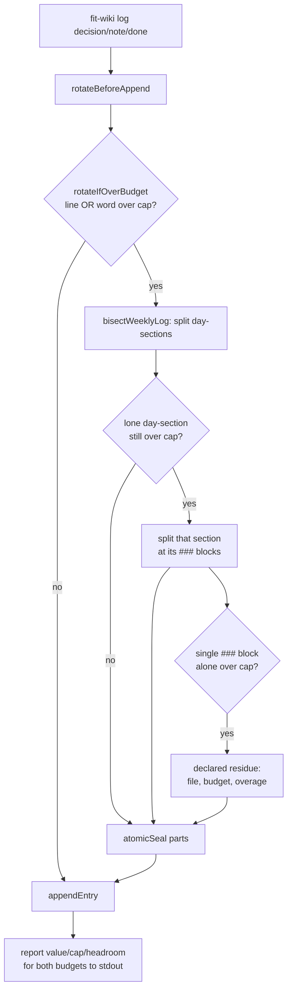

# Design 1730 — Compliant-by-construction wiki writes

Translates [spec 1730](spec.md). The spec names five capabilities; this design
places each in the existing `libwiki` write/read/audit seams so a contract
breach is prevented at write time rather than discovered post-hoc by a
non-writer. No new module is introduced — every change lands on a surface that
already owns the relevant concern, keeping the one-counter-pair, one-name-regex
invariants intact.

## Components touched

| Component | File | Role today | Change |
|---|---|---|---|
| Rotation primitive | `weekly-log.js` | `bisectWeeklyLog` finds `## YYYY-MM-DD` seams, `packSections` packs the resulting sections | Re-bisect a lone over-cap day-section at its `###` block seams (one grain finer; at most two grains) |
| Append commands | `commands/log.js` | `decision`/`note`/`done` rotate-then-append | Report budget state on completion; pass a `{lines, words}` delta to the trigger |
| Rotation trigger | `weekly-log.js` `rotateIfOverBudget` | Line-cap-only pre-append check (takes `appendLines`) | Widen the input to a `{lines, words}` delta; trigger on either projected cap |
| Boot digest | `boot.js` `buildDigest` | Emits claims/inbox/summary | Add per-file headroom for summary + active weekly log |
| Audit rules | `audit/rules.js` + `audit/scopes.js` | Read-only contract checks | Add a heading-grammar-drift finding; steer structure findings to `fit-wiki log`; drop hand-split hints |
| Commit boundary | `libutil/git-client.js` | `commitPaths`/`status` pass `paths` after `--` | Reject `:`-prefixed pathspec entries before they reach git |
| Memory protocol | `.claude/agents/references/memory-protocol.md` | Names `fit-wiki log` as the append path | Reserve direct weekly-log edits for repair |

## Data flow — append path (capabilities 1, 2)

Both rotation branches converge on `appendEntry` (E), so the report step (K)
runs after **every** append (criterion 5), not only the no-rotation path. The
append always lands (spec: "the append itself always lands"); rotation runs
first when the post-append file would breach **either** budget. The sub-seam
split is a second decomposition pass invoked only for the irreducible lone-entry
case, preserving the packer's move-not-copy guarantee at the finer grain.

## Key Decisions

| # | Decision | Rejected alternative |
|---|---|---|
| D1 | Sub-entry rotation is a recursive bisect inside `bisectWeeklyLog`: when its packing yields a lone day-section that alone exceeds a cap, re-bisect that section at its `###` block seams (the same find-seams → pack pipeline, one grain finer) instead of reporting it as the terminal residue. The residue becomes a single over-cap `###` block, not a whole day. | A separate `bisectDaySection` function — duplicates the find-seams + greedy-pack + move-not-copy machinery and risks the two diverging on the content-equal invariant. |
| D2 | The seam-finding lives in `bisectWeeklyLog` (the `seamRe` slice into `{date,text}` sections), not in `packSections` (which packs already-split sections and holds no regex). D1's finer pass parameterises `bisectWeeklyLog`'s seam matcher — `## date` for the top level, `###` for a day-section's interior — and reuses `packSections` unchanged on the resulting block sections. | A bespoke string-slice splitter for blocks — re-implements the offset arithmetic `bisectWeeklyLog` already gets right byte-for-byte. |
| D3 | The word-cap joins the line-cap in `rotateIfOverBudget`'s pre-append trigger (superseding spec 1450's word-overflow exclusion). To project the post-append file, the trigger's `appendLines` line-delta is generalised to a `{lines, words}` delta the `log` commands already compute from the body they are about to append; the public `rotate` command and the audit-driven `fix` path pass a zero delta, so they trigger on the file's own counts. | Leaving word-overflow to the post-hoc audit — the breach still lands and reddens the shared gate; the spec's whole point is to move it left. Measuring only the current file's words instead of the projection — the very append that would tip it over still lands silently. |
| D4 | Budget feedback is emitted by the `log` commands after a successful append, reading the just-written file once. The reporting helper lives in `commands/log.js` (the only append entry point), not in `appendEntry` (a pure fs primitive with no stdout). | Threading a reporter into `appendEntry` — couples a side-effect-free primitive to process stdout and breaks its reuse by rotation. |
| D5 | Heading-grammar drift is a new `weekly-log-main`/`-part` audit rule: an entry-shaped line (`^## …`) that is **not** the dated grammar is a finding. Structure findings (this one + the existing decision-block rule) name `fit-wiki log` in their hints; the sealed-part budget hints drop "split by hand". | A write-time guard rejecting drifted headings — the tooling cannot tell a repair edit from a drive-by one, and the spec routes that concern to protocol (capability 3, deliberate). |
| D6 | The pathspec guard lives in `git-client.js` at the two methods that forward caller `paths` after `--` (`commitPaths`, which itself spawns both `add --` and `commit --`, and `status`): a path whose first char is `:` throws at method entry, before any `git` spawn, covering both of `commitPaths`' spawns at one site. `commitAll` takes no paths (`add -A`) and is not a path-forwarding surface. JSDoc on each method's `paths` parameter documents the rejection (criterion 9 names the commit boundary; `status` gets the same warning for consistency). | Guarding in `wiki-sync.js` — the boundary that actually hands strings to git is `git-client`; guarding upstream leaves the dangerous surface reachable by any other caller. |

### Heading-grammar drift — why a new rule and not the existing seam matcher

The rotation seam matcher (`/^## (\d{4}-\d{2}-\d{2})/`) already ignores drifted
headings — that is precisely why a drifted file degrades to one unsplittable
prologue and the audit never names the cause. The new rule inverts the seam
matcher: it flags `^##` lines that the seam matcher would skip, so the audit
finally names the drift that makes rotation impossible. The seam matcher is
currently inlined in four places (`weekly-log.js` ×2, `commands/log.js`, and the
audit's `decisionWithin5` `entryRe`); this design moves it to one
`WEEKLY_LOG_*` home in `constants.js` and has both the seam-finder and the new
drift rule import it, so the "flagged as drift" set is exactly the complement of
the "rotatable seam" set — they cannot disagree about what a conforming heading
is. (The existing decision-block rule keeps its own stricter anchored variant;
only the seam-finder and the drift rule must share the matcher.)

## Interfaces

- `bisectWeeklyLog(text, agent, isoWeekStr)` keeps its `{parts, residue}`
  return shape; the residue's `section` may now name a `###` block heading
  rather than a date, and a formerly-irreducible input may now yield multiple
  parts. Callers read `section`/`lines`/`words` as today, but
  `rebisectOverBudgetPart` carries its own `parts.length === 1` short-circuit
  (the "no splittable seam, leave byte-identical" branch): once sub-entry
  splitting lands, a part that used to hit that branch may now split, so the
  short-circuit narrows to the true base case (a single over-cap `###` block).
  That behavioural shift is intended — the `fix` path inherits sub-entry
  rotation for free — and is the only caller whose observable result changes.
- `rotateIfOverBudget`'s `appendLines` number widens to an `{lines, words}`
  delta so the word-cap trigger can project the post-append file (D3). The
  public `rotate` and the `fix` re-bisect pass a zero delta. This is the one
  intended signature change; `commands/log.js` already computes the body's
  line and word counts it passes in.
- `buildDigest` gains two fields: `summary_headroom` and `weekly_log_headroom`,
  each `{words, lines, word_cap, line_cap, words_remaining, lines_remaining}`.
  `summary_headroom` reuses the summary text already read; `weekly_log_headroom`
  is a new read of the active weekly-log file (`weeklyLogPath`), which the
  digest does not open today. Additive to the payload; existing fields
  unchanged.
- `commitPaths(message, paths, opts)` and `status({paths})` throw at entry on a
  `:`-prefixed `paths` entry, before any spawn. The throw is the contract;
  callers already wrap git calls in the sync error path.

## Risks

- **Sub-seam recursion termination.** A `###` block that itself exceeds a cap
  has no finer seam — it must terminate as the declared residue (criterion 3),
  never recurse forever. The packer's existing "chunk alone over budget → seal
  as own part + record residue" branch is the base case; the design must not
  add a third grain below `###`.
- **Word-cap trigger and the 6400/496 asymmetry.** The weekly-log word budget
  (6400) is far looser than the line budget (496); most rotations still fire on
  lines. The word path is exercised by long-prose entries the line count clears
  — the spec's observed `6501/6400` case. Fixtures must hit the word boundary
  with the line count under cap, or the new trigger goes untested.

## Out of scope (per spec)

Summary content/inventory (spec 1610), `fit-wiki sync` whole-tree semantics, the
already-landed claim/release pathspec fix (#1568 — this design keeps it closed
for minted filenames), filename-grammar auditing (#1574), cross-agent manual
edit enforcement (protocol, not tooling).

— Staff Engineer 🛠️
