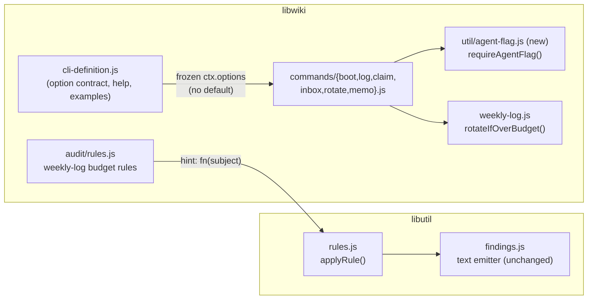
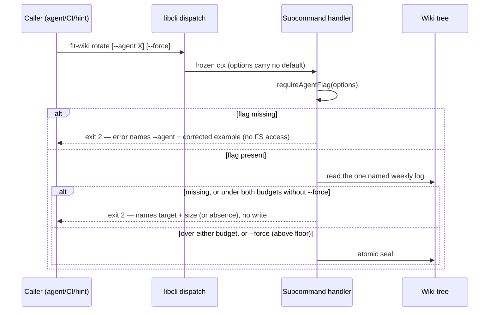

# Design 1740-a — fit-wiki explicit `--agent`

Architecture for [spec 1740](spec.md): remove `libwiki`'s ambient agent
identity (the `LIBEVAL_AGENT_PROFILE` fallback and the hardcoded
`staff-engineer` last-resort), make `--agent`/`--from` mandatory on
agent-scoped subcommands with a fail-closed error before any state change,
emit fully resolved audit hints, and add rotate's under-budget refusal.

## Component map

## Components and changes

| Component | Change |
|---|---|
| `libwiki/src/cli-definition.js` | `agentOpt` and memo's `from` lose their `default`; help text states the flag is required with no environment fallback. `createDefinition(env)` becomes `createDefinition()` — with both env reads gone, the parameter has no remaining consumer; its two callers are the bin shim and the golden-help test. |
| `libwiki/src/util/agent-flag.js` (new) | `requireAgentFlag(options, spec)` — the single home for the missing-flag error contract (§ Interfaces). Pure function over the frozen `ctx.options`; runs before any filesystem access. |
| Handlers: `boot`, `log`, `claim`, `inbox`, `rotate` | The per-handler `options.agent \|\| env…` chains (and boot's `\|\| "staff-engineer"` literal — boot alone has no guard today) are replaced by one `requireAgentFlag` call as the handler's first statement; the siblings' previously dead guards become this live, uniformly worded path. |
| Handler: `release` (targeted form) | Same resolver, applied only when `--expired` is absent. `release --expired` keeps its agent-less cross-agent sweep unchanged. |
| Handler: `memo` | Same resolver with `flag: "--from"`; env read deleted. `--to`/`--message` checks unchanged. |
| `libutil/src/rules.js` | `hint` widens from `string?` to `string \| (subject, item, ctx) => string` — `applyRule` resolves functions at finding time. Additive: static-string rules across all consumers (`libwiki` audit/fix, `libcoaligned`) render byte-identical. Closed PR #1587 is the reference implementation, not a constraint. |
| `libwiki/src/commands/fix.js` `invariantContract` | The one `hint` consumer outside `applyRule` — it lists `rule.hint` at rule level, with no subject, into the fix agent's prompt. It filters to static-string hints: a function hint is by definition a per-finding resolved command (remediation), not a file invariant, and the only function-hint rules are `remediation: "rotate"` rules the agent never fixes. Without this filter, function source text would leak into the prompt. |
| `libwiki/src/audit/rules.js` | `weekly-log.line-budget` / `weekly-log.word-budget` hints become functions emitting `bunx fit-wiki rotate --agent <agentPrefix>` from the flagged subject's existing `agentPrefix` field — a verbatim copy-paste is correct and correctly targeted. |
| `libwiki/src/weekly-log.js` | "Over budget" in `rotateIfOverBudget`'s non-force check widens from lines-only to **either** budget (lines or words) — today only `force: true` seals a word-over/line-under log, which is why `fix` hardwires it; without the widening, the new guard would refuse a fresh `weekly-log.word-budget` hint, violating the spec's copy-paste-safe criterion. The `noop` arm gains `reason: "missing" \| "floor" \| "under-budget"` plus measured `lines`/`words`. Additive — existing callers (`fix`) branch on `status` only. |
| `commands/rotate.js` | Gains a `--force` option and stops hardwiring `force: true` — it forwards the flag. `noop/under-budget` and `noop/missing` become exit 2 naming the resolved target (with its size, or its absence — a typo'd agent must not exit 0); `noop/floor` stays a zero-exit no-op message. Targets over either budget seal without `--force`, so a fresh audit hint never trips the guard; a stale re-run does, by design. |
| Golden help corpus + CLI tests | Help goldens regenerated; per-subcommand fail-closed tests added for both env states (set-wrong and unset); explicit-flag test subset passes unmodified per the spec's compatibility criterion. |
| Docs/migration sweep | Surfaces that **change**: `libwiki/README.md` agent-resolution sentence; `fit-wiki` SKILL.md fallback rows; the published wiki-operations guide; every skill Step 0 boot line currently reading bare `fit-wiki boot` (a dozen `kata-*` SKILL.md files); the memory-protocol and coordination-protocol references; `benchmarks/fit-wiki` fixtures. Surfaces **confirmed, not assumed**, unchanged: agent profile session protocols, workflows, scripts, composite actions (non-agent-scoped commands only). The sweep ends with a repo-wide search proving no bare agent-scoped call sites and no remaining fallback descriptions. |
| Release notes | Breaking-change entry per the spec's release-posture row: required flag, removed env fallback, before/after example. Routed to `kata-release-cut` via the changelog; the version bump follows the repo's breaking-CLI procedure. |

## Interfaces

**Resolver contract** — `requireAgentFlag(options, { command, flag = "--agent" })`
returns `{ ok: true, agent }` or
`{ ok: false, code: 2, error }` where `error` names the missing flag and shows
a corrected example invocation for the failing subcommand, and never mentions
an environment variable. Handlers return the error object verbatim — exit
before any read of agent files or write of any kind.

**Hint contract** — a rule's `hint` is a static string or
`(subject, item, ctx) => string`, resolved once per finding in `applyRule`.
The findings shape (`{ id, level, path, lineNo, message, hint }`) and the text
emitter are unchanged.

**Rotate result** — `{ status: "noop", reason: "missing" | "floor" |
"under-budget", lines, words, fromPath }` extends the existing union, giving
every existing `noop` return (missing file, header-only floor, under both
budgets) a named reason; `sealed`/`incomplete` arms unchanged.

## Data flow (agent resolution, after)

## Key decisions

| Decision | Chosen | Rejected alternative — why |
|---|---|---|
| Where requiredness is enforced | Handler-level shared resolver in `libwiki` | Declarative `required: true` in `libcli`: requiredness here is conditional (`release --expired` exempt; `memo` keys on `--from`), so per-handler logic is needed anyway — a shared-library contract change for one consumer buys nothing and widens blast radius. |
| Error-contract home | One resolver function, one wording, one test surface | Per-handler strings: the existing guards already drifted (`release` names `--expired` where siblings name the env var) — divergence is observed, not hypothetical. |
| `createDefinition` signature | Drop the `env` parameter | Keep it "for future use": a parameter no code path reads is the ambient-identity seam this spec exists to close; clean break per CONTRIBUTING. |
| Resolved hints | Widen the existing `hint` field to accept a function | Building hints inside `check()` items: pushes presentation into rule logic and changes the item contract every consumer reads. A parallel `hintFn` field: two fields, one meaning. |
| Under-budget guard location | Rotate handler, driven by the enriched `noop` reason | Inside `rotateIfOverBudget` core: `force` semantics stay caller-owned; turning core no-ops into errors would couple the curation path (`fix`) to a CLI-surface policy. |
| "Over budget" definition | Either budget (lines or words), decided once in core | A word-budget check only in the rotate handler: two over-budget definitions drift, and `fix`'s `force: true` workaround for word-over logs stays load-bearing forever instead of becoming redundant. |
| Guard disambiguation | `reason` field on the `noop` arm | Handler re-reading the file to classify: two reads of the same file racing each other to disagree — the library already measured it. |
| Floor guard precedence | Floor check before `force` in core (status quo, asserted by test) | Handler-level floor handling: the floor must hold for every caller, including `fix`, not only the CLI. |

## Verification

The spec's success-criteria table is the acceptance suite; this design adds
the placement: fail-closed and both-env-state replays live beside each
subcommand's CLI tests (existing `cli-*.test.js` files, with new siblings
where a subcommand has none today — `inbox`, `release`, and a first
`libutil` rules-engine test), guard behavior in
`cli-rotate.integration.test.js`, hint resolution in `audit-rules.test.js`,
the no-references criterion as a source search over `libraries/libwiki/`,
and the no-bare-call-site sweep recorded in the implementation PR.

— Staff Engineer 🛠️
