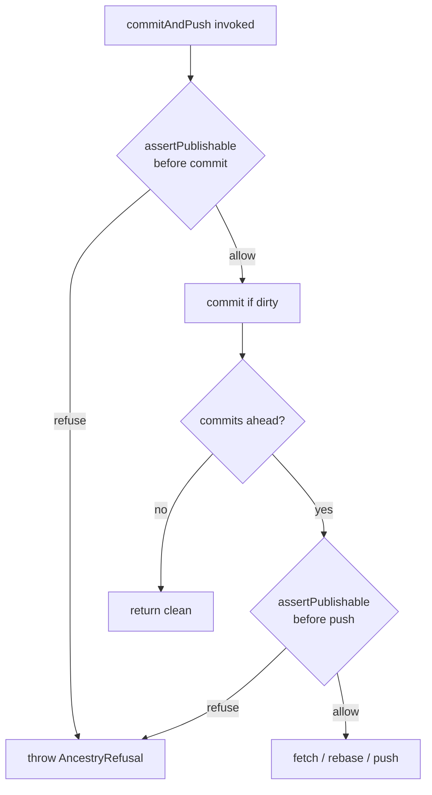

# Design 1750 — libwiki commitAndPush ancestry guard

Implements [spec.md](./spec.md). The invariant: **unverifiable ⇒ refuse,
everywhere — before damage.** The guard runs inside `WikiSync.commitAndPush`
ahead of both the commit and the push, classifies the clone's relationship to
the published remote branch, and on anything it cannot positively confirm
raises a typed refusal that the three command surfaces map to a non-zero exit.

## Components

| Component | Role |
|---|---|
| `AncestryRefusal` (new error in `wiki-sync.js`) | Typed refusal carrying a `kind` (`"unrelated"` confirmed-no-shared-history, or `"unverifiable"` could-not-verify) and a recovery message. Distinct text per kind (spec success-criteria rows). |
| `WikiSync.#assertPublishable()` (new private method) | The guard. Called by `commitAndPush` before the commit gate and again before the push gate. Reads HEAD/remote state through `GitClient`, decides allow / refuse, throws `AncestryRefusal` on refusal. |
| `GitClient` ancestry primitives (new methods in `libutil`) | Read-only git observations the guard needs: HEAD state, the published branch ref, merge-base existence, a non-swallowed remote probe, and a history-deepening fetch. |
| Command surfaces `sync.js` / `claim.js` | Catch `AncestryRefusal`, map to non-zero exit, print the not-published recovery. The `claim`/`release` catch is narrowed so only this error class pierces the saved-locally degradation. |
| `commitAndPush` JSDoc contract | States refusal conditions, the positive-evidence allowance, and traces to this spec. |

## The guard: what it verifies

The history the guard verifies is the history the push would publish: the
branch ref `WikiSync` hard-codes today (`master` in fetch / rebase / push),
never bare `HEAD`. This closes the detached-HEAD trap (spec D1) — a detached
HEAD never resolves to that branch ref, so it is structurally `unverifiable`.

The guard is invoked twice because the commit gate and push gate are
independent (spec § Scope): a clean tree creates no commit but its branch may
already carry unverifiable committed history, which only the pre-push call
catches.

### Decision table (inside `#assertPublishable`)

| Observed state | Decision |
|---|---|
| HEAD detached (not on the `master` branch) | refuse `unverifiable` |
| Branch present on remote **and** HEAD unborn | refuse `unrelated` (message names re-clone recovery) |
| Branch present on remote **and** no merge-base (within fetched window) | deepen history, then re-check merge-base |
| After deepening: still no merge-base | refuse `unrelated` |
| After deepening: deepening fetch itself failed | refuse `unverifiable` |
| Local remote-tracking ref absent → remote probe says **branch present** | treat as "branch present on remote" and re-enter the branch-present rows above (unborn-HEAD and merge-base both judged against the probed branch tip) |
| Local remote-tracking ref absent → remote probe says **branch absent** (positive emptiness evidence) | allow (empty-new-wiki) |
| Local remote-tracking ref absent → remote probe **fails** | refuse `unverifiable` |
| Branch present, HEAD on branch, merge-base resolves | allow |

Rows are evaluated top-to-bottom: the detached-HEAD row fires first, so an
absent-tracking-ref clone is reached only when HEAD is on `master` (born or
unborn), and the unborn / merge-base classification then runs against the
probed branch tip — closing spec criterion 11's sibling shapes.

The emptiness evidence (a non-swallowed remote probe) runs **only** on the
absent-tracking-ref path, so the healthy-clone hot path adds no remote
round-trip (spec success criterion). The empty-new-wiki allowance covers only
the single invocation that earned it; the guard re-derives state from live git
on each call, so a failed first publication (the remote branch now exists) is
re-judged by the standard rows — no auto-re-grant is possible by construction.

## GitClient primitives (new, read-only except the deepening fetch)

| Method | Git command | Used for |
|---|---|---|
| `headBranch({cwd})` | `symbolic-ref --short -q HEAD` | Detached-HEAD detection (empty ⇒ detached) and the branch name to verify. |
| `revParseVerify(ref,{cwd})` | `rev-parse --verify -q <ref>` | Unborn-HEAD test and remote-tracking-ref presence. |
| `mergeBaseExists(a,b,{cwd})` | `merge-base <a> <b>` run with `allowFailure` | Shared-ancestry test: exit 0 ⇒ base exists, exit 1 ⇒ no base (returns boolean, does not throw on the no-base exit). |
| `lsRemoteHas(remote,branch,{cwd})` | `ls-remote --heads <remote> <branch>` (non-swallowed) | Positive emptiness evidence; throws on probe failure. |
| `fetchUnshallow(remote,branch,{cwd})` | `fetch --unshallow` (or full-depth) `<remote> <branch>` | Obtain full history before a confirmed-unrelated refusal. |

All thread auth through the existing `withAuth` path. `lsRemoteHas` and
`fetchUnshallow` are the only network calls the guard adds, and only on the
non-modal paths named above.

## Surface error mapping (spec D2)

`commitAndPush` throws `AncestryRefusal`; surfaces translate it:

- **`sync.js` `runPushCommand`** — wrap the call; on `AncestryRefusal` write
  the refusal message to stderr and return `{ ok: false, code: 1 }`. The Stop
  hook already surfaces a non-zero `fit-wiki push`.
- **`claim.js` `pushWiki`** — today its `catch` maps *every* error to a
  saved-locally success. Narrow it: re-throw `AncestryRefusal` (all other
  errors keep the degradation). `runClaimCommand` / `runReleaseCommand` catch
  the re-thrown refusal and return `{ ok: false, code: 1 }` with a message
  stating the written row is **not published** and remains an uncommitted
  working-tree change. The local `writeFileSync` already happened, so the row
  is present-but-uncommitted exactly as the spec requires.

## Key Decisions

| Decision | Choice | Rejected alternative |
|---|---|---|
| Where the guard lives | Inside `WikiSync.commitAndPush`, the shared primitive | A check in each command surface — would triplicate the logic and let a future caller bypass it; the spec names the primitive as the one seam. |
| Refusal signalling | Throw a typed `AncestryRefusal` | A `{ refused, kind }` return envelope — `commitAndPush` already returns `{ pushed, reason }`; a throw cleanly separates "refused before damage" from normal outcomes and rides the existing surface `catch` blocks. |
| Two refusal kinds | `unrelated` vs `unverifiable`, distinct messages | One generic refusal — the spec's could-not-verify criterion requires text distinct from confirmed-unrelated so the operator knows which state to recover from. |
| Verify the branch ref, not HEAD | Guard resolves the configured branch ref | Verifying `HEAD` — passes on a detached HEAD that the push would not publish (spec D1 detached-HEAD trap), reintroducing silent loss. |
| Emptiness evidence placement | Only on the absent-tracking-ref path | Always probing the remote — adds a round-trip to the modal healthy-clone path the spec explicitly protects. |
| Deepening before refusing unrelated | Deepen, then re-check merge-base | Refusing on the first missing merge-base — a shallow clone's shared ancestry may lie outside the window; refusing there would reject healthy clones (spec shallow-clone criteria). |

## Out of scope (per spec)

Push-outcome honesty, the `-X ours` conflict fallback, and the foreign
claim-row conservation criterion (security note N1) all ride the consolidated
"commitAndPush fails loudly" spec (the next P2 spec; spec 1780). This design changes neither the existing fire-and-forget push nor
the merge fallback; it only refuses earlier. The `unverifiable ⇒ refuse`
guard composes with the pathspec-scoped commit mode unchanged — both modes
pass through `#assertPublishable`.

— Staff Engineer 🛠️
