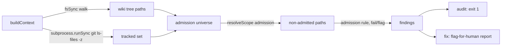

# Design 1760 — wiki filename admission grammar for `fit-wiki audit`

Architecture for [Spec 1760](spec.md): `fit-wiki audit` gains a rule that flags
any git-tracked file under `wiki/` whose name (or root-level directory) the
declared filename grammar does not admit. Flag-for-human only; day-one clean on
the live wiki. The grammar's normative home is `memory-protocol.md`, shared with
[Spec 1770](../1770-weekly-log-part-h1-slot-numbering/spec.md).

## Components

| Component | Location | Responsibility |
|---|---|---|
| Grammar matcher | `libraries/libwiki/src/audit/grammar.js` (new) | Pure functions classifying one path against the root classes + admitted-directory rule. The single code expression of the grammar. |
| Tracked-file enumerator | `libraries/libwiki/src/audit/admission.js` (new) | Walks the wiki tree on disk with `fsSync.readdirSync` + `fsSync.statSync` per entry (not `withFileTypes` — the sync fs surface and its mock do not expose it), intersects with the git index (`subprocess.runSync`) when git state is present, yields the admission universe as relative paths. |
| `admission` scope | `audit/scopes.js` (extended) | New `SCOPE_RESOLVERS.admission` returning one subject per **non-admitted** path; `buildContext` threads `subprocess` and runs the enumerator once. |
| Admission rule | `audit/rules.js` (extended) | One `fail` rule, `scope: "admission"`, `remediation: "flag"`, message naming the rejected path. |
| Grammar contract | `.claude/agents/references/memory-protocol.md` | New "Wiki filename grammar" section: root classes, calendar-token vocabulary, admitted directories, admission path (Decision 4). Spec 1770's heading grammar shares this section. |

`fit-wiki fix` is **unchanged code**: its existing partition routes any
finding whose `remediation !== "agent"` to the flag-for-human report
(`commands/fix.js` `classOf`/`partition`). `remediation: "flag"` satisfies
Decision 3 with no edit to `fix.js`.

## Data flow

## The grammar (code shape of Decision 1)

`classify(relativePath)` returns `admitted` or `rejected`. A calendar token is
a hyphen-delimited filename segment matching exactly week `YYYY-Www`, month
`YYYY-MNN`, date `YYYY-MM-DD`, or bare year `YYYY` — so `8080` inside a longer
segment is not a year token (segment-anchored, not substring).

**Root files** (basename, depth 0):

| Class | Predicate |
|---|---|
| Named ledger | basename ∈ `{Home.md, MEMORY.md, STATUS.md}` |
| Weekly log | matches `WEEKLY_LOG_NAME_RE` or `WEEKLY_LOG_PART_NAME_RE` (constants.js) |
| Storyboard | `storyboard-YYYY-MNN.md` |
| Dated deliverable | `<topic>-YYYY-MM-DD.md`, `<topic>` token-free |
| Summary | `<slug>.md`, `<slug>` token-free |

Load-bearing sharpening (spec § Decision 1): a basename carrying **any**
calendar token is admitted only if it matches weekly-log, storyboard, or
dated-deliverable *exactly*; the token-free constraint on `<topic>`/`<slug>`
blocks trailing-token smuggling. A token-free `.md` falls through to the summary
class. Non-`.md` files at the root are rejected (no root class admits them).

**Directories**: evaluated at the wiki root level only — the unit is the first
path segment. A root-level directory is admitted iff it is `metrics/` **or** an
`<agent>/` sidecar where `<agent>.md` is a root summary-class member. Once a
root directory is admitted, every file beneath it at any depth is admitted by
membership — innards unpoliced, nesting irrelevant. Any other root-level
directory, including dot-directories (`.claude/` true positive), is rejected;
the enumerator emits the directory's tracked files as findings (one per file)
so the message points at concrete paths.

## Key Decisions

| Decision | Choice | Rejected alternative |
|---|---|---|
| Tracked-set source | `git ls-files -z` via `subprocess.runSync` at `wikiRoot` (NUL-delimited, paths relative to the wiki root), intersected with the disk walk; when no git state is present — `git ls-files` non-zero exit or no `.git`, the fixture/bootstrap case (spec § Decision 1) — the universe is the whole disk walk | Parse `.git/index` directly — reimplements git; brittle across index versions. `git status` — reports untracked too, the opposite of the spec's universe. |
| Sync, not async | Reuse `subprocess.runSync`; keep `buildContext`/audit synchronous | Promote the audit to async for `GitClient` — ripples through every scope, command, and test for one rule; the spec's universe is a one-shot read. |
| Disk walk ∩ index, not `git ls-files` alone | Walk gives the directory structure the grammar evaluates (root dirs vs files) and the fixture-fallback universe; the index intersection enforces "tracked" | `git ls-files` only — loses the no-git fixture path and forces re-deriving directory structure from path strings. |
| One finding per rejected file | Resolver yields non-admitted paths; rule fires once each | One finding per rejected directory — hides which tracked files sit under it; the `.claude/worktrees` lesson is that the *files* are the residue. |
| Grammar in its own module | `grammar.js` pure, imported by the `admission` scope | Inline in `scopes.js` — buries the normative grammar in I/O code, blocks unit testing the classifier without a filesystem. |
| `remediation: "flag"` | New class value routed to flag-for-human by the existing `fix` partition | Auto-fix/move — a wrong delete destroys memory (Decision 3); `fix.js` already flags any non-`agent` class, so no new routing code. |

## Grandfathering (day-one clean)

The grammar is a represented constraint, not just a target: every legitimate
git-tracked file at HEAD must classify as `admitted`, so the rule fires zero
findings on the live wiki the day it ships. No file is rewritten, renamed, or
relocated (spec § Grandfathering). The classes are drawn from the live
inventory — the nine dated study files map to the dated-deliverable class, the
sidecars to the directory rule, `metrics/` innards to membership — which is what
makes the grammar admit them where they are rather than forcing a transitional
clause. The day-one-clean success criterion verifies this against the live wiki.

## Contract home (Decision 2)

A new `memory-protocol.md` section declares the filename grammar, calendar-token
vocabulary, admitted directories, and the admission path. The audit's
`grammar.js` is the enforcement of what the section declares — one home per
policy. Spec 1770 adds its sealed-part **heading** grammar to the same section;
creation is ordering-independent (§ spec Decision 2): whichever paired
implementation lands first creates the section, the second extends it. 1760's
success criterion verifies only the filename half.

## Admission path (Decision 4)

The section documents the single admission mechanism: to admit a new
convention, extend the grammar section **and** `grammar.js` in one reviewed
change. Spec 1610's companion file is admissible today via the summary class
(token-free name) with no grammar change; a token-bearing or content-audited
surface enters through this path as its first consumer. No second mechanism is
introduced.

## Risks

- **`git ls-files` cwd**: must run with `cwd: wikiRoot` and split the `-z`
  NUL-delimited output into paths relative to the wiki root; a stale cwd
  silently empties the tracked set and the grammar would then govern an
  over-broad universe. Mitigated by the enumerator owning the cwd and the
  day-one-clean success criterion catching a mis-scoped read against the live
  wiki.
- **Mock subprocess keys by command name**: `git` responses are shared across
  calls in `createMockSubprocess`. Tests exercise the git-present path through a
  real temp git repo (integration) and the no-git fallback through `createMockFs`
  with no `.git` entry; unit tests for `grammar.js` need neither.

— Staff Engineer 🛠️
