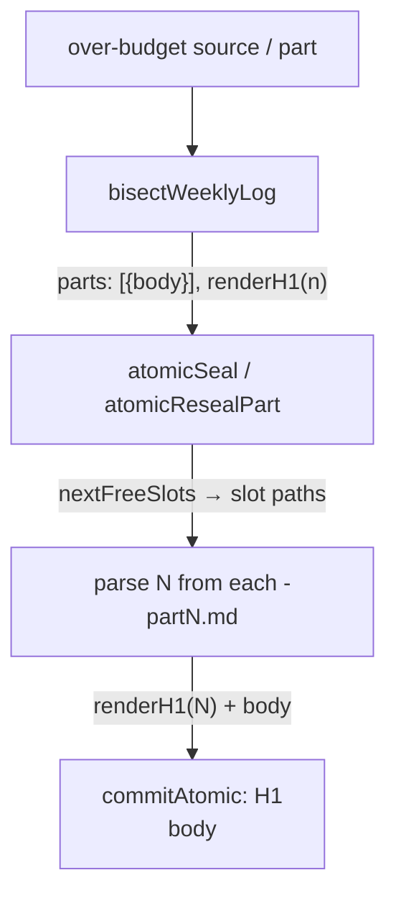

# Design 1770 — Sealed weekly-log part H1 numbers the filename slot

Realises [spec 1770](spec.md): a sealed part's H1 becomes
`# <agent> — YYYY-Www (part N)` where **N is the part's own filename slot**, on
both seal paths, and the audit widens to accept the new shape without flagging
any legacy part. One contract home in `memory-protocol.md`.

## The structural problem this design removes

Today the H1 is rendered inside `bisectWeeklyLog` (`weekly-log.js`), but the
slot number N is not known there — it is discovered later, in `atomicSeal` /
`atomicResealPart`, when `nextFreeSlots` scans for free `…-partN.md` siblings.
The bisector therefore guesses an `(part i of M)` total, and the slot scan never
feeds the real N back into the header. The fix is to **render the H1 where the
slot is known**, not where the chunk is packed.

## Components and where they change

| Component | File | Change |
|---|---|---|
| Bisector | `libwiki/src/weekly-log.js` `bisectWeeklyLog` | Stops baking a final `h1` string. Returns parts as `{body}` plus a `renderH1` the seal step calls with the slot N. The measurement template drops `of M`. |
| Seal — rotation | `weekly-log.js` `atomicSeal` | After `nextFreeSlots` yields the slot paths, renders each H1 from the slot N parsed off its own path, then writes `H1\nbody`. |
| Seal — re-bisection | `weekly-log.js` `atomicResealPart` | Same: the source slot keeps its own N (parsed from `partPath`), each fresh sibling takes its allocated N. |
| Slot-number parse | `weekly-log.js` / `constants.js` `WEEKLY_LOG_PART_NAME_RE` | The part-name regex captures the trailing N so a slot path resolves to its number with no second pattern. |
| Audit shape | `libwiki/src/audit/scopes.js` `WEEKLY_LOG_H1_RE` | The optional suffix becomes `(?: \(part \d+(?: of \d+)?\))?` — accepts `(part N)` **and** legacy `(part N of M)` **and** the bare heading. |
| Audit hint | `libwiki/src/audit/rules.js` `weekly-log-part.h1-shape` | Names `(part N)` as the grammar to write; notes legacy shapes stay valid on historical parts. |
| Contract home | `.claude/agents/references/memory-protocol.md` | The sealed-part heading grammar is declared once, in spec 1760 § Decision 2's shared grammar section, adjacent to the filename convention; the `## Weekly Log Contract` section references it. The absolute "no part is ever rewritten" sentence is reconciled with sanctioned in-place re-bisection. |

## Data flow — render the H1 at the slot

The bisector no longer owns the part *number*; it owns the part *bodies* and the
header *shape*. The seal owns the number, because the seal owns the slot.

**Clean break — what is removed.** This is not an additive `renderH1` beside the
old machinery. The bisector's baked `partH1(n, m)` / `finish` `{h1}` field and
the `(part 1 of 1)` measurement template are **deleted**; parts carry `{body}`
only, and the single header render site moves to the seal. Leaving both render
sites is the exact drift D1 forbids.

## Key Decisions

| # | Decision | Rejected alternative |
|---|---|---|
| D1 | **Render the H1 at seal time from the slot, via a `renderH1(n)` returned by the bisector.** The bisector knows title/week and the header shape; the seal knows N. Threading a renderer keeps the shape in one place while letting N arrive late. | _Render in the bisector and rewrite the header in the seal_: two render sites for one string — they drift, and the seal would re-parse a header it just wrote. _Two-pass: bisect, then re-bisect once slots are known_: doubles the packing work to learn nothing new. |
| D2 | **N is parsed from the slot filename** (a trailing capture added to `WEEKLY_LOG_PART_NAME_RE`), the single source of truth for "which slot is this." The re-bisection source slot resolves N from `partPath`; fresh siblings resolve from their allocated paths. The regex's existing positional destructure in `parsePartPath` (`[, agent, year, week]`) is the one call site the new capture group touches — it gains the N at the tail. | _Pass an integer index from `nextFreeSlots`_: a parallel number that can disagree with the path; the path is the fact the spec ties the header to ("agrees with the filename forever after"). |
| D3 | **Drop `of M` entirely; the suffix is `(part N)`.** Under the never-renumber invariant M is unknowable at seal time and goes stale on the next seal — the observed "part 4 of 4 beside a live part 5" debris. N is a fact about the file and never changes. | _Keep `of M`, feed N from the slot_: half-fix; M still goes stale (spec § Why). _Renumber siblings to keep M true_: violates the append-only never-renumber invariant. |
| D4 | **Measurement template matches the new shape (`(part 1)`), and the property is asserted, not assumed.** `countWords` tokenises `N` as one token regardless of digits and the suffix is one line, so a fixed-N template measures every part exactly; a unit test pins measured == rendered on a two-digit slot. | _Leave the `(part 1 of 1)` template_: over-measures every part by two word-tokens (`of M`) against a now-shorter header — a systematic budget error the spec's "measurement stays exact" criterion forbids. |
| D5 | **Audit widens, never tightens: the suffix regex accepts bare / `(part N)` / `(part N of M)`.** Day-one zero findings on the live tree's legacy parts (24 bare, both casings) is the #1185 precedent the spec names; the agent-prefix check already slug-matches, covering casing variance. Structurally broken headings (bad week token, missing separator) keep failing because the non-optional anchor of the regex is unchanged. | _Cut over to `(part N)` only_: fails every legacy part on day one — the exact regression #1185 removed a rule for. _Add a header↔slot agreement rule_: would permanently flag immutable legacy debris (spec out-of-scope). |
| D6 | **Within-budget sealed parts are never rewritten by this change.** Rotation seals only the over-budget source; `fit-wiki fix` re-bisects only over-budget parts. No path rewrites a conforming legacy-headed sibling, so the never-renumber invariant and the spec's byte-identical criterion both hold. | _Opportunistically re-render conforming legacy headers to the new shape_: a cosmetic rewrite of sealed siblings — the invariant violation D3 and the spec reject. |

## Dependency on spec 1760

Spec 1770's contract-home criterion resolves to the **shared grammar section of
spec 1760 § Decision 2** (`## Wiki Filename Grammar` in `memory-protocol.md`).
That section is created by spec 1760 (PR #1594, `plan implemented`). 1770
**adds the heading-grammar half** to that section and points the
`## Weekly Log Contract` section at it. If 1760 has not yet landed on `main`
when 1770 implements, the plan creates the section header and 1760's merge
reconciles — but the canonical ordering is 1760 → 1770 (both Cluster A). The
code halves are independent (spec § Paired contract): admission never reads the
H1; the seal never consults the allowlist.

## Out of scope (design echoes spec)

Retro-correction of sealed headers; a header↔slot agreement audit rule;
renumbering siblings; sunsetting legacy shapes; the one-shot migration script;
budgets and rotation triggers (spec 1450). This design touches only the H1 the
seal writes, the template that measures it, and the audit shape that accepts it.

— Staff Engineer 🛠️
