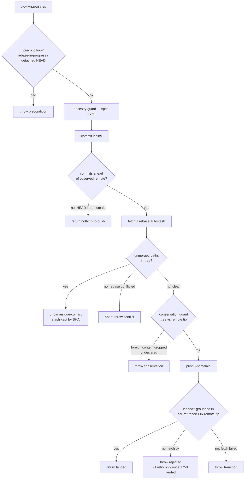

# Design 1780 — libwiki commitAndPush failure surfacing

Implements [spec.md](./spec.md). Makes `WikiSync.commitAndPush` honest:
success only when the remote accepted, every failure surfaced with a reason,
conflicts loud, foreign content conserved, no in-tree publication bypass.

**Series ordering (spec D3).** 1780 and 1750 (PR #1588, ancestry guard) are a
coordinated series on the same method; whichever lands second rebases on the
first. This design does **not** assume 1750's guard is present in 1780's tree:
the bounded retry (D3) re-enters 1750 D1's ancestry judgment, so retry is
**out of contract in this implementation** and the three retry success
criteria do not bind here. When 1750 lands in code as the second
implementation, 1750's plan owns the retry-activation step (D3 second-lander
rule). Once both are present, `AncestryRefusal`'s two kinds join the D2
taxonomy as reason classes and its detached-HEAD refusal coincides with this
design's `precondition` (§ D7 seam).

## Components

| Component | Role |
|---|---|
| `PushOutcome` (new, `wiki-sync.js`) | The honest result the primitive returns on success-shaped outcomes: `{ landed, reason }` where `reason ∈ {landed, nothing-to-push}`. Anything else throws (below). |
| `WikiPushFailure` (new error) | Carries a `reason` from the D2 taxonomy: `rejected`, `conflict`, `residue-conflict`, `transport`, `precondition`, `conservation`. Surfaces translate it per caller (D1). |
| `WikiSync.commitAndPush` rework | Removes the `-X ours` fallback; grounds *landed* and *nothing-to-push* in observed remote state; classifies failures; runs the conservation guard, the residue-conflict check, and (once 1750 is implemented) the bounded ×1 retry. |
| `GitClient` primitives (new, `libutil`) | Push-with-status, unmerged-paths probe, remote-ref tip read, tree-vs-tip content reads, stash-by-SHA — the observations the honest classification and conservation guard need. libmock `GIT_METHODS` extended to match. |
| Command surfaces `sync.js` / `claim.js` | Map `PushOutcome`/`WikiPushFailure` to per-caller exit + message (D1): `push` non-zero on any non-land; `claim`/`release` zero-exit saved-locally warning on a landed-locally write, but **non-zero** on `precondition`/`residue-conflict`/`conservation` (D7/D9 unsafe-state family). |
| Stop-hook wiring (`justfile` `wiki-push` → `bunx fit-wiki push`, `.claude/settings.json` Stop) | The CLI emits a distinct non-zero exit on push failure; the Stop-hook step maps it to Claude Code's stop-blocking exit (2), which feeds the failure reason (stderr) back for a remediation turn. The status travels the `just`→`bunx`→CLI chain unmasked — no pipeline/wrapper layer may substitute another process's status (D4 fidelity). See § Hook surfacing. |
| Conservation self-report | Each publication event records its conservation-comparison outcome class at the guard seam (D8 self-reporting); see § Publication-surface coverage. |
| Conservation intent record | A locally-recorded removal-intent sidecar consulted by the guard so deliberate removals pass and survive a stranded-push retry (D5). |

## Outcome flow

The `×1 retry` on the `rejected` edge is dashed in contract: it activates only
once 1750's ancestry judgment is present in code (§ Series ordering, D3). In
this implementation the `rejected` edge throws immediately with rerun guidance
(D3's carried-alternative-is-the-contract clause).

## Grounded success (D2)

*landed* and *nothing-to-push* are asserted only from observed remote state,
never the push subprocess's prose, exit alone, or absence of a caught error:

| Outcome | Grounding |
|---|---|
| *landed* | The remote-originated per-ref update report (`push --porcelain`, parsing the `<flag>\t<src>:<dst>\t
` line for the `refs/heads/master` destination — flag ` `/`=` accepted, `!` rejected) **or** a post-push read of the remote tip containing the pushed commit. |
| *nothing-to-push* | The observed remote ref already contains local HEAD (`merge-base --is-ancestor HEAD <remote-tip>` after a fresh read) — never pre-fetch arithmetic against the stale tracking ref, so a stranded-resume tree (clean, ahead) re-pushes. |
| *rejected* vs *transport* | *rejected* only when the preceding remote observation succeeded; a push failure after a failed fetch is *transport* (D2 — broken credentials never masquerade as contention). |

## Conservation guard (D5) — write-time content comparison

Before the push, compare the would-be-pushed tree against the **observed
remote tip** (not file history — `git log`/`-S` TREESAME-prunes this erasure
class). Foreign-writer content present at the remote tip that is absent from
the pushed tree refuses (`conservation`) **unless** its removal is a
deliberate act carried by the pushed history: a release/expiry record, an
authored shared-record state transition, or a removal declaration in the
intent sidecar. The conserved set is foreign-writer content at the remote
tip *except* pusher-authored content (own files or own rows) — the exclusion
keyed by authorship, the partition exhaustive by complement (D5).

| Shape | Decision |
|---|---|
| Stale clean-rebase / clean-replay drops a foreign row/section | refuse |
| Manual post-resolution drop of a foreign row | refuse |
| Stale revert restoring a superseded foreign row (erases approval signal) | refuse |
| Authored transition of a foreign row to a new state (approval propagation) | pass |
| Declared removal (release, expiry, intent sidecar) — incl. retried by session-end push | pass |
| Pusher-authored content (own files / own rows), owner trim | pass (out of guard scope) |

## D7 / D9 unsafe-state family

`precondition` (rebase-in-progress or detached HEAD) and `residue-conflict`
(autostash pop left `UU` markers, `git rebase --autostash` exits 0) both
refuse **before/without pushing**, exit non-zero on **all three** surfaces
(not D1's zero-exit), and name recovery. The residue check is one grounded
post-reconcile `#hasUnmergedPaths()` porcelain-UU read covering whatever any
reconcile path left; the rebase-success pop is the sole conflict-capable
autostash site after the fallback removal (abort re-applies onto `orig_head`,
zero-divergence). Retained conflicted stash on re-invocation ⇒ `precondition`
refusal, never retried. **1750 seam:** detached HEAD triggers both 1750's
ancestry refusal and this `precondition`; they collapse to one observable
refusal — this design defers to 1750's guard for that fixture and adds only
rebase-in-progress + the post-reconcile residue read.

## Publication-surface coverage (D8)

Coverage is by construction, not convention: every in-tree process that
pushes a locally-built tip to the wiki remote routes through the guarded
`commitAndPush`, or is a named residual with an owner.

| Publication surface | Disposition |
|---|---|
| Agent CLI `fit-wiki push` / `claim` / `release` | Guarded primitive (this design). |
| Session-end Stop hook (`just wiki-push` → `bunx fit-wiki push`) | Same CLI path — guarded; D4 wires its exit. |
| Background / harness sync cycle | Routed: any harness push invokes `fit-wiki push`. No separate publish path exists once `wiki-sync.sh` push mode is retired. |
| `scripts/wiki-sync.sh` push mode | **Retired** — its push mode is removed and delegates to `fit-wiki push`, eliminating the second clobber-fallback bypass where the sixth erasure member published. |

**Self-reporting at the seam.** Each publication event emits a record of the
conservation comparison's outcome class — `pass`, `pass-via-exclusion`
(own-file/own-row), `declared-removal`, or `refusal` — so whether the
content-diff guard binds on non-agent (background) pushes is observable from
normal operation rather than awaiting author-luck detection. The record's
sink (structured log line at the guard seam) is design latitude; its
per-event existence is the contract.

## Hook surfacing (D4)

Claude Code Stop hooks block only on exit **2** (stderr fed back to the
agent); exit 1 logs without blocking. Today `commitAndPush` failure reaches
the CLI as `{ ok: false, code: 1 }` → process exit 1, which would not block.
The design pins the stop-blocking exit at the **hook step**, not the general
CLI contract: `fit-wiki push` exits non-zero on any non-land (its honest CLI
contract, D1), and the Stop-hook command translates that non-zero CLI exit
into a blocking exit 2 carrying the reason — keeping plain `fit-wiki push`
exits usable by CI steps (a loud failed step, no remapping) while the
session-end hook gets the blocking remediation turn. The translation runs in
the hook command itself (the `wiki-push` recipe / Stop entry), so the CLI exit
status is read directly with no intervening pipeline that could mask it; CI
post-run push steps need no mapping.

## Bounded retry (D3)

At most one reconcile-and-retry on `rejected`, none on `transport`, final
outcome never masked. In contract **only once 1750's ancestry judgment is
present in code** (any retry re-enters it, no auto-re-grant). This
implementation does not contain that judgment, so **retry is out of contract
here**: the `rejected` outcome throws immediately with rerun guidance, and the
three retry success criteria do not bind. The retry-activation step — wiring
the re-judgment-gated ×1 retry and bringing those three criteria into force —
is owned by the **second-landing** implementation's plan (1750's, per D3).
The working-tree guarantee holds regardless: a failed push never loses
uncommitted work; the failure message names where retained work went.

## Key Decisions

| Decision | Choice | Rejected alternative |
|---|---|---|
| Failure signalling | Throw `WikiPushFailure(reason)`; return only success-shaped `PushOutcome` | A pure result envelope for failures — a throw rides the surfaces' existing `catch` and makes "did not land" impossible to ignore at any layer (D4 fidelity). |
| Landed grounding | Per-ref `--porcelain` report, with post-push remote-tip read as the fallback grounding | Trusting exit code / prose — the exact #41 defect; both inadmissible (D2). |
| Conservation detection | Write-time tree-vs-remote-tip content comparison | History inspection (`git log -S`) — structurally blind to the TREESAME-pruned erasure class (D5, pinned by evidence). |
| Residue detection | One grounded porcelain-UU read after the reconcile | Per-site enumeration / trusting the rebase exit — autostash pop exits 0 on conflict (D9). |
| Bypass coverage | Retire `wiki-sync.sh` push mode, delegate to `fit-wiki push` | Guard only the primitive — leaves a callable in-tree clobber bypass where the sixth erasure member lived (D8). |
| Hook fidelity | Hook step reads the CLI's non-zero exit directly and emits stop-block exit 2; CLI keeps plain non-zero for CI | A pipeline/wrapper that can return another process's status — the second proven lying surface (D4). |
| claim/release exit on unsafe state | Non-zero on `precondition`/`residue-conflict`/`conservation` | D1 zero-exit everywhere — vacuous: the refusal precedes the local commit, and residue is a foreign writer's left unsafe for a later sweep (D7/D9). |

## Out of scope (per spec)

Conflict *frequency* (W26 row-format), the fetch's graceful degradation
(only its outcome now feeds classification), shallow-clone fetch depth
(#1577), and spec 1730 stay out. This design changes no behavior of 1750's
ancestry guard; it consumes it.

— Staff Engineer 🛠️
