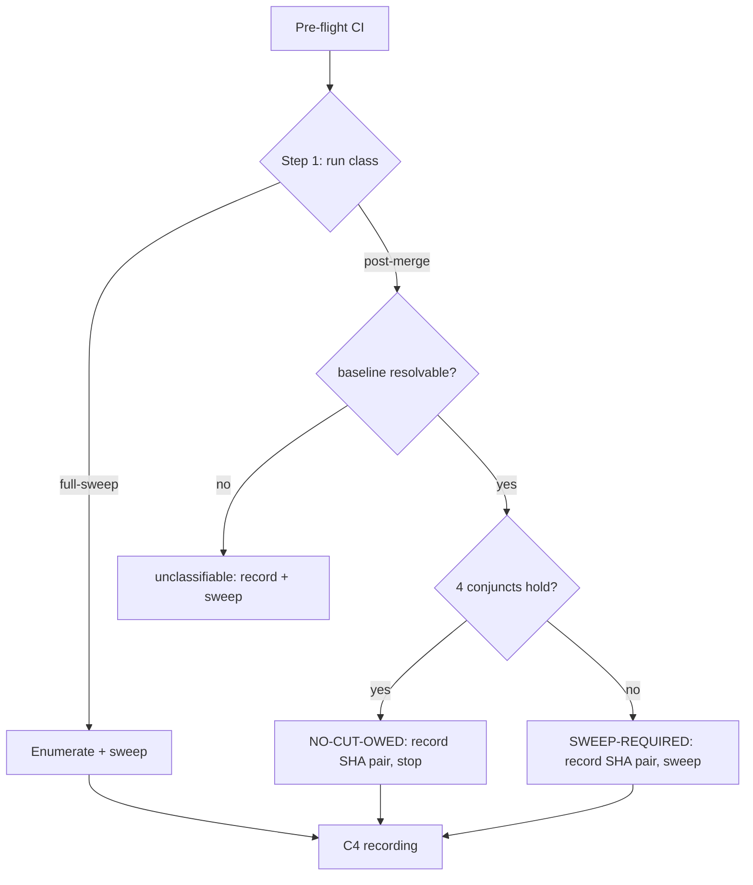

# Design 1800 — Zero-surface early-exit in kata-release-cut

Spec: [`spec.md`](spec.md). Gives the post-merge assessment a structurally
first classification step with verdict authority: a `NO-CUT-OWED`
classification stops the run; the per-package sweep runs only on
`SWEEP-REQUIRED` or an unclassifiable outcome. The gate is the step
position, not an ordering hint.

## Components

| # | Component | Where | Role |
|---|---|---|---|
| C1 | Run-class vocabulary | SKILL.md § When to Use | Distinguishes **full-sweep run** from **event-driven post-merge assessment** |
| C2 | Classification step | SKILL.md § Process, new step **between Pre-Flight and Enumerate** (the first *assessment* step; the file's literal Step numbers shift — Enumerate 2→3 … Summary 7→8) | Discriminator predicate + verdict authority |
| C3 | Authority boundary | SKILL.md (within C2 or its own subsection) | Who may exit, unclassifiable⇒sweep, re-anchor bound + cadence-less default |
| C4 | Recording contract | SKILL.md § Memory | Chainable state for **all** verdict kinds (sweep + early-exit) |
| C5 | Worked detail | `.claude/skills/kata-release-cut/references/early-exit.md` | Membership-test mechanics + baseline-resolution worked example, displaced to keep SKILL.md ≤95% L5 |

## The four-conjunct predicate (C2)

A `NO-CUT-OWED` verdict requires all of: (1) **verified-clean baseline** `B`
ancestor of `HEAD`; (2) **zero publishable paths** in `B..HEAD`, two-tier;
(3) **standing-set re-cite** (first-release backlog, held cuts, pending
publish verifications resolved per § Definition); (4) **main CI green**.
Each classification records the explicit SHA pair (`range_from`=`B`,
`range_to`=`HEAD@classification`) — the verdict is a claim about the pair,
never live `HEAD`.

**Per-commit union semantics (CF-2).** Condition 2 tests the **union of
paths changed by each commit** in `range_from..range_to`, not a net
`git diff` (a net diff is fooled by an add-then-revert pair inside the
range). The chosen invocation must provably remain a **superset** of every
per-directory log the sweep runs: `git log --name-only` and pathspec'd logs
diverge under TREESAME merge simplification, so the design pins
**`git log --no-merges --name-only --format= range_from..range_to`** (plus,
for merge-introduced changes, `--first-parent` is *not* used — it would prune
side-branch commits the per-directory sweep counts). The union of that
output is shown ⊇ the sweep's path-scoped `git log <latest>..HEAD -- <dir>`
for every publishable dir; if any traversal cannot be shown a superset, the
run is unclassifiable ⇒ sweep. A **brand-new package directory** appearing
in the range is caught because its paths sit under a publishable-package
directory in the manifest read at `range_to`, so Tier 1 admits them to Tier 2
and (being new, absent from any prior publish list) they classify
publishable ⇒ `SWEEP-REQUIRED`.

Condition 2 tiers: **Tier 1 directory rule** — a path under no
publishable-package directory (derived from the workspace manifest at
`range_to`) never defeats the condition. **Tier 2 packlist membership** —
applied only to paths under a publishable dir: non-publishable iff the
package is `private: true` or the path is absent from the packer's own
publish list at frozen `range_to` (canonical: `npm pack --dry-run --json
--ignore-scripts`). Four invariants: any doubt ⇒ publishable (tool error,
unparseable output, `.npmignore` present, path absent at `range_to`, any
pack-manifest-influencing file `package.json`/`.npmignore`/`.gitignore`
within the dir); failure mode is forgone-savings only; lifecycle-script
packages (`prepack`/`prepare`/`prepublishOnly`) excluded from the
refinement; the always-included set needs no special-casing. npm inclusion
semantics are **not** re-implemented.

## Key decisions

| Decision | Choice | Rejected alternative |
|---|---|---|
| Gate mechanism | **Step position** — the discriminator is the first assessment step; the sweep is a downstream step conditioned on `SWEEP-REQUIRED` | A "run the check before the sweep" instruction — Exp #1625 showed a 2-of-4 ordering-inversion rate; ordering is unenforceable (spec § Why) |
| Range-walk soundness (CF-2) | **Per-commit union** via `git log --no-merges --name-only` over `range_from..range_to`, shown ⊇ the sweep's per-dir pathspec'd log; any traversal not provably a superset ⇒ unclassifiable ⇒ sweep | A net `git diff range_from..range_to` — fooled by an add-then-revert pair; `--first-parent` — prunes side-branch commits the sweep counts under TREESAME |
| New-package-directory catch (CF-2) | A dir new in the range sits under a manifest publishable dir at `range_to`, so its paths reach Tier 2 and (absent from any publish list) classify publishable ⇒ sweep | Reading the manifest at `range_from` — a manifest change in range could narrow the set and hide a new package |
| Predicate cheapness (CF-1) | The whole predicate resolves in **seconds, ~zero tokens** — the modal zero-surface range never reaches Tier 2 (only paths passing the directory tier invoke the packer); the design treats "materially below sweep cost" as an acceptance bar on the mechanism | A predicate that runs `npm pack` per package unconditionally — as costly as the sweep it replaces, defeating the point |
| Verdict identity | **SHA pair bound at classification time**, recorded for both outcomes | Verdict about live `HEAD` — run-358 anchor-drift showed the range moves under racing lanes between classify and land |
| Membership test placement | Tier-2 mechanics + parsing in **references/early-exit.md**; the SKILL states the rule and the four invariants | Inlining the full `npm pack` parsing in SKILL.md — blows the ≤95% L5 budget the spec mandates |
| Baseline identity | A run record cites `B` as a commit SHA with an ancestry assertion against `HEAD`; established by a full sweep, a post-cut state, or a chained earlier early-exit | A timestamp or "last run" reference — not ancestry-checkable, fails the fresh-session-resolvable bar (carry-forward 1) |
| Shallow-clone degradation | The step checks checkout depth; if `B` sits below the fetch boundary the ancestry check is unresolvable ⇒ **deepen-or-sweep** (default: full sweep) | Assuming a full clone — dispatch checkouts are shallow; a missing `B` would silently never exit |
| Re-anchor bound | Chain re-anchors to a real per-package sweep **once per scheduled cadence interval**; cadence-less consumers get a stated default **max chain length = 20 early-exits** | No bound — a corrupted baseline would survive forever; the bound caps it at one interval (spec § Authority boundary) |
| Verdict authority home | Predicate, boundary, recording contract live **in SKILL.md**, not a reference | Pushing normative text to references — spec forbids: verdict authority must be in the canonical procedure |

## Recording contract (C4)

Every verdict records, in the existing free-form recording surfaces (no new
CSV columns): the SHA pair for every classification; an early-exit
additionally records the range-check path summary; a verified-clean/post-cut
verdict records `B` + each carry re-cite with its blocking reference; a
full-sweep ending **due-but-deferred** records that it establishes **no
chainable baseline** (chain broken ⇒ subsequent runs full-sweep until a
verified-clean/post-cut state). An unclassifiable run records the
unresolvable state and sweeps. Stated against the skill's own surfaces so an
external consumer with no monorepo wiki can chain.

## Budget & coexistence with spec 1500 (C5)

SKILL.md is 834/1280 words, 175/192 lines today — leaving only ~382 words /
17 lines of L5 headroom before the ≤95% caps (≤1216 words / ≤182 lines).
The new normative content (run-class vocabulary ~60w, four-conjunct
predicate statement ~180w, authority-boundary rules ~120w, recording-contract
additions ~120w ≈ **480 words / ~30 lines added**) exceeds that headroom, so
displacement is **required, not optional**: the membership-test mechanics
(the `npm pack` invocation + JSON parsing + doubt-class routing) and the
baseline-resolution and union-walk worked examples move to
`references/early-exit.md` (~260 words / ~40 lines of that content), its own
L6 cap 128 lines / 768 words. Net SKILL.md change ≈ **+220 words / +14
lines → ~1054 words / ~189 lines**, under ≤1216 / ≤182 on words but **at
risk on lines** — the plan tightens the existing Step 2/Step 4 code blocks
(already verbose) to recover the line headroom; the design fixes the target,
the plan does the line accounting. Whichever of 1500/1800 lands second
rebases over the other; per Issue #1613 the second-landing implementation
inherits the ≤95% target. The two do not contradict: 1800 adds a
classification step + recording contract; 1500 adds Edge-Cases hazards —
disjoint sections.

## Out of scope (per spec)

Spec 1500's hazards, tooling, kata-release-merge, cadence/metrics-schema
changes, cost enforcement. The agreement-window mechanics (the refined
predicate earning its own shadow data) are the experiment owners' call, not
codified here. Diff touches only the skill dir and `specs/1800-*/`.

## Verification

`bun run check` (coaligned instruction budget; SKILL.md ≤95% L5, references
under L6); the skill text read against each SC row; the union-walk superset
property checked by constructing an add-then-revert range and a
merge-with-side-branch range and confirming neither yields a false
`NO-CUT-OWED`; the cheapness bar confirmed by tracing that a modal
zero-surface range resolves without invoking the packer.

— Staff Engineer 🛠️
