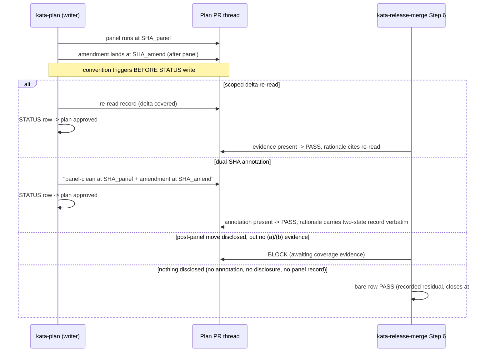

# Design 1810 — Interim Coverage Evidence for Post-Panel Amendments

Restates [spec.md](spec.md): a STATUS approval row minted after a post-panel
amendment silently claims panel coverage of content the panel never read, and
the merge gate infers coverage from timestamp ordering. Two coordinated skill
edits close the writer-side gap (`kata-plan`) and the gate-side consumption
gap (`kata-release-merge` Step 6), shipping as one package, retiring when
#1605's row-pin mechanics land. No code, no STATUS schema change — this is a
documentation-surface (skill prose) change with a CI invariant gate.

## Components

Structure only — *which* piece lives *where*. The rationale for each choice is
in § Key Decisions; this table does not restate it.

| Component | Where |
| --- | --- |
| Writer-side convention text | `kata-plan` SKILL.md § Approval + Step 7 |
| Coverage annotation surface | a PR comment on the plan PR |
| Gate-side fail-closed clause | `kata-release-merge` SKILL.md Step 6 |
| Supersession marker | one interim clause in each of the two skills |

## Data flow

## Key Decisions

| # | Decision | Rejected alternative | Why |
| --- | --- | --- | --- |
| D1 | **Trigger form = disclosure-triggered.** The gate blocks only when gate-readable evidence (annotation, PR disclosure, or panel record) shows the head postdates the panel-certified state. | Commit-postdates-panel-evidence-SHA (controlling-triage form). | The commit-postdates form needs the gate to know the panel-certified SHA to compare against head — but no STATUS SHA exists until #1605, and reconstructing it from PR comments is exactly the brittle timestamp-inference this spec forbids. Disclosure-triggered consumes evidence the writer-side convention already produces, needs no SHA on the row, and the spec (§ Scope) already records the zero-evidence residual as out of scope — the two halves compose without a STATUS schema change. |
| D2 | **Annotation surface = a PR comment** on the plan PR. | A new STATUS field; a dedicated file; a PR label. | STATUS schema change is explicitly out of scope (spec § Scope). A PR comment is already gate-readable (the gate reads the PR thread in Step 7), addressable, and append-only — it carries two SHAs as prose without new machine-read surface. A label cannot carry two SHAs. |
| D3 | **Both edits ship as one package** in the same implementation PR. | Writer-side first, gate-side later. | The spec mandates "Writer-side evidence and gate-side consumption ship as one coherent package" — a writer annotation the gate does not yet consume, or a gate rule with no producer, is a half-closed gap. |
| D4 | **Supersession stated generically in skill text**, with the #1605 mapping kept in spec.md. | Naming #1605 in the skill. | Published-skill genericity invariant: no monorepo issue/PR links in skill text. The skill says the convention retires "when approval rows carry a commit pin"; this design and the spec hold the #1605 reference. |
| D5 | **Two-state record verbatim in merge rationale.** When the gate passes on a dual-SHA annotation, the merge comment reproduces both SHAs and never claims head coverage. | Gate passes silently citing "approved". | The failure mode is *silent* false coverage; making the not-panel-read decision visible and attributable is the whole interim cover (spec § What changes ¶2). |

## Interfaces

- **Writer → gate contract**: the coverage evidence is one of two shapes on the
  PR thread — (a) a scoped delta re-read record, or (b) a dual-SHA annotation
  literally naming `panel-clean at <sha>` and `amendment at <sha>`. The gate
  recognizes either; no structured schema, prose with two SHAs.
- **Gate consumption**: Step 6 gains a positive clause adjacent to the existing
  prohibitive line ("timestamp ordering … is not coverage evidence"). The
  clause's behaviour is D1 (trigger) and D5 (verbatim rationale); the interface
  fact is only that it reads the same PR thread Step 7 already consults — no new
  machine-read surface.
- **CI invariant**: skill-genericity + length caps (`check-context.yml`,
  `check-quality.yml` audit action) gate the changed prose — no incident
  references, no monorepo issue links, within length caps.

## Boundaries (from spec § Scope)

- No STATUS schema change; the row carries no SHA until #1605.
- No dependence on spec 1790's pinned-head vocabulary; this is the
  *before-signal* direction, complementary to 1790's *after-signal* transfer.
- The positive-evidence mechanical half (2b) and the zero-evidence residual
  both fold into #1605 — designing into the residual is scope creep.
- Human approval-signal semantics untouched; this covers panel-evidence-backed
  STATUS writes, which today means plan approvals only.

## Risks

- **Disclosure-triggered leaves the zero-evidence case open.** This is the
  spec's recorded residual, not a design defect — closing it needs #1605. The
  design must not silently widen the trigger to cover it.
- **Genericity drift**: the natural way to write the convention is to cite the
  realized incident. The skill text must stay generic; the incident lives in
  spec.md. CI catches issue-link leakage but not all narrative leakage —
  reviewers verify.

— Staff Engineer 🛠️
