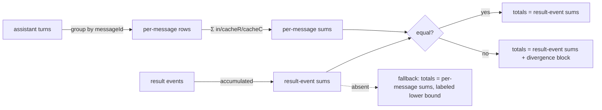

# Design — fit-trace stats totals agree with the trace's own result events

Spec: [spec.md](./spec.md). Builds on the #1703 shipped baseline (libeval
0.1.61): result-event accumulation and totals parity are live; this design
covers the remaining delta — per-message accounting, `modelUsage` additive
merge, population labeling, the labeled fallback, divergence surfacing, the six
fixtures, guidance, and release notes.

## Problem restated

`fit-trace stats` totals now match the summed result events (decision 1,
shipped). Everything below the totals line still misleads: `perTurn` is one row
per *stream event* not per *API message* (34 rows for 14 messages), `modelUsage`
is last-wins, no count names its population, and a result-event-free trace
reports silent `0`s. The fix tracks message identity so the query layer can
account once per API message, merges `modelUsage` additively in the collector,
and labels every published population.

## Components and where each decision lands

| Component | File | Change |
|---|---|---|
| Collector — message identity | `trace-collector.js` `handleAssistant` + `toJSON` | Carry `messageId = message.id ?? null` onto each assistant turn, and bump the document `version` to `1.2.0`. The version is the deterministic marker that tells a post-change document (per-message accounting available) from a pre-change one — not the presence of `messageId`, which a legitimate `id:null` message also lacks. No other turn shape change. |
| Collector — modelUsage merge | `trace-collector.js` `handleResult` | Replace `modelUsage` last-wins with `mergeModelUsage(prev, event.modelUsage)`: per model, sum the **additive allow-set** — `inputTokens`, `outputTokens`, `cacheReadInputTokens`, `cacheCreationInputTokens`, `costUSD`, `webSearchRequests` (the SDK's per-model token/cost/request counters, exact key set pinned from the fixtures); any other per-model field (e.g. `contextWindow`) is carried first-seen, never summed. |
| Query — per-message accounting | `trace-query.js` `stats()` + new `perMessageUsage` | Group assistant turns by `messageId`; per message take field-wise **max** across its snapshots (order-insensitive, zero-residual on byte-identical duplicates, output is a floor). `perTurn` becomes one labeled entry per message. |
| Query — totals, divergence, fallback | `trace-query.js` `stats()` | Per-message sums are **always** computed (they feed both `perTurn` and the divergence check). Result-event totals win when `summary.tokenUsage` present (shipped); the per-message input/cacheRead/cacheCreation sums are then compared against the result-event sums and a `divergence` block is emitted when they differ. No result event → labeled fallback (decision 4). |
| Query — overview labels | `trace-query.js` `overview()` | Add `resultEventTurns` (`summary.numTurns`) beside `turnCount`, each carrying a population label, so 294-vs-41 is self-describing. |
| Fixtures + tests | `test/fixtures/`, `test/trace-query-*.test.js` | The six spec fixtures (see § Fixtures); parity + delta assertions per spec success criteria. |
| Guidance + release notes | `.claude/skills/fit-trace/SKILL.md`, trace-analysis guide, `libraries/libeval/CHANGELOG`/release notes | Result-event-sum semantics; "sum **all** result events"; what each figure measures. |

## stats() output shape (the contract change)

```jsonc
{
  "totals": {                       // result-event sums when present (shipped)
    "inputTokens": 8166, "outputTokens": 7654,
    "cacheReadInputTokens": 742072, "cacheCreationInputTokens": 110587,
    "totalCostUsd": 2.58877,
    "durationMs": 123456, "durationLabel": "cumulative invocation time",
    "resultEventTurns": 19,
    "population": "result-event-sum",          // or "per-message-fallback"
    "resultEventsPresent": true
  },
  "perTurn": [                      // RENAMED population: one row per API message
    { "messageId": "msg_01", "inputTokens": …, "outputTokens": …,
      "outputIsStreamingSnapshot": true, "population": "api-message" }
  ],
  "modelUsage": {                   // additive allow-set summed across results
    "claude-opus-4-x": { "inputTokens": …, "outputTokens": …,
      "cacheReadInputTokens": …, "cacheCreationInputTokens": …,
      "costUSD": …, "webSearchRequests": … }
  },
  "divergence": null                // or { field, perMessageSum, resultEventSum }
}
```

On the **no-result-event fallback**, `totalCostUsd`, `durationMs`, and
`resultEventTurns` are `null` (not `0`), `population` is `"per-message-fallback"`,
`resultEventsPresent` is `false`, and each `perTurn` row's `outputIsStreamingSnapshot`
flags output as a lower bound. A `null`-`messageId` turn is its own singleton
message and its output carries the same streaming-snapshot floor label.

`perTurn` keeps its key name (CLI-stable) but its rows are now per-message and
labeled; the spec's "one entry per unique assistant message id (14, not 34)" is
the assertion. Output per message is a streaming-snapshot floor, labeled.

## Per-message accounting rule

For each `messageId`, across that message's snapshots: **field-wise maximum**
of input/cacheRead/cacheCreation. On the evidence traces a message's duplicate
snapshots are byte-identical, so max = the single value = zero residual against
result-event sums. Max (not first/last) is order-insensitive and, for output,
never overstates — it is the largest streaming snapshot seen, a floor below the
true result-event output. Turns with `messageId === null` (none in current
captures, but possible) each count as their own singleton message.



## Key Decisions

| Decision | Choice | Rejected alternative |
|---|---|---|
| Per-message accounting layer | Query layer (`stats`), keyed on a new `messageId` turn field | **Collector-side dedup** (collapse stream events into one turn): breaks timeline/turn-by-index/head/tail, which the spec's rendering guarantee forbids — the stream must stay inspectable turn-by-turn. |
| Per-message reducer | Field-wise **max** across a message's snapshots | **Last snapshot wins**: order-sensitive and unproven; **sum**: re-introduces the multiply-count the spec exists to kill. Max ties zero-residual to the byte-identical evidence and keeps output a floor. |
| `modelUsage` merge home | Collector `handleResult` (alongside the shipped token/cost accumulation) | **Query-time merge**: result events aren't retained individually in the document — only the accumulated summary is — so the query layer cannot re-merge; the collector is the only place holding successive events. |
| Divergence surfacing | A `divergence` field in `stats()` output, null when none | **Throw / stderr warning**: `stats` is consumed as JSON by tooling; an in-band, machine-readable field is checkable by a fixture test and never breaks the exit contract. |
| Fallback signaling | Explicit `null`/label fields (`resultEventsPresent:false`, cost/duration/turns = `null`, output labeled lower bound) | **Silent `0`** (today's behavior): indistinguishable from a real zero, the exact defect decision 4 names. |
| Structured-document compatibility | `stats()` reads the document `version`: `< 1.2.0` → label `population:"carried-document-summary"` and report the carried last-wins summary; `>= 1.2.0` → full per-message accounting. Corrected figures for old docs come from re-running NDJSON. | **Schema migration / shim**: clean-break — old docs lack message identity and per-result-event records, so parity is unsatisfiable; label honestly rather than fabricate. Keying on `messageId` presence is rejected — a legitimate `id:null` message is indistinguishable from a pre-change turn; the version field is the unambiguous marker. |

## Data flow notes

- The structured document carries every assistant `turn`; adding `messageId`
  (new in this change — `handleAssistant` persists no id at the #1703 baseline)
  makes per-message accounting work on **both** NDJSON and post-change
  structured JSON via the existing `loadTrace` dual path. The `1.2.0` version
  bump, not `messageId` presence, gates which path a structured document takes
  (see § Key Decisions).
- `summary.tokenUsage`/`totalCostUsd`/`durationMs`/`numTurns` are the shipped
  accumulated result-event figures; `stats` reads them directly. `modelUsage`
  becomes correctly merged at the same accumulation point.
- Rendering commands (`timeline`, `turn`, `head`, `tail`) read `turns`
  unchanged; adding `messageId` to a turn does not alter their output. Only
  measurement assertions move.

## Fixtures

Six, each scrubbed of sensitive content and reduced in size while preserving the
event/usage structure (duplicate message-id sets and all result events intact):

| Fixture | Derived from | Pins criterion |
|---|---|---|
| `single-result` | run 27329648271 (1 result event) | Single-result parity; rendering unaffected. |
| `multi-result` | run 27330905698 (6 result events) | Multi-result parity; duration + `modelUsage`; per-message `perTurn` (14 not 34); populations labeled. |
| `multi-lane` | several sources' events merged in one file | Multi-lane totals (file-total spend across every lane). |
| `no-result-event` | a result-event-free (crashed/partial) capture | Fallback on partial traces (labeled lower bound, unavailable not 0). |
| `divergence` | synthetic — per-message sums ≠ result-event sums | Divergence is surfaced; result-event totals still win. |
| `pre-change-structured` | a `version < 1.2.0` structured document | Pre-existing structured documents stay readable, labeled carried-over. |

Fixture parity assertions fail against pre-#1703 main and pass at the #1703
baseline; the delta assertions fail at baseline and pass post-fix.

## Risks

- **A future trace where a message's snapshots are NOT byte-identical** would
  make max diverge from result-event sums on input/cacheRead/cacheCreation. The
  divergence block exists exactly for this: totals stay authoritative (result
  events win), the divergence is surfaced, never silently absorbed.
- **`modelUsage` field taxonomy** (which fields are additive) is not uniform
  across SDK versions. The merge sums a fixed additive allow-set and carries
  others first-seen; the plan must enumerate that set from the captured
  fixtures, not guess.

## Out of scope (from spec)

Per-invocation breakdown sections, per-line timeline token snippets, trace
capture mechanics, and the #996 QoL backlog. Wall-clock session time is not
computed — summed duration is labeled cumulative invocation time.

— Staff Engineer 🛠️
