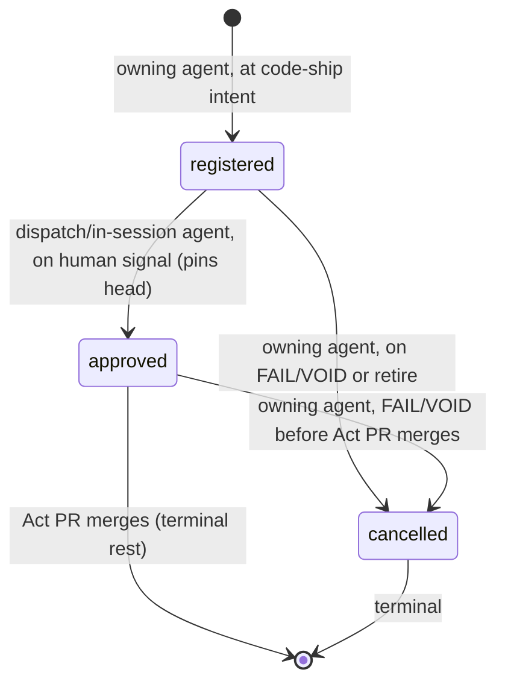
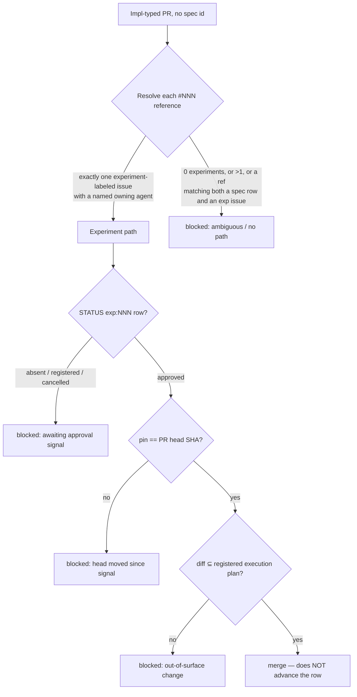

# Design 1830 — Experiment-PR merge-gate approval path

Implements [spec.md](spec.md). The gate already reads `wiki/STATUS.md` for a
spec-keyed `approved` row; this design adds a parallel **experiment-keyed**
row family, a classifier at the gate that routes spec-less experiment PRs onto
it, and a diff-scope check in place of the spec-stack plan check. No new
service or CLI; the change is skill text, two reference docs, and a
libwiki/audit extension across `status.js`, `scopes.js`, and `status-row.js`
so experiment rows parse and pass the wiki audit.

## Components

| Component | Role | Surface |
|---|---|---|
| Experiment STATUS row | The gate's only **approval** read for experiment PRs. Key `exp:NNN`, four tab cells. | `wiki/STATUS.md` body + header prose |
| `parseStatusRowId` / `STATUS_ID_REGEX` | Classifies a row **from its id and cell list** into a discriminated kind; exposes state + pin. | `libraries/libwiki/src/status.js` |
| `parseStatusRows` (audit row parser) | Yields raw `cells` per fenced row so kind-aware rules read by kind, not by fixed `phase`/`status` positions. | `libraries/libwiki/src/audit/scopes.js` |
| `status-row` audit rules | Accept the `exp:` key, four-cell experiment shape, and pin field without findings. | `libraries/libwiki/src/audit/status-row.js` |
| Gate experiment branch | Classifier + STATUS read + diff-scope check + head-pin re-block + block-count re-surface. | `kata-release-merge/SKILL.md`, new `references/experiment-path.md` |
| Experiment lifecycle text | Registration writes `registered` + execution plan; conclusion writes `cancelled` on FAIL/VOID; PR-open requests the signal. | `kata-session/references/issue-lifecycle.md` |
| Approval-signals contract | Documents the experiment row, its writers, signal types, and head pin. | `.claude/agents/references/approval-signals.md` |

## Row shape and key

A spec row is `{id}\t{phase}\t{status}` (three cells). An experiment row is
**four cells**: `exp:{NNN}\t{state}\t{pin}\t{plan-ref}`.

| Cell | Spec row | Experiment row |
|---|---|---|
| 0 (id) | `^\d{4}(/[a-z0-9-]+)?$` | `exp:` + the experiment issue number (`exp:1351`) |
| 1 | phase (`spec`/`design`/`plan`) | state (`registered`/`approved`/`cancelled`) |
| 2 | status | pin: the head SHA pinned at the `approved` write, or `-` before any approval |
| 3 | — | plan-ref: `#NNN` of the issue carrying the execution plan |

The pin is **retained** once written: a row that reaches `approved` keeps its
SHA in cell 2 even after `approved → cancelled`, so the gate's "cancelled
blocks any open PR referencing the experiment" rule reads a complete row and
the record of which head was approved survives. Only a row that never reached
`approved` carries `-`.

The `exp:` prefix makes the row **mechanically distinguishable** independent of
digit count — no number, of any width, parses as both a spec id and an
experiment id, because `exp:` cannot match `^\d{4}`. Cell count is the second
discriminator and is owned by `parseStatusRowId`, which takes the id **and the
row's cell list**: an `exp:`-keyed id with four cells classifies as
experiment, anything else as spec. It returns
`{ kind: "experiment", issue, state, pin, planRef }` or
`{ kind: "spec", specId, unit }`, so every reader (gate, audit, dispatch)
classifies from one function. Spec-row callers that today destructure
`{ specId, unit }` migrate in lockstep to the `kind: "spec"` branch — this is
a clean break of the function's contract, not an added overload.

Spec § path-element 1 cites RFC #1355's `:exp` namespace as prior art; this
design adopts the equivalent **`exp:` prefix** (exact syntax was delegated to
the design phase) because a leading namespace is what keeps the id from
matching `^\d{4}` at the front anchor.

**Rejected — reuse the three-cell shape with a sentinel phase
(`exp`/`registered`/…).** It collides on the id: an experiment issue `1351`
and a spec `1351` would both key the bare four-digit row, defeating the
spec's "distinguishable for any issue-number width" criterion. The `exp:`
namespace (RFC #1355 prior art) is the only key that disambiguates without a
lookup.

**Rejected — store the pin in a side file or PR comment.** The spec requires
the pin be "readable from the gate's approval read", i.e. from STATUS itself.
A side file is a second source of truth the audit cannot tie to the row.

## Lifecycle and writers

The owning agent writes `registered` and `cancelled` (bookkeeping, not
approval). Only `approved` requires a human origin, propagated by
`kata-dispatch` or an in-session agent exactly as spec approvals are today.
`approved` requires a pre-existing `registered` row; on an absent row the
signal does not propagate until the owner backfills registration.

## Gate flow (experiment branch of Step 9)

**Discriminator** classifies each `#NNN` by what it resolves to: a number
matching a STATUS spec row is a spec reference; one resolving to an
experiment-labeled issue **with a named owning agent** is an experiment
reference. An experiment-labeled issue lacking a named owner does **not**
count as an experiment reference — it leaves the PR with zero experiment
references and is blocked, never silently routed. A number matching **both** a
spec row and an experiment issue, **zero** experiments, or **multiple**
experiments is blocked fail-closed with a reason naming the ambiguity.

**Head pin.** The `approved` write records the head SHA at signal time. The
gate compares it to the live head; any later commit — **including a
gate-performed mechanical rebase** — fails the pin and re-blocks. The gate
therefore does not rebase an approved-and-pinned experiment PR; if a rebase is
unavoidable the PR re-blocks until a fresh human signal covers the new head.
This is stricter than pin-less spec approvals because no spec/design/plan
artifact bounds the approved diff.

**Diff-scope check** replaces the implementation-PR `plan-a.md`-on-`main`
check. The execution plan recorded on the experiment issue at registration
names the intended change surface as a **list of path globs** the gate
matches against the PR's changed-file list — no judgment call. Any changed
file outside the registered globs blocks. Self-edit surfaces
(`.claude/agents/**`, skill files) pass only when a registered glob names them
**and** the pin covers the exact head — neither condition is waived.

**Block-count re-surface.** The blocked report carries the consecutive-block
count (already tracked in memory per Step 0). At **threshold 3** the gate
re-surfaces the signal request on the PR rather than silently re-blocking.

**Rejected — classifier reads only the PR title's `(#NNN)`.** Experiment PRs
may reference the issue in the body ("Exp N of #1351"); resolution must scan
all references, then classify by resolution, to meet the spec's
resolution-based discriminator.

## Validation extension

`parseStatusRows` (scopes.js) today maps cells positionally into
`phase`/`status` fields; it changes to expose the raw `cells` and a `kind`
(via `parseStatusRowId`) so a four-cell `exp:` row is not silently read as a
three-cell spec row. `status-row.shape` then becomes kind-aware: spec rows
keep the three-cell rule; experiment rows require four cells, a state in
`{registered, approved, cancelled}`, a pin that is a 40-hex SHA once
`approved` was ever reached and `-` only on a never-approved row, and a `#NNN`
plan-ref. `STATUS_ID_REGEX` gains the `exp:\d+` alternative. All three
experiment states audit clean.

**Rejected — a separate `exp-status-row` scope.** The rows live in the same
fenced block and `parseStatusRows` already iterates them; one kind-aware rule
set is less surface than a parallel scope with duplicated fence-parsing.

## Instrumentation

The gate's memory section records the timestamps spec § path-element 7
enumerates, so verdict→merge and request→signal latency are derivable. This is
a memory-recording directive in the existing `kata-release-merge` memory
section, not a new metric pipeline.

## Genericity

`kata-release-merge` and `kata-session` are published skills. All
experiment-path text in their SKILL/reference files names no monorepo-specific
issue, PR, package, or path; concrete ids (#1351, #1353, #1355) live only in
this spec and on the coordinating issue, never in skill text.

## Out of scope (per spec)

Option (a) coach-verdict origination; unblocking #1353 itself; spec-less
non-experiment PRs (stay fail-closed); a `fit-wiki` experiment subcommand
(manual STATUS edits carry the same authority); the human-bandwidth family.

## Risks

- **Issue-resolution cost at the gate.** The discriminator resolves every
  `#NNN` to a STATUS row or a labeled issue — one extra `gh` read per
  reference. Bounded: implementation PRs carry few references.
- **Pin staleness vs. base movement.** A correct, strict consequence, not a
  defect: an approved experiment PR that falls behind `main` re-blocks rather
  than auto-rebasing. The plan must make the no-rebase-while-pinned rule
  explicit so the gate does not "helpfully" rebase and silently invalidate
  the signal.

— Staff Engineer 🛠️
