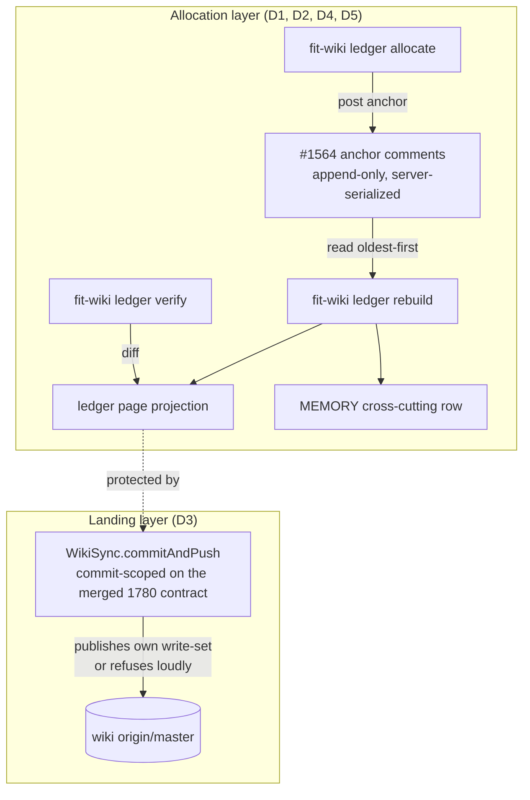

# Design 1850-a — anchor-serialized allocation and commit-scoped landings

Realizes [spec 1850](spec.md). Two architecturally separable layers, matching
the spec's split approval: **allocation** (D1, D2, D4, D5: where identity lives
and how projections derive from it) and **landing** (D3: how the wiki write
primitive publishes). They share no code. The landing layer protects the
allocation layer's projections but does not depend on it.

## Problem restated

Identifiers (occurrence `#N`, near-miss `NM-N`, fold `n=N`, meta `M-N`) are
minted by editing the counter line of `wiki/parallel-collision-ledger.md`, a
merge-contested page. Every mint races every landing, and a lost race destroys
the allocation. The landing primitive (`WikiSync.commitAndPush`) compounds
this. It side-picks contested hunks (`mergeOursStrategy`), sweeps the whole
tree when unscoped, reports `pushed: true` on a swallowed push failure, and
proceeds on a swallowed fetch failure, so it can republish stale foreign
content with no conflict and no error.

## Key decisions

The decisions and their rejected alternatives live here. The two layer tables
below are pure projections of these decisions onto the spec's success criteria.

| # | Decision | Rejected alternative |
|---|---|---|
| KD1 | **Allocation anchor is an append-only comment on issue [#1564](https://github.com/forwardimpact/monorepo/issues/1564)** (D1), the surface the corpus already keys by, since every lossless renumber "resolved by event SHA or anchor id." GitHub serializes comment creation and assigns a monotonic `id`; that `id` order is D1's serialization. A mint posts an anchor comment with a fenced, machine-parseable body, then projects. | A new git file or branch as the anchor store: still merge-contested, the exact surface under repair. A dedicated service: infrastructure the team neither runs nor needs when #1564 is already server-serialized. |
| KD2 | **Anchor body is a fenced `yaml` block** (`alloc:` kind, `ids:` list, `event:` SHA or anchor key, `note:`) inside the human comment, one block per comment. A parser scans #1564 comments oldest-first; the first comment claiming an id wins (D1 first-published-wins), and a second claim is a double-allocation resolved at rebuild. | Free-form prose parsed heuristically: the status quo that forces forensic reconstruction. Comment metadata only: unreadable to humans skimming the thread. |
| KD3 | **`fit-wiki ledger` subcommand group** in libwiki hosts the procedure: `allocate` (post an anchor, print the ids it would receive), `rebuild` (regenerate both projections from the anchor sequence), `verify` (rebuild into a scratch buffer, diff against the live projections, and flag double-allocations). | A standalone script outside libwiki: splits the wiki toolchain across two homes and skips libwiki's injected-runtime test harness. Manual procedure only: leaves allocation a hand-edit, the defect. |
| KD4 | **Projections stay where they are** (`parallel-collision-ledger.md` body plus the MEMORY cross-cutting row), regenerated by `rebuild` (D2). Authored prose (adjudications, renumber maps, conventions) carries an inline `<!-- anchor:<comment-id> -->` citation so `rebuild` preserves and re-emits it. The Conventions section of the ledger page is the conventions home; its header links the procedure. | Moving projections to new files: gratuitous churn the spec scopes out. Dropping authored prose on rebuild: loses adjudication content the anchors authorize but do not contain verbatim. |
| KD5 | **The landing layer scopes `WikiSync.commitAndPush`'s commit to the session's own write-set** (D3), so the whole-tree `add -A` sweep that carried the eraser no longer runs. The merged spec 1780/1750 contract is the foundation and is canonical (see § Relationship): it already grounds the landing in observed remote state, refuses loudly on every non-land reason via the `{landed, reason}` / thrown `WikiPushFailure` taxonomy, guards ancestry, and replaced the `mergeOursStrategy` side-pick with the singleton reapply path. D3 adds only the commit-scoping the merged contract still lacked. | Re-grounding the base with a parallel `lsRemote` check: redundant with the merged contract's `#observeRemoteTip` + grounded nothing-to-push, and would re-introduce a second base-verification home. A shim layered over the sweep: leaves the sweep reachable. |
| KD6 | **Per-session write-set attribution is working-tree isolation, with explicit pathspec as the override.** The canonical attribution mechanism is a per-session wiki checkout: when the landing runs in an isolated tree, every dirty path is the session's own, so the session-close `fit-wiki push` commits exactly that dirty set and no `add -A` sweep of a *shared* tree can occur. A caller that already knows its narrower write-set (the `claim`/`release` path, scoped to `MEMORY.md`) passes an explicit pathspec. Where the landing runs in a shared tree it cannot attribute and refuses with the loud-refusal properties, per spec criterion 11. | Whole-tree `add -A` of a shared tree: the sweep that carried the n=71 eraser. Manual pathspec on every caller including the hook: the session-close hook does not track per-file authorship, so requiring a hand-declared pathspec would refuse every routine session landing. |

Two spec parameters stay open, as the spec directs. D4's post-detection
labeling policy (renumber versus stable ordinals with gaps) is a `rebuild`
render mode the spec leaves to the design phase and which a reviewer may still
redirect; this design defaults it to today's renumber behavior but does not
settle it. D5's eventual retirement of the reservation floor is an input to the
Exp [#1565](https://github.com/forwardimpact/monorepo/issues/1565) 6/24 read,
not decided here.

## Component view

## Allocation layer (D1, D2, D4, D5)

| Concern | Design | SC |
|---|---|---|
| Allocate | `ledger allocate` posts one anchor comment to #1564 and prints the ids it would receive from the current sequence; no projection write precedes the post. The printed ids are provisional, since a concurrent anchor may interleave; `rebuild` over the published sequence is authoritative, which is where any interleave is reconciled. | SC1 |
| Projections | `rebuild` reads all #1564 anchors oldest-first, folds them into the canonical id sequence, re-emits the ledger page body and MEMORY row, and re-attaches `<!-- anchor:ID -->`-cited prose. It writes only those two projection surfaces; the Exp 51 measurement files under `wiki/metrics/exp-51-ledger-format/` are not projection outputs and are never rewritten. Deleting both projections and rebuilding yields zero missing ids. | SC2, SC8 |
| Backfill | A one-time `ledger allocate --backfill` registers an anchor for every pre-anchor entry lacking one (most already cite an anchor); `rebuild` then covers the whole corpus. | SC2 |
| Identity | The durable key per entry is its `event` (SHA or anchor `id`); labels are render-time output, so a key resolves identically across label generations. | SC6 |
| Double-allocation | When two anchors claim one id, `rebuild` and `verify` flag it, assign the first-published (lowest comment `id`) as winner, and the procedure directs the loser to re-`allocate` against the now-visible sequence. No merge ever resolves it. | SC7 |
| Reservation floor | The Active-Claims reservation continues as a tripwire: a surviving claim collision renders as evidence; a lost claim row voids nothing, because the anchor, not the claim, is the allocation. No code path reads a claim as exclusion. | SC9 |

The #1564 comment surface meets D1's substrate test (SC10): a posted comment
survives any wiki landing, merge, or projection loss, since it lives in GitHub,
not the wiki repo; GitHub assigns one total `id` order every observer agrees
on; and no wiki or git operation can edit or delete a posted comment. Anchor
*amendment* (an M31-style correction) posts a new comment citing the prior
`id`; divergence resolves per D2 to the anchor sequence. Pinning the
allocation-of-record to one issue thread is a portability cost the spec accepts
when it makes the anchor surface a design choice.

## Landing layer (D3) — `WikiSync.commitAndPush`

The merged spec 1780/1750 contract is the canonical foundation (see
§ Relationship). D3 changes one thing on top of it: the commit's write-set is
scoped to the session's own files, so the whole-tree `add -A` sweep that carried
the eraser never runs.

| Step | Behavior | SC |
|---|---|---|
| 1. Attribute the write-set | A caller with a known narrower write-set passes an explicit pathspec (the `claim`/`release` path, scoped to `MEMORY.md`). The session-close `fit-wiki push` passes none and lands its own tree's dirty set, correct because the canonical mechanism runs it in a per-session isolated checkout where the dirty set holds no foreign content (KD6). The dirty set is read from `git status --porcelain`. | SC11 |
| 2. Commit scoped | Commit via `commitPaths` scoped to the declared pathspec, or to the dirty set the session-close landing collected; the whole-tree `commitAll` / `add -A` sweep never runs, so foreign content on undeclared paths is never staged. | SC3, SC11 |
| 3. Ground the base | The merged contract observes the authoritative remote tip (`#observeRemoteTip`) and reports a grounded nothing-to-push only when that tip already contains HEAD — never pre-fetch arithmetic. D3 adds no parallel base check; it inherits this grounding unchanged. | SC5 |
| 4. Publish completely | The merged contract fetches, rebases the scoped commit (`--autostash`), and pushes, grounding *landed* in the per-ref porcelain report or a post-push tip read. A rebase conflict on a registered singleton re-derives the row via the reapply path; otherwise it fails loud (`conflict`). The `mergeOursStrategy` side-pick is already removed by the merged contract; D9 residue handling and the bounded ×1 retry are retained. | SC4 |
| 5. Honest outcome | Every non-land reason is thrown as `WikiPushFailure` (`transport`, `rejected`, `conflict`, `residue-conflict`, `conservation`, `precondition`) with the commit preserved locally, closing the `pushed: true` phantom (issue #1580). | SC5 |

The whole-tree `add -A` of a shared tree is deleted: the session-close landing
commits only its own isolated tree's dirty set and scoped callers pass a
pathspec, so the sweep that carried the n=71 fast-forward eraser no longer
exists. The peer `pull()` method shares the same `fetch()` path but is a
read-side reconcile, not a publish, and is outside D3's landing surface
(`fit-wiki push`).

### Relationship to spec 1780/1750 (the contract D3 builds on)

This design's written shape (KD5/KD6 above and the earliest landing table)
targeted the pre-1780 `commitAndPush`: a `{pushed}` return, an `lsRemote`
base-verification step, and the `mergeOursStrategy` side-pick to remove. **Spec
1780 (with 1750's ancestry guard) landed first**, and its merged contract is
canonical: a `{landed, reason}` success / thrown `WikiPushFailure` taxonomy,
the `#assertPublishable` precondition + `AncestryRefusal` guard, and the
singleton reapply path that already replaced the `-X ours` fallback with
fail-loud-on-conflict. As the original § Relationship directed — "whichever of
1780 and 1850 lands last carries the reconciling edits" — this design is
adapted to that merged contract rather than re-grounding the base or
reshaping the taxonomy. D3's residual contribution is exactly the commit-scoping
in step 1/2; the base grounding (old step 3) and honest-outcome (old step 5)
are subsumed by the merged contract. 1780's **D6** kept the whole-tree sweep;
this design supersedes that one criterion (the n=71 eraser was a clean
fast-forward no loud-conflict contract could reach, so the sweep is deleted, not
made loud). Everything else in 1780/1750 stands unchanged.

**Availability cost, accepted (spec D3):** the merged contract strands a record
locally behind a blocked stop on any non-land reason until retried, where the
pre-1780 session would fast-forward harmlessly. The corpus prices silent loss
above deferred publication.

## Risks

- **#1564 comment volume.** The thread is large, so the rebuild read path must
  paginate the comments API correctly; an incomplete page silently truncates
  the corpus. This is the one correctness-critical mechanical concern for the
  plan.
- **Backfill fidelity.** The one-time backfill must not double-register entries
  that already cite an anchor; `verify`'s double-allocation detector is the
  guard, run before the backfill is trusted.
- **Caller pathspec correctness.** D3 shifts the burden of declaring the
  write-set to every caller. A caller that under-declares silently drops its
  own content rather than corrupting a teammate's, a fail-safe direction, but
  the plan must enumerate every landing caller and its pathspec.

— Staff Engineer 🛠️
