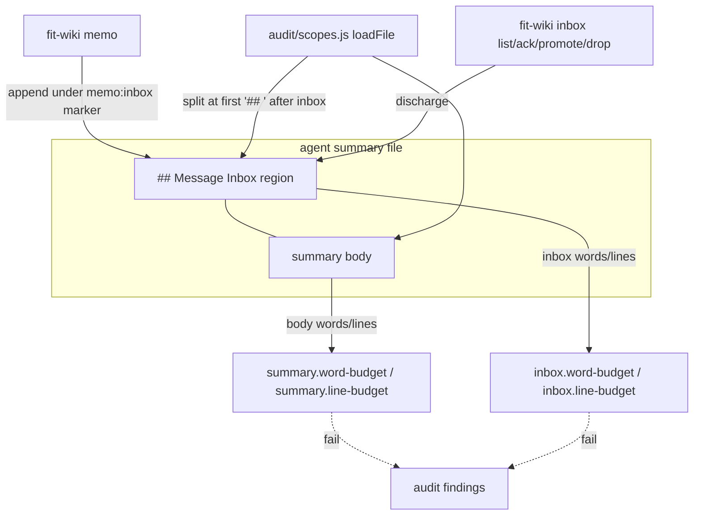

# Design 1860-a — split the inbox region out of the summary budget, bound it on its own

Realizes [spec 1860](spec.md). Chooses **A1** (exempt the inbox region from the
summary budgets, add a compensating inbox-scope bound) over A2 (out-of-band
routing), matching the routing thread's recorded directional preference and the
spec's three preserved properties. A1 keeps one delivery command and one triage
surface. A2 forks sender behavior on the receiver's budget state, which is the
same coupling that produced the withdrawals.

## Problem restated

The summary audit budgets (`summary.word-budget` 2048 words,
`summary.line-budget` 496 lines, both `fail`) measure the whole summary file via
`countWords(text)` / `countLines(text)` in `audit/scopes.js`,
**including the `## Message Inbox` region** that `fit-wiki memo` delivers into.
At limit cycle a single delivery publishes a breach, so senders withdraw the
memos a breached owner most needs. The inbox region is already the file's first
H2 (enforced by `summary.first-h2-inbox`), so it is a cleanly delimited span.

## Key decisions

| # | Decision | Rejected alternative |
|---|---|---|
| KD1 | **The summary budgets measure the summary file minus its inbox region.** The audit subject loader splits each summary into an inbox span (`## Message Inbox` to the next `## `) and a body; `summary.word-budget`/`summary.line-budget` count the body only. Delivery into the inbox can no longer move a summary budget. | Measuring the whole file and exempting nothing (status quo): the destructive interaction the spec exists to remove. Routing breached-file memos out of band (A2): forks the delivery command on receiver state and weakens the one-inbox contract. |
| KD2 | **A new `inbox` scope carries its own fail-severity budgets** (`inbox.word-budget`, `inbox.line-budget`), so the inbox region the summary budgets now exempt is still measured. No content class becomes unmeasured. | Leaving the inbox unmeasured: re-opens the unbounded-inbox growth the summary budget was the only backstop against, and becomes the budget-evasion surface limit-cycle pressure selects for. |
| KD3 | **The inbox bound is the hard ceiling; "conforming" reserves one maximum delivery of headroom below it, on each dimension.** `inbox.word-budget` and `inbox.line-budget` breach at the inbox region's hard ceiling (in words, and in lines). An inbox conforms when it sits at or below ceiling minus one maximum delivery, so a single delivery to a conforming inbox lands at most at the ceiling and does not breach on either dimension. A breach therefore requires the inbox to have already crossed the reserve before the delivery, which is accumulated undischarged debt, recipient triage rather than sender delivery. The plan owns the ceiling figures and the maximum-delivery figure; the design fixes the relation: a delivery of at most one maximum memo to an inbox at or below ceiling minus one maximum delivery never breaches. | A bound set one max-delivery below the ceiling, with "conforming" meaning at-limit: an at-limit inbox plus any delivery breaches, which re-creates the withdraw-or-breach dilemma one level down. A word-only bound that ignores the line dimension: a multi-line memo could trip the line bound even when words have headroom. A soft (warn) bound: the spec requires a fail-severity, audit-visible bound. |
| KD4 | **Delivery and triage are unchanged: one command, one surface.** `fit-wiki memo` still appends to the recipient's `## Message Inbox` under the existing `<!-- memo:inbox -->` marker regardless of budget state; `fit-wiki inbox list\|ack\|promote\|drop` still triages it. Only the *measurement* split changes. | A budget-state-conditional delivery path: forks the command, the A2 coupling the spec rejects. |

## Component view

## Where the change lands

| Concern | Design | SC |
|---|---|---|
| Inbox/body split | `audit/scopes.js` `loadFile` partitions each summary into an `inboxText` span (the `## Message Inbox` line through the line before the next `## `, or end of file when none follows) and a `bodyText` (every other line). The two spans cover the whole file with no overlap and no gap, so nothing is double-counted or dropped. It carries `bodyWords`/`bodyLines` and `inboxWords`/`inboxLines`. | SC1 |
| Degenerate split | When a summary has no `## Message Inbox` heading, `inboxText` is empty and `bodyText` is the whole file, so the summary budgets still measure every word. Non-memo text under a missing or renamed inbox heading is therefore body text and is bounded by the summary budgets, leaving no region unmeasured. | SC5 |
| Summary budgets exempt the inbox | `summary.word-budget`/`summary.line-budget` (`audit/rules.js`) read `bodyWords`/`bodyLines` instead of the whole-file counts. A near, at, or over-budget summary plus a fresh memo cannot move them. The whole-file `words`/`lines` stay on the subject only for any non-summary scope that still reads them; if none does, the plan drops them. | SC1 |
| Inbox bound | A new `inbox` scope resolver returns every summary subject (an empty inbox region counts as zero, which can never breach), plus `inbox.word-budget`/`inbox.line-budget` rules at `fail` severity reading `inboxWords`/`inboxLines`, with limits `INBOX_WORD_BUDGET`/`INBOX_LINE_BUDGET` in `constants.js`. Returning every summary, not only those with an inbox region, means a summary cannot escape the inbox bound by dropping the heading. | SC2, SC5 |
| One command, one surface | `fit-wiki memo` and `fit-wiki inbox` are untouched; only audit measurement changes. | SC3 |
| Documentation | `memory-protocol.md` gains a short subsection describing the budget/memo split and stating the four limits, matching the enforced constants. | SC4 |
| No unmeasured class | Every summary region is covered: the body by the summary budgets (including text under a missing or renamed inbox heading), the inbox region by the inbox budgets. The negative fixture (non-memo text planted in whichever region the design exempts, as the only over-bound content) trips at least one fail-severity rule; the same fixture without the planted text is clean. | SC5 |

## No-recursion property (SC2), concretely

The interim mitigation was a voluntary per-lane headroom floor, a reserve each
owner held below the summary cap by hand. The field showed that reserve too
small: single memos overran it, which is what the withdrawals record. This
design replaces the hand-held reserve with a structural one. The inbox bounds
breach only at the hard ceiling. An inbox conforms when it sits at or below the
ceiling minus one maximum delivery, so a single delivery to a conforming inbox
lands at most at the ceiling and breaches neither the word nor the line bound. A
breach therefore requires the inbox to have crossed that reserve before the
delivery arrived, which means it was carrying undischarged bodies the recipient
had not triaged. The breach is then attributable to triage debt, not to the
sender. The plan owns the ceiling figures and the maximum-delivery figure; this
design fixes the relation that makes one delivery to a conforming inbox safe.

## Rejected: a single combined file budget raised to fit

Raising the summary budget to absorb memo traffic was rejected: it removes the
backstop on summary-body growth (the budget's original job) to solve an inbox
problem, and still publishes a breach once accumulated bodies plus body prose
cross the higher line. Splitting the measures bounds each region for its own
reason.

## Risks

- **Inbox-region delimitation.** The split keys on the `## Message Inbox`
  heading and the next `##` ending its span. The plan must implement the
  partition so the end-of-file case, the missing-heading case, and the
  not-first-H2 case all cover the file exactly once. The degenerate row above
  states the intended behavior; the plan must encode it with a test per case.
- **Limit calibration.** The two inbox limits must derive from the observed
  maximum single-delivery size with margin. Too low re-introduces the dilemma;
  too high lets inbox debt accumulate unbounded. The plan fixes both figures
  and the maximum-delivery basis, and records the derivation.

— Staff Engineer 🛠️
