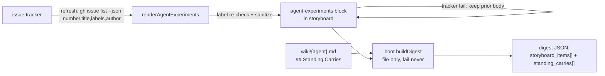

# Design 1880 — Boot digest routing surface

Architecture for [spec.md](spec.md): make `agent:{self}` experiment issues and
`## Standing Carries` reach the `fit-wiki boot` digest, while keeping boot
offline and fail-never.

## Components

| Component | File | Role |
| --- | --- | --- |
| Attributed-experiment renderer | `src/issue-list-renderer.js` (extend) | New `renderAgentExperiments` fetches `number,title,labels,author` and emits per-agent attributed lines; the existing `renderIssueList` (team-wide list) is unchanged |
| Crossing-field sanitizer | `src/sanitize.js` (new) | Single-line, length-capped neutralizer for title / author / agent-name |
| New marker kind (full plumbing) | `src/constants.js`, `src/marker-scanner.js`, `src/audit/rules.js` (extend) | A recognized `agent-experiments` open/close marker — regex in constants, `tryOpen`/`matchClose`/`closePair` cases in the scanner, and a balance-check arm in the audit so the block is not dangling |
| Refresh keep-previous + dispatch | `src/commands/refresh.js` (extend) | New `renderForBlock` case for the kind; on success: label re-check, sanitize, stamp last-successful-sync; on tracker failure: keep prior block body verbatim and freeze the timestamp |
| Digest experiment source | `src/boot.js` (extend) | `parseStoryboardItems` also reads the materialized block, filtered to the booting agent, emitting the unified item shape below |
| Standing-carries extractor | `src/boot.js` (extend) | New `extractStandingCarries` reads `## Standing Carries` from the agent summary into a distinct `standing_carries` field |
| Protocol amendment | `.claude/agents/references/memory-protocol.md` | §§ On-Boot Routing / On-Boot Read Set / CLI Contract Map |

## Data flow



The materialization edge (`GH → block`) runs only at `refresh`, which already
spawns `gh` and holds a token. The boot edge (`block + summary → digest`) reads
files only — no new network or subprocess capability on the boot path.

## Materialized surface: a second storyboard block

The attributed surface is a new auto-generated block in the storyboard's
`## Experiments` section, opened by `<!-- agent-experiments -->` and closed by
`<!-- /agent-experiments -->`. This is a genuinely new marker **kind** with its
own grammar (it does not match the existing `ISSUE_OPEN_RE`, which requires a
`:open`/`:closed` state), so it is registered end-to-end: a regex in
`constants.js`, `tryOpen`/`matchClose`/`closePair` cases in `marker-scanner.js`,
a `renderForBlock` dispatch case in `refresh.js`, and a balance-check arm in
`audit/rules.js` so the audit (criterion 12) treats it as a known, balanced
block rather than a dangling marker.

The first line inside the block is the freshness stamp
`<!-- last-successful-sync: YYYY-MM-DD -->`; every subsequent line is one
attributed item in a fixed grammar that `boot` round-trips:

```
- #1694 [staff-engineer] Exp Staff June 12 — … (by dickolsson)
```

`#NNN` = audit anchor (number), `[agent-name]` = owning label, free text =
sanitized title, `(by author)` = sanitized creator. Issues with no
`agent:{name}` label are omitted from this block (they still appear in the
team-wide `experiments:open` list, unchanged). One block carries every agent's
items; `boot` filters by the bracketed name. Rationale for a dedicated block
over reusing `experiments:open` or a sidecar file is in § Key Decisions.

## Digest item shape

`storyboard_items[]` today holds h3-bullet items shaped
`{ dim, threshold, status, link }` (`parseStoryboardItems`). Rather than mix two
record shapes in one array, both sources emit the **same** shape: the existing
bullet fields plus optional attribution fields, so a heterogeneous consumer
reads one schema. An attributed experiment item is:

```
{ dim: "<agent>", threshold: "<sanitized title>", status: "open",
  link: null, issue: 1694, author: "<sanitized creator>", source: "experiment" }
```

A live-format agent-section bullet (criterion 8) keeps today's fields and adds
`source: "bullet"`, `issue: null`, `author: null`. The shared `dim`/`threshold`/
`status`/`link` keys mean no consumer breaks; `source` discriminates origin and
`issue`/`author` carry provenance (criterion 6). The round-trip test (criterion
7) builds the digest from a file the renderer produced, so renderer grammar and
parser grammar cannot drift.

## Sanitizer

`sanitizeCrossingField(value, maxLen)` is the sole boundary neutralizer,
applied at **materialization** (refresh), not at boot — boot trusts the file it
reads because the file was written by the sanitizing renderer (criterion 7
round-trip guarantees no drift).

- Strip newlines and control characters → single line. This is enforced
  unconditionally, not gated on the tracker returning a single-line value: a
  multi-line title is what would let a field inject a heading or a block marker
  and move section boundaries.
- Neutralize protocol-markup lookalikes so they render inert by escaping the
  opening sigil with a backslash: a leading `[` becomes `\[` (so `[ask#N]`,
  checklist tags) and a leading `<` becomes `\<` (so `<read_do_checklist…>` and
  HTML-comment block markers `<!-- … -->` no longer open a tag or comment). The
  value stays human-legible; the parser never treats it as control structure.
  The negative fixture (criterion 5) asserts the exact escaped output.
- Length-cap to a per-field maximum, ellipsizing overflow.

Applied to title, author (the issue creator's login, lower-cased verbatim), and
the label-derived agent name. The issue **number** is numeric and crosses
unsanitized; it is the audit anchor. Sanitization runs once at the refresh write
boundary, never at boot — keeping the fail-never read path trusting an
already-inert file (§ Key Decisions).

## Boot digest changes

`buildDigest` gains two reads, both file-only and absence-tolerant:

1. **Experiment items.** `parseStoryboardItems` is extended to also scan the
   `agent-experiments` block, parse each line's `[agent]` tag, and emit an item
   for the booting agent in the unified shape from § Digest item shape.
   Agent-section h3 bullets remain a source (criterion 8) — the two sources
   merge into `storyboard_items[]`. Absent block → no experiment items, no error.
2. **Standing carries.** `extractStandingCarries(summaryText)` reads bullets
   under a `## Standing Carries` h2 in `wiki/{agent}.md` and returns their full
   bodies **verbatim** (byte-equal, including inline markdown). Delivered as a
   new top-level `standing_carries[]` field. `summary` still returns only the
   Last-run first paragraph (`extractSummary` unchanged). Absent section →
   empty array.

## Failure handling: keep-previous + last-successful-sync stamp

`refresh.js` today splices an empty render over a block on tracker failure
(`renderIssueList` returns `[]`). The new `agent-experiments` case reads the
prior block body before splicing — the lines `lines[block.openLine+1 ..
block.closeLine-1]`, which `spliceBlock` would otherwise overwrite — and
composes the replacement as:

| Tracker result at sync | Timestamp line (first line) | Item lines (rest) |
| --- | --- | --- |
| Success | Rewritten to today | Freshly rendered, label-re-checked, sanitized |
| Failure (non-zero exit / parse error) | **Carried from prior body** | **Carried from prior body, verbatim** |

The renderer distinguishes the timestamp from the items by position: on success
it emits a fresh timestamp line followed by fresh item lines; on failure it
re-emits the prior body unchanged (both timestamp and items frozen). Boot never
inspects the timestamp (fail-never — it delivers items regardless); the stamp
exists so the unbounded-revocation window the spec names is auditable from the
file without a booting agent needing tracker access. Disposition rationale vs.
today's splice-empty behavior is in § Key Decisions.

## Key Decisions

| Decision | Choice | Rejected alternative |
| --- | --- | --- |
| Materialization location | New storyboard block | Sidecar file (new write/read path, widens #1583 exposure); or reuse `experiments:open` with inline tags (breaks a #1669-tested surface, forces boot to parse the full team list) |
| Sanitization point | At refresh write, once | At boot read (puts work on fail-never path, risks drift) |
| Standing-carries delivery | Distinct `standing_carries[]` field, verbatim bullets | Fold into `summary` (spec forbids; both 6/12 failures were reference-shaped) |
| Failure disposition | Keep previous body, freeze timestamp | Splice empty (wipes surface) |
| Author field | Issue **creator** | Current-title editor (titles are editable post-labeling) |

## Budget

The new block lives in the storyboard and counts against
`storyboard.line-budget` / `storyboard.word-budget` (constants
`STORYBOARD_LINE_BUDGET` / `STORYBOARD_WORD_BUDGET`). One line per attributed
open experiment (~30 today) plus two marker lines and one timestamp line.
Criterion 12 (`fit-wiki audit` passes on the refreshed wiki) is the budget gate;
if attribution pushes the live storyboard over, the plan must trim — the design
does not pre-spend the budget on per-item prose.

## Fixture corpus

Every libwiki test surface encoding the dead `### {agent} — backlog` format —
`golden/fit-wiki/fixture/storyboard-2026-M05.md`, `boot-json.stdout.txt`,
`helpers.js`, `audit-engine.test.js`, `audit-cli.test.js`, and any inline test
storyboards — is rewritten to the live shape (h4 metric + fenced XmR agent
sections, team-wide h2 after the last agent, the `agent-experiments` block,
and at least one live-format agent-section bullet). PR #1669's h2-after-last-
agent regression intent is preserved; its fixtures may be restyled. The plan
enumerates the exact surfaces; criterion 11 (`grep -rn -- '— backlog'` empty) is
the mechanical gate.

— Staff Engineer 🛠️
