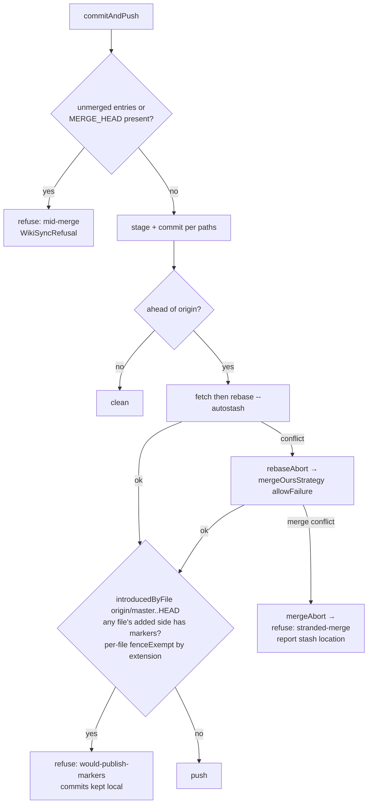

# Design 1890 — Wiki conflict-marker detection and publish guards

Architecture for [spec 1890](spec.md): a structural conflict-marker detector
shared by a new audit rule (Layer 1) and a sync-path push guard (Layer 2), plus
three sync-path fixes (mid-merge refusal, no-stranded-tree fallback, no marker
deposit). The detector is the load-bearing component — both layers and the
spec's pinned false-positive contract route through one function.

## Components

| Component                            | Where                                        | Responsibility                                                                                                   |
| ------------------------------------ | -------------------------------------------- | ---------------------------------------------------------------------------------------------------------------- |
| `scanConflictMarkers(text, opts)`    | new `libwiki/src/conflict-markers.js`        | Pure structural detector. Line-anchored open/close (unconditional) + separator (block-conditioned); fence/span exempt unless `fenceExempt:false`. |
| `conflict-scan` audit scope          | `libwiki/src/audit/scopes.js`                | Yields one subject per audited file (every md surface **plus** MEMORY.md, STATUS.md) carrying `text`, `path`, `fenceExempt`. |
| `conflict.markers` rule              | `libwiki/src/audit/conflict-markers-rule.js` | Fail-severity rule over `conflict-scan`; adjudicate-not-trim hint. Distinct id from budget rules.                |
| `unmergedPaths` / `isMidMerge` / `mergeAbort` | `libutil/src/git-client.js`         | Any-U-family unmerged index code / `MERGE_HEAD` presence; abort a merge.                                         |
| `introducedByFile(range)`            | `libutil/src/git-client.js`                  | Added lines of outgoing commits **grouped by path** (`git diff` added-side), decidable from shallow state.       |
| `commitAndPush` guards               | `libwiki/src/wiki-sync.js`                   | Mid-merge refusal (hole 1), failure-allowed+abort fallback (hole 2/3), pre-push no-marker check (hole 3/Layer 2).|
| `WikiSyncRefusal`                    | `libwiki/src/wiki-sync.js`                   | Reason-carrying refusal result/error class with a `reason` taxonomy.                                             |

## The detector (criteria 1–4)

`scanConflictMarkers` walks lines once, tracking fence and conflict-block state,
returning `[{ lineNo, kind }]` where `kind ∈ {open, separator, close}`.

```
state: insideFence=false, openDepth=0
for each line (1-indexed):
  if line matches fence toggle (``` or ~~~, ignoring info string): flip insideFence; continue
  if NOT fenceExempt-suppressed:                       # see fence policy
    if /^<{7}( |$)/        → emit open;  openDepth++   # admits "<<<<<<< Updated upstream" label
    elif /^>{7}( |$)/      → emit close; openDepth>0 && openDepth--  # admits ">>>>>>> Stashed changes" / sha label
    elif /^={7}\s*$/ AND openDepth>0 → emit separator   # block-conditioned only
```

The single-space-or-EOL guard after the run admits both branch-merge and
stash-pop label forms (criterion 1) while rejecting longer `=`/`<`/`>` runs.

- **Fence policy.** When `fenceExempt` (prose surfaces) and `insideFence`,
  suppress all emits — a fenced block quotes content. When `!fenceExempt`
  (STATUS.md, non-markdown push targets), fence state never suppresses
  (criterion 4). Backtick **code spans** are handled by the line anchor itself:
  a marker quoted mid-line in a span (`` `>>>>>>> sha` ``) does not start at
  column 1, so `^` never matches (criterion 2); straight-quote mid-line prose
  likewise never anchors. The line-wrapped close that lands at column 1 *inside*
  a span is the residual the open/close-unconditional rule cannot block (it must
  stay unconditional for criterion 1's seal-severed split). It is closed by the
  fence layer: the spec's pinned rider corpus quotes its markers inside a fenced
  code block (the W24 weekly-log rider is a fenced specimen-quote), so fence
  suppression catches it. **Corpus boundary the rule depends on:** a column-1
  quoted close in a bare span with no surrounding fence is not in the pinned
  negative corpus and is out of the detector's discrimination — recorded with
  the accepted-residual setext case below so it is not later filed as a bug.
- **Open/close unconditional, separator conditioned** (criterion 1): a seal
  rotation severs one block across two files; each file fires on its own marker.
  The accepted residual — a lone separator with no open above it — does not fire
  (criterion 3), indistinguishable from a setext underline.

## Layer 1 — audit scope and rule (criteria 1–6)

`conflict-scan` is a dedicated scope, not an extension of `summary`/`weekly-log`
per-file scopes, because it must also cover MEMORY.md and STATUS.md, which today
reach the audit only as whole-text or per-row scopes. `buildContext` already
loads every file once. The per-file subjects carry `fileLines`; the MEMORY and
STATUS subjects carry `text` only (`readOptional` shape). The scope normalizes
both into a uniform `{ path, text, fenceExempt }` subject (deriving `text` from
`fileLines.join("\n")` for the per-file shapes), tagging `fenceExempt`: `true`
for prose surfaces (summaries, weekly logs + parts, storyboards, MEMORY.md),
`false` for STATUS.md.

The rule's hint directs the writer to *adjudicate the merged form*, with no trim
guidance, and carries a distinct id (`conflict.markers`) so a co-occurring
word-budget breach (criterion 6) reports both findings, never misattributing
structure as size. It does not reuse the storyboard `markers-balanced` rule
(HTML-comment balance, storyboard-scoped) — see Key Decisions.

## Layer 2 — sync-path guards (criteria 7–11)



The pre-push scan runs after the existing `fetch()` in `commitAndPush`, so
`origin/master` is the freshly-fetched tip (criterion 11), not a stale ref.

| Hole | Guard | Decision |
| ---- | ----- | -------- |
| 1 | **Mid-merge refusal** before staging. `unmergedPaths` (any U-family `git status --porcelain` code — `UU`/`AA`/`DD`/`AU`/`UA`/`DU`/`UD`) plus `MERGE_HEAD` existence (`isMidMerge`). | Refuse with reason `mid-merge` before any `add`/`commit`. Decidable from index + working tree alone — no history (criterion 11). |
| 2 | **Fallback failure allowance + abort.** `mergeOursStrategy` gains `allowFailure`; on non-zero exit, `mergeAbort` runs, then refuse `stranded-merge` reporting where retained work went (the autostash stash). | No mid-merge state survives a thrown/failed fallback (criterion 8). The new `mergeAbort` primitive and the `allowFailure` flag stand independent of the fallback's fate: if spec 1780 removed the ours-fallback first, this row is vacuous but the no-mid-merge assertion attaches to whatever conflict path remains. |
| 3 | **No-marker pre-push check.** For each path in `introducedByFile("origin/master..HEAD")`, `scanConflictMarkers(addedText, {fenceExempt: !isMarkdown(path)})` — markdown keeps the Layer-1 quoted-form exemption (spec §108); non-markdown (CSV) lines are never legitimate ⇒ `fenceExempt:false`. | Refuse `would-publish-markers` if **any** file's added side fires; commits kept local (criterion 9). Per-file dispatch binds the content this writer introduces only. Stateless across episodes: each lane's outgoing diff is scanned on its own publish attempt (dual-lineage, criterion 9), pre-existing origin corruption is never in the added side, so unrelated writers are not blocked. |

**Introduced-vs-pre-existing on shallow clones (criterion 11).** After the
rebase replays local commits onto the fetched origin tip, the added side of
`git diff origin/master..HEAD` is exactly *this writer's outgoing content* —
pre-existing origin markers are on the base side, never the added side. Both
endpoints (fetched origin tip, local commits) exist in any shallow clone, so no
ancestor resolution is needed. If the diff command fails (e.g. unresolvable
ref), the guard refuses with reason — it never silently passes.

**Why `--autostash` stays.** Removing it to dodge hole 3 would lose the
foreign-writer dirt the autostash protects. Instead the mid-merge refusal
(hole 1) catches a conflicting pop on the next flow, and the pre-push check
catches anything staged past it — the autostash is preserved, the markers are
not published.

## Refusal taxonomy and 1780 seam

`WikiSyncRefusal` carries `reason ∈ {mid-merge, stranded-merge,
would-publish-markers}` and, for `stranded-merge`, a `workAt` field naming the
stash. This is the spec's seam with 1780's outcome/refusal taxonomy: reasons are
additive strings on the shared flow, so whichever spec lands second reconciles
by union, not rewrite. The pre-push check sits at one named point — after the
rebase/merge-fallback resolves and before `push`, on the post-merge HEAD state —
so #1667's budget re-check attaches at the same point against the same resolved
state, without this spec owning or invoking the budget axis.

## Key Decisions

| Decision | Choice | Rejected |
| -------- | ------ | -------- |
| Detector placement | Standalone pure module shared by both layers | Inline per-scope walks (4× duplication, unusable by Layer 2); regex-only matcher (no state — cannot block-condition the separator) |
| Audit rule home | New `conflict.markers` rule + dedicated `conflict-scan` scope | Extending `markers-balanced` (HTML-comment balance, storyboard-scoped — different surface set and remediation) |
| Separator handling | Block-conditioned (open above in same file) | Always-fire (false-positives every setext underline) |
| Open/close handling | Unconditional, per file | Complete-block matcher (misses seal-severed split, criterion 1) |
| STATUS.md fence | `fenceExempt:false` — data, not prose | Fence-blind exemption (silently exempts STATUS, fails criterion 4) |
| Push guard input | Per-file added side of `origin/master..HEAD` diff, dispatched fenceExempt by extension | Working-tree scan (blocks unrelated writers, fails criterion 9); whole-diff single-mode scan (loses markdown quoted-form exemption, spec §108); deepen clone (forbidden on normal path, criterion 11) |
| Failure handling | Refuse-with-reason; commits/work preserved | Throw/crash (strands mid-merge tree, hole 1 re-entry) |

— Staff Engineer 🛠️
