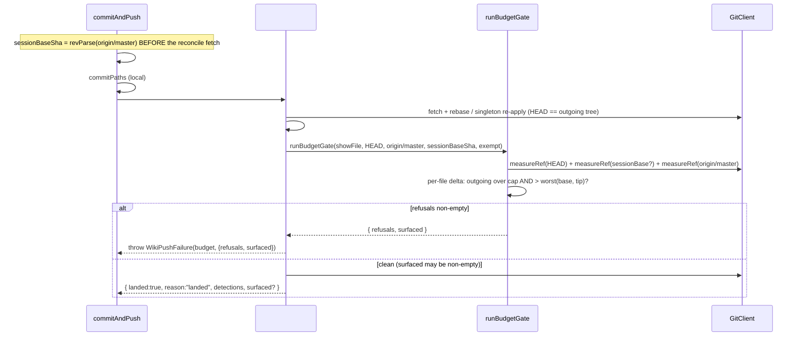

# Design 1900 — Post-landing pre-push budget re-validation (size axis)

Architecture for [spec.md](spec.md). The wiki landing flow re-runs the audit's
budget predicates on the **outgoing committed tree** between the reconcile and
the push, and refuses a push that introduces or deepens a per-file budget breach
this writer's push would publish.

## Problem restated

The merged `WikiSync.commitAndPush` (spec 1780 honest-outcome taxonomy + spec
1750 ancestry guard) commits pathspec-scoped, asserts publishability, then in a
bounded reconcile loop fetches, rebases (or re-derives a registered singleton
row against the fresh tip), runs the conflict-marker / conservation / secret
gates, and pushes — grounding a `landed` outcome or throwing `WikiPushFailure`.
Nothing measures budgets against the post-reconcile result, so two under-cap
sides can union over-cap and a single-lane rewrite can overrun, and both
publish. Budgets are defined once by the audit's rules (`summary.word-budget`,
`weekly-log.word-budget`, and their line / part variants in
[`audit/rules.js`](../../libraries/libwiki/src/audit/rules.js)). The gate must
**reuse those same rules** over the outgoing tree, never re-define them, and
refuse — never edit.

> **Adapted to the merged 1780/1750 contract (owner-approved).** This design
> was first written against the pre-1780 shape (a `{pushed:false, reason}`
> return and a `-X ours` rebase fallback). The merged contract is canonical:
> success is `{landed, reason}`; every failure throws `WikiPushFailure`; the
> `-X ours` fallback is gone (registered-singleton re-apply or fail-loud). A
> budget breach is therefore a **thrown `WikiPushFailure` with reason
> `budget`**, not a return object. Re-siting and re-shaping to fit it is the
> approved deviation; the merged contract is not reshaped.

## Components

| Component | Where | Responsibility |
|---|---|---|
| `BUDGET_RULE_IDS` | `audit/rules.js` (new export) | The canonical set of budget-predicate rule ids (`summary.line-budget`, `summary.word-budget`, `weekly-log.line-budget`, `weekly-log.word-budget`, `weekly-log-part.line-budget`, `weekly-log-part.word-budget`). Single home; the gate resolves these to rule objects in `RULES` and reuses each rule's own `check` and `scope`. |
| `budgetRules` / `budgetedFiles` / `measureRef` / `revalidateBudgets` | `budget-gate.js` (new) | Pure: resolve rules; enumerate budgeted files via the audit's `buildContext` classification; measure a git ref's tree by reading each blob through `showFile` and counting with the audit's `countWords` / `countLines`; compute the per-file/per-predicate delta. No git or fs of their own. |
| `runBudgetGate` | `budget-gate.js` (new) | Orchestrator: build the context, enumerate, measure `HEAD` + both baselines through the one `measureRef` path, and return `{refusals, surfaced}`. Owns the unreadable-ref fail-visible posture (abort without refusing). |
| `GitClient.showFile(ref, file)` | `libutil/git-client.js` (amended) | Reads one blob at a tree-ish ref; returns `null` for an absent path (git's "does not exist in" / "exists on disk, but not in"), **throws `GitError` for an unreadable ref** so a caller never mistakes a pruned ref for an empty file. |
| `WikiPushFailure` reason `budget` | `wiki-sync.js` | A breach throws `WikiPushFailure(BUDGET, msg, {refusals, surfaced})`, carrying the offending and surfaced-only `(file, ruleId, baseline, value)` tuples — the merged honest-outcome taxonomy, not a `{pushed:false}` object. |
| Re-validation seam | `wiki-sync.js` `#reconcileAttempt` | The single post-reconcile/pre-push point, after the conservation and secret gates and before `#groundedPush`. Constraint (a): one point; spec 1890's marker check already registers there as `#refuseIfIntroducedMarkers`. |

## Data flow

## Key decisions

| Decision | Choice | Rejected alternative |
|---|---|---|
| Refusal shape | A breach throws `WikiPushFailure` with the new `budget` reason, carrying `refusals` / `surfaced`, matching the merged 1780 taxonomy (success returns; every failure throws). | A `{pushed:false, reason:"budget"}` return — the pre-1780 shape; would re-introduce the two-shape ambiguity 1780 removed. |
| Where the gate attaches | The existing single post-reconcile/pre-push seam in `#reconcileAttempt`, after the conservation and secret gates, before `#groundedPush`. HEAD there is the final outgoing tree (rebase / re-apply already re-derived it against the fresh tip). | A new gate before the reconcile — would measure a pre-rebase tree, missing the merge-union the spec exists to catch; or a second re-validation point — violates constraint (a). |
| What "outgoing tree" means | The committed `HEAD` tree, measured via `measureRef(showFile, "HEAD", …)` — not the working dir. The pathspec-scoped commit + `--autostash` rebase can leave foreign uncommitted residue that will not be pushed; reading `HEAD` measures exactly what publishes. | Read the working directory — folds uncommitted foreign residue into the measurement and refuses on words the push never carries. |
| Budget source of truth | Resolve `BUDGET_RULE_IDS` to rule objects and call each rule's own `check` plus the same counters the audit uses. Not via `runRules` (it drops the numeric value and emits nothing under cap). A future predicate change (spec 1860) flows through with no gate change (criterion 8). | A second budget definition in the gate (drifts from the audit); or driving `runRules` (cannot supply per-file values or under-cap baselines). |
| Refusal predicate | Per-file, per-predicate **delta**: refuse iff outgoing over cap **and** outgoing > worst baseline (`max(sessionBase, originTip)`). Equal-or-better passes; foreign pre-existing breaches the writer did not worsen pass (criteria 4, 5). | Absolute-cap refusal — blocks on foreign breaches absorbed by the rebase; contradicts constraint (c). |
| Unreadable ref | `showFile` throws `GitError`; `runBudgetGate` catches it and aborts **without refusing** (push proceeds). The gate only refuses a regression it can prove, never fabricating a value-0 baseline that would falsely block a foreign breach (criterion 4). | Degrade an unreadable ref to an empty blob — fabricates a 0 baseline, falsely refusing untouched foreign breaches. |
| Spec-1860 seam input | An explicit `exemptSummaryFiles` argument the memo-delivery caller threads through `commitAndPush`; for those files the `summary.*` predicates surface (do not refuse). Empty by default, so non-memo callers are unchanged. | Infer memo deliveries from tree shape — unreliable and couples the gate to memo internals; or block them — enforces the contradiction 1860 exists to fix. |
| Surfaced field on the happy path | `surfaced` is attached to the landed result **only when non-empty**, so a clean under-budget sync's landed result is byte-identical to today's (criterion 10). | Always attach `surfaced: []` — a happy-path behaviour change the merged tests strict-equal against. |

## Baseline semantics

The two baseline refs are the spec's two push inputs:

- **`sessionBaseSha`** = the `origin/master` SHA captured **before** the
  reconcile's fetch (the writer's pre-edit branch point), via
  `GitClient.revParse`. `""` (unborn origin on a fresh clone) means a value-0
  session baseline. Using the pre-fetch ref — not post-commit `HEAD` — is what
  catches the no-merge author-overrun (criterion 2 / SecE 2): against `HEAD` the
  outgoing would equal the baseline and never refuse.
- **`origin/master`** = the tip landed onto (after the reconcile's fetch).

For each budgeted file and predicate the baseline is
`max(value@sessionBase, value@originTip)`, an absent file counting as 0. A
breach refuses only when its outgoing value exceeds that baseline.

## Refusal-reason taxonomy (constraint b)

Spec 1890 (the conflict-marker check) is merged on this flow as
`#refuseIfIntroducedMarkers`, surfacing through `WikiSyncRefusal`
(`would-publish-markers`). This spec adds the size-axis class as a `budget`
`WikiPushFailure`. The two classes are distinguishable by reason (`budget` vs
the marker class) and co-reside at the one seam without a second gate, settling
constraint (b) on this (second-landing) artifact.

## Failure and edge handling

- **Absent path vs unreadable ref**: `showFile` separates them by stderr. An
  absent path is a real value-0 baseline (the audit's "missing counts as empty"
  posture); an unreadable ref aborts the gate without refusing (above).
- **Singleton re-apply path**: a registered-singleton re-apply landing returns
  before the seam; those paths touch `SINGLETON_PATHS` (MEMORY.md rows), not the
  summary / weekly-log surfaces the gate measures, so the gate's concern is
  untouched.
- **No budgeted files changed / clean sync**: `runBudgetGate` returns empty;
  the push proceeds exactly as today (criterion 10).

## Out of scope

Per [spec.md § Out of scope](spec.md): auto-trim, foreign-breach repair,
memo-delivery deliverability semantics (1860's WHAT), the structure axis (1890),
write-time enforcement (1730), changing budget values / measures, and
non-summary / non-weekly-log budget surfaces.

— Staff Engineer 🛠️
