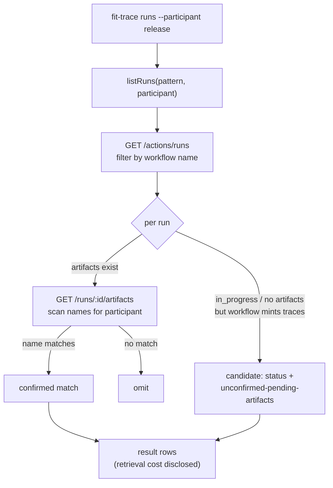
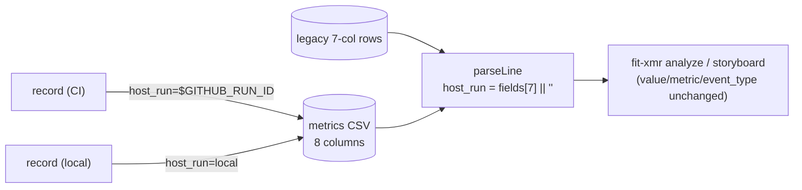

# Design 1910 — deterministic per-participant trace harvest

Implements [spec.md](spec.md). Two independent gaps, two independent component
changes, joined only by the trace-file naming convention
`trace--<case>--<participant>.<role>.ndjson` that already exists in `libeval`.
Discovery and keying ship in one spec because they serve one job, but they touch
disjoint code and could land in either order.

## Components

| Component          | File                                                           | Change                                                                                                               |
| ------------------ | -------------------------------------------------------------- | -------------------------------------------------------------------------------------------------------------------- |
| Run discovery      | `libraries/libeval/src/trace-github.js`                        | `listRuns` gains a `participant` filter; new `findByKey(runId, participant)` resolves the lane artifact + trace path |
| Discovery CLI      | `libraries/libeval/src/commands/trace.js` + `bin/fit-trace.js` | `runs` accepts `--participant`; new `find` subcommand wraps `findByKey`                                              |
| Metrics row writer | `libraries/libxmr/src/commands/record.js`                      | Append host-run-id field from CI env or explicit no-host marker                                                      |
| CSV schema         | `libraries/libxmr/src/constants.js`, `src/csv.js`              | Eighth trailing column `host_run`; parser/validator treat it as optional-trailing                                    |
| Convention text    | `KATA.md` § Metrics                                            | Publish the keying obligation so every lane inherits it                                                              |

## Gap 1 — participant-keyed discovery

`listRuns` today filters GitHub workflow runs by **workflow name** only
(`re.test(r.name)`). A participant's identity lives one level down, in the run's
artifact inventory: matrix hosts emit one `trace--<participant>` artifact per
cell; dispatch hosts emit one shared artifact whose member filenames carry
`trace--<case>--<participant>.<role>.ndjson`. The matcher never reads either, so
`fit-trace runs release` returns `[]`.

### Data flow

The participant key **augments** the workflow-name pattern (Decision 1): the
name pattern narrows the candidate set, then a two-level name scan confirms the
lane on whichever host shape produced the run. Both levels read _names_, never
trace _content_ (Decision 4 / Criterion 8):

- **Matrix host** — the participant is the artifact name
  (`trace--<participant>`). Confirmation matches at the artifact-inventory
  level; this is exactly the level `pickTraceArtifact` already matches on.
- **Dispatch host** — one shared `trace--*` artifact whose member _filenames_
  carry `trace--<case>--<participant>.<role>.ndjson`. The artifact name does not
  name the participant, so confirmation matches against the member-file list
  from the artifact's manifest, a level below `pickTraceArtifact`.

Confirmation is therefore "participant ∈ {artifact names} ∪ {member filenames}",
not a single artifact-name lookup — the distinction the two host shapes force.

Candidacy (Decision 2) is shaped in `listRuns`'s own output rows, derived from
**workflow identity**, not artifacts: a run whose workflow is one that mints
trace artifacts but whose artifacts are absent (still running, or
completed-but-not-yet-uploaded) is emitted by `listRuns` carrying its `status`
and `match: "unconfirmed-pending-artifacts"` — the locus for success
criterion 2. A silent `[]` while such a candidate exists is the defect the spec
names. The set of trace-minting workflows is matched by the same name pattern
`listRuns` already uses, so candidacy needs no new configuration surface.

### Keyed lookup — `find`

`findByKey(runId, participant)` is the deferred-read path (Decision 5): fetch
the run's artifact list and resolve the lane by the same two-level name scan —
the artifact name on a matrix host, the member filename inside the shared
artifact on a dispatch host — then return the trace path with no enumeration and
no content read. `pickTraceArtifact` covers the artifact-name level directly;
the dispatch-host level reuses the same filename grammar against the member
list. The `find` CLI subcommand wraps it. Given (run id, participant) it
produces the lane trace in one operation.

**Rejected — content-grep attribution.** Reading trace bodies to attribute a
lane is the status-quo fallback the spec exists to kill: it is inference, and
wiki-echo (a trace quoting another run's id) makes it wrong. Name-level matching
on the artifact inventory is deterministic. Criterion 8 pins it.

**Rejected — a separate run-index artifact uploaded per host.** A new
side-channel mapping participant→run would be authoritative but adds an upload
obligation to every workflow and a new thing to keep in sync. The artifact
inventory is already the ground truth; read it directly.

## Gap 2 — run records keyed to their host run

`record.js` appends a row to `wiki/metrics/{skill}/{YYYY}.csv` with the
positional 7-column schema `date,metric,value,unit,run,note,event_type`. Nothing
records the GitHub workflow run id, so deferred backfill degrades to a forensic
time-window sweep.

The existing `run` column holds a session label (`run-353`), not a workflow run
id — it cannot be repurposed without overloading two meanings. Add a **new
eighth trailing column `host_run`** (Decision 3):

- A CI session writes `$GITHUB_RUN_ID` (the host already exposes its own run
  identity to the session).
- A non-CI session writes an explicit no-host marker `local` — never a silent
  empty field (criterion 5).

### Keeping existing consumers reading (criterion 6)

`fit-xmr analyze`, `validateCSV`, and the storyboard control charts read the
same `parseCSV`/`validateCSV` path. Current-year files on disk are 7-column. The
schema change must not break them:

- `parseLine` reads `host_run` as `fields[7] || ""` — a 7-field legacy row
  yields `host_run: ""`, parsing unchanged for every existing consumer.
  `event_type` stays at `fields[6]`, so `validateRow`'s required-field check on
  `event_type` keeps reading the same index — the trailing add moves nothing.
- The 7-column schema is encoded in three places that must change in lockstep:
  `HEADER` and `COLUMNS` (`constants.js`), and `validateCSV` /
  `headerMismatchMessage` (`csv.js`). `validateCSV` accepts the header **with or
  without** the trailing `host_run` column (legacy 7-col header stays valid);
  `host_run` is never a required field. This trailing-optional treatment is the
  compat the spec names in criterion 6 — not a fallback path, a
  forward-compatible column addition. `record.js` always writes the 8-column
  header on new files.

**Rejected — overload the existing `run` column.** It already carries the
session label used in narrative cross-reference; storing a numeric workflow id
there would collide with `run-NNN` labels and silently corrupt the one field
that already disambiguates sessions in prose.

**Rejected — a sidecar `{YYYY}.keys.csv`.** A second file keyed by row would
double the write surface and invite the two files to drift. One column on the
authoritative row is the single source of truth.

**Rejected — JSON-per-row or a schema-versioned header.** Either re-encodes
every consumer. A trailing optional column is the minimal change that leaves
`value`/`metric`/`event_type` positions fixed.

## Risks

- **`host_run` ordering vs `validateCSV` strictness.** The validator does an
  exact header-string compare today; it must change to accept both the 7- and
  8-column header. If only `record.js` changes, validation of new files fails.
  The two must land together.
- **Workflow-identity candidacy can over-include.** By design (Decision 2); the
  `unconfirmed-pending-artifacts` label is the contract that keeps an
  over-included run from being read as a confirmed match.

## Out of scope (per spec)

`fit-trace stats` accuracy (spec 1820), dispatch-host artifact-naming parity
(mechanical, ships separately), backfilling historical un-keyed rows (one-time,
done on the issue).

— Staff Engineer 🛠️
