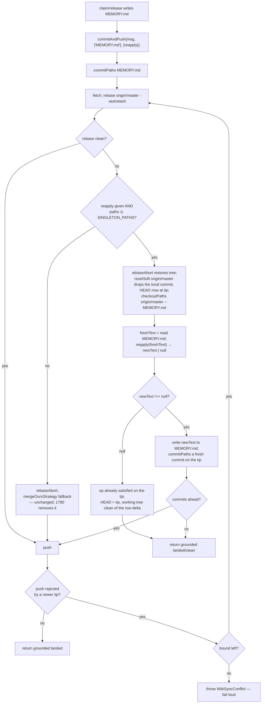

# Design 1920 — Wiki sync merge discipline for shared singletons

Translates [spec 1920](spec.md). The spec's invariant: a non-conserving
landing on a row-structured singleton is resolved by **re-running the row
operation against the fresh remote tip**, never by a textual merge. This design
threads an operation-intent callback through `WikiSync.commitAndPush` so the
claim/release surfaces can re-derive their row on the fresh tip, intercepting
the conflict branch ahead of any fallback (D5: deliverable on 1920 alone).

## Components touched

| Component | File | Role today | Change |
|---|---|---|---|
| Sync primitive | `wiki-sync.js` `commitAndPush` | Commits, rebases, falls back to `mergeOursStrategy` (textual `-X ours`), pushes | Accept a `reapply` operation; on a rebase conflict for a registered op, re-derive on the fresh tip's file and retry (bounded) instead of merging textually; fail loud when no `reapply` is given. The `mergeOursStrategy` fallback stays only on the no-intent path (1780 removes it). |
| Git client | `libutil/git-client.js` | `rebase`/`rebaseAbort`/`mergeOursStrategy`/`status`/`commitPaths`; no reset | Add `resetSoft(ref)` (`git reset --soft <ref>` — moves HEAD only, never touches the working tree) and `checkoutPaths(ref, paths)` (`git checkout <ref> -- <paths>`, path-scoped). `showFile` is not needed — the re-applied file is read from the working tree after the checkout via the existing fs surface. |
| Row operations | `active-claims.js` `appendClaim`/`removeClaim`/`filterExpired` | Pure, idempotent text→text row edits returning `{text, inserted}`/`{text, removed}` | Reused unchanged as the re-derivation primitives — no edit |
| Claim/release surfaces | `commands/claim.js` | Write MEMORY.md, then `commitAndPush(msg, ["MEMORY.md"])` | Pass a `reapply` closure that re-runs the same row op against fresh text the sync hands it |
| Singleton registry | `constants.js` | `MEMORY_FILE`, Active Claims literals live here | Add `SINGLETON_PATHS` (founding member `MEMORY.md`); `commitAndPush` consults it |
| Contract docs | `wiki-sync.js` JSDoc | Documents the `-X ours` fallback | State the re-apply/fail-loud boundary, the registry, and the 1780 floor, traceable to 1920 |

## Data flow — `commitAndPush` with an operation intent

The re-apply path replaces the `mergeOursStrategy` call **on the registered-op
path only**, and conserves the shared working tree throughout. `rebaseAbort`
restores the autostashed foreign residue; **`resetSoft origin/master`** drops the
stale local commit by moving HEAD to the tip *without touching the working tree*
(so foreign uncommitted edits to other files survive — no `reset --hard`);
**`checkoutPaths origin/master -- MEMORY.md`** resets only that one file to the
tip. `freshText` is then read from the working-tree MEMORY.md (now the tip's),
so the closure never sees the stale local content. `reapply(freshText)` re-runs
the operation's own `appendClaim`/`removeClaim` and returns the new text, or
**null** when the op leaves the fresh text unchanged (the primitives'
`{inserted:false}`/`{removed:false}` map to null) — an add whose row the tip
already carries, or a release whose row is already gone. A non-null result is
committed as a fresh commit *on the tip* and pushed; if the push is rejected
because the tip moved again, the bounded loop re-fetches and re-derives. Because
re-derivation runs on the tip's MEMORY.md, every foreign claims-table row **and**
every prose section the op does not touch is preserved from the tip; only the
operation's own row changes. The file-scoped registry entry thus behaves
surface-granularly: the row ops edit the table, the rest of the file rides
through unchanged from the tip.

## Key Decisions

| # | Decision | Rejected alternative |
|---|---|---|
| D1 | Resolution is operation re-apply: on a rebase conflict for a registered op, abort the rebase, `resetSoft origin/master` to drop the stale local commit (HEAD-only, working tree untouched), `checkoutPaths origin/master -- <file>` to reset only the registered file, re-run the op's row edit on the fresh file content, commit it fresh on the tip, push; if the push races a newer tip, retry — bounded (default 3 rounds). No textual resolution ever runs for a registered singleton, and no foreign uncommitted residue is destroyed. | Spec's carried (b) union-merge attribute — line-level; resurrects just-released rows, duplicates near-identical lines. (c) re-fetch/rebase retry alone — cannot close the deterministic table-tail window (it is 1780 D3, shown not to help). A whole-tree `reset --hard` — simplest re-derivation base, but destroys parallel writers' uncommitted residue the pathspec-scoped commit exists to preserve. |
| D2 | The operation intent is a `reapply: (freshText: string) => string \| null` callback passed by the command, not a data record interpreted by `WikiSync`. The callback closes over the parsed operation (agent/target/claim fields) and calls the same `appendClaim`/`removeClaim` the command used, so re-derivation and the original write cannot diverge. | A serialized intent record (op kind + fields) stored and replayed by `WikiSync` — re-implements the row ops inside the sync layer and risks drift from `active-claims.js`. |
| D3 | A `SINGLETON_PATHS` set (founding member `MEMORY.md`) declares the governed surfaces. `commitAndPush` re-applies only when a `reapply` is given **and** every committed path is in the set; otherwise the conflict fails loud. STATUS.md / metrics CSV are future members, each its own approval. | Heuristic "structured-looking hunk" detection — a misclassified prose hunk would be re-applied with no intent to derive from (spec D3 rejected). |
| D4 | The conflict outcome is binary and whole-publish: a registered op with intent re-applies (foreign rows conserved because re-apply runs on the fresh tip that holds them); every other conflict — no `reapply`, an unregistered path, or a mixed/whole-tree sweep — aborts the rebase and throws `WikiSyncConflict`, publishing nothing partial. | Confine re-apply to the command surfaces and fail loud on every sweep — leaves the storm's actual firing site paying a remediation turn for the recoverable class (spec D4 rejected). |
| D5 | Re-apply intercepts the conflict branch **ahead of** the `mergeOursStrategy` fallback, so 1920 is deliverable alone. On the registered-op path the fallback is replaced by re-apply; on the no-intent path the existing `mergeOursStrategy` call **stays in place** (current behavior, the floor 1780 later removes). Grounded outcome taxonomy and the D5 write-time refusal are 1780's. Joint criteria 6–8 activate when both land; whichever lands second carries the activation step. | None — coordination constraint, not an adjudicable choice. |

### Why the existing row primitives are the re-derivation

`appendClaim(freshText, claim)` already returns `{inserted:false}` (text
unchanged) when the row is present, and `removeClaim` returns `{removed:false}`
when the row is gone. The closure maps an unchanged result to `null`. So
re-apply onto a tip that already carries the add is a no-op; re-apply after own
release never resurrects the row; an expiry release re-derived on the fresh tip
re-evaluates `filterExpired` against that tip (the closure closes over the
command's `today`), sparing a renewal landed since the stale read. D2's three
properties are consequences of reusing these functions, not new code.

## Interfaces

- `commitAndPush(message, paths, options?)` gains
  `options.reapply?: (freshFileText: string) => string | null` and
  `options.maxReapply?: number` (default 3). After the path-scoped checkout
  `WikiSync` reads the now-tip working-tree file via `runtime.fsSync` and hands
  the text to `reapply`; the closure never reads the stale local commit. D3's
  guard requires **every** committed path to be in `SINGLETON_PATHS` (claim and
  release commit exactly the one file). Existing two-arg callers (`fit-wiki
  push` whole-tree) are unchanged: no `reapply`, so a conflict keeps today's
  `mergeOursStrategy` fallback (1780's floor, not 1920's).
- `GitClient` gains `resetSoft(ref, {cwd})` (`git reset --soft <ref>`, moves
  HEAD only) and `checkoutPaths(ref, paths, {cwd})` (`git checkout <ref> --
  <paths>`, path-scoped, rejecting `:`-prefixed paths the same way once 1730
  lands).
- New `WikiSyncConflict extends Error` (sibling of `WikiPullConflict`),
  carrying the conflicting paths and the exhausted-bound reason, so callers
  report through 1780's taxonomy once landed.
- `commands/claim.js` `pushWiki` builds the `reapply` closure: for a claim it
  re-runs `appendClaim(fresh, claim)`; for a release `removeClaim(fresh, …)`;
  for `--expired` it re-derives `filterExpired(parseClaims(fresh), today)` then
  removes each still-expired row. Each returns the new text, or null when the
  primitive reports `inserted:false`/`removed:false` (no change against the tip).

## Risks

- **`resetSoft` drops the local commit but not the row intent.** `resetSoft
  origin/master` moves HEAD to the tip, so the stale local commit is gone; the
  re-derived row must come entirely from the `reapply` closure (which closes over
  the parsed operation), never read back from the dropped commit. `resetSoft`
  leaves the working tree untouched, so foreign uncommitted residue and the
  checkout of MEMORY.md are unaffected by it.
- **No-op outcome is a grounded landing, not a silent skip.** When `reapply`
  returns null, HEAD already equals the tip after `resetSoft` (no fresh commit
  is made), so there is nothing to push and nothing dangling; the path returns a
  grounded *landed/clean* (criterion 7) — it must not report an ungrounded
  success.
- **Bound exhaustion leaves a recoverable tree.** At exhaustion the path throws
  `WikiSyncConflict`; because only `resetSoft` (HEAD-only) and a path-scoped
  checkout ever ran, the working tree retains the foreign residue and the
  operator's worst case is the current manual-repair turn — never a destroyed
  local commit or a hang.
- **Reading MEMORY.md on a tip without the file.** A first-ever claim into a
  wiki whose `origin/master` has no MEMORY.md: `checkoutPaths` of a path absent
  on the ref must be tolerated (or the read fall back to empty text) so the row
  ops create the section, rather than aborting the founding claim.

## Out of scope (per spec)

Outcome honesty / grounded reporting / retry bounds / the D5 refusal itself
(spec 1780); label allocation and reservation (1840/1850); conflict-marker
detection (1890); prose surfaces (stay fail-loud); conflict frequency (this
spec makes the collision lossless, not rarer).

— Staff Engineer 🛠️
