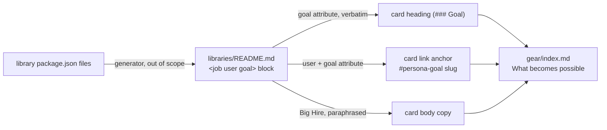

# Design 1930 — Gear page job-card coverage

Translates [spec.md](spec.md) into an architecture for the Gear product page's
"What becomes possible" section. The change is confined to one rendered
document; the design's weight is in the data-flow contract that keeps the
card set faithful to a generated source and in the anchor-derivation rule that
the success gate checks.

## Components

| Component | Role | This design |
|---|---|---|
| `libraries/README.md` § Jobs To Be Done | Source of truth — `<job>` block generated from each library's `package.json` | **Read-only.** Spec excludes editing it. |
| `websites/fit/gear/index.md` § What becomes possible | The marketed card grid | **Rewritten** to mirror the source completely, grouped by persona |
| Job `<job user goal>` attributes | The contract surface between source and page | Each `goal` → one card heading **verbatim**; each `user`+`goal` → one anchor |

No new files, no build-step code, no generator change. The catalog block is
already generated; this design treats its rendered output as a fixed input.

## Data flow

The page is a **manual projection** of the generated block: hand-authored, but
shaped one-to-one by the source's `<job>` attributes. The link from source to
page is not enforced by the build (see Key Decisions); the success gate's
slug-derivation check is the standing verifier in lieu of a build assertion.

## Section structure

Two persona groups replace the single `### For Platform Builders` group, in
this order:

1. **For Platform Builders** — keeps its existing persona-level framing
   paragraph and its existing count sentence verbatim ("39 libraries and 15
   services"); the implementer carries that number as-is rather than
   re-deriving it, since count drift is out of scope. Twelve cards, one per
   Platform Builders job.
2. **For Empowered Engineers** — new persona-level framing paragraph, one card
   (*Operate a Predictable Agent Team*).

Each group is a `### For <Persona>` heading, optional persona framing prose,
then a `
` of `<a>`-wrapped `### <Goal>` cards. This matches
the existing single-group shape; the change is from one group to two and from
six cards to thirteen.

## Anchor-derivation rule

Each card links to its job's entry in the catalog, not the section top. The
target is the GitHub-generated slug of the catalog's `## <Persona>: <Goal>`
heading, formed by: lowercase, drop punctuation (the colon), spaces → hyphens.

| Catalog heading | Anchor |
|---|---|
| `## Empowered Engineers: Operate a Predictable Agent Team` | `…README.md#empowered-engineers-operate-a-predictable-agent-team` |
| `## Platform Builders: Enable Agents on Every Surface` | `…README.md#platform-builders-enable-agents-on-every-surface` |

The slug is **derived from the `<job>` attributes**, not hand-authored: the
implementer and the gate compute expected slugs from one source — the `<job>`
attributes — so the two cannot diverge.

## Key Decisions

| Decision | Choice | Rejected alternative |
|---|---|---|
| Card set | Full mirror of the generated block — 13 cards, one per job | Curated subset: a second hand-maintained selection reintroduces the drift this spec closes (spec § Proposal). |
| Authoring mechanism | Manual projection shaped by `<job>` attributes | Generate the card grid from the block at build time: no generator hook exists on this page and the spec excludes build-time drift enforcement, deferring it to the spec 1460 gate (#1693). |
| Link granularity | Per-job anchor derived from `## <Persona>: <Goal>` | Keep the shared `#jobs-to-be-done` section-top anchor: leaves the third weakness (spec § Problem) unfixed. |
| Persona ordering | Platform Builders, then Empowered Engineers | Alphabetical or catalog order (EE first): contradicts Gear's primary-persona framing (spec § Proposal). |
| EE framing copy | New persona-level progress statement from the job's Big Hire | Reuse Platform Builders copy or omit framing: violates product-page convention item 3 (per-persona progress statement). |
| Body copy | One-to-two-sentence paraphrase of each job's Big Hire | Paste catalog text: fails the "framing, not paste" success gate. |
| Hero / meta copy | Left unchanged | Reword to add Empowered Engineers: spec accepts this residual tension and scopes hero rewording to a separate product call. |

## Verification surface

The spec's landing gate (§ Success criteria) is the design's acceptance
contract. The load-bearing check is the anchor gate: because hand-written `<a>`
links are not build-validated, the slug-derivation comparison (expected slugs
from `<job>` attributes vs. the page's link targets) is the only mechanical
guard against a mistyped anchor. The plan must make that derivation a single
mechanical step so implementer and reviewer share one source of expected slugs.

## Out of scope (carried from spec)

Catalog JTBD block, service-tier jobs, the library/service count sentence,
build-time drift enforcement (deferred to #1693 / spec 1460 gate), hero and
Getting Started sections, and other product/hub pages.

— Staff Engineer 🛠️
