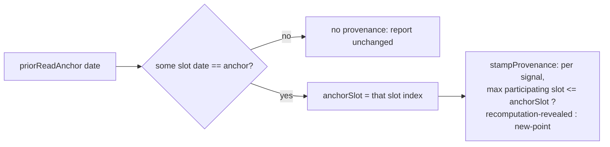
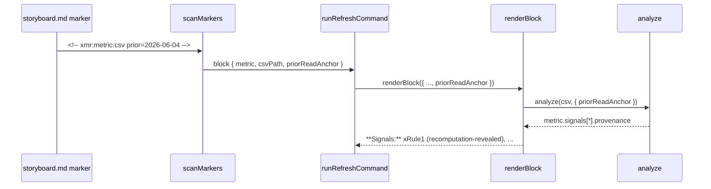

# Design 1940 — libxmr per-signal recomputation-revealed provenance

Implements [spec.md](spec.md). Adds an optional prior-read anchor to `analyze`,
stamps each fired signal record with anchor-relative provenance, threads the
anchor through the storyboard refresh marker, and documents the field at its
three published sites.

## Components

| Component                       | Location                                                                                                       | Role                                                                                                                                |
| ------------------------------- | -------------------------------------------------------------------------------------------------------------- | ----------------------------------------------------------------------------------------------------------------------------------- |
| `analyze`                       | `libraries/libxmr/src/analyze.js`                                                                              | Accepts `priorReadAnchor` option; resolves the date to an anchor slot; calls the stamper only for a corresponding anchor.           |
| Provenance stamper              | `libraries/libxmr/src/signals.js`                                                                              | New pure function `stampProvenance(signals, anchorSlot)` returning the same shape with `provenance` added to every fired record.    |
| `runAnalyzeCommand`             | `libraries/libxmr/src/commands/analyze.js`                                                                     | New `--prior-read` CLI option; passes the date to `analyze`.                                                                        |
| CLI definition                  | `libraries/libxmr/bin/fit-xmr.js`                                                                              | Declares `prior-read` option on the `analyze` command.                                                                              |
| Marker grammar                  | `libraries/libwiki/src/constants.js`                                                                           | `XMR_OPEN_RE` gains a third capture for an optional `prior=YYYY-MM-DD` token.                                                       |
| `scanMarkers`                   | `libraries/libwiki/src/marker-scanner.js`                                                                      | `tryOpen`/`closePair` read the new capture and carry `priorReadAnchor` on the xmr block.                                            |
| `runRefreshCommand`             | `libraries/libwiki/src/commands/refresh.js`                                                                    | Forwards `block.priorReadAnchor` into `renderBlock`.                                                                                |
| `renderBlock` / `formatSignals` | `libraries/libwiki/src/block-renderer.js`                                                                      | Accepts `priorReadAnchor`, threads it into `analyze`, and annotates each fired rule in the `**Signals:**` line with its provenance. |
| Documentation                   | `libraries/libxmr/README.md`, `.claude/skills/fit-xmr/SKILL.md`, `websites/fit/docs/.../xmr-analysis/index.md` | Document the `provenance` field at all three signal-record sites (criterion 5).                                                     |

## Anchor representation and resolution

The anchor is a **date string** (`YYYY-MM-DD`) — the end of the metric's series
as observed at the prior read. `analyze` already sorts each metric's group by
date and assigns 1-indexed slots. **Resolution is exact-match:** find the slot
whose date equals the anchor date; that slot's 1-indexed position is
`anchorSlot`.

- If no slot's date equals the anchor (backfill, correction, or anchor beyond
  the series end), the anchor is **non-corresponding** → no provenance is
  stamped that read, equivalent to supplying no anchor (spec § Scope).
- Append-only between reads guarantees the prior read's last date is still
  present, so exact-match resolves under normal operation. Nearest-slot-below
  resolution is explicitly rejected (Key Decisions) — it would assert membership
  facts backfill cannot support.

## Provenance predicate

After `detectSignals` runs unchanged, the stamper sets, on each fired record
across all four rules:

- `recomputation-revealed` when `Math.max(...record.slots) <= anchorSlot` —
  every participating observation was present at the prior read.
- `new-point` otherwise — at least one participating slot exceeds `anchorSlot`.

The predicate is anchor-relative **data membership**, not novelty: a signal that
also fired at the prior read still satisfies `max(slots) <= anchorSlot` and
carries `recomputation-revealed` (accepted — a single anchor cannot distinguish
revealed from persistent). For mR-Rule 1 a record's slot is `i + 2`, the _later_
of the two points whose moving range fired; comparing that later slot to
`anchorSlot` is what makes `Math.max(...slots) <= anchorSlot` sound for mR as
well as X signals, so no rule-specific branch is needed.

When no anchor (or a non-corresponding one) is supplied, `analyze` never calls
the stamper and records carry **no** `provenance` key — not `null`. This keeps
existing golden snapshots byte-identical (spec criterion 3).

## Data flow: storyboard refresh

The open marker is the only durable carrier of the prior-read date across
regenerations, because the refresh splices only the region _between_ the open
and close markers — the open marker line survives. Today `XMR_OPEN_RE` matches
trailing text with a non-capturing `(?:\s+[^>]*?)?` group and `tryOpen` reads
only metric + csvPath. This design adds a **third capture** to the regex for an
optional `prior=YYYY-MM-DD` token and carries it through `scanMarkers` onto the
xmr block; refresh forwards it to `renderBlock`. The new capture must precede
the existing `(?:\s+[^>]*?)?` trailing-text group so the "Do not edit" notice is
still tolerated and does not swallow the token. `renderBlock` currently calls
`analyze(csvText)` and `formatSignals` emits only rule names — both gain the
anchor and per-signal annotation respectively.

`formatSignals` annotates each fired rule with its provenance when present, so a
reader distinguishes recomputation-revealed from new-point signals at the cell.
Absent a `prior=` token the line renders exactly as today.

How a participant _writes_ the `prior=` token (who stamps it, at which session)
is **out of scope** — the storyboard-template guidance and session protocol own
that. This design only consumes the token if present.

## Key decisions

| Decision                 | Choice                                          | Rejected alternative                                                                                                                                              |
| ------------------------ | ----------------------------------------------- | ----------------------------------------------------------------------------------------------------------------------------------------------------------------- |
| Anchor type              | Date string, exact-match to a slot.             | Slot index directly — brittle across backfills and meaningless to a human writing a marker; the date is the natural prior-read identity.                          |
| Where provenance lives   | A `provenance` key on each fired signal record. | A metric-level `flip_provenance` roll-up — misclassifies the motivating case (spec § Problem, § Alternatives); consumers derive a roll-up from per-signal values. |
| Absent-anchor shape      | Omit the key entirely.                          | Emit `provenance: null` — would alter every existing golden snapshot, violating criterion 3's "report otherwise unchanged".                                       |
| Non-corresponding anchor | Treat as no anchor (no provenance).             | Nearest-slot-below — would silently assert membership facts the append-only assumption cannot support under backfill.                                             |
| Refresh anchor carrier   | New `prior=` capture in `XMR_OPEN_RE`.          | A sidecar file or a close-marker field — the open marker is the one line guaranteed to survive a splice; extending its grammar keeps the carrier with the block.  |
| Stamping site            | A pure stamper run after `detectSignals`.       | Inside each `detect*` function — would entangle provenance with detection and force four edits; the predicate only needs `slots`, already on every record.        |

## Interfaces

- `analyze(csvText, { eventType?, priorReadAnchor? })` — `priorReadAnchor` is a
  `YYYY-MM-DD` string or undefined. Adds `provenance` to fired records only when
  the anchor exact-matches a slot date; a malformed or non-corresponding date
  degrades to no provenance (§ Anchor resolution).
- `stampProvenance(signals, anchorSlot)` — exported from `signals.js`; returns
  the keyed-by-rule structure with `provenance` added to each record. `analyze`
  is the sole caller and invokes it only for a corresponding anchor, so the
  no-anchor path (and its golden snapshots) is untouched.
- `renderBlock({ metric, csvPath, projectRoot, fs, priorReadAnchor? })` — new
  optional field threaded into `analyze`; `formatSignals` gains per-rule
  provenance annotation.

## Out of scope (per spec)

Per-flip roll-up; baseline-freeze convention; signal-detection rules, `status`,
`classification`, and limit computation (all unchanged — provenance never
suppresses or reorders signals); historical block re-rendering. Spec 1680's
`classification` enum is untouched; the two specs edit different sites of the
same three doc files with no merge-order constraint.

— Staff Engineer 🛠️
