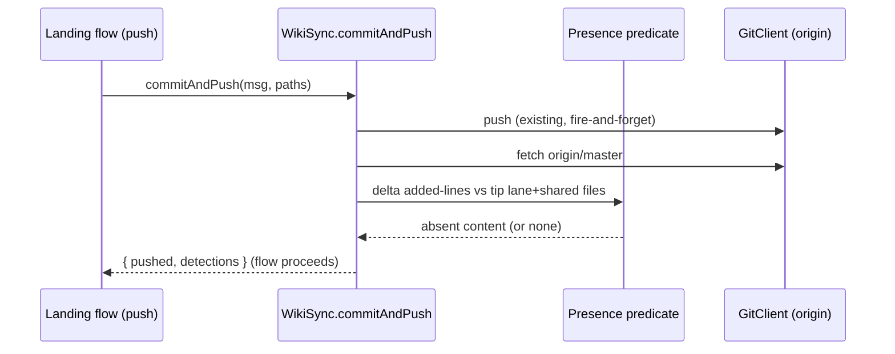
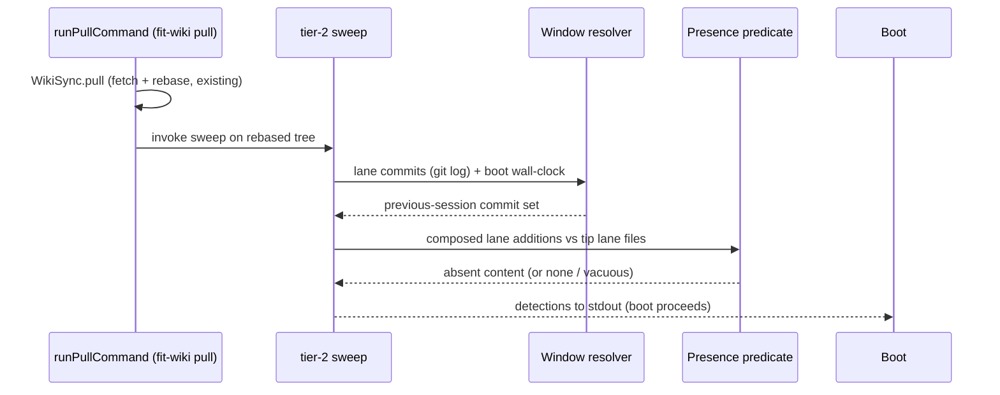

# Design 1960 — Wiki post-push integrity instrument

Architecture for [spec 1960](./spec.md): a two-tier, content-keyed,
fail-visible integrity instrument in libwiki. Tier 1 verifies the just-pushed
delta at the origin tip in the landing flow; tier 2 sweeps the lane's
previous-session push set at boot. Neither gates, neither writes, neither
restores.

## Problem (restated)

A sibling session's merge can drop a lane's already-landed wiki content at
origin with no signal to the writer. Pre-push gates measure the outgoing tree;
the eraser is a different session's later push. The only instrument that covers
this residual is victim-side post-push probing, at two seams: right after the
landing push (bounds same-window erasure to seconds) and at the next boot
(catches a prior session's erasure, including across rotations). Presence is
content-keyed so legitimate rotation and part-split never false-positive;
additions composed over the window so the lane's own trims never false-positive.
13 success criteria; see spec § Success criteria.

## Components

| Component | Home | Responsibility |
| --- | --- | --- |
| `GitClient` log/show primitives | `libutil/src/git-client.js` | New read-only git verbs the predicate needs: `log` (lane-commit enumeration with author + commit-time), `showDiff` (a commit's added **content lines**, not just names), `show` (blob at a ref). |
| Lane-file matcher | `libwiki/src/lane-files.js` (new) | Pure predicate: does a path belong to lane `A`? (`A.md`, `A-YYYY-Www.md`, `A-YYYY-Www-partN.md`, `metrics/{skill}/{year}.csv` authored by `A`). Shared by both tiers and the window scan. |
| Presence predicate | `libwiki/src/integrity.js` (new) | Pure core: given a set of added content lines (composed over a window, own-deletions cancelled) and the tip's lane-file contents, return the absent lines with their push-time home + identity. Tier-agnostic. |
| Window resolver | `libwiki/src/integrity.js` (new) | Given lane-authored commits (time-ordered) and the boot wall-clock, return the previous-session commit set (tier 2). Owns the heuristic below. |
| Tier-1 probe | `libwiki/src/integrity.js`, called from `WikiSync.commitAndPush` after the existing push | Re-fetch origin/master (a **new** post-push fetch — `commitAndPush` today fetches only pre-push), then run the predicate over the just-pushed delta (full delta incl. shared surfaces) against the fetched tip's blobs. Returns detections; never throws, never writes. |
| Tier-2 sweep | `libwiki/src/integrity.js`, called from `runPullCommand` (`commands/sync.js`) after `WikiSync.pull` returns | `pull` is the boot flow's fetch+rebase seam; the sweep runs there, on the just-rebased tree. Resolve the window, compose lane additions over it, run the predicate over lane files only. Returns detections. (`fit-wiki boot` performs no fetch and is untouched.) |
| Detection record + renderer | `libwiki/src/integrity.js` + command surfaces | A `Detection` carries `{ tier, contentId (the absent line's normalized text — criterion 10), pushHome (push-time file), detectedAt (wall-clock), exposure?: {seconds, basis:"commit-timestamp"} }`; rendered to the calling command's stdout. |

## Data flow

## Key Decisions

| Decision | Choice | Rejected alternative |
| --- | --- | --- |
| Window heuristic (tier 2) | **Idle-gap session boundary** with a fixed `SESSION_GAP` (30 min): walk lane commits newest→oldest; the current session is the run of lane commits ending at the tip; the **previous session** is the next contiguous run, where a commit-time gap > `SESSION_GAP` separates runs. The window is that previous-session run (vacuous if no lane commit exists at all). | (a) **Watermark/state file** — rejected: spec § What forbids instrument-authored state; a watermark is itself erasable and would need its own coverage. (b) **Fixed look-back duration** (e.g. last 24h) — rejected: a long-running or long-idle lane either over- or under-covers the floor depending on cadence, not session structure. (c) **All-history sweep** — rejected: spec § Out of scope (standing whole-history audit) and unbounded adjudication load. |
| Over-widening posture | The resolver MAY widen (e.g. fold an ambiguous boundary into the previous session) because the spec proves widening is detection-only and idempotent. When the gap structure is unresolvable but lane commits exist, return a **degenerate detection**, never a vacuous pass (criterion 7). | Narrowing to "final push only" — rejected by spec § Tier 2: fails the recursive-victim guarantee; claim-time/interim pushes are lane pushes too. |
| Presence keying | **Content-keyed, line-granular**: a pushed added line is present iff that exact line exists in any lane file at the tip. Identity = the line's normalized text + its push-time home path. | Path-keyed presence — rejected: false-positives on every rotation/part-split (criterion 4); the eighth-member window crossed a split. |
| Composition over window | **Additions-only, own-deletions cancel within the window**: compose the window's commits oldest→newest; a later own-lane deletion of an earlier-added line removes that line from the assertion set. The residual assertion set is verified against the tip. | Per-commit independent assertion — rejected: a lane's own trim/rotation in a later commit would falsely assert the trimmed line absent (criterion 5). |
| Tier-1 scope | Tier 1 verifies the **full** just-pushed delta (lane files **and** shared singletons/teammate surfaces), because its window is seconds. | Restricting tier 1 to lane files — rejected: spec § Presence predicate binds tier 1 to the full delta; a same-window shared-surface erasure is exactly what 42s detection buys. Accepted cost: a legitimate seconds-later consumption surfaces as a tier-1 detection for adjudication (spec-accepted, mirrors D5). |
| Tier-2 scope | Tier 2 verifies **lane files only**; shared singletons and teammate surfaces are excluded (consumed at session cadence). | Including shared surfaces in tier 2 — rejected: spec § tier-2 domain bullet; their durability is owned by their own semantics. |
| Detection effect | **Never gates, never writes, never restores.** Tier 1 runs after publication (nothing to refuse); tier 2 annotates boot. Detections surface in command stdout only (criteria 9, 12, 13). | Throwing / non-zero exit on detection — rejected: would gate the flow, contradicting criteria 12–13. |
| Stamp basis | Every detection stamps the **detector's wall-clock** (`runtime` clock) as the binding receipt; any exposure-seconds figure derived from commit timestamps is labeled `basis: "commit-timestamp"` (criterion 8). | Commit-timestamp-only stamping — rejected: push receipts are unrecoverable (spec § Problem); commit arithmetic is the labeled fallback, not the receipt. |
| Read-of-tip mechanism | Tier 1 re-fetches then reads `origin/master` blobs via `GitClient.show`. Tier 2 reads the post-pull working tree directly (fs), since `runPullCommand`'s `WikiSync.pull` already rebased the tree onto the fetched tip. | Re-fetching in tier 2 — rejected: `runPullCommand` is the fetch seam and the rebased tree *is* the fetched tip. Tier 1 cannot read the tree (its own commit sits on it) so it reads origin blobs after a fresh fetch. |

## Window heuristic — justification and adjudication load

**Why idle-gap.** A lane's pushes within one agent invocation cluster in time
(claim-time push, interim pushes, session-close push — minutes apart); the
inter-session gap is the latency floor the spec names (hours to days). A
30-minute idle gap cleanly separates a session's cluster from the prior one
without any stored state: the boundary is read from commit-time deltas in the
fetched history, which a tip-side erasure does not rewrite. The previous-session
run is, by construction, a **superset of or equal to** the spec's floor (the
previous session's full push set, criterion 3): every claim-time and interim
push of that session is a lane commit inside the same idle-bounded run.

**Adjudication load (spec-required statement).** "Always safe" is coverage
safety only; the cost of the window is the legitimate condensations/archivals
inside it that surface as detections. The idle-gap heuristic bounds the window
to **one session's worth of lane authoring** (typically a handful of commits
over minutes), so the expected per-boot adjudication load is the count of
lines a sibling same-lane or cross-lane curation pass legitimately rotated out
of that one session's additions between its close and this boot — zero when no
such pass ran, and at most the session's own addition count when a curation
pass condensed the whole session. This is strictly tighter than a
fixed-duration or whole-history window. Bounding further (e.g. owner-side
acknowledgement of known rotations) is owner practice, per spec § Detection
semantics, and out of instrument scope.

## Clean break

New code only; no existing path is wrapped or shimmed. `commitAndPush` gains a
post-push verification step appended after the existing push, returning an
extended result `{ pushed, reason, detections }`; the push command renders
detections. The boot flow gains a sweep step after `fit-wiki pull`. No
compatibility shims — the spec names none.

## Risks

- **`git show ref:path` for a path absent at the tip** errors; the predicate
  must treat "file not present at tip" as "lines from it not present", not as a
  hard failure — folded into the content-keyed scan over the tip's lane-file
  set, never a per-path lookup.
- **Author identity vs lane identity.** Lane-commit enumeration keys on git
  author (the inherited parent identity), but lane *ownership* of a file keys on
  the filename agent token. The window scan uses author; the predicate's domain
  uses the filename matcher. The plan must not conflate them.

— Staff Engineer 🛠️
