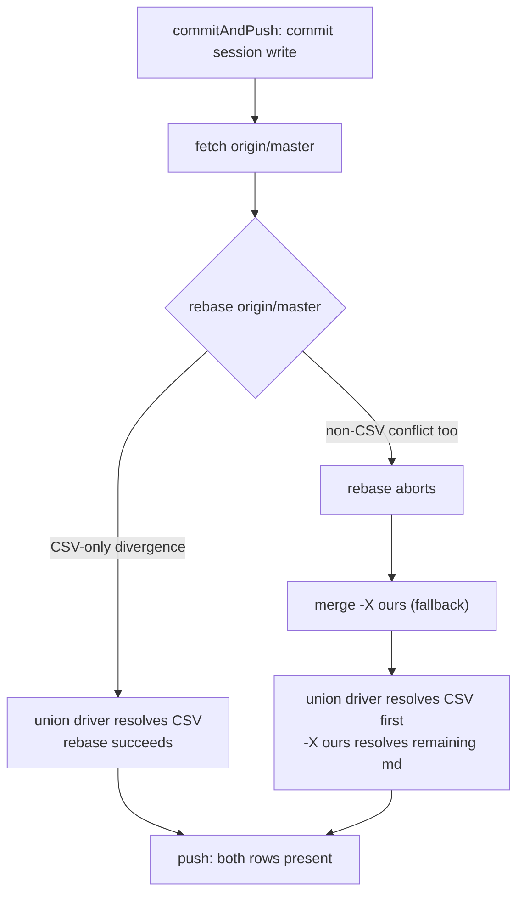

# Design 1970 — Wiki metrics CSV appends survive concurrent sync-merges

Architecture for [spec.md](./spec.md). The spec's WHAT: concurrent appends to
`metrics/**/*.csv` must keep both sides' rows on every publish path, with
duplicates surfaced (never silently removed) and the non-CSV boundary intact.
This design settles WHERE the union declaration lives, HOW provisioning
guarantees it, and WHICH component reports duplicates.

## Components

| Component | Role |
| --- | --- |
| Wiki `.gitattributes` | The union declaration. A tracked file in the wiki repo working tree carrying `metrics/**/*.csv merge=union`. Governs every clone and both publish paths because git reads it from the worktree during merge. |
| `WikiSync` provisioning step | Ensures the declaration is present-and-correct before the publish commit, idempotently. Existing wikis acquire it on their next sync; the change rides the same commit as the session's metric write. |
| `runInitCommand` provisioning | Writes the declaration into freshly cloned wikis so protection exists from creation, before any append. |
| Audit `metrics-csv` scope + duplicate rule | A new audit scope enumerating `metrics/**/*.csv` and a rule reporting exact-duplicate rows by file and line. The fail-visible half of keep-both. |

## Merge mechanism: git built-in `union` driver

Git ships a built-in low-level merge driver named `union` that, on a
three-way merge of a single file, emits the union of both sides' added lines
with no conflict. It is selected per path by a `merge=union` attribute. No
`merge.<name>.driver` config registration is needed — `union` is internal to
git, so the declaration is one `.gitattributes` line and nothing else.

**Why this pre-empts the keep-local fallback.** The merge driver runs at the
per-blob level inside git's merge machinery. Both publish paths in
`commitAndPush` route through that machinery: the `rebase origin/master` step
replays commits via three-way merges, and the `mergeOursStrategy` fallback
(`merge -X ours`) is a recursive-strategy merge. For a path attributed
`merge=union`, git invokes the union driver and the file resolves cleanly — so
the rebase no longer fails on CSV-only divergence, and when the fallback merge
does run (driven by a concurrent *non-CSV* conflict), `-X ours` only governs
paths the union driver did **not** already resolve. The CSV keeps both sides;
the markdown keeps the local side. The two behaviors compose without code in
`commitAndPush` choosing between them — the attribute decides per path.

This is the precedence the spec asked the design to demonstrate, and it is the
reason the declaration must be a tracked worktree file rather than repo-local
config: `core.attributesFile` and `.git/info/attributes` are per-clone and do
not propagate, so they would protect the seeding clone alone and miss the very
sibling sessions that cause the loss.

### Rejected alternatives

- **Application-level read-union-rewrite on conflict.** Detect the CSV
  conflict in `commitAndPush`, parse both sides, re-emit the union, continue.
  Rejected: it reimplements a three-way line merge git already ships, runs only
  on the paths the code remembers to special-case, and — fatally — does not
  protect downstream installations' wikis or any publish path other than the
  one we patched. The spec requires the rule to be "carried by the wiki itself
  so it governs every clone and both publish paths." A worktree `.gitattributes`
  is that carrier; code in one library function is not.
- **Custom registered merge driver (`merge.csvunion.driver = ...`).** A
  user-defined driver invoking a script. Rejected: needs both a `.gitattributes`
  attribute *and* a per-clone `merge.csvunion.driver` config entry that does not
  travel with the clone, reintroducing the propagation problem the built-in
  `union` driver avoids entirely.

## Provisioning: two owners, one declaration

The declaration's content is identical everywhere; the two entry points cover
the two ways a wiki comes to exist. A single shared helper owns the canonical
declaration text and the present-and-correct check so both owners agree
byte-for-byte. "Correct" means the `metrics/**/*.csv merge=union` line is
present; other unrelated `.gitattributes` lines are preserved untouched.

| Path | Owner | Trigger | Idempotency |
| --- | --- | --- | --- |
| Fresh clone | `runInitCommand` | wiki cloned for the first time | Write only if absent-or-wrong; present-and-correct is a no-op. Fresh clones carry the line before their first append. |
| Existing clone | `WikiSync.commitAndPush` | next publish after rollout | Ensure-before-commit; if the file already matches, no write, no commit, no push. When the line is absent-or-wrong, the ensure both writes the file **and** forces `.gitattributes` into the commit, regardless of what else the publish carries. |

**The declaration must be committed independently of the session's payload.**
`commitAndPush` has two properties this design must respect, both verified in
`wiki-sync.js`: the commit is **pathspec-scoped** when `paths` is supplied
(`commitPaths` stages only those paths — `fit-wiki claim` scopes to
`["MEMORY.md"]`, a metric write to its CSV), and the function **returns early**
at the clean-tree / not-ahead gates before committing. So a declaration write
cannot rely on "riding" the session's commit: on the scoped path it falls
outside the pathspec and is autostashed aside, and on a no-payload sync there
is no commit at all.

The ensure therefore runs **before** the clean/ahead gates and, when it writes
the file, appends `.gitattributes` to the effective commit pathspec (and, when
the session has no other payload, supplies `.gitattributes` as the sole
pathspec so a commit exists to carry it). This makes "exactly one change
introduces it; a second sync produces zero changes and zero commits" hold on
every publish path: first sync after rollout commits the one line; every later
sync finds it present-and-correct and the ensure is a no-op, so the clean/ahead
gates short-circuit exactly as before. Protection begins one sync after an
existing clone acquires the line (the spec's accepted one-sync window).

### Rejected alternative

- **Eager standalone provisioning push** (a dedicated commit+push that installs
  the attribute the moment a wiki lacks it, independent of any session write).
  Rejected per the PR's recorded eager-push provisioning decision: it adds a
  churn commit and a push race of its own to every existing clone's first
  sync, for no durability gain over folding the one-line write into the commit
  the session is already making.

## Duplicate-row audit finding

Keep-both means two sides appending the identical line yield that line twice.
The spec requires this be fail-visible with an owner-driven exit path.

- **New audit scope `metrics-csv`.** `buildContext` today loads only `.md`
  files; it gains a pass that enumerates `metrics/**/*.csv` under the wiki
  root and loads each as a subject carrying `path` and parsed rows. A
  `SCOPE_RESOLVERS["metrics-csv"]` entry returns those subjects.
- **New rule `metrics-csv.duplicate-row`** (severity `fail`). For each CSV it
  reports every data line that is byte-identical to an earlier data line in the
  same file, as a finding naming the file and the duplicate's line number. A
  data line is any non-blank line after the first (the header row, identified
  positionally as line 1, is never a duplicate subject — the plan settles
  header detection). It does not edit the file — removal stays with the owner.
- **Exit path is structural, not special-cased.** The check keys on exact line
  equality, so any column edit (run id or note) on one row makes the pair
  non-identical and the finding stops firing. A confirmed-genuine measurement
  pair cannot re-fire it; a resurrected deletion (a genuine duplicate) re-fires
  it, which is the spec's "visible, re-flagged resurrection."

### Rejected alternative

- **Auto-dedup in the merge driver or audit fix.** Silently collapse identical
  rows. Rejected: the spec forbids silent removal — a duplicate can be a
  genuine repeated measurement, and only the owner knows which. Surface and let
  the owner decide.

## Boundary and durability (from spec, not re-litigated)

- **Non-CSV boundary.** Only `metrics/**/*.csv` carries `merge=union`. Markdown
  surfaces match no attribute, so rebase/`-X ours` behave exactly as today —
  verified by a test, not assumed.
- **Deletion durability.** Keep-both resurrects a row deleted on one side while
  the other appends; accepted, because the resurrected duplicate re-fires the
  audit finding (visible retry, not silent loss).
- **Row ordering.** Arbitrary among concurrently appended rows; harmless — rows
  are order-insensitive and self-dating per spec § Problem.

## Documentation

The published contract page
`websites/fit/docs/libraries/predictable-team/wiki-operations/index.md` gains
the keep-both-sides merge behavior for metrics CSVs, the duplicate-visibility
trade, and the audit finding. (Plan routes this to `technical-writer`.)

— Staff Engineer 🛠️
