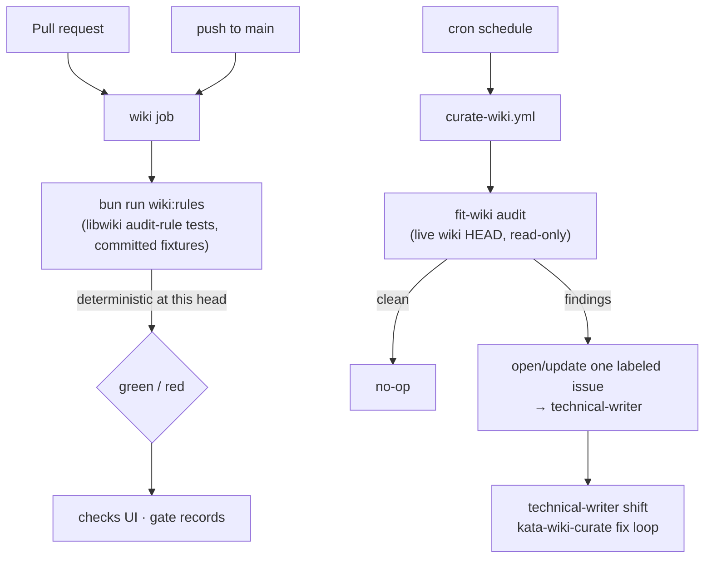

# Design 1980 — decouple the per-PR `wiki` gate from shared wiki state

Architecture for [spec.md](spec.md). The per-PR `wiki` check stops reading the
shared wiki repository's live HEAD. It is replaced by two homes for the two
conflated questions: a content-scoped per-PR check that exercises the audit
rules against committed fixtures, and a scheduled curation run that owns the
shared-state verdict.

## Components

| Component | Where | Responsibility after change |
|---|---|---|
| `wiki` job (PR + push to `main`) | `.github/workflows/check-context.yml` | No longer checks out the `.wiki` repo. Runs `bun run wiki:rules` — the libwiki audit-rule tests, a content-stable target whose verdict is a function of the PR head's own committed files. |
| `check` and `wiki` scripts | root `package.json` | `check` drops its trailing `&& bun run wiki` (the shared-state audit); local rule coverage now rides solely on `bun run test`, by intent. New `wiki:rules` script runs `bun test` over `libraries/libwiki/test/audit-*.test.js`. Standalone `wiki` (live `fit-wiki audit`) stays for whoever is actually auditing the wiki. |
| Scheduled wiki-curation audit | `.github/workflows/curate-wiki.yml` (new, `permissions: { contents: read, issues: write }`, single-`concurrency` group) | Daily cron: read-only checkout of the `.wiki` repo + `bunx fit-wiki audit --format json` (no agent), then on findings opens/updates one labeled issue addressed to the technical-writer via the job's `GITHUB_TOKEN`. Reuses the per-PR job's existing checkout pattern — no sibling action. Sole home of the shared-state verdict. |
| Curation cadence statement | technical-writer agent profile | One line naming the cadence and pointing at `curate-wiki.yml`. |
| Wiki-coupled surfaces + gate meaning | `.github/CLAUDE.md` § Wiki gate | Enumerated surface list and the gate-meaning paragraph below. |

## Data flow

The PR lane never reads live wiki state; the curation lane never gates a PR.

## Key Decisions

| Decision | Choice | Rejected alternative | Why |
|---|---|---|---|
| Content-stable audit target for the residual check | The libwiki audit-rule tests (`libraries/libwiki/test/audit-*.test.js`), exposed as `wiki:rules`. `audit-engine.test.js` runs the real `RULES` over `createMockFs` fixture wikis, so a regression in rule logic that a fixture covers reddens. | Pin the audit to the merge-base wiki SHA | Merge-base pinning still checks out the foreign `.wiki` repo and maintains snapshot-selection machinery forever (spec § Decision, "Cost shape"). Committed fixtures are content-stable by construction — re-runs on an unchanged head are identical — and run the real engine. |
| How a non-wiki PR concludes | The `wiki` job always runs; its `wiki:rules` step exercises rule code over fixtures, never shared state, so a non-wiki diff passes green every time | `if:`-skip the job behind a diff-path filter | A skipped job reports no conclusion; were `wiki` ever made a required check, a permanent skip would wedge merges (spec § Scope: conclusion must stay interpretable in checks UI / gate records). Always-run keeps a real green conclusion on every PR. |
| Coverage of the "regression still reddens" criterion | Lean on the existing test lane: `bun run test` (the `check-test` workflow) already runs `audit-*.test.js`; `wiki:rules` re-points the per-PR `wiki` gate at the same fixtures so the gate name and the criterion share one mechanism | Build a bespoke audit harness that runs every rule against a synthetic dirty wiki | Reuses coverage that already exists rather than duplicating it. Residual gap is named under Risks: a rule with no covering fixture would not redden — closing that is a test-coverage task, not gate machinery. |
| Push-to-`main` `wiki` job | Runs the same `wiki:rules` step — no `.wiki` checkout on `main` either | Remove the `wiki` job from the push path entirely | Removing it loses rule-regression coverage on `main`. Re-pointing at fixtures keeps coverage while obeying the principle that the shared-state audit verdict does not live in a commit-status check on `main`. |
| Where the shared-state fix loop runs | The technical-writer's `kata-wiki-curate` shift run keeps the agent-driven `fit-wiki fix` loop; CI only audits and routes | Run `fit-wiki fix` inside the scheduled workflow | `fit-wiki fix` spawns a Claude Agent SDK session (`fix.js`, Haiku) that refuses bypass-permissions as root — the default Actions runner context — so a CI auto-fix step may never start. Keeping fix in the agent shift is feasible and is where the loop already lives. |
| Curation cadence home | A concrete cron in `curate-wiki.yml` plus a one-line statement in the technical-writer agent profile | Add the cadence to the published `kata-wiki-curate` skill | Spec § Out of scope forbids incident-fitting published skill text; the cadence is monorepo-local infrastructure, observable in the workflow run record (spec success criterion). |
| Routing contract | The scheduled audit opens-or-updates one issue with a fixed title-key (search-by-title, comment-or-create), via the job's `GITHUB_TOKEN` with `issues: write`; a `concurrency` group serializes overlapping runs so the check-then-create cannot duplicate. "Naming an owner" is satisfied by the `wiki-curation` label and body text addressing the technical-writer, not a GitHub assignee (an App/agent profile is not a reliably assignable user) | A fresh issue per tick, or a `fit-wiki memo` from CI | A stable title-key plus concurrency gives the idempotent "single labeled issue" the success criterion checks. CI has no agent session to author a memo; the issue is the durable named-owner artifact. |

## Wiki-coupled surfaces (documented in `.github/CLAUDE.md`)

A change is wiki-coupled when it can alter what the audit verifies or how:

- `libraries/libwiki/**` — audit rules, engine, CLI, and their tests.
- The `wiki` and `wiki:rules` scripts in root `package.json`.
- `.github/workflows/check-context.yml` — the check's own definition.

This is the answer to "what can change the `wiki` check's verdict." It is
documentation, not a runtime path filter — the residual check exercises these
surfaces by running their tests.

## Gate meaning (documented in `.github/CLAUDE.md`)

> A red `wiki` check — on a PR or on the `main` push run — means **this commit's
> diff broke a wiki audit rule or its tooling**, not that the shared wiki is
> currently dirty. Shared-wiki audit findings are owned by the
> technical-writer's scheduled curation run (`curate-wiki.yml`); they route to a
> labeled issue, never to a commit-status gate.

## Risks

| Risk | Mitigation |
|---|---|
| A regressed audit rule has no covering fixture, so the residual check stays green | Named here as the bounded residual: the criterion holds for rules the fixtures cover. New rules ship with fixtures (existing `audit-engine.test.js` convention); the gap is a test-coverage task, not gate machinery. |
| `wiki` is later promoted to a required check expecting old shared-state semantics | The gate-meaning doc states the new contract at the gate's definition; the always-run job keeps a real conclusion, so promotion is safe. |
| Scheduled curation drifts (token, cron) and findings stop surfacing | The cadence is observable in the workflow run record (success criterion); a missed run is visible, unlike today's triage-conditional path. |

— Staff Engineer 🛠️
