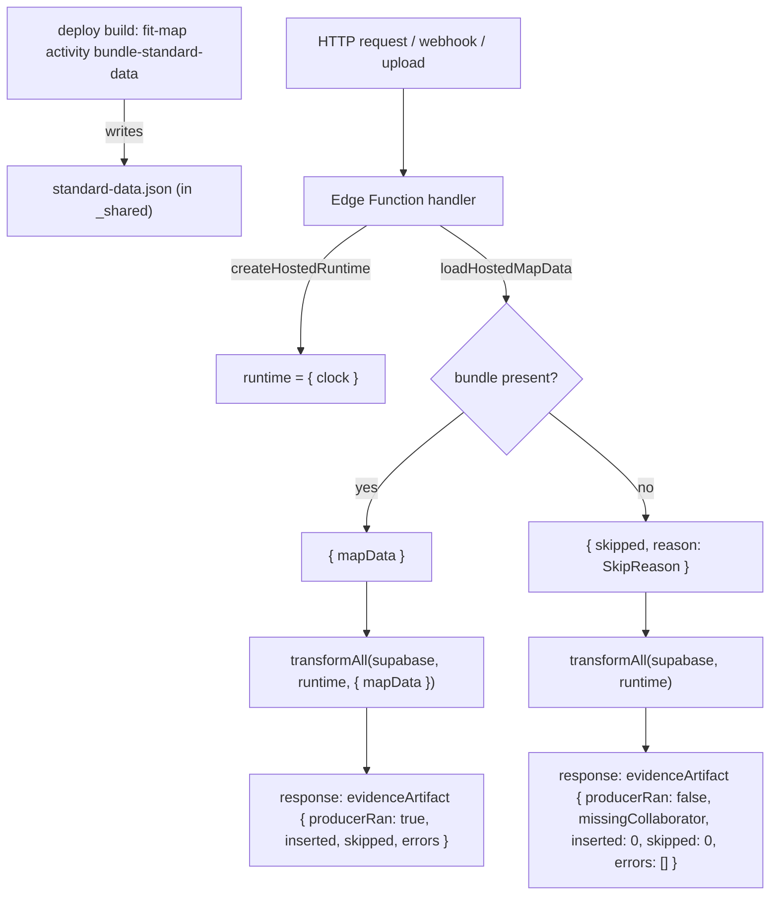

# Design 2000-a: Hosted transform path runs the artifact-driven evidence producer

Architecture for [spec.md](spec.md). The hosted Supabase Edge Function surface
must invoke the shared transform code with the same two collaborators the CLI
supplies — a **runtime** (for the injected clock) and **standard data**
(`mapData`, for the artifact-driven evidence producer) — and must report a
skipped producer distinctly from an empty one.

## Components

| Component                          | Where                                                      | Role                                                                                                   |
| ---------------------------------- | ---------------------------------------------------------- | ------------------------------------------------------------------------------------------------------ |
| Standard-data bundle               | `products/map/supabase/functions/_shared/activity/standard-data.json` (generated) | The serialized `loadAllData` shape, emitted at deploy build and read by the hosted surface             |
| `loadHostedMapData`                | `products/map/supabase/functions/_shared/activity/map-data.ts`                    | Reads the bundle; the single home for the skip-reason contract (see Interfaces)                         |
| `createHostedRuntime`              | `products/map/supabase/functions/_shared/runtime.ts`                              | Constructs the minimal runtime the transforms touch — a `clock` with `now()` only — as a frozen bag    |
| Handler logic modules              | `products/map/supabase/functions/{transform,getdx-sync,people-upload}/handler.js` | Pure `handle(supabase, runtime, …)` per function — no `Deno`/esm.sh imports. Each runs the function's full extract→transform sequence and threads the runtime into both phases (the extracts read the clock too); `transform` also threads `mapData`. Returns the response body |
| Edge Function wrappers             | `.../index.ts` | Thin `Deno.serve` wrappers that build the Deno-only collaborators (esm.sh supabase client, `createHostedRuntime`), read `Deno.env` config, call the handler, and map the body to an HTTP status. Not imported by tests |
| Bundle generator                   | `products/map/bin/fit-map.js` (`activity bundle-standard-data` subcommand)        | Resolves the data dir via the CLI's existing `findDataDir`, loads via the CLI loader, writes the bundle |
| Hosted test harness                | `products/map/test/activity/hosted/*.test.js`                                     | Imports each handler module and drives it against a fake Supabase + fixture bundle                      |

`createHostedRuntime` lives at `_shared/runtime.ts` (cross-domain), not under
`_shared/activity/`, where the standard-data components live.

## Data flow

## Key decisions

| #  | Decision                                                                                                                                                       | Rejected alternative & why                                                                                                                                                                       |
| -- | -------------------------------------------------------------------------------------------------------------------------------------------------------------- | ------------------------------------------------------------------------------------------------------------------------------------------------------------------------------------------------ |
| D1 | **Standard data is bundled at deploy** as a generated JSON asset under `_shared`, read by the hosted path the same way it re-exports transform code.            | _Persist in DB_: adds a schema, a write path, and a freshness/invalidation story the spec lists as out of scope for a first cut. _Accept in request_: opens a trust boundary on every webhook. _Fetch from a service_: a network dependency on the import hot path. Bundle reuses the deploy as the freshness boundary, which is already how hosted code ships. |
| D2 | **`createHostedRuntime` builds only what the transforms read** — a `clock` exposing `now()` over `Date.now()` and nothing else (no `sleep`/`setTimeout`/`fs`/`proc`), frozen. | _Reuse `createDefaultRuntime`_: it constructs a Node `fs`/`proc`/`Finder` that does not exist under Deno and that no transform on this surface touches. A minimal bag keeps the hosted surface honest about its dependencies. |
| D3 | **Handlers thread collaborators explicitly** at each call site (runtime to the three clock-touching functions; `mapData` to the orchestrator only), matching the CLI's threading shape. | _Default `runtime`/`mapData` inside the transforms_: hides the dependency and re-creates the silent-skip the spec is closing — the same defect, moved one layer down. |
| D4 | **`loadHostedMapData` returns a typed skip** rather than throwing; the orchestrator surfaces it (see D5).                                                          | _Throw on missing bundle_: a missing bundle is an operating condition (D1 freshness boundary), not a fault; throwing would regress to the indistinguishable failure the spec rejects.            |
| D5 | **The producer result reports run/no-run with an additive distinct field.** `transformEvidenceArtifact` already returns a `skipped` *count* (per-row no-match); the orchestrator (in `src/activity/transform/index.js`, not the `_shared` shim) adds `producerRan: boolean` to the `evidenceArtifact` result on both branches, plus `missingCollaborator` when `mapData` is absent. The `inserted`/`skipped`/`errors` fields are retained on both branches, so the CLI readers (`transformAllTargets` and the `seed` path) are unaffected — criterion 5 holds. | _Overload the existing `skipped` field_: collides with the per-row no-match count and re-creates the indistinguishable shape criterion 4 rejects. _Infer skip from zero counts in the handler_: counts cannot distinguish "no match" from "did not run." |
| D6 | **Handler logic is a pure `handle(...)` in a sibling `handler.js`**, free of `Deno`/esm.sh imports; the `.ts` `index.ts` wraps it in `Deno.serve` and supplies the Deno-only collaborators. Collaborator loaders (`loadMapData`, the `readBundle` reader) are parameters, so the Node test runner drives the real handler. The `transform` handler surfaces `loadHostedMapData`'s skip `reason` and the producer's `missingCollaborator` (criterion 4: names *why*). | _Keep logic inline in `Deno.serve`_: the module has no export and references `Deno`/esm.sh at top level, so it cannot be imported by the repository's Node test runner — criteria 1, 3, 4 require driving the handler, not the shared transform. _Mock the `Deno` global_: brittle and tests the wrapper, not the wiring. |

## Interfaces

- `createHostedRuntime(): { clock: { now(): number } }` — frozen; the only
  surface the people and GetDX transforms dereference.
- `loadHostedMapData(): Promise<{ mapData: object } | { skipped: true; reason: SkipReason }>`
  — the single home for the skip-reason union. `SkipReason = "bundle_absent" |
  "bundle_malformed"`; the diagram and D4 reference it by name. Reads the bundle
  relative to the module via `import.meta.url`.
- `transformAll(supabase, runtime, { mapData } = {})` — call signature unchanged;
  the **producer-result contract** gains, additively, `producerRan: boolean` on
  both branches and `missingCollaborator` when false. `inserted`/`skipped`/
  `errors` are retained. Both CLI consumers of this result —
  `transformAllTargets` (`src/commands/activity.js`) and the `seed` path — read
  only the retained fields, so their output is unchanged. The orchestrator's
  source of truth is `src/activity/transform/index.js`; the `_shared` files are
  pure re-export shims and are not edited.
  `transformAllGetDX(supabase, runtime)` and `transformPeople(supabase, runtime)`
  are already runtime-typed; the change is that hosted callers now pass it.
- Bundle generator subcommand resolves the data dir via the CLI's `findDataDir`,
  then reuses `createDataLoader(runtime).loadAllData(dataDir)` and writes the
  serialized shape; no new loading logic.

## Surface coverage

| Edge Function    | Threads runtime | Threads mapData | Why                                                                 |
| ---------------- | --------------- | --------------- | ------------------------------------------------------------------- |
| `transform`      | yes             | yes             | Calls the orchestrator; needs both for clock branches and producer  |
| `getdx-sync`     | yes             | no              | `extractGetDX` reads the clock to timestamp stored docs; `transformAllGetDX` reads it for snapshot-comment files; no `mapData` |
| `people-upload`  | yes             | no              | `extractPeopleFile` reads the clock to name the stored file, and `transformPeople` reads it on every upload (live failure); both phases get the runtime |
| `github-webhook` | no              | no              | `transformGitHubWebhook` / `extractGitHubWebhook` take neither; out of scope per spec § Scope |

## Clean break

The hosted handlers stop calling transforms collaborator-less; they thread the
real collaborators. No shim wraps the old call. The orchestrator's no-`mapData`
path no longer returns the ambiguous bare `{ inserted: 0, skipped: 0, errors:
[] }`: it carries `producerRan: false` and `missingCollaborator` alongside the
retained counts (D5), so a reader can tell "did not run" from "ran, matched
nothing." The discriminator is additive — CLI readers ignore it and their output
is unchanged.

## Risks

- **Bundle drift.** A deploy that ships code without regenerating the bundle
  serves stale standard data. Mitigation lives in the plan: the generator is a
  build step, and a stale/absent bundle degrades to the reported skip (D4), not
  a silent wrong answer.
- **Deno path resolution** for the bundle differs from Node; `loadHostedMapData`
  resolves relative to `import.meta.url`, exercised by the hosted harness.

— Staff Engineer 🛠️
