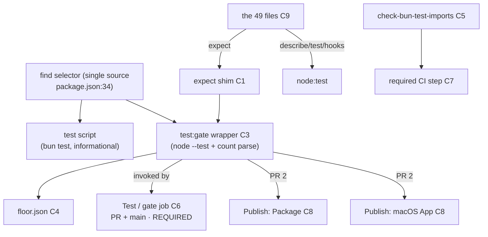

# Design 2020 — Test-Runner Strategy: `node --test` Gate, bun Local/PR

Architecture for [spec 2020](spec.md): one named `test:gate` role-script running
`node --test` with a count-enforcing wrapper, invoked at four surfaces; a
dependency-free `expect` shim in libmock so the 49 `bun:test` importers converge
onto `node:test`; and a repo-wide re-divergence guard wired as an explicit
required CI step. Ships as two PRs per the spec's sequencing constraint.

## Components

| # | Component | Where | Responsibility |
| --- | --- | --- | --- |
| C1 | `expect` shim | `libraries/libmock/src/expect/index.js` (+ export `@forwardimpact/libmock/expect`) | Dependency-free Jest-style `expect()` covering the measured matcher surface; runs unchanged under `node --test` and `bun test` |
| C2 | shim test | `libraries/libmock/test/expect.test.js` | A table-driven per-matcher anti-vacuity property (each matcher in the D3 surface: one passing + one throwing case) + explicit `.not` negated-should-fail case + async negative (`rejects.toThrow()` on a non-rejecting promise must fail) + semantics-drift cases (`toEqual` Map/Set, `toThrow` substring vs RegExp, async `.rejects`) |
| C3 | `test:gate` wrapper | `scripts/test-gate.mjs` (+ `package.json` `test:gate` script) | Runs `node --test` **per file** over the **same selector as `test`**, parses each run's `# tests`/`# pass`/`# fail`, enforces aggregate floor + per-file ≥1 + zero-files-fails |
| C4 | committed floor | `scripts/test-gate.floor.json` | Pinned aggregate executed-test count, updated in the PR that changes the population |
| C5 | re-divergence guard | `scripts/check-bun-test-imports.mjs` (+ `context:check-bun-test` script) | Fails on any `bun:test` **import statement** repo-wide |
| C6 | `Test / gate` job | `.github/workflows/check-test.yml` (new `gate` job) | Required PR + `main` check running `bun run test:gate` (node) |
| C7 | guard CI step | explicit step in the `Test` workflow (`check-test.yml`) | Invokes C5 directly, mirroring `check-dependabot.mjs` run directly at `check-security.yml` |
| C8 | publish flip | `publish-npm.yml:60`, `publish-macos.yml:41` | **PR 2 only**: `bun run test` → `bun run test:gate` |
| C9 | the 49 converged files | libbridge (20), ghbridge (10), msbridge (9), libpack (6), libeval/libhttp/pathway (4) | Import `describe/test/hooks` from `node:test` (`afterAll`→`after` rename), `expect` from C1 |
| C10 | resolved-trade doc | `specs/0650-bun-test-runner/spec.md` superseding note + a short § in `CONTRIBUTING.md` | Records the settled per-surface runner strategy so the choice stops re-litigating |

The existing `Test / test` bun job (`check-test.yml`) is **left non-blocking /
informational** — it keeps surfacing the 290-fail bun#5090 cascade at inner-loop
speed; only the new `Test / gate` node job (C6) is required.

## Data flow

## Key decisions

| # | Decision | Why | Rejected alternative |
| --- | --- | --- | --- |
| D1 | The shim lives in **libmock** as a new `./expect` export, in `src/expect/` beside the existing `src/mock/` helpers | libmock is already the runner-independent test-helper home (`spy()` replaced `mock.fn` for exactly this reason), depends only on libtype, and is already imported across the test suite — zero new package, exact mirror of 0650's move | A new `libtest` package — more wiring, more publish surface, no benefit since libmock already plays this role |
| D2 | The 49 files import `describe/test/beforeEach/afterEach` from **`node:test`** and `expect` from the shim — a **two-source split**; `afterAll` is rewritten to `node:test`'s **`after`** | `node:test` ships every imported name except `expect` **and `afterAll`** (verified: `node:test` exports `after`, not `afterAll`; one file — `products/pathway/test/serve.integration.test.js` — imports `afterAll` and is renamed to `after`). Routing structural names to their reference-correct source keeps `describe`-in-`test` valid and isolates the shim to `expect` | Re-export `describe/test`/an `afterAll` alias from the shim — would wrap node's own runner primitives in a needless indirection layer and hide which runner is active |
| D3 | The shim covers the **full measured usage surface** of the 49 files, not the spec's named subset | Measured on `main`: 12 matchers + `.not`/`.resolves`/`.rejects` (`toBe` 439, `toHaveLength` 105, `toEqual` 103, `toThrow` 78, `toContain` 56, `toBeNull` 39, `toBeUndefined` 22, `toBeGreaterThan` 12, `toBeTruthy` 9, `toBeDefined` 5, `toMatch` 2, `toMatchObject` 1; `.resolves` 2, `.rejects` 7). A matcher used but unimplemented throws `undefined is not a function` at gate time | Implement only the spec's enumerated tail — leaves `toBeGreaterThan`/`toBeTruthy`/`toMatch`/`.resolves` unresolved and reddens the gate |
| D4 | `test:gate` is a **`.mjs` wrapper that spawns `node --test` once per file** and parses each run's TAP `# tests`/`# pass`/`# fail` summary, then sums them | `node --test` exits 0 on a zero-test file (clean import) *and* on an erroring `describe` (which reports `# tests 0`, exit 0), so the *wrapper* — not node — must fail. Per-file spawning is the only path that yields a per-file count node's own batched aggregate hides | Parse one batched run's per-file reporting — verified unworkable: a batched run counts a zero-registration file as `# tests 1` (synthetic file-level subtest), so batched per-file counts can never detect a dropped file |
| D5 | The floor is a **committed JSON value** (`floor.json`) holding the aggregate count; a contributor **manually commits** the new value in the same PR that changes the population. The wrapper fails when summed observed `< floor`, printing the observed value to commit | Pins the floor to *current* so it cannot decay into a stale-low rubber stamp; a committed value (not a comment, not an auto-rewrite) is reviewable and diffable in the PR that changed the population | Open-ended `≥ N` literal, a comment, or a wrapper that auto-rewrites the floor — auto-rewrite defeats the gate (it never fails), and a literal/comment rots silently as the suite grows |
| D6 | **Per-file ≥1-test** = the per-file run (D4) for **every gate-set file** must report `# tests ≥ 1` **and** `# fail 0` **and** exit 0 | Verified: an erroring `describe` that drops its tests reports `# tests 0` / exit 0 — caught only by a per-file `# tests ≥ 1` assertion; an import-time throw reports `# fail 1` / exit 1 — caught by the per-file exit/`# fail` check. (A clean file that registers zero real tests reports `# tests 1` via node's synthetic file-level subtest and would pass — but that is not a failure mode this gate targets; the targeted holes are the silently-dropped ones above) | Aggregate-only count — clears the floor even when one file's `describe` silently dropped every test |
| D7 | The guard (C5) is wired as an **explicit step in the required `Test` workflow** `check-test.yml` (C7), not via the `bun run check`/`context` aggregate | The aggregates are local-only convenience scripts — *no workflow invokes them* (verified: CI hand-wires `check-dependabot.mjs` directly in `check-security.yml`). A guard gated only through the aggregate passes locally and never blocks a PR — the exact silent-non-enforcement it exists to prevent | Add `context:check-bun-test` to the `context` aggregate and rely on it — never runs in CI |
| D8 | The guard matches **`bun:test` import/require statements**, not string mentions | Two files mention `bun:test` only in comments and must not trip the guard; the failure mode is an *import*, which is the only thing that breaks `node --test` | `grep bun:test` — false-positives on comments and doc strings |
| D9 | **Two PRs**, sweep+gate-script+required-node-job+guard first, publish flip second | `node --test` hard-fails on any remaining `bun:` import, so a combined PR is red until the last file converges and can never go green incrementally; the flip must ride a suite already proven green on `main` under the required node job | Single PR — mid-review pushes leave CI red; the flip would land before the node gate proves the sweep complete |
| D10 | The resolved trade (C10) is documented as a **superseding note on 0650's spec** plus a short runner-strategy § in `CONTRIBUTING.md` | The spec reopens 0650's decision; the supersession belongs where the reversed decision lives, and the per-surface rule (node gate / bun local) belongs in the contributor-facing testing guidance so a new unimplemented `node:test` method does not re-litigate the choice | A standalone doc page — orphaned from both the reversed decision and the place contributors actually read testing rules |

## Interfaces

- **C1 `expect`** — `expect(actual)` returns a matcher object exposing the D3
  surface; `.not` inverts; `.resolves`/`.rejects` await `actual` then apply the
  chained matcher. Each matcher throws an `AssertionError`-shaped error on
  mismatch (so a failed assertion is a thrown error both runners surface). No
  imports outside `node:` standard library. `toEqual` does deep structural
  equality including `Map`/`Set`; `toThrow` accepts string (substring) or
  `RegExp`.
- **C3 wrapper exit contract** — the wrapper expands the shared selector to a
  file list, runs `node --test <file>` per file, and parses each run's summary.
  Exit 0 iff: the file list is **non-empty**, **and** every file run exited 0
  with `# fail 0` and `# tests ≥ 1`, **and** the summed `# tests` ≥ floor. Exit
  non-zero otherwise — printing the summed observed value — for: an **empty file
  list** (zero-files-fail), any per-file `# fail > 0` / non-zero exit, any
  per-file `# tests < 1`, a below-floor sum, or a **summary line that is absent
  or unparseable** (fail loud — never treat an unread count as a pass). The
  selector string is the single one shared with `test`.
- **C4 `floor.json`** — `{ "floor": <int> }`. The wrapper only **reads** it; a
  contributor commits the new value in the population-changing PR (D5). The
  wrapper never writes it.
- **C5 guard exit contract** — exit 0 on a clean tree; exit 1 listing every
  offending `file:line` on any `bun:test` import statement anywhere in the repo.

## Risks

- **`node --test` summary format.** The wrapper parses node 22's TAP summary
  (`# tests N` / `# pass N` / `# fail N`). A node-major upgrade could change the
  field names; the wrapper must fail loudly (non-zero, explicit message) when
  the summary is unparseable rather than treat an unparsed run as a pass. The
  runner is pinned by the root and libmock `package.json` `engines.node`
  `>=22.0.0`.
- **Per-file invocation cost (D4/D6).** Running `node --test` once per file is
  the 87.1 s-class per-file path, not the 70.3 s batched path — the gate is
  slower than the batched number in the spec's table. This is the *only* path
  that yields per-file counts (the batched alternative is unworkable, D4); the
  plan must measure the per-file wall-clock and may parallelise per-file runs,
  but per-file enforcement is non-negotiable.
- **Shim semantics drift.** A swept file may rely on a bun `expect` behaviour
  the shim approximates differently (e.g. `toEqual` on class instances). The
  shim test's semantics-drift cases (C2) plus the integration non-vacuity
  criterion (invert an assertion in a real swept file → gate non-zero) bound
  this; any file needing `bun:test`-only semantics the shim cannot reproduce
  re-bounds the sweep and is surfaced here —
  **none found in the measured surface** (0/49 use `spy()`/`mock.fn`; all 49 use
  only the D3 matcher set).

— Staff Engineer 🛠️
