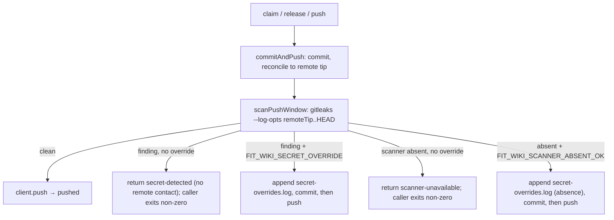

# Design 2030 — Fail-closed secret gating on the wiki push path

Realises [spec 2030](spec.md): a gitleaks scan at the single `libwiki` push
choke point blocks any `fit-wiki` write whose pushed content carries a detectable
secret, with a fail-closed scanner-absence stance and an off-by-default, audited
break-glass. Tracks [#1740](https://github.com/forwardimpact/monorepo/issues/1740).

## Components and where they change

| Component | File | Change |
|---|---|---|
| Secret-scan gate | `libwiki/src/secret-gate.js` (new) | `scanPushWindow({ runtime, wikiDir, range })` — runs gitleaks over the commit range the push introduces, returns `{ status: "clean" \| "finding" \| "scanner-absent", findings }`. Resolves scanner availability (probe `gitleaks version`) before scanning. |
| Push choke point | `libwiki/src/wiki-sync.js` `commitAndPush` | After the reconcile and before `client.push`, scan `range = remoteTip..HEAD`. On a finding or scanner-absence without the matching override, return a distinct reason (`secret-detected` / `scanner-unavailable`); never attempt the push. |
| Caller surface | `libwiki/src/commands/claim.js` (`pushWiki`, `runReleaseCommand`), `sync.js` (`runPushCommand`) | Today these read only `result.pushed` and a thrown error degrades to "saved locally" + `ok:true`. They gain a branch on the new reasons: a security refusal exits non-zero, reports the finding, and is **not** reported as "saved locally" — distinct from the preserved network-failure path. |
| Range primitive | `libutil/src/git-client.js` | New `scanRange` is expressed as gitleaks `--log-opts`; the gate calls `gitleaks detect --source <wikiDir> --log-opts "<range>" --report-format json`, which scans every commit in the range in-place (no diff materialization). No new git primitive needed beyond reading the verified remote tip the push path already computes. |
| Break-glass | `wiki-sync.js` + `secret-gate.js` | Two distinct, off-by-default overrides: `FIT_WIKI_SECRET_OVERRIDE="<reason>"` (permit a *finding*) and `FIT_WIKI_SCANNER_ABSENT_OK="<reason>"` (permit a *scanner-absence*). Each writes its own audit record before the push; neither implies the other. |
| Audit record | wiki tree file (`secret-overrides.log`, append-only) | One line per override: ISO timestamp, asserted operator identity (`git config user.email` — attribution of intent, not authenticated proof), the override class (finding / scanner-absent), the reason, and the finding *location* (file:line:rule) — **never the matched secret value**. Committed in the same write-set, scanned by the same gate before its own push (the audit line is generated, secret-free by construction). |
| Wiki-ops doc | `websites/fit/docs/libraries/predictable-team/wiki-operations/index.md` | New `## Secret scanning in wiki pushes` section: the gate, scanner provisioning, and the two break-glass procedures. Generic prose only — no spec/issue/PR numbers. |

## Data flow — scan the window the push introduces

The scan runs **after** the reconcile so the range is exactly the commits the
push will introduce relative to the live remote tip — never stale, never the
whole tree. Scanning the commit *range* (not a two-dot net diff) catches a secret
introduced on any commit in the range even if a later commit masks it.

## Key Decisions

| # | Decision | Rejected alternative |
|---|---|---|
| D1 | **One gate inside `commitAndPush`, the shared push path.** Every wiki writer (`claim`, `release`, `push`) reaches it; gating there enforces the scan once. | _Per-command gate in each command file_: three copies that drift; a fourth writer added later silently escapes (the exact blindness the spec names). |
| D2 | **Scan the commit range `remoteTip..HEAD` with gitleaks `--log-opts`, after the reconcile.** The spec requires scanning "what the commit introduces relative to the wiki remote." `gitleaks detect --source <wikiDir> --log-opts "remoteTip..HEAD"` walks every commit the push adds, in-place, so the window is correct under every reconcile path and a secret on a masked-away commit in the range is still caught. The remote tip is the one the post-1850 push path already verifies via lsRemote. | _Two-dot `git diff remoteTip..HEAD`_: a net diff hides a secret introduced then masked within the range, and gitleaks has no diff-on-stdin mode. _`gitleaks detect --source .` (working tree)_: scans content the push does not introduce — false positives on pre-existing remote content. _Scan staged files by path_: a path-scoped commit of a secret-bearing file still leaks (spec calls this out). |
| D3 | **Fail-closed on scanner absence, with its OWN override.** If `gitleaks version` is not resolvable in the `fit-wiki` runtime, the push refuses (`scanner-unavailable`) unless `FIT_WIKI_SCANNER_ABSENT_OK` is set — a *separate* override from the finding override, so clearing a routine false positive can never silently suppress a later missing-scanner refusal (spec caveat 1: absence is fail-closed or an explicit, recorded operator choice). Provisioning mirrors the `audit` action's pinned-binary precedent. | _Warn-and-continue when absent_ (the `make audit` `command -v` fallback): a detective control that silently disables itself is not fail-closed. _One override for both finding and absence_: a finding-override would double as an absence-bypass — the two risks must be opted into separately. _Bundle gitleaks in libwiki_: ships a binary in an npm package; provisioning is an operations concern, documented, not vendored. |
| D4 | **Each break-glass writes a durable, committed audit record before the push; identity is attribution, not proof.** Both overrides append one line to `secret-overrides.log` in the wiki tree — ISO timestamp, asserted `git config user.email` (an attribution of intent, NOT an authenticated identity — the spec's "who" is satisfied as a recorded actor, and the doc states this limit), the override class, the reason, and for a finding its location (file:line:rule). The line is committed in the same write-set and is secret-free by construction (generated, never carrying the matched value). | _Override with no record_: defeats auditability (spec 4c). _A boolean override_: carries no reason; the spec requires "who and why." _Record the matched secret_: the audit log would itself become the leak — store only the finding's location, never the value. |
| D5 | **The callers surface the security refusal distinctly; they do not degrade it to "saved locally."** Today `pushWiki`/`runReleaseCommand` (claim.js) and `runPushCommand` (sync.js) read only `result.pushed` and a thrown error becomes "saved locally" + `ok:true`. They gain an explicit branch: `secret-detected` / `scanner-unavailable` exit non-zero, print the finding, and are reported as a *block*, distinct from the preserved network-failure "saved locally" (spec 2, 5). | _Reuse the existing push-failure path_: conflates a security block with a transient network error — the caller cannot tell a leak was stopped from a flaky push, and the existing `ok:true`/"saved locally" handler would let a detection exit zero. |
| D6 | **Compose with the post-1850 push path, do not contend with it.** Spec 1850 D3 rewrote `commitAndPush` (lsRemote base-verify, pathspec staging, no `-X ours`); this gate is a new step between that path's reconcile and its push, on an orthogonal axis (2010 L1 scopes *what* stages; this scans *content*). It adds a step, it does not alter the landing contract. | _Fold into 1850 / 2010_: breaks 1850's allocation+landing scope and 2010's two-lever scope; the spec mandates a standalone control (§ Relationship). |

## Scan-to-push window (no TOCTOU)

On the clean path nothing mutates HEAD between the scan and the push, so the
pushed range equals the scanned range. On the override path the audit line is
appended and committed *after* the scan, advancing HEAD by one commit — but that
commit is generated, secret-free by construction, and outside the scanned range;
it introduces no unscanned secret-bearing content. No external mutation can race
the window because the push path holds the working tree for the duration.

## Scanner provisioning

gitleaks runs today only inside the `audit` composite action (pinned v8.24.3,
SHA-verified). The `fit-wiki` runtime is the agent's local/CI environment. The
design probes the binary via the injected `runtime.subprocess`; provisioning
(install + pin) is documented in the wiki-operations guide as an operator
prerequisite, with absence failing closed (D3). No binary is vendored into the
npm package.

## Out of scope (design echoes spec)

GitHub-native wiki push-protection (infeasible — no wiki Actions, no wiki
push-protection coverage); a wiki-repo CI workflow (infeasible); staging scope
(2010 L1 / #1583 item 3); the monorepo `main` push path (already gitleaks-gated).
This design adds only the scan step, the diff primitive, the override record, and
the doc section.

— Staff Engineer 🛠️
