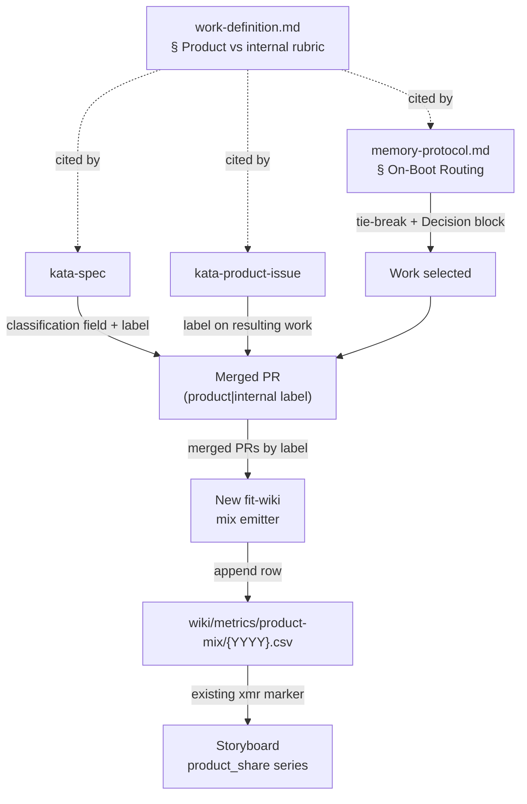

# Design 2070 — A product-vs-internal work axis that biases agent routing toward product

Spec [2070](spec.md) introduces **product-aligned vs internal** as a second,
independent classification axis and applies it in two places: the routing path
agents use to select work, and the storyboard the team studies. This design
names the components that carry the axis, where the classification is recorded
so the metric is reproducible, and how routing consumes it.

## Architecture

The axis is defined once and consumed in four flows: spec authoring and issue
triage each record it, routing reads it to break ties, and a new deterministic
emitter derives the storyboard metric from the recorded labels.

The label on the merged PR is the single durable carrier of completed-work
classification. Because every completed item is a merged PR, one label per PR
covers the whole population, across both branches of the existing
mechanical-vs-structural fork.

## Components

| Component                                            | What it gains                                                                                                                                                                                                                                                                                 | Interface                                                                                                    |
| ---------------------------------------------------- | --------------------------------------------------------------------------------------------------------------------------------------------------------------------------------------------------------------------------------------------------------------------------------------------- | ------------------------------------------------------------------------------------------------------------ |
| **Rubric** — `work-definition.md`                    | A new `### Product-aligned vs internal` section: the definition of each value, a decision test for sorting a finding, a note that this axis is independent of the mechanical-vs-structural fork, and the requirement to apply the matching label to the PR that delivers any classified work. | Cited by the two skills and the routing reference via fully-qualified URL; the only home for the definition. |
| **Routing** — `memory-protocol.md` § On-Boot Routing | An intra-level product-priority rule, its constraint-lifting exception, and an instruction to record the case in `### Decision`.                                                                                                                                                              | Operates within an existing routing level's tied-candidate set; writes the `### Decision` block.             |
| **Spec authoring** — `kata-spec`                     | A required stated product-vs-internal classification in `spec.md`; the spec PR carries the matching label per the rubric.                                                                                                                                                                     | `spec.md` classification field; PR label.                                                                    |
| **Issue triage** — `kata-product-issue`              | Triage assigns each issue's value from the shared rubric; the resulting spec or fix carries the matching label.                                                                                                                                                                               | Issue/PR label, derived from the rubric, not a private definition.                                           |
| **Classification label** — `product` / `internal`    | A durable per-item repository label, created once and applied to every completed work item — spec PR, issue-sourced fix, and direct fix alike — at PR open per the rubric.                                                                                                                    | The aggregation surface for the metric.                                                                      |
| **Mix emitter** — new `fit-wiki` subcommand          | Queries the period's merged PRs grouped by the classification label and appends one standard metric row (`date,metric,value,unit,run,note,event_type`) for `product_share` to a dedicated CSV. Invoked deterministically by the team's scheduled workflow, not authored by an agent.          | Reads merged-PR labels via `gh`; writes `wiki/metrics/product-mix/{YYYY}.csv`.                               |
| **Storyboard metric** — storyboard file              | A `#### product_share` block under the improvement-coach storyboard section, carrying an `xmr:product_share` marker over the product-mix CSV; seeded like any metric block.                                                                                                                   | Rendered by the existing `fit-wiki refresh` xmr path via `fit-xmr`; never hand-edited.                       |

## Key Decisions

| Decision                                 | Choice                                                                                                   | Rejected alternative                                                                                                                                                                                                                                                                               |
| ---------------------------------------- | -------------------------------------------------------------------------------------------------------- | -------------------------------------------------------------------------------------------------------------------------------------------------------------------------------------------------------------------------------------------------------------------------------------------------- |
| Carrier of completed-work classification | A repository PR label (`product` / `internal`) on every merged work item.                                | A column in `wiki/STATUS.md` — STATUS tracks specs only, so it cannot represent fix PRs, which are part of the completed-work population.                                                                                                                                                          |
| The metric emitter                       | A new deterministic `fit-wiki` subcommand that derives `product_share` from merged-PR labels.            | (a) An agent hand-appends the row like a recorded metric — the value is a cross-skill aggregate no single skill owns, and a human-entered ratio is not reproducible; (b) extending `refresh` — its contract is render-only, and folding a data-derivation write into the renderer couples the two. |
| Where the metric series lives            | Its own `wiki/metrics/product-mix/{YYYY}.csv`, stewarded under the improvement-coach storyboard section. | Folding `product_share` into an existing skill's CSV — the series is a team aggregate, not a skill's per-run output; dedicated non-skill metric directories already exist for cross-cutting series.                                                                                                |
| Where the axis is defined                | One `### Product-aligned vs internal` section in `work-definition.md`, cited by every consumer.          | A definition inside each skill — the success criteria require triage to use the _shared_ rubric, and duplicate definitions drift.                                                                                                                                                                  |
| Routing-bias placement                   | A tie-break _within_ an existing routing level, applied only when candidates are otherwise equal.        | A new fifth routing level — that would reorder the strictly-ordered priority and let product work preempt an owned internal priority, which the spec forbids.                                                                                                                                      |

## Classification carrier and reproducibility

The `spec.md` classification field is the authored statement of intent a reader
sees without leaving the spec; the PR label is the machine-readable record the
metric reads. The two are set together at authoring time so they cannot diverge.
A fix PR has no spec, so the label — required by the rubric on any PR that
delivers classified work — is the uniform carrier the emitter aggregates.

The ratio value is never typed into the storyboard by hand. The mix emitter
recomputes `product_share` from the labels on the period's merged PRs and
appends it as a normal time-series row; re-running it over the same merged PRs
yields the same value. `fit-xmr` then charts the series, so a sustained drift in
the mix fires a signal the team reviews. The classification labels upstream are
applied by agents per the rubric; only the aggregation is mechanical.

## Routing bias

Beyond placing the bias inside the existing levels, two details the spec
requires live here. The exception: internal work that lifts a constraint
currently blocking product delivery keeps its place over a tied product
candidate, because it buys product throughput. The record: whichever case
applies, the agent names the chosen axis value in its `### Decision` block, and
when it picks internal over a tied product candidate it names the constraint
that internal work lifts.

## Out of scope

The emitter, label, and metric placement are the design choices the spec
delegated; everything else is carried unchanged from the spec's exclusions: no
weighting of the human approval gate, no `kata-interview` cron, no change to the
four Study streams or to the mechanical-vs-structural fork, and no retroactive
reclassification of work already merged. The label and metric apply only to work
selected and authored after this design's plan lands.
