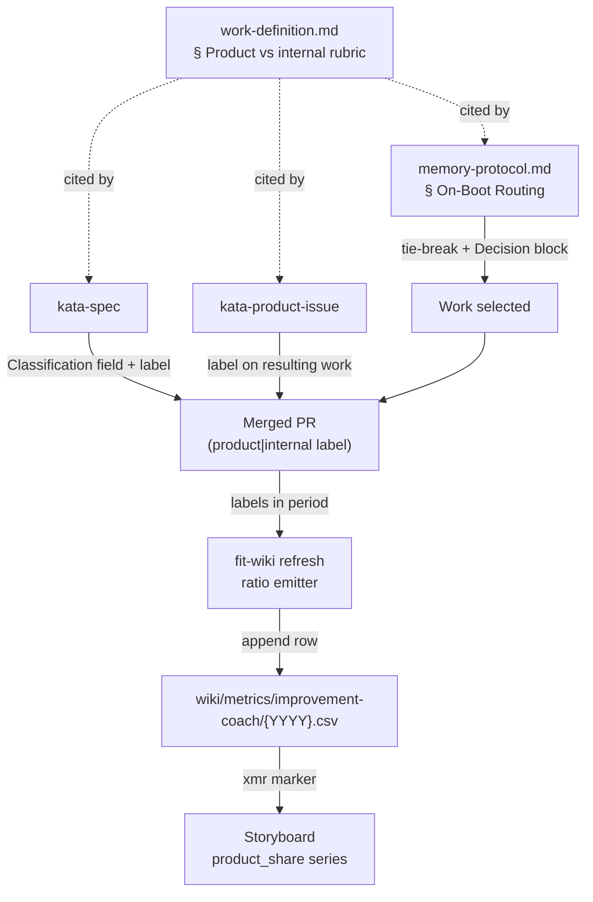

# Design 2070 — A product-vs-internal work axis that biases agent routing toward product

Spec [2070](spec.md) introduces **product-aligned vs internal** as a second,
independent classification axis and applies it in two places: the routing path
agents use to select work, and the storyboard the team studies. This design
names the components that carry the axis, where the classification is recorded
so the metric is reproducible, and how routing consumes it.

## Architecture

The axis is defined once and consumed in three independent flows: spec/issue
authoring records it, routing reads it to break ties, and a deterministic
emitter aggregates the recorded labels into a storyboard metric.

The label on the merged PR is the single durable carrier of completed-work
classification. Everything downstream of merge reads it; nothing re-derives the
class by hand.

## Components

| Component                                            | What it gains                                                                                                                                                                                        | Interface                                                                                                                           |
| ---------------------------------------------------- | ---------------------------------------------------------------------------------------------------------------------------------------------------------------------------------------------------- | ----------------------------------------------------------------------------------------------------------------------------------- |
| **Rubric** — `work-definition.md`                    | A new `### Product-aligned vs internal` section: the definition of each value, a decision test for sorting a finding, and a note that this axis is independent of the mechanical-vs-structural fork. | Cited by the two skills and the routing reference via fully-qualified URL; it is the only home for the definition.                  |
| **Routing** — `memory-protocol.md` § On-Boot Routing | An intra-level product-priority rule, its constraint-lifting exception, and an instruction to record the case in `### Decision`.                                                                     | Reads the `boot` digest fields already used; writes the `### Decision` block.                                                       |
| **Spec authoring** — `kata-spec`                     | A required `**Classification:** product-aligned \| internal` line in `spec.md`, and application of the matching PR label.                                                                            | `spec.md` field (human-readable statement); PR label (machine carrier).                                                             |
| **Issue triage** — `kata-product-issue`              | Triage records the product-vs-internal value for each issue using the shared rubric, and the resulting work (spec or fix) carries the matching label.                                                | Issue/PR label, set from the rubric, not a private definition.                                                                      |
| **Classification label** — `product` / `internal`    | A durable per-item GitHub label applied to every completed work item, spec PR and fix PR alike.                                                                                                      | The aggregation surface for the metric.                                                                                             |
| **Ratio emitter** — `fit-wiki refresh`               | Counts merged PRs in the storyboard period grouped by the classification label and appends one `product_share` row to the coach metric CSV.                                                          | Reads GitHub PR state (refresh already reads issue state for Active/Concluded); writes `wiki/metrics/improvement-coach/{YYYY}.csv`. |
| **Storyboard metric** — `storyboard-{YYYY}-MNN.md`   | A `#### product_share` block under the coach section with an `<!-- xmr:product_share:wiki/metrics/improvement-coach/{YYYY}.csv -->` marker.                                                          | Rendered by `fit-wiki refresh` via `fit-xmr`; never hand-edited.                                                                    |

## Key Decisions

| Decision                                 | Choice                                                                                            | Rejected alternative                                                                                                                                          |
| ---------------------------------------- | ------------------------------------------------------------------------------------------------- | ------------------------------------------------------------------------------------------------------------------------------------------------------------- |
| Carrier of completed-work classification | A GitHub PR label (`product` / `internal`) on every merged work item.                             | A column in `wiki/STATUS.md` — STATUS tracks specs only, so it cannot represent fix PRs, which are part of the completed-work population.                     |
| Where the metric is computed             | A deterministic aggregation in `fit-wiki refresh` over the period's merged-PR labels.             | Per-skill metric rows written at run time — fragmented across skills and blind to direct fix PRs that run no skill, so the ratio would be incomplete.         |
| Where the axis is defined                | One `### Product-aligned vs internal` section in `work-definition.md`, cited by every consumer.   | A definition inside each skill — the spec's success criteria require triage to use the _shared_ rubric, and duplicate definitions drift.                      |
| Routing-bias placement                   | A tie-break _within_ an existing routing level, applied only when candidates are otherwise equal. | A new fifth routing level — that would reorder the strictly-ordered priority and let product work preempt an owned internal priority, which the spec forbids. |
| Spec's stated classification             | An inline `Classification` field in `spec.md` **and** a mirrored PR label.                        | Label only — a success criterion requires the spec itself to state its value, so a reader of `spec.md` sees the classification without leaving the file.      |

## Classification carrier and reproducibility

Completed work is exactly the set of merged PRs. Recording the class as a PR
label gives one uniform surface that spans both branches of the existing
mechanical-vs-structural fork: a `spec(NNN)` PR and a `fix` PR each carry one
label. The `spec.md` `Classification` field is the authored statement of intent;
the label is the durable record the metric reads. The two are set together at
authoring time so they cannot diverge.

The ratio is reproducible because it is never written by a human into the
storyboard. `fit-wiki refresh` recomputes it each run from the labels on PRs
merged in the period — the same way it already recomputes the Active/Concluded
obstacle and experiment lists from live GitHub state — and appends the period's
`product_share` value as a normal time-series row. `fit-xmr` then renders the
series, so a sustained drift in the mix fires an XmR signal the team reviews.

## Routing bias

On-Boot Routing keeps its four strictly-ordered levels unchanged. The new rule
fires only when two or more candidates sit at the **same** level after that
ordering — an owned priority still preempts everything below it, and an active
claim still means the work is in flight. Among tied candidates, product-aligned
outranks internal. The single exception is theory-of-constraints discipline:
internal work that lifts a constraint currently blocking product delivery keeps
its place, because it buys product throughput. Whichever case applies, the agent
names the chosen axis value in its `### Decision` block, and when it picks
internal over a product candidate it names the constraint that internal work
lifts. This makes the success criterion's "sample run shows the recorded value"
verifiable from the weekly log.

## Out of scope

Carried unchanged from the spec: no weighting of the human approval gate, no
`kata-interview` cron, no change to the four Study streams or to the
mechanical-vs-structural fork, and no retroactive reclassification of work
already merged. The label and metric apply only to work selected and authored
after this design's plan lands.
