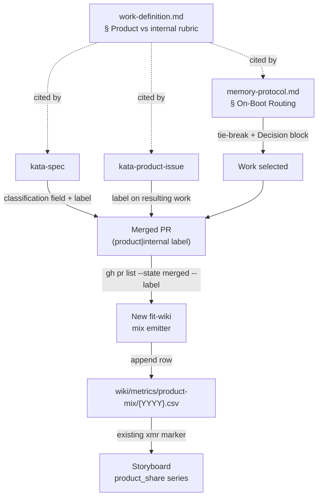

# Design 2070 — A product-vs-internal work axis that biases agent routing toward product

Spec [2070](spec.md) introduces **product-aligned vs internal** as a second,
independent classification axis and applies it in two places: the routing path
agents use to select work, and the storyboard the team studies. This design
names the components that carry the axis, where the classification is recorded
so the metric is reproducible, and how routing consumes it.

## Architecture

The axis is defined once and consumed in four flows: spec authoring and issue
triage each record it, routing reads it to break ties, and a new deterministic
emitter derives the storyboard metric from the recorded labels.

The label on the merged PR is the single durable carrier of completed-work
classification: every completed item is a merged PR, so one label per PR spans
both branches of the existing mechanical-vs-structural fork.

## Components

| Component                                            | What it gains                                                                                                                                                                                        | Interface                                                                                                                                                          |
| ---------------------------------------------------- | ---------------------------------------------------------------------------------------------------------------------------------------------------------------------------------------------------- | ------------------------------------------------------------------------------------------------------------------------------------------------------------------ |
| **Rubric** — `work-definition.md`                    | A new `### Product-aligned vs internal` section: the definition of each value, a decision test for sorting a finding, and a note that this axis is independent of the mechanical-vs-structural fork. | Cited by the two skills and the routing reference via fully-qualified URL; the only home for the definition.                                                       |
| **Routing** — `memory-protocol.md` § On-Boot Routing | An intra-level product-priority rule, its constraint-lifting exception, and an instruction to record the case in `### Decision`.                                                                     | Operates within an existing routing level's tied-candidate set; writes the `### Decision` block.                                                                   |
| **Spec authoring** — `kata-spec`                     | A required stated product-vs-internal classification in `spec.md`, plus the matching label on the spec PR.                                                                                           | `spec.md` classification field; PR label.                                                                                                                          |
| **Issue triage** — `kata-product-issue`              | Triage assigns each issue's product-vs-internal value from the shared rubric; the resulting work (spec or fix) carries the matching label.                                                           | Issue/PR label, derived from the rubric, not a private definition.                                                                                                 |
| **Classification label** — `product` / `internal`    | A durable per-item repository label, created once and applied to every completed work item, spec PR and fix PR alike.                                                                                | The aggregation surface for the metric.                                                                                                                            |
| **Mix emitter** — new `fit-wiki` subcommand          | Queries the period's merged PRs grouped by the classification label and appends one `product_share` row to a dedicated metric CSV.                                                                   | `gh pr list --state merged --label …`; writes `wiki/metrics/product-mix/{YYYY}.csv`. Run in the workflow's deterministic pre-push step, beside `fit-wiki refresh`. |
| **Storyboard metric** — storyboard file              | A `#### product_share` block under a team-level headline, carrying an `xmr:product_share` marker over the product-mix CSV.                                                                           | Rendered by the existing `fit-wiki refresh` xmr path via `fit-xmr`; never hand-edited.                                                                             |

## Key Decisions

| Decision                                 | Choice                                                                                                                                   | Rejected alternative                                                                                                                                                                                                                                                                                                     |
| ---------------------------------------- | ---------------------------------------------------------------------------------------------------------------------------------------- | ------------------------------------------------------------------------------------------------------------------------------------------------------------------------------------------------------------------------------------------------------------------------------------------------------------------------ |
| Carrier of completed-work classification | A repository PR label (`product` / `internal`) on every merged work item.                                                                | A column in `wiki/STATUS.md` — STATUS tracks specs only, so it cannot represent fix PRs, which are part of the completed-work population.                                                                                                                                                                                |
| The metric emitter                       | A new deterministic `fit-wiki` subcommand that derives `product_share` from merged-PR labels, run in the pre-push step beside `refresh`. | (a) An agent hand-appends the row like legacy metrics — non-deterministic, and the single-metric-per-skill storyboard plus the facilitator's no-write role leave no natural writer; (b) extending `refresh` itself — its contract is render-only, and folding a data-derivation write into the renderer couples the two. |
| Where the metric series lives            | Its own `wiki/metrics/product-mix/{YYYY}.csv`, rendered under a team-level storyboard headline.                                          | Adding `product_share` to an existing skill's CSV — violates the ratified single-metric-per-skill protocol.                                                                                                                                                                                                              |
| Where the axis is defined                | One `### Product-aligned vs internal` section in `work-definition.md`, cited by every consumer.                                          | A definition inside each skill — the success criteria require triage to use the _shared_ rubric, and duplicate definitions drift.                                                                                                                                                                                        |
| Routing-bias placement                   | A tie-break _within_ an existing routing level, applied only when candidates are otherwise equal.                                        | A new fifth routing level — that would reorder the strictly-ordered priority and let product work preempt an owned internal priority, which the spec forbids.                                                                                                                                                            |

## Classification carrier and reproducibility

The `spec.md` classification field is the authored statement of intent a reader
sees without leaving the spec; the PR label is the machine-readable record the
metric reads. The two are set together at authoring time so they cannot diverge.
A fix PR that has no spec still carries the label, so the label — not the spec
field — is what the emitter aggregates.

The ratio is reproducible because no human writes it into the storyboard. The
mix emitter recomputes the period's `product_share` from the labels on merged
PRs and appends it as a normal time-series row, the same class of GitHub-state
query `refresh` already runs for the obstacle and experiment lists, except it
writes a CSV row rather than rendering a list. `fit-xmr` then charts the series,
so a sustained drift in the mix fires a signal the team reviews. Re-running the
emitter over the same merged PRs yields the same row.

## Routing bias

On-Boot Routing keeps its four strictly-ordered levels unchanged. The new rule
fires only when two or more candidates sit at the **same** level after that
ordering — an owned priority still preempts everything below it, and an active
claim still means the work is in flight. Among tied candidates, product-aligned
outranks internal. The single exception is theory-of-constraints discipline:
internal work that lifts a constraint currently blocking product delivery keeps
its place, because it buys product throughput. Whichever case applies, the agent
names the chosen axis value in its `### Decision` block, and when it picks
internal over a product candidate it names the constraint that internal work
lifts.

## Out of scope

The emitter, label, and metric placement are the design choices the spec
delegated; everything else is carried unchanged from the spec's exclusions: no
weighting of the human approval gate, no `kata-interview` cron, no change to the
four Study streams or to the mechanical-vs-structural fork, and no retroactive
reclassification of work already merged. The label and metric apply only to work
selected and authored after this design's plan lands.
