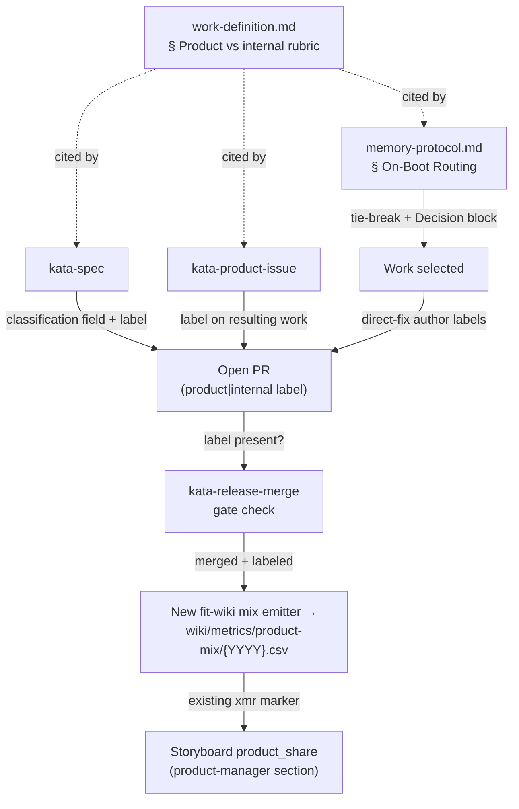

# Design 2070 — A product-vs-internal work axis that biases agent routing toward product

Spec [2070](spec.md) introduces **product-aligned vs internal** as a second,
independent classification axis and applies it in two places: the routing path
agents use to select work, and the storyboard the team studies. This design
names the components that carry the axis, where the classification is recorded
so the metric is reproducible, and how routing consumes it.

## Architecture

The axis is defined once and consumed in four flows: spec authoring and issue
triage each record it, routing reads it to break ties, and a new deterministic
emitter derives the storyboard metric from the recorded labels. A merge-gate
check keeps the recorded population complete.

The label on the PR is the single durable carrier of completed-work
classification. Because every completed item is a merged PR, one label per PR
covers the whole population, across both branches of the existing
mechanical-vs-structural fork.

## Components

| Component                                            | What it gains                                                                                                                                                                                                                                                                                                                                                        | Interface                                                                                                    |
| ---------------------------------------------------- | -------------------------------------------------------------------------------------------------------------------------------------------------------------------------------------------------------------------------------------------------------------------------------------------------------------------------------------------------------------------- | ------------------------------------------------------------------------------------------------------------ |
| **Rubric** — `work-definition.md`                    | A new `### Product-aligned vs internal` section: each value's definition, a decision test for sorting a finding, a note that the axis is independent of the mechanical-vs-structural fork, and the requirement that the agent opening any work PR applies the matching label. The existing issue-intake "product-aligned" line links here rather than redefining it. | Cited by the two skills and the routing reference via fully-qualified URL; the only home for the definition. |
| **Routing** — `memory-protocol.md` § On-Boot Routing | A product-priority tie-break rule (detailed in § Routing bias below).                                                                                                                                                                                                                                                                                                | Operates within an existing routing level's tied-candidate set; writes the `### Decision` block.             |
| **Spec authoring** — `kata-spec`                     | A required stated product-vs-internal classification in `spec.md`; the spec PR carries the matching label per the rubric.                                                                                                                                                                                                                                            | `spec.md` classification field; PR label.                                                                    |
| **Issue triage** — `kata-product-issue`              | Triage assigns each issue's value from the shared rubric; the resulting spec or fix carries the matching label.                                                                                                                                                                                                                                                      | Issue/PR label, derived from the rubric.                                                                     |
| **Classification label** — `product` / `internal`    | A durable per-item repository label, created once and applied at PR open by the agent authoring the work — spec PR, issue-sourced fix, and direct fix alike.                                                                                                                                                                                                         | The aggregation surface for the metric.                                                                      |
| **Merge-gate check** — `kata-release-merge`          | Verifies the classification label is present before merge (the gate already classifies PR type and reads PR labels), so no PR enters `main` unlabeled.                                                                                                                                                                                                               | Blocks merge on a missing label; makes the merged-PR population complete.                                    |
| **Mix emitter** — new `fit-wiki` subcommand          | Counts the period's merged PRs by classification label and appends one standard metric row (`date,metric,value,unit,run,note,event_type`) for `product_share`. Deterministic, not authored by an agent; invoked in the product-manager scheduled run.                                                                                                                | Reads merged-PR labels via `gh`; writes `wiki/metrics/product-mix/{YYYY}.csv`.                               |
| **Storyboard metric** — storyboard file              | A `#### product_share` block under the existing `### product-manager` section, carrying an `xmr:product_share` marker over the product-mix CSV.                                                                                                                                                                                                                      | Rendered by the existing `fit-wiki refresh` xmr path via `fit-xmr`; never hand-edited.                       |

## Key Decisions

| Decision                                 | Choice                                                                                                                                          | Rejected alternative                                                                                                                                                                                    |
| ---------------------------------------- | ----------------------------------------------------------------------------------------------------------------------------------------------- | ------------------------------------------------------------------------------------------------------------------------------------------------------------------------------------------------------- |
| Carrier of completed-work classification | A repository PR label (`product` / `internal`) on every merged work item.                                                                       | A column in `wiki/STATUS.md` — STATUS tracks specs only, so it cannot represent fix PRs, which are part of the completed-work population.                                                               |
| Keeping the population complete          | The merge gate refuses an unlabeled PR, so the denominator is every merged PR in the period.                                                    | Trusting author discipline alone — a missed label silently drops a PR from the denominator and biases `product_share`.                                                                                  |
| The metric emitter                       | A new deterministic `fit-wiki` subcommand deriving `product_share` from merged-PR labels.                                                       | (a) An agent hand-appends the row — a human-entered ratio is not reproducible; (b) extending `refresh` — its contract is render-only, and folding a derive-and-write into the renderer couples the two. |
| Metric owner and home                    | A dedicated `wiki/metrics/product-mix/{YYYY}.csv`, owned by the product-manager and rendered under that agent's storyboard section.             | Folding `product_share` into the product-manager's per-run CSV — it is a team aggregate, not a per-run output; dedicated non-skill metric directories already exist for cross-cutting series.           |
| Where the axis is defined                | One `### Product-aligned vs internal` section in `work-definition.md`, cited by every consumer and subsuming the existing issue-intake mention. | A definition inside each skill — the success criteria require triage to use the _shared_ rubric, and duplicate definitions drift.                                                                       |
| Routing-bias placement                   | A tie-break _within_ an existing routing level, applied only when candidates are otherwise equal.                                               | A new fifth routing level — that would reorder the strictly-ordered priority and let product work preempt an owned internal priority, which the spec forbids.                                           |

## Classification carrier and reproducibility

The `spec.md` classification field is the authored statement of intent a reader
sees without leaving the spec; the PR label is the machine-readable record the
metric reads. A fix PR has no spec, so the label is the uniform carrier the
emitter aggregates, and the merge gate guarantees it is present.

The ratio is never typed into the storyboard. The emitter computes
`product_share` as product-labeled merged PRs over all merged PRs in the period,
and appends it as one time-series row; re-running it over the same merged PRs
yields the same value. The series begins at the first period after the gate
check lands — earlier PRs are out of scope and never enter the denominator.
`fit-xmr` charts the series, so a sustained drift fires a signal the team
reviews.

## Routing bias

The bias is a tie-break inside the existing strictly-ordered levels (an owned
priority still preempts everything below it). Two details the spec requires live
here. The exception: internal work that lifts a constraint currently blocking
product delivery keeps its place over a tied product candidate, because it buys
product throughput. The record: whichever case applies, the agent names the
chosen axis value in its weekly-log `### Decision` entry, and when it picks
internal over a tied product candidate it names the constraint that work lifts —
that entry is the verification surface for the spec's sample-run criterion.

## Out of scope

The emitter, label, gate check, and metric placement are the design choices the
spec delegated; everything else is carried unchanged from the spec's exclusions:
no weighting of the human approval gate, no `kata-interview` cron, no change to
the four Study streams or to the mechanical-vs-structural fork, and no
retroactive reclassification of work already merged. The axis applies only to
work selected and authored after this design's plan lands.
