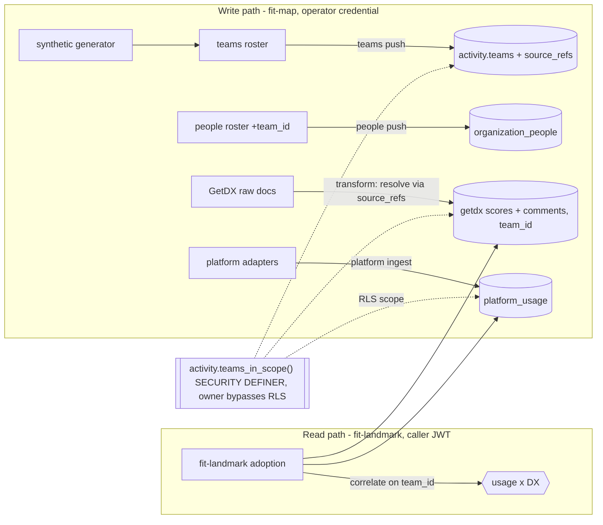

# Design 2080-a — Platform adoption substrate

Architecture for spec 2080: a single vendor-neutral `activity.teams` registry
shared by the GetDX scores and comments tables and a new `platform_usage` cube,
a pull-based collector with a per-platform adapter contract, and a
`fit-landmark adoption` read surface. Clean break: `getdx_teams` and every
`getdx_team_id` are removed, not migrated (schema is pre-production), across the
schema, its readers, and the synthetic-data pipeline.

## Architecture



Identity, JWT issuance, and the anon-key read client are unchanged from spec
0840 (`resolveIdentity` -> `createLandmarkClient`). `organization_people` keeps
`manager_email` and its existing person-scoped policy; this design only adds
`team_id` and the team-attributed scope path.

## Components

| Component | Home | Responsibility |
| --- | --- | --- |
| `activity.teams` | new migration | Canonical team identity: `team_id` (vendor-neutral slug PK), `name`, `parent_id`, `manager_email` (FK to `organization_people.email`), `ancestors`, `source_refs` (JSONB `{source: ref}`), `updated_at`. |
| `activity.platforms` | new migration | Registry: `platform_id` PK, `name`, `category`, `outcome_metric`. |
| `activity.platform_usage` | new migration | Facts: PK `(team_id, platform_id, metric_id, period_start)`, `metric_kind`, `value`, `contributor_count`, `period_end`, `vs_prev`, `imported_at`. Typed fields only — no per-engineer column, no opaque `raw` passthrough. |
| `activity.teams_in_scope()` | new migration | SECURITY DEFINER, STABLE, `SET search_path=''`, no args, reads `auth.email()` internally: the `team_id`s visible to the caller. Sole scope source for every team-attributed RLS policy. |
| `fit-map teams push` | `products/map/src/commands/teams.js` | Author the registry from a roster file, maintaining `ancestors`. Operator-only. Idempotent on `team_id`. |
| `fit-map platform ingest` | `products/map/src/commands/platform.js` + `src/platform/adapters/` | Generic collector: resolve adapter by `platform_id`, fetch, map to `team_id`, enforce guardrails, upsert. Ships a reference fixture adapter. |
| GetDX transform (adapted) | `activity/transform/getdx.js` | Resolve GetDX team ids to `team_id` via `source_refs`; write scores and comments against `team_id` (the comment path's `getdx_teams.manager_email` derivation is replaced by `source_refs` resolution); skip+count unresolved; no longer writes `getdx_teams` or membership. |
| Synthetic pipeline (adapted) | `libsyntheticgen`, `libsyntheticrender` | Generator mints vendor-neutral `team_id`s and emits a teams roster; renderer and `validate-activity.js` write and assert `team_id`. |
| `people push` (adapted) | `products/map/src/commands/people.js` + people transform | Sole writer of `organization_people.team_id` from the roster. |
| `fit-landmark adoption` | `products/landmark/src/commands/adoption.js` | Render the Team x Platform matrix, XmR trend, and usage x DX correlation under the caller JWT. |

## Key interfaces

**Adapter contract** (pull-only, aggregate-only):

```
PlatformAdapter:
  platform_id():            string          // must match a platforms row
  period_grain():           'day'|'week'|'month'|'quarter'
  async fetch(period):      SourceRecord[]   // adapter owns its source auth
  resolve_team(record):     team_id | null   // via teams.source_refs[platform_id]
  to_rows(record):          { metric_id, metric_kind, value, contributor_count }[]
```

`to_rows` is a closed typed shape with no per-person field and no free-form
passthrough, and the cube stores nothing else — so there is no column an adapter
could smuggle identity through. The collector drops rows with
`contributor_count < k` (config, default 5) and counts-and-skips a `null` team.
#829's no-individual-attribution and k-anonymity constraints hold by
construction.

**Scope function** — `activity.teams_in_scope()` returns, for `auth.email()`:
the membership team (`organization_people.team_id`), teams led
(`teams.manager_email = email`), and every team whose `ancestors` contains any
led team. The function body schema-qualifies all references (required under the
empty `search_path`). Each team-attributed policy is `team_id IN (SELECT
activity.teams_in_scope())`; `platforms` is readable by all `authenticated`;
`anon` is granted nothing.

**`ancestors`** is a JSONB array of plain ancestor `team_id` slug strings,
root-first and self-exclusive, recomputed by `teams push` on every roster
change. Descendant membership is the containment test `ancestors ? <led-id>`.

## Key decisions

| Decision | Choice | Rejected alternative |
| --- | --- | --- |
| Team identity | One vendor-neutral `teams` registry; vendors map in via `source_refs`. | Per-vendor team tables (today's `getdx_teams`) — no shared key, so usage and DX can't correlate. |
| Registry authorship | `fit-map teams push` from an authoritative roster; the synthetic generator emits one too. | Bootstrap from GetDX teams-list — reintroduces a vendor as the implicit team origin. |
| RLS recursion | `teams_in_scope()` SECURITY DEFINER, owned by a role that owns the activity tables and without `FORCE ROW LEVEL SECURITY`, so it reads with RLS bypassed and the self-referential `teams` policy never re-enters. | Inline subqueries — recurse on the self-referential `teams` table; app-side filtering — bypassable. |
| No per-record passthrough | Cube stores only typed aggregate fields; drop the `raw` column. | Keep `raw` JSONB — an opaque blob with no enforceable per-person detection rule, defeating the no-attribution guarantee. |
| Subtree expansion | Materialized `ancestors` slug path maintained by `teams push`; containment check. | Recursive CTE per query — re-walks the tree on every read; no path column to keep correct. |
| Usage/Goodhart guardrail | `metric_kind` column; a `(platform_id, metric_id)` has one kind; read renders `usage` only beside an `outcome`. | Convention/docs only — nothing structural stops a usage-only individual scoreboard. |
| k-anonymity | Dropped at ingest (collector), and applied to the GetDX side at correlation display. | Display-time suppression only — the de-anonymizing cell still sits in storage. |
| Clean break | Remove `getdx_teams`/`getdx_team_id` everywhere incl. the synthetic pipeline; rewrite base + RLS migrations. | Additive migration keeping the old columns — dual team identity, the gap this spec closes. |

## Data flow

**Ingest.** `teams push` (or the synthetic generator's roster) populates the
registry with each team's `source_refs` and `ancestors`. `people push` sets
membership. GetDX transform maps `getdx team id -> team_id` via `source_refs`,
writes scores and comments against `team_id`, skips unresolved. `platform
ingest` dispatches to an adapter, which rolls source records up to `team_id`;
the collector applies the guardrails and upserts on the PK (idempotent).

**Read.** `fit-landmark adoption` queries `platform_usage` (and, for
correlation, `getdx_snapshot_team_scores`) under the caller JWT; RLS clamps both
to `teams_in_scope()`. The matrix suppresses or rolls up sub-threshold cells on
both sides, withholds an unpaired `usage` metric, draws the per-team-per-platform
control chart via `fit-xmr`, and joins usage to DX scores by mapping a usage
period to the snapshot cycle whose `scheduled_for` window covers the period.

## Clean-break removals and rewrites

| Item | Action |
| --- | --- |
| `activity.getdx_teams` | dropped |
| `organization_people.getdx_team_id` | -> `team_id` referencing `teams`; `manager_email` and its policy retained |
| `getdx_snapshot_team_scores.getdx_team_id` | -> `team_id`; PK and ingestion upsert key move to `(snapshot_id, team_id, item_id)` |
| `getdx_snapshot_comments.team_id` | FK re-pointed -> `teams`; email-scoped RLS retained; transform team-derivation re-rooted to `source_refs` |
| `activity.snapshot_ids_for_person` | re-keyed to join on `team_id`; stays SECURITY INVOKER, membership-scoped |
| RLS table-name allowlists | REVOKE/GRANT lists, retention `COMMENT` set, `_validate_retention_blob`, `retention_blob`, and the `DO` block extended; `teams`/`platforms` are null-window classes (like `organization_people`), `platform_usage` is windowed on `imported_at` |
| `activity.get_team` (management-tree helper) | unchanged; `snapshots.js` re-points only its composition with team identity |
| synthetic pipeline | `libsyntheticgen` mints vendor-neutral `team_id`; `libsyntheticrender` raw + validator assert `team_id` |
| `migrations/20250504000001_org_people_getdx_team_id.sql` | removed; folded into base |
| base activity-schema + landmark-RLS migrations | rewritten to the new shape |
| `transform/getdx.js` team/score/comment transforms | resolver, not a writer of `getdx_teams`/membership |
| `queries/snapshots.js`, `substrate-persona-query.js`, `persona-enricher.js` (drop `gdx_team_` prefix), `landmark/src/commands/sources.js`, `services/map/test/map.test.js` | re-pointed to `teams`/`team_id` |

## Risks

- **SECURITY DEFINER surface.** `teams_in_scope()` takes no caller args, reads
  `auth.email()` internally, is `STABLE SET search_path=''` with all references
  schema-qualified, owned by a role without `FORCE ROW LEVEL SECURITY`, and
  grants EXECUTE to `authenticated` only with PUBLIC revoked.
- **`ancestors` correctness.** Scope depends on the slug path; `teams push` must
  recompute it on every roster change or a moved team mis-scopes.
- **Roster gaps.** A GetDX team or platform cohort with no matching `source_refs`
  silently drops its rows. Transforms and the collector count skips; the
  operator reconciles via the roster.
