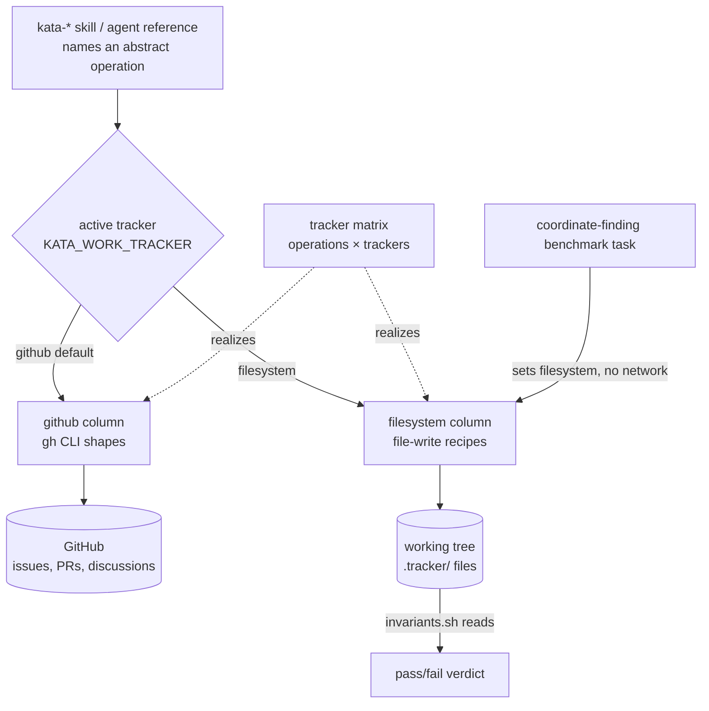

# Design 2090: Work-Item Tracker Abstraction

Generalizes the GitHub coupling in kata coordination behind a **tracker
matrix** and adds a **filesystem** tracker, so the coordination half of the
kata loop (file → open change → gate → merge) becomes benchmarkable offline.
Scope, success criteria, and exclusions are in [spec.md](spec.md). This design
fixes the three decisions the spec deferred: the matrix's published home, the
filesystem storage format, and how approval signals generalize.

## Architecture



A skill names a tracker-independent operation. The active tracker, chosen by
one environment variable, selects which matrix column realizes it: the `github`
column (existing `gh` shapes) or the `filesystem` column (file-write recipes
against `.tracker/`). The matrix is the single home for any tracker-specific command.

## Components

| Component | Home | Role |
| --- | --- | --- |
| **Work-item model** | new `kata-coordinate` skill | Defines issue, change, and the shared envelope plus the abstract operation vocabulary. |
| **Tracker matrix** | a reference in `kata-coordinate` | Maps each operation to its `github` and `filesystem` realization; states per-tracker degradation and the selection rule. The only place tracker commands appear. |
| **github column** | matrix | Absorbs every tracker command now outside it — the `gh` shapes in `coordination-protocol.md`, `issue-lifecycle.md`, `approval-signals.md`, and the kata-* skills, plus the remote-git operations (branch, push) the spec names — into one column (the spec's § Problem grep set bounds the file set). |
| **filesystem column** | matrix | New. File-write recipes over the `.tracker/` layout below. |
| **Re-pointed references** | `work-definition.md`, `coordination-protocol.md`, `approval-signals.md` | Re-expressed over operations: `work-definition.md`'s "Created via" and `coordination-protocol.md`'s routing name operations and move their `gh` shapes to the matrix; `approval-signals.md` generalizes its signal vocabulary, its one `gh` shape (`gh pr review --approve`) moving to the matrix github column. |
| **Re-pointed skills** | the kata-* skills that call `gh` | Call sites replaced by an operation name + matrix link. |
| **Benchmark task** | `benchmarks/kata-skills/tasks/coordinate-finding/` | End-to-end coordination graded by `invariants.sh` against `.tracker/` files. |

## Delivery and linkage

The spec requires the resource to reach installations via the published skill
pack but leaves its surface to the design. It lives in a new `kata-coordinate`
skill, so the existing publish manifest (which syncs `.claude/skills/kata-*/**`)
carries it with no CI change. A dedicated skill is chosen over two lighter
alternatives: attaching the matrix as a reference under an existing kata-* skill
was rejected because no existing skill owns cross-cutting coordination, which
would leave the vocabulary without a clear owner or stable citation target;
adding `.claude/agents/references/` to the publish manifest was rejected for a
larger blast radius that forces genericizing all four references and couples
delivery to a CI change. Skills cite the matrix as a pack sibling; the three
references under `.claude/agents/references/` — which do not ship — cite it by
fully-qualified monorepo URL, the pattern published skills already use for that
directory. The vocabulary lives in the published matrix, so an installation
resolves every operation name without needing the unpublished references.

## Work-item model

Two kinds share one **envelope** carried as YAML front-matter:

| Field | Meaning | github | filesystem |
| --- | --- | --- | --- |
| `id` | stable identity | issue/PR number + URL | caller-supplied slug = repo-relative path |
| `kind` | `issue` \| `change` | issue \| pull request | file under `issues/` \| `changes/` |
| `state` | `open` \| `closed` \| `merged` | issue/PR state | front-matter value |
| `labels` | classification incl. `agent:*` | issue/PR labels | front-matter list |
| `links` | related work-item ids | issue refs | front-matter list |
| `approval` | change-only trusted gate | PR label/review by trusted human | front-matter value |

Discussion is an appended `## Comments` section for filesystem and the native
thread for github; the matrix records how each capability degrades per tracker.
Front-matter is the envelope carrier, chosen over a sidecar manifest or a JSON
store so one human-readable file holds both metadata and body and an agent edits
it without a tool.

## Abstract operations

`create-issue`, `list-issues`, `comment`, `label`, `link`, `open-change`,
`gate`, `merge-change`, `close`, and the discussion pair `create-discussion` /
`comment-discussion`. The vocabulary is kept to these primitives plus
compositions rather than a larger flat verb set, so each tracker implements a
small fixed surface: the spec's `triage` and `patch` are compositions
(label / comment / close, and open-change / merge-change), not first-class
operations. Obstacle and experiment are issues distinguished by label, so
`issue-lifecycle.md` becomes operation recipes (`create-issue` + `comment` +
`close`) that point at the matrix rather than carrying `gh`.

## Filesystem storage format

A coordination root `.tracker/` in the working tree, tracker-owned and disjoint
from app files:

```
.tracker/
  issues/{id}.md      # envelope front-matter + body; ## Comments appended
  changes/{id}.md      # envelope (kind: change) + links to its issue(s)
  discussions/{id}.md  # RFC threads
```

`create-*` writes a file from the envelope template; `list-issues` globs and
filters on front-matter; `comment` appends; `gate` sets `approval`;
`merge-change` sets `state: merged`. No network, no remote, no git required —
plain file writes the agent already performs, which is why the flow runs in the
benchmark sandbox.

One file per item is chosen over a single append-only log or JSON store, which
an agent authors and `invariants.sh` asserts on less directly. Ids are
caller-supplied slugs (so a `{id}.md` path is the identity) rather than
tracker-minted monotonic ids, which would be non-deterministic and defeat
path-based assertions. A change file carries only its envelope; the diff is the
working tree at merge time, rather than a materialized patch object that
duplicates the tree and adds an apply step the benchmark does not need.

The root is named `.tracker/` — not a product- or methodology-specific name — so
an agent reading the working tree infers it is the active tracker's store
directly, without consulting the matrix.

## Tracker selection

One input: environment variable `KATA_WORK_TRACKER`, defaulting to `github`.
The matrix documents it; skills never branch on it. The benchmark task exports
`filesystem`; production leaves the default. An env var is chosen over a config
file or per-skill flag, which add surface and one more thing the sandbox must
seed.

## Approval-signal generalization

`approval-signals.md` keeps STATUS.md as the canonical record and keeps the
trust rule (human-originated for spec/design). Its signal table is re-expressed
as work-item signals — "a trusted approval marker on a change" and "a change
reaches `merged`" — and the matrix maps each to its realization: github reads
the PR label/review/merge event (the `kata-dispatch` bridge, unchanged);
filesystem reads the change file's `approval` field and `state: merged`. The
benchmark exercises the filesystem realization directly, without webhooks. On
filesystem the `approval` field records the granting signal (an approval marker,
optionally the approver); trust that the setter is authorized is out-of-band —
the actor that runs `gate` is trusted by construction (the benchmark harness or
a human). Emulating contributor-list trust offline is rejected as unverifiable
without the tracker.

## Benchmark coordination task

`coordinate-finding/` follows the existing task structure — the agent, judge,
and supervisor task files, a workdir overlay, and the preflight and invariants
hooks. The agent is given a finding and runs the loop: `create-issue`,
`open-change` linking it, `gate` with a trusted signal, `merge-change`, all under
the filesystem tracker with networking unavailable. The invariants hook asserts
on the resulting `.tracker/` files — issue exists and is linked, change reached
`state: merged`, `approval` recorded — using the same `assert` harness the other
tasks use.

## Criteria coverage

| Spec criterion | Satisfied by |
| --- | --- |
| 1 model + matrix + selection | Work-item model, tracker matrix, env-var selection |
| 2 tracker commands only in github column | Matrix is the single command home; skills/references re-pointed |
| 3 three references over operations | Re-pointed references component |
| 4 benchmark runs offline | Filesystem tracker needs no network; task exports it |
| 5 tracker-independent wording | Skills name operations; branching lives only in the matrix |
| 6 coordination task asserts on files | `coordinate-finding` `invariants.sh` |
| 7 resource reaches installations | `kata-coordinate` ships in the published pack |
| 8 no leakage, clean install | New skill obeys the skill-genericity invariant |

## Out of scope

Per spec: no CLI or library (the matrix is the seam a later `fit-work` CLI
adopts), no Jira/GitLab tracker, GitHub stays the production default, and
`wiki/STATUS.md` / `kata-dispatch` mechanics are unchanged.
