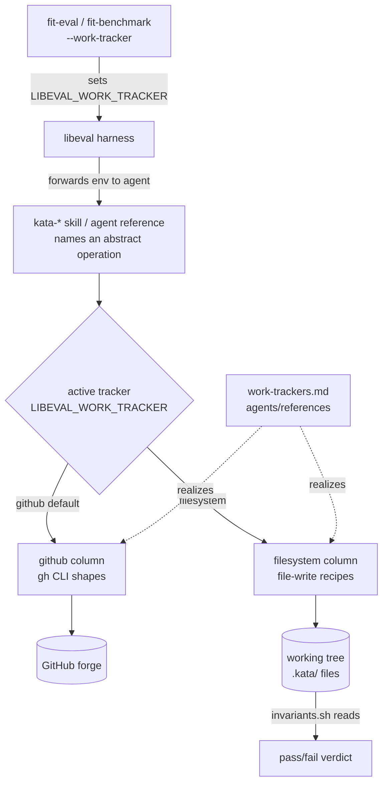

# Design 2090-b: Work-Item Tracker Abstraction (no new skill)

Alternative to [design-a.md](design-a.md). Same goal — generalize the GitHub
coupling behind a **tracker matrix** plus a **filesystem** tracker so the
coordination half of the kata loop (file → open change → gate → merge) becomes
benchmarkable offline. Scope, criteria, and exclusions are in
[spec.md](spec.md).

This variant fixes three decisions: the model and matrix live as one reference
on the surface that already owns cross-cutting coordination
(`.claude/agents/references/`), the publish workflow and genericity gate are
corrected so that surface ships and stays clean, and tracker selection is wired
into the libeval harness the way agent profiles already are. It introduces **no
new skill**.

## Matrix home: the agent-references surface

The matrix is needed *whenever an agent coordinates*, independent of which skill
is active. A skill's `references/` file is only context when something links to
it, so hosting the matrix under a domain skill buries a cross-cutting primitive
in one skill's scope and makes every coordinating skill depend on that skill's
presence. The surface already in scope for every agent is
`.claude/agents/references/` — `coordination-protocol.md`, `work-definition.md`,
`approval-signals.md` are cited from the agent profiles themselves. The matrix
belongs there as a peer (`work-trackers.md`), giving it a clear owner and a
stable citation target.

Rejected: a dedicated `kata-coordinate` skill (design-a) adds a skill scaffold
and README entry for a unit that only hosts a table; a reference under an
existing kata-* skill ships with no workflow change but couples the matrix to
that skill's domain and presence (the activation problem above).

## Reaching installations

APM installs the agent profiles and the skills from one pack together, so agent
references already reach installations in principle — but the publish workflow's
agent step copied only the top-level `*.md` profiles, never the `references/`
subtree. This design ships that subtree too, symmetric with skill references, so
all agent references (not just the three the spec re-expresses) become published
content. That is the right surface for the matrix and ends the skill/agent
asymmetry; leaving it unpublished is rejected because it fails criterion 7.

Two assumptions that pre-dated APM are corrected to make this sound. The
**genericity invariant** was scoped to the skill tree only and even banned
skills from relative-linking into `agents/` ("not shipped"); its scope now
covers `.claude/agents/references/` and that stale link ban is removed, so
cross-pack relative links resolve and every shipped reference is gate-checked on
each run (criterion 8 holds standingly, not by a one-time scan). Bringing the
tree to green required genericizing one internal invocation (a `bunx fit-*` call
in `self-improvement.md` → `npx`); the gate keeps it clean. Agent *profiles*
also ship and still carry monorepo-specific operational detail; bringing them
under the same gate is a separate follow-up, not part of this spec.

## Architecture



The active tracker, chosen by the harness-set env var, selects which matrix
column realizes each operation. The matrix is the single home for forge
commands.

## Components

| Component | Home | Role |
| --- | --- | --- |
| **Work-item model + matrix** | new `.claude/agents/references/work-trackers.md` | One reference defining issue, change, the shared envelope, the abstract operation vocabulary, the `github`/`filesystem` columns, per-tracker degradation, and the selection rule. The only place forge commands appear. |
| **github column** | inside `work-trackers.md` | Absorbs every forge command now outside it — the `gh` shapes in the coordination references, `issue-lifecycle.md`, and the kata-* skills, plus the remote-git operations (branch, push) the spec names. The § Problem grep set bounds the file set. |
| **filesystem column** | inside `work-trackers.md` | New. File-write recipes over the `.kata/` layout below. |
| **Re-pointed references** | `work-definition.md`, `coordination-protocol.md`, `approval-signals.md` | Re-expressed over operations; their `gh` shapes move to the matrix; they cite it by directory-relative path. |
| **Re-pointed skills** | the kata-* skills that call `gh` | Call sites replaced by an operation name + a relative matrix link, valid now that agents ship in the same pack. |
| **Tracker selection** | libeval command layer + `fit-eval`/`fit-benchmark` | `--work-tracker` sets `LIBEVAL_WORK_TRACKER`; the harness forwards it to the agent, mirroring the existing `--agent-profile` → `LIBEVAL_AGENT_PROFILE` path. |
| **Published surface + gate** | the publish workflow + the genericity invariant | Ship and gate the references tree (rationale in § Reaching installations). |
| **Benchmark task** | `benchmarks/kata-skills/tasks/coordinate-finding/` | End-to-end coordination graded by `invariants.sh` against `.kata/` files. |

## Work-item model

Two kinds share one **envelope** carried as YAML front-matter:

| Field | Meaning | github | filesystem |
| --- | --- | --- | --- |
| `id` | stable identity | issue/PR number + URL | caller-supplied slug = repo-relative path |
| `kind` | `issue` \| `change` | issue \| pull request | file under `issues/` \| `changes/` |
| `state` | `open` \| `closed` \| `merged` | issue/PR state | front-matter value |
| `labels` | classification incl. `agent:*` | issue/PR labels | front-matter list |
| `links` | related work-item ids | issue refs | front-matter list |
| `discussion` | comment thread | native issue/PR thread | appended `## Comments` section |
| `approval` | change-only trusted gate | PR label/review by trusted human | front-matter value |

The matrix records how each capability degrades per tracker. Front-matter is the
envelope carrier, chosen over a sidecar manifest or JSON store so one
human-readable file holds metadata and body and an agent edits it without a tool.

## Abstract operations

`create-issue`, `list-issues`, `comment`, `label`, `link`, `open-change`,
`gate`, `merge-change`, `close`, and the discussion pair `create-discussion` /
`comment-discussion`. The spec's `triage` and `patch` are compositions
(label / comment / close, and open-change / merge-change), not first-class
operations, keeping each tracker's surface small and fixed. Obstacle and
experiment are issues distinguished by label, so `issue-lifecycle.md` becomes
operation recipes (`create-issue` + `comment` + `close`) that point at the
matrix rather than carrying `gh`.

## Filesystem storage format

A coordination root `.kata/` in the working tree, tracker-owned and disjoint
from app files:

```
.kata/
  issues/{id}.md       # envelope front-matter + body; ## Comments appended
  changes/{id}.md      # envelope (kind: change) + links to its issue(s)
  discussions/{id}.md  # RFC threads
```

`create-*` writes a file from the envelope template; `list-issues` globs and
filters on front-matter; `comment` appends; `gate` sets `approval`;
`merge-change` sets `state: merged`. The remote-git operations branch and push
have no remote to target, so they degrade to no-ops per the envelope rule: a
change's diff is simply the working tree at merge time. No network, no remote,
no git required — plain file writes the agent already performs, which is why the
flow runs in the benchmark sandbox.

One file per item is chosen over a single append-only log or JSON store, which
an agent authors and `invariants.sh` asserts on less directly. Ids are
caller-supplied slugs (so a `{id}.md` path is the identity) rather than
tracker-minted monotonic ids, which would be non-deterministic and defeat
path-based assertions. A change file carries only its envelope; the changeset is
the working tree, not a materialized patch that duplicates it.

## Tracker selection

One input: environment variable `LIBEVAL_WORK_TRACKER`, defaulting to `github`.
The libeval command layer sets it on the agent environment exactly where it
already sets `LIBEVAL_AGENT_PROFILE`; `fit-eval` and `fit-benchmark` declare a
`--work-tracker` option that feeds it, with matching golden help. The matrix
documents the variable; skills never branch on it. The benchmark task runs
`--work-tracker filesystem`; production leaves the default. A harness-set env var
is chosen over a per-skill flag or a config file, which add surface the sandbox
must seed and would let skill wording branch on the tracker — the one thing
criterion 5 forbids.

## Approval-signal generalization

`approval-signals.md` keeps STATUS.md as the canonical record and keeps the
trust rule (human-originated for spec/design). Its signal table is re-expressed
as work-item signals — "a trusted approval marker on a change" and "a change
reaches `merged`" — and the matrix maps each to its realization: github reads
the PR label/review/merge event (the `kata-dispatch` bridge, unchanged);
filesystem reads the change file's `approval` field and `state: merged`. The
benchmark exercises the filesystem realization directly, without webhooks. On
filesystem the `approval` field records the granting signal; trust that the
setter is authorized is out-of-band — the actor that runs `gate` is trusted by
construction (the benchmark harness or a human). Emulating contributor-list
trust offline is rejected as unverifiable without the forge.

## Benchmark coordination task

`coordinate-finding/` (named for its object, a finding, rather than the
`-feature` suffix the rubric tasks use) follows the existing task structure —
agent, judge, and supervisor task files, a workdir overlay, and the preflight
and invariants hooks. Invoked with `--work-tracker filesystem`, the agent is given a finding
and runs the loop: `create-issue`, `open-change` linking it, `gate` with a
trusted signal, `merge-change`, networking unavailable. The invariants hook
asserts on the resulting `.kata/` files — issue exists and is linked, change
reached `state: merged`, `approval` recorded — using the same `assert` harness
the rubric tasks (spec/design/plan) use.

## Criteria coverage

| Spec criterion | Satisfied by |
| --- | --- |
| 1 model + matrix + selection | `work-trackers.md`: model, matrix, env-var selection rule |
| 2 forge commands only in github column | Matrix is the single command home; skills/references re-pointed |
| 3 three references over operations | Re-pointed references component |
| 4 `--work-tracker` flag + offline benchmark | libeval selection wiring; `coordinate-finding` runs `--work-tracker filesystem` |
| 5 tracker-independent wording | Skills name operations; branching lives only in the matrix |
| 6 coordination task asserts on files | `coordinate-finding` `invariants.sh` |
| 7 resource reaches installations | Agent-references tree published with the pack |
| 8 no leakage, clean install | Genericity invariant extended to the published references tree |

Out of scope follows the spec unchanged: no work-item operations CLI (the matrix
is the seam a later `fit-work` CLI adopts), no Jira/GitLab tracker, GitHub stays
the default, `wiki/STATUS.md` and `kata-dispatch` mechanics untouched.
