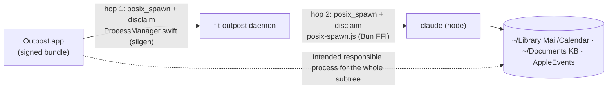
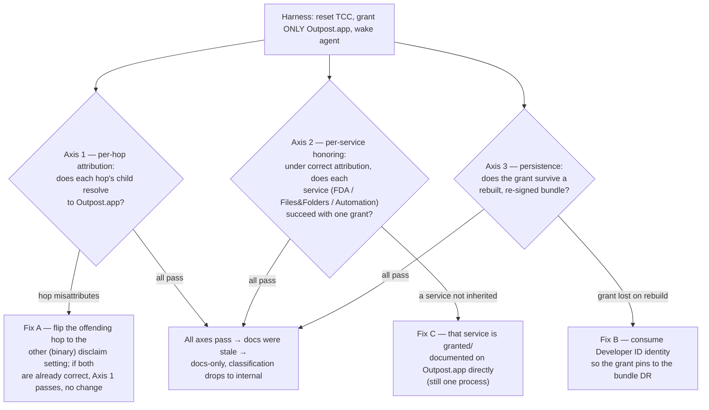

# Design 2100-a — One TCC grant for Outpost's spawned agents

Spec 2100 asks that an Outpost user grant macOS access to a single process —
`Outpost.app` — instead of three (`Outpost.app`, `node`, the Claude Code CLI).
The spec leaves the root cause open: the three-grant instruction may be a live
runtime defect or stale documentation, and the effect of
`responsibility_spawnattrs_setdisclaim` must be confirmed on hardware before any
change. This design is therefore **diagnosis-gated**. It does not pick a fix up
front; it defines a diagnostic that measures three independent axes, maps each
failing axis to a fix that composes with the others, and records the implicated
axes in the implementation (spec criterion 4).

## Attribution model

macOS attributes a TCC-gated access to the accessing process's **responsible
process**, found by walking the spawn chain — provided each hop is created with
`posix_spawn` (not `fork`+`exec`) so the spawn attributes apply. A single grant
to the responsible process covers the subtree it spawns. Outpost's chain has two
such hops, each carrying a `responsibility_spawnattrs_setdisclaim(attr, d)` call
where `d` is a **binary** disclaim flag — not a tunable range — set to `1` at
both hops today. The repo's comments and spec 0600 read `1` as "child disclaims,
responsibility flows up to `Outpost.app`"; the first spec panel split on whether
that reading is correct. Which of the two flag settings actually keeps
`Outpost.app` responsible is what the harness measures — it is not assumed here.
These two calls are the only knob that steers attribution along the chain:

The two hops are independent call sites in different languages, but they
implement one primitive and must agree: if **either** hop attributes its child
to itself, that child needs its own grant. The design governs them by one
contract — "both hops keep `Outpost.app` the responsible process" — not two
independent toggles, and the harness asserts attribution **per hop**, not only
at the leaf, so one correct hop cannot mask an inverted one.

## TCC services per resource (spec obligation, line 18)

The spec requires the design to pin which TCC service each resource needs; the
harness confirms these on hardware:

| Resource             | Path                              | TCC service                 |
| -------------------- | --------------------------------- | --------------------------- |
| Mail store read      | `~/Library/Mail/…/Envelope Index` | Full Disk Access            |
| Calendar store read  | `~/Library/Calendars/`            | Full Disk Access            |
| Knowledge base       | `~/Documents/<kb>`                | Files & Folders (Documents) |
| Draft-side Mail send | Mail via AppleScript              | Automation (AppleEvents)    |

The product page's "Files & Folders" framing covers the `~/Documents` knowledge
base; the Mail/Calendar reads under `~/Library` are Full Disk Access. They are
different resources, not a contradiction — the docs rewrite states both. The
harness reads the Calendar store as files (Full Disk Access); it does **not**
exercise the distinct EventKit Calendar service, so a green result here is not
read as covering the Calendar API path.

## Diagnostic: three composable axes

One hardware procedure (the runbook below) resets TCC, grants **only**
`Outpost.app`, wakes an agent, and measures three axes. Axes are independent —
zero, one, or several may fail, and their fixes stack:

If every axis already passes, the three-grant instruction was stale: the only
change is docs and comments, and the spec's classification drops to internal.

## Components

| Component                         | Where                                                                                           | Role                                                                                                                 |
| --------------------------------- | ----------------------------------------------------------------------------------------------- | -------------------------------------------------------------------------------------------------------------------- |
| Diagnostic / verification runbook | Owned by the Outpost macOS package (path is a plan decision)                                    | The single hardware procedure detailed in § Verification harness; run once to diagnose, once per release to re-check |
| Spawn attribution control         | `ProcessManager.swift` (hop 1), `libraries/libmacos/src/posix-spawn.js` (hop 2)                 | The two `setdisclaim` calls; Fix A flips the implicated hop(s) to the attribution-preserving setting                 |
| Signed bundle identity            | `sign-app.sh` (`MACOS_SIGN_IDENTITY`), `macos-signing` action — already wired                   | Consumed, not built; Fix B's persistence dimension, supplied by the cert rollout                                     |
| TCC docs                          | `websites/fit/outpost/index.md`, `websites/fit/docs/getting-started/engineers/outpost/index.md` | Rewritten to one grant + a one-time migration note, after a green harness run                                        |
| Spawn-site comments               | both hops                                                                                       | Reconciled to the verified semantics, so the next contributor cannot silently invert the knob                        |

## On the signing identity (Fix B's real role)

Developer ID signing is **not** an in-session fix for misattribution: if Axis 1
already resolves to `Outpost.app`, the grant on `Outpost.app` is what TCC
consults, and identity does not change that. Identity governs Axis 3 only — what
the grant pins to and whether it survives a rebuilt bundle — plus the
trustworthy name the user authorizes. So 2100 is **not blocked on the
certificate rollout**: the spec's in-session three-grant gap is closed by Fix A
and/or Fix C, and Axis 3 already has a fallback in spec 1170's deterministic
ad-hoc cdhash (a single ad-hoc grant survives a `brew upgrade`). Developer ID is
the occasion and the stronger persistence guarantee, owned by the cert rollout,
not a 2100 dependency.

## Verification harness (single home for the procedure)

One tracked runbook encodes spec criteria 1–3 as a checklist: `tccutil reset`
the services in § TCC services → grant only `Outpost.app` → wake an agent →
assert each hop's responsible-process lookup (`launchctl procinfo` / a
`log stream` TCC predicate) resolves to `Outpost.app`, the Mail/Calendar read
succeeds, and no `node`/CLI entry is required (criterion 1); a draft-side action
exercises Automation (criterion 2); a re-signed-bundle reinstall checks
persistence (criterion 3). This is the only durable guard — TCC state is not
exercisable in CI or on Linux — so it doubles as the per-release re-check.

## Key decisions

| Decision                                                        | Why                                                                                                        | Rejected alternative                                                                     |
| --------------------------------------------------------------- | ---------------------------------------------------------------------------------------------------------- | ---------------------------------------------------------------------------------------- |
| Diagnose on hardware before changing code                       | The repo's comments and spec 0600 may be wrong about the knob; an inverted flip silently preserves the gap | Trust the comments and flip the flag — the failure mode the spec exists to avoid         |
| Three composable axes, not one exclusive branch tree            | Failures can co-occur (a wrong hop value and a non-inherited service); their fixes stack                   | A mutually-exclusive 4-way decision tree — forces one exit when several causes may hold  |
| Treat both spawn hops as one governed control, assert per hop   | Either hop disclaiming to its child reopens the gap; a leaf-only check hides it                            | Fix/observe only the daemon→`claude` hop — leaves hop 1 able to break attribution unseen |
| Pin TCC services in the design                                  | The spec assigns this to the design (line 18)                                                              | Defer service identification to the harness — leaves the docs rewrite ungrounded         |
| One runbook for diagnosis and per-release re-check              | TCC behavior is not exercisable in CI/Linux; a manual re-check is the only durable guard                   | Build a CI assertion — impossible without macOS TCC state                                |
| Docs rewrite gated on a green harness run; clean break, no shim | Writing one-grant instructions before the behavior is confirmed would mislead users                        | Rewrite docs speculatively, or keep three-grant docs as a fallback                       |

## Recording the diagnosed outcome (satisfies criterion 4)

Because the harness runs after this design is written, the diagnosed outcome —
which axes were implicated and which fixes were applied — is recorded as part of
the implementation, in the implementation PR alongside the code/doc changes, not
as a re-approved design. The plan sequences the diagnostic run first, so its
result is known before the fix and docs steps; that recorded outcome in the
implementation is what spec criterion 4 verifies. The runbook itself is a
tracked file the implementation creates (so the per-release re-check has a
home); its path is a plan decision.

## Out of scope (unchanged from spec)

Terminal-invoked CLI attribution (deferred in spec 0600), the signing-pipeline
mechanics themselves, the config trust boundary / spawn-env allow-set (spec
1360), and OS-sandboxing the spawned agent.
