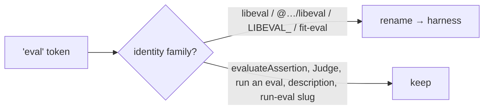
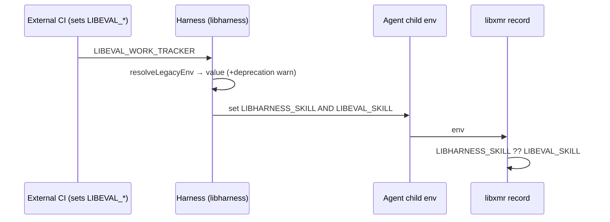
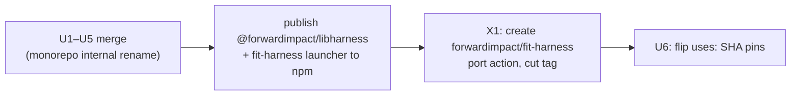

# Design 2110-a: Rename `libeval` → `libharness`

Spec 2110 renames the harness library identity, its published CLI surface
(`fit-eval`→`fit-harness`), its `LIBEVAL_*` env contract, and its prose to
`harness`, while keeping the evaluation **domain** vocabulary and treating
`specs/`+CHANGELOG history as immutable. This design fixes WHICH change-units
exist, WHERE the one non-mechanical piece (env-var compatibility) lives, and in
WHAT order the units land so the published surface never breaks.

A rename has almost no new architecture. The design work is three things:
(1) partition the blast radius into **atomic commits** that each keep CI green;
(2) design the **env-var transition** the spec mandates; (3) sequence the
**cross-repo publish** so no `uses:` pin ever points at an unpublished tag.

## Change-units (atomic commits)

Each unit is a single commit that leaves `bun run invariants`, `bun run
context:fix`, and the test suite green. Ordering across units is § Sequencing.

| Unit | Surface | Atomicity constraint |
| --- | --- | --- |
| **U1 Library identity** | `git mv libraries/libeval libraries/libharness`; package `name`+`repository.directory`; internal import specifiers; the dep ranges + import sites in `libwiki`, `products/gear`, and the spec-named consumers `libmock`/`libbridge`/`scripts/` | dir move + every importer in one commit or module resolution breaks |
| **U2 CLI + launchers + invariant** | `bin/fit-eval.js`→`fit-harness.js`, `bin`/`exports` keys; **all three launchers** — `launchers/fit-eval`→`fit-harness` (dir) **and** the byte-exact `import "@forwardimpact/libeval/bin/*"` in the `fit-trace`+`fit-benchmark` launcher bins → `@forwardimpact/libharness`; `SIBLING_ACTION_CLIS` entry; `canonicalBinContent` JSDoc | `public-cli-set` checks launcher bins byte-exact against the package name, so every launcher flips with U1's rename in one commit |
| **U3 Env contract** | `LIBEVAL_*`→`LIBHARNESS_*` at all read/write sites + the compat shim (§ Env-var) | shim and renamed sites in one commit so both prefixes work from that commit on |
| **U4 Prose + docs + build manifest** | `KATA.md`, `.github/CLAUDE.md` (incl. `IS_SANDBOX`), `libraries/CLAUDE.md`, skills, `websites/**`, `build/cli-manifest.json`, `FIT_EVAL_REF`→`FIT_HARNESS_REF` + `libskill`/`libcoaligned` fixtures | `cli-manifest.json` is hand-maintained — verify the binary build, not just `context:fix` |
| **U5 Generated tables** | `bun run context:fix` output (`libraries/README.md`, `websites/README.md`, `enum:` blocks) | regenerated last so it reflects U1–U4; never hand-edited |
| **X1 Sibling repo** | create `forwardimpact/fit-harness`, port `fit-eval` action, cut release tag | external repo; must precede U6 |
| **U6 Flip `uses:` pins** | `kata-dispatch`/`eval-guide`/`kata-interview` SHA pins, `sibling-edit.yml` allowlist | after X1 tag exists |

`public-cli-set` has a fourth input beyond U2's three: it also scrapes
`npx/bunx fit-*` invocations from `.claude/skills/**` and `websites/**`
markdown (renamed in U4). The invariant stays green across the U2→U4 gap
because `SIBLING_ACTION_CLIS` seeds `fit-harness` unconditionally and the rule
intersects invoked names with live `bin` keys — a stale `fit-eval` left in a
doc maps to no bin and is dropped, never producing drift.

## Token-classification gate

The rename is **not** a blanket `sed`. A codemod that rewrites every `eval`
would corrupt the evaluation domain. The gate: rename only the four identity
token-families — `libeval`, `@forwardimpact/libeval`, `LIBEVAL_*`, `fit-eval` —
and leave `evaluateAssertion`, `Judge`, "run an eval", the package
`description`/`keywords`/`jobs`, and the `run-eval` doc slug untouched.
Criterion 1's `rg 'libeval|LIBEVAL_|fit-eval'` is the completeness oracle; the
keep-list (criterion 6) is the allowlist of surviving matches.

## Env-var transition (the only real component)

The spec requires a window in which a config that sets `LIBEVAL_*` behaves
identically. Two interface points:

- **Reads** — `work-tracker.js` (`WORK_TRACKER`), `redaction.js`
  (`REDACTION_DISABLED`, `REDACTION_ENV_VARS`), and `libxmr/record.js`
  (`SKILL`). The resolver returns the resolved string, so existing tests like
  `=== "1"` apply to its result unchanged.
- **Writes** — the harness sets `AGENT_PROFILE`/`WORK_TRACKER` (lead commands)
  and `SKILL` (`agent-runner`) on the **child** agent env; `SKILL` then crosses
  a process boundary and is read by `libxmr`.

**Decision: read both, write both, prefer new.** A reader resolves
`LIBHARNESS_X ?? LIBEVAL_X`; every write site sets **both** names during the
window — uniformly across all three written vars, not just `SKILL`. (`SKILL` is
the var that *forces* dual-write because it is the one crossing into `libxmr`;
the other two are dual-written for one consistent write path, not three.) The
resolver and its placement trade-offs are in § Key Decisions.

Window removal (drop `LIBEVAL_*` reads/writes and the helper) is a follow-up
spec, not this one.

## Cross-repo publish sequencing

`@forwardimpact/libharness` and the `fit-harness` launcher must be on npm
before the sibling action (which `npx`-invokes `fit-harness`) is cut, and the
sibling tag must exist before any monorepo `uses:` points at it. The old
`forwardimpact/fit-eval` repo and its tags stay published (immutable history)
until consumers migrate; this design does not delete them.

## Key Decisions

| Decision | Choice | Rejected alternative |
| --- | --- | --- |
| Rename mechanism | Category-scoped codemod gated by the four identity families | Blanket `sed s/eval/harness/` — corrupts evaluation domain (spec (c)) |
| Clean break vs shim | Clean break everywhere **except** the env contract, where the spec names compat as a requirement | Shimming the package name (`libeval` re-export) — unneeded; npm handles the scope rename via a new name + dependents bump |
| Env resolver home | Pure helper in `libutil`, shared by `libharness`+`libxmr` | Per-site `??` (drift); `libharness`→`libxmr` import (layering inversion) |
| Write-side compat | Write both prefixes during the window | Write new only — breaks new-harness → old-`libxmr` `SKILL` handoff |
| CLI atomicity | bin + launcher + invariant in one commit (U2) | Separate commits — `public-cli-set` red between them |
| Sibling repo | New `forwardimpact/fit-harness`; old repo left published | Rename-in-place — breaks every existing SHA pin with no migration window |
| History | `specs/`+CHANGELOG immutable (spec) | Rewrite — large diff, no value, self-referential count churn |

## Verification mapping

| Criterion | Where satisfied |
| --- | --- |
| 1 identity tokens gone | U1–U6; `rg` oracle includes `fit-eval` |
| 2 library at new path | U1 |
| 3 `fit-harness` + 3 unchanged CLIs | U2 |
| 4 `public-cli-set` green | U2 (atomic) |
| 5 both env prefixes work | U3 + `libutil` resolver; reader sites incl. `libxmr/record.js` |
| 6 domain vocab intact | token-classification gate |
| 7 generated tables + manifest | U5 (`context:fix`) + U4 (`cli-manifest.json` manual) |
| 8 full suite green | every unit's atomicity constraint |
| 9 non-breaking sequence | § Cross-repo publish sequencing |

## Risks

- **`cli-manifest.json` slips `context:fix`.** Mitigation: its own change-unit
  (U4) + an explicit binary-build check, since neither criterion-1 `rg` nor
  `context:fix` catches a stale `fit-eval` entry there.
- **External pin still on `forwardimpact/fit-eval`.** Acceptable: the old repo
  stays published; consumers migrate on their own clock. No monorepo pin points
  at it after U6.
- **Window never closed.** Tracked as a follow-up spec; the `libutil` helper is
  the single deletion point.
