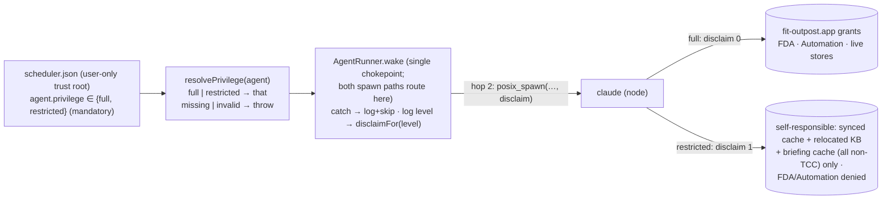

# Design 2120-a — Per-agent least-privilege execution for Outpost

Spec 2120 keeps the verified single-grant model (one grant to `fit-outpost.app`
covers the spawned subtree) for agents that sync the live mail/calendar stores
or send mail, while making that grant **not** flow to an agent whose job only
touches already-synced, non-protected substrate. A `restricted` agent must be
denied Full Disk Access and Automation even when fully prompt-injected, yet
complete its knowledge-base work with no TCC grant and no `node`/`claude`
prompt. The level is declared per agent in `scheduler.json`, daemon-enforced,
agent-immutable, and **mandatory** — a clean break, with no implicit default,
no shim, and no back-compatible fallback for existing installs.

The architecture reuses the one attribution seam spec 2100 verified — the
`responsibility_spawnattrs_setdisclaim` call on the daemon→`claude` hop — rather
than adding a new isolation mechanism. `full` keeps today's `disclaim = 0`
(child inherits `fit-outpost.app` as responsible process); `restricted` passes
`disclaim = 1` (child is responsible for itself, so the app's grants are not
extended and `node`/`claude` holds no grant of its own). Substrate relocation,
not a new grant, is what lets a self-responsible `restricted` child still work.

## Data flow

Hop 1 (`fit-outpost.app` → daemon, `ProcessManager.swift`) is unchanged and
stays `disclaim = 0`: the daemon must always remain the app's child. Only hop 2
varies by level.

## Components

| Component | Where | Role |
| --- | --- | --- |
| Privilege resolver | `products/outpost/src/privilege.js` (new) | `PRIVILEGE_LEVELS = ["full","restricted"]`, `resolvePrivilege(agent)`, `disclaimFor(level)`. The level is mandatory: a missing or invalid value **throws**, there is no default. Patterned on `posture.js` but with no `effective*` coercion. |
| Wake chokepoint | `products/outpost/src/agent-runner.js` (`AgentRunner.wake`) | Resolves the level once from `agent.privilege`, catches a missing/invalid level (log + skip), logs the resolved level, threads the disclaim flag into its spawn-primitive call. The one site both the scheduler tick and the socket wake already funnel through; it needs no config beyond the `agent` object it already receives. |
| Spawn primitive | `libraries/libmacos/src/posix-spawn.js` (`spawn`) | The hardcoded `setDisclaim(attr, 0)` becomes a `disclaim` input (default `0`, so the `tcc-responsibility.js` wrapper and every other present caller keep the inherited setting unchanged); the `restricted` wake passes `1`. Exact arg shape (options field vs. positional) is a plan call. **Released separately → coupled libmacos release.** |
| Default config + KB path | `products/outpost/config/scheduler.json` (bundled), `products/outpost/pkg/macos/postinstall` (`DEFAULT_KB`, and the copy of the bundled config into the trust root) | Ship an explicit level on every agent (sync/send → `full`, the rest → `restricted`) and the relocated non-TCC knowledge-base path (`~/.local/share/fit/outpost/team`). No default-level key exists. |
| KB provisioning (`init`) | `products/outpost/src/outpost.js` (CLI definition + `init` dispatch), `products/outpost/src/kb-manager.js` | `fit-outpost init [name]` resolves a single safe path segment under the XDG data home to `~/.local/share/fit/outpost/<name>` rather than taking an arbitrary path — so a provisioned KB always lands outside TCC-protected folders and the cryptic data-home prefix never has to be typed. The name is validated like an agent name (no `/`, `\`, `..`, NUL, leading `~`); it defaults to `team`. |
| Verification runbook | `products/outpost/macos/TCC-VERIFICATION.md` | New axis: a `restricted` probe shows an explicit `SystemPolicyAllFiles` **Denied**, a `full` agent **Allowed**, in one install; the service table's KB row is updated for the relocated non-TCC path. |
| End-user docs + installer paths | `websites/fit/outpost/index.md`, `websites/fit/docs/getting-started/engineers/outpost/index.md`, installer copy (`pkg/macos/{welcome,conclusion}.html`, `uninstall.sh`) | Which agents need which macOS permissions; relocate every `~/Documents` KB-path reference (the `/Personal` and `/Team` examples, including the literal data paths in `uninstall.sh`) to the new path. |

## Privilege resolution

`resolvePrivilege(agent)` is a pure function over one agent's config. A declared
`full`/`restricted` is honored; **any other state — a missing level included —
throws**. The wake catches the throw, logs `outpost.privilege.rejected`, and
skips the agent (the same fail-and-skip shape the state-path validator's callers
use). There is no default, no coercion, and no second argument: the resolver
reads `agent.privilege` alone. The level lives in the same user-only trust root
as the spawn-env allow-set and state roots, so "agent-immutable" needs no new
mechanism — a spawned agent already cannot write `scheduler.json`.

The bundled `config/scheduler.json` therefore pins an explicit level on every
shipped agent: the mail/calendar sync and send agents as `full`, the rest as
`restricted`. A user who hand-adds an agent must declare its level too; an entry
that omits it is refused at wake rather than run with a guessed privilege.

## Knowledge-base relocation

Knowledge bases live under the XDG data home, `~/.local/share/fit/outpost/`,
named by a single path segment. `fit-outpost init [name]` provisions one at
`~/.local/share/fit/outpost/<name>`; the name defaults to `team`, so a
default install lands at `~/.local/share/fit/outpost/team`. The command
takes a **name**, not a filesystem path — it resolves the name under the data
home and validates it as a safe segment (the `agent-path.js` rejection rule: no
`/`, `\`, `..`, NUL, or leading `~`) — so the substrate cannot be steered back
into a TCC-protected folder and the user never types the data-home prefix. This
is an **unconditional** move off `~/Documents/Personal` (TCC
`SystemPolicyDocumentsFolder`): the bundled config's `kb` entries, the
installer's `DEFAULT_KB`, and the `init` call all point at the data-home path. A
`restricted`, self-responsible child reads the synced cache
(`~/.cache/fit/outpost/`, already non-protected) and writes the KB under its
data-home path with no grant and no Documents prompt; the daemon still writes
its briefing to `~/.cache/fit/outpost/state/<agent>_last_output.md` (non-TCC, so
no grant is needed there either).

There is no continue-to-serve path and no in-place migration: the code knows
only the relocated location. The small number of existing installs are migrated
by hand — move the KB directory and add explicit levels to their
`scheduler.json` — which keeps the codebase free of a legacy default or a
dual-path read (see § Out of scope).

## Key decisions

| Decision | Why | Rejected alternative |
| --- | --- | --- |
| Reuse the hop-2 disclaim seam to express both levels | One verified primitive already steers attribution; `restricted` is its `disclaim = 1` branch | A second (helper/two-bundle) identity holding its own narrow grant — explicitly deferred by the spec |
| Resolve and apply the level at the single `AgentRunner.wake` chokepoint | Both spawn paths already funnel through it; one resolution site cannot drift between paths | Branch inside `posix-spawn.js`, or duplicate the logic in `socket-server.js` — two sites that can disagree |
| Level is mandatory; a missing or invalid value throws and the wake skips (fail-closed) | A clean break with no implicit behavior: every agent's reach is declared, and a typo or omission cannot silently run with the wrong privilege | Any implicit default (a runtime `?? full`/`restricted`, or a `defaultPrivilege` marker) — a fallback the clean break forbids and a path the user must hand-migrate off anyway |
| Relocate the default KB unconditionally; existing installs migrated by hand | Keeps one KB location in the code — no legacy default, dual-path read, or in-place move logic | Continue-to-serve the old `~/Documents` path, or auto-migrate the directory on upgrade — legacy the user explicitly rejected, and an upgrade-time move races an in-flight sync |
| Relocated path `~/.local/share/fit/outpost/team` | Unambiguously outside every TCC-protected folder; durable, namespaced with the cache | `~/Library/Application Support/…` (FDA-ambiguous on some macOS versions); `~/.cache/…` (reserved for ephemeral synced content, not the durable KB) |
| `init [name]` resolves names under the data home; default name `team` | The data-home prefix is unmemorable and unguessable; a name is the handle a user can type, and resolving it under the data home keeps every KB out of TCC folders by construction. `team` is the default because the FIT suite is built for collaborative environments, and it coexists with further KBs like `personal`. | `init <path>` taking an arbitrary path — lets a user place the KB back in `~/Documents`, reopening the TCC hole this spec closes; a `kb` leaf name — a type, not a name, redundant under `outpost/` and unable to sit beside a second named KB |
| Add a positive `restricted`-denial probe to the runbook | Denial must be distinguishable from "never attempted"; TCC state is unexercisable in CI | A code-level/CI assertion — impossible without macOS TCC state |

## Out of scope (unchanged from spec)

OS-sandboxing the spawned child (the `writeFileSync`/redirect write escape,
tracked under § Template Write Deny); a two-bundle or helper-bundle identity;
adding the missing Automation/Calendar entitlements so those services can
prompt; any change to the spawn-env allow-set; and any automated migration or
back-compatible fallback for existing installs — the few current installs move
their KB and declare levels by hand, and no legacy default or dual-path read
lives in the code.
