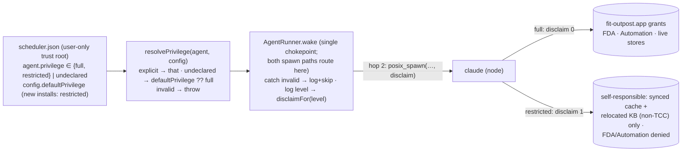

# Design 2120-a — Per-agent least-privilege execution for Outpost

Spec 2120 keeps the verified single-grant model (one grant to `fit-outpost.app`
covers the spawned subtree) for agents that sync the live mail/calendar stores
or send mail, while making that grant **not** flow to an agent whose job only
touches already-synced, non-protected substrate. A `restricted` agent must be
denied Full Disk Access and Automation even when fully prompt-injected, yet
complete its knowledge-base work with no TCC grant and no `node`/`claude`
prompt. The level is declared per agent in `scheduler.json`, daemon-enforced,
agent-immutable, secure-by-default for new agents, and back-compatible for
existing installs.

The architecture reuses the one attribution seam spec 2100 verified — the
`responsibility_spawnattrs_setdisclaim` call on the daemon→`claude` hop — rather
than adding a new isolation mechanism. `full` keeps today's `disclaim = 0`
(child inherits `fit-outpost.app` as responsible process); `restricted` passes
`disclaim = 1` (child is responsible for itself, so the app's grants are not
extended and `node`/`claude` holds no grant of its own). Substrate relocation,
not a new grant, is what lets a self-responsible `restricted` child still work.

## Data flow

Hop 1 (`fit-outpost.app` → daemon, `ProcessManager.swift`) is unchanged and
stays `disclaim = 0`: the daemon must always remain the app's child. Only hop 2
varies by level.

## Components

| Component | Where | Role |
| --- | --- | --- |
| Privilege resolver | `products/outpost/src/privilege.js` (new) | `PRIVILEGE_LEVELS = ["full","restricted"]`, `resolvePrivilege(agent, config)`, `disclaimFor(level)`. Validates the declared value, applies the config-level default. Patterned on `posture.js` but **rejects** an invalid value rather than coercing it. |
| Wake chokepoint | `products/outpost/src/agent-runner.js` (`AgentRunner.wake`) | Resolves the level once, catches an invalid level (log + skip, mirroring how callers handle `UnsafeAgentNameError`), logs the resolved level, threads the disclaim flag into the direct `posix-spawn.spawn` call. `wake` today receives only `config.env`; its signature widens so the resolver sees `config.defaultPrivilege`. The one site both the scheduler tick and the socket wake already funnel through. |
| Spawn primitive | `libraries/libmacos/src/posix-spawn.js` (`spawn`) | The hardcoded `setDisclaim(attr, 0)` becomes a `disclaim` parameter appended after `runtime` (default `0`, preserving every current caller incl. the `tcc-responsibility.js` wrapper); `restricted` passes `1`. **Released separately → coupled libmacos release.** |
| Default config + KB path | `products/outpost/config/scheduler.json` (bundled), `products/outpost/pkg/macos/postinstall` (`DEFAULT_KB`, and the copy of the bundled config into the trust root) | Ship per-agent levels, `defaultPrivilege: "restricted"`, and the relocated non-TCC `kb` path so new installs are least-privilege by default. |
| Verification runbook | `products/outpost/macos/TCC-VERIFICATION.md` | New axis: a `restricted` probe shows an explicit `SystemPolicyAllFiles` **Denied**, a `full` agent **Allowed**, in one install; the service table's KB row is updated for the relocated non-TCC path. |
| End-user docs | `websites/fit/outpost/index.md`, `websites/fit/docs/getting-started/engineers/outpost/index.md`, installer copy (`pkg/macos/{welcome,conclusion}.html`, `uninstall.sh`) | Which agents need which macOS permissions; the relocated KB path everywhere `~/Documents/Personal` is named today. |

## Privilege resolution

`resolvePrivilege(agent, config)` is a pure function. An **explicit**
`full`/`restricted` is honored; any other declared value is rejected (it throws,
the wake catches and logs `outpost.privilege.rejected`, then skips — the same
fail-and-skip shape the state-path validator's callers use). An **undeclared**
level falls back to `config.defaultPrivilege` when present and valid, else
`full`.

That config-level default is how requirement 6's two halves hold at once. The
bundled `config/scheduler.json` ships `defaultPrivilege: "restricted"` and pins
each shipped agent's level **explicitly** — the mail/calendar sync and send
agents as `full`, the rest as `restricted` — so a fresh install never loses live
reach to the new default; `defaultPrivilege` governs only an agent the user
later hand-adds without a level, which is then `restricted`.
An existing install's `scheduler.json` — copied at its own install time — has no
`defaultPrivilege` key and no per-agent levels, so every agent resolves to
`full` and behaves exactly as today. The level lives in the same user-only trust
root as the spawn-env allow-set and state roots, so "agent-immutable" needs no
new mechanism: a spawned agent already cannot write `scheduler.json`.

## Knowledge-base relocation and migration

The default knowledge base moves from `~/Documents/Personal` (TCC
`SystemPolicyDocumentsFolder`) to `~/.local/share/fit/outpost/kb`, a non-TCC
path under the XDG data home, set in the bundled config's `kb` entries and in
the installer's `DEFAULT_KB`. A `restricted`, self-responsible child reads the
synced cache (`~/.cache/fit/outpost/`, already non-protected) and writes the KB
under that relocated path with no grant and no Documents prompt; the daemon
still writes its briefing to `~/.cache/fit/outpost/state/<agent>_last_output.md`
(non-TCC, so no grant is needed there either).

Migration is **continue-to-serve**, not move: an upgrade never rewrites the
user-owned `scheduler.json`, so an install that already names
`~/Documents/Personal` keeps that path, and its agents — undeclared, therefore
`full` — keep reading Documents under the app grant exactly as today. Only the
bundled config, the installer default, and the docs change. No directory is
relocated on disk, so nothing is stranded or duplicated.

## Key decisions

| Decision | Why | Rejected alternative |
| --- | --- | --- |
| Reuse the hop-2 disclaim seam to express both levels | One verified primitive already steers attribution; `restricted` is its `disclaim = 1` branch | A second (helper/two-bundle) identity holding its own narrow grant — explicitly deferred by the spec |
| Resolve and apply the level at the single `AgentRunner.wake` chokepoint | Both spawn paths already funnel through it; one resolution site cannot drift between paths | Branch inside `posix-spawn.js`, or duplicate the logic in `socket-server.js` — two sites that can disagree |
| Config-level `defaultPrivilege` marker, absent in pre-upgrade configs | Distinguishes a new install (undeclared→`restricted`) from an existing one (undeclared→`full`) without a runtime default that means two things | A single runtime default — `full` leaves new hand-added agents over-privileged, `restricted` silently breaks existing installs |
| Invalid level throws → wake logs and skips (fail-closed) | "Schema accepts no other values"; a typo must not silently run with the wrong reach | Coerce an unknown value to `restricted` (the `posture.js` shape) — hides the config error and runs anyway |
| Relocate the default KB by changing the bundled config + installer default; continue-to-serve existing paths | The user-owned config is never rewritten, so no KB is orphaned (requirement 5) with zero on-disk risk | Move the directory on upgrade — risks stranding, duplication, and a race with an in-flight sync |
| Relocated path `~/.local/share/fit/outpost/kb` | Unambiguously outside every TCC-protected folder; durable, namespaced with the cache | `~/Library/Application Support/…` (FDA-ambiguous on some macOS versions); `~/.cache/…` (reserved for ephemeral synced content, not the durable KB) |
| Add a positive `restricted`-denial probe to the runbook | Denial must be distinguishable from "never attempted"; TCC state is unexercisable in CI | A code-level/CI assertion — impossible without macOS TCC state |

## Out of scope (unchanged from spec)

OS-sandboxing the spawned child (the `writeFileSync`/redirect write escape,
tracked under § Template Write Deny); a two-bundle or helper-bundle identity;
adding the missing Automation/Calendar entitlements so those services can
prompt; and any change to the spawn-env allow-set.
