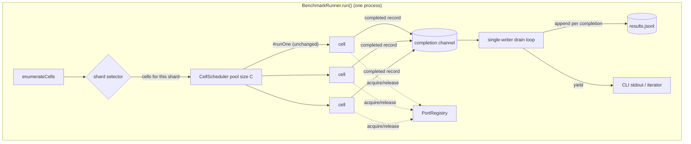
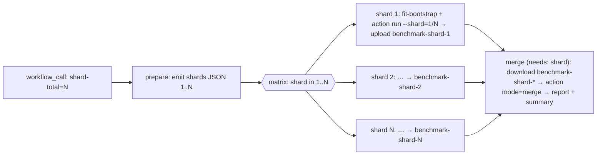

# Design 2130-a — Parallel Benchmark Execution

Implements spec 2130. The serial nested loop in `BenchmarkRunner.run()` becomes a
bounded concurrent scheduler (Layer 1), and the runner gains a deterministic
shard selector plus a multi-input merge in `report`, fanned across CI by a new
reusable workflow (Layer 2). A record's verdict, schema, and the per-cell
lifecycle (`#runOne`: setup → supervised agent → invariants → judge → teardown)
are unchanged; only *how many cells run at once* and *how the ledger is
assembled* change.

**Clean break — no shims, no fallbacks, no dual representations.** With few
consumers today, this replaces the obsolete paths outright rather than wrapping
them: the serial loop, the `allocatePort` allocator, and the single-file
`loadRecords` read are **deleted**, not flagged or branched. There is one
scheduler, one durable ledger (the incrementally-appended `results.jsonl` — no
sidecar copy), one port mechanism, one merge path (always recursive), and one
sharded primitive where an unsharded run is simply shard `1/1`. No
`--legacy`/compat flag exists, and no old behavior is preserved "for safety."

## Architecture

Concurrency lives in execution (`CellScheduler` runs `C` cells at once); the
ledger stays **single-writer** because only the drain loop appends to
`results.jsonl` and yields. Workers communicate completions through a channel,
never touch the shared stream. The append is incremental — each cell lands in
`results.jsonl` the moment it settles — so a killed run keeps every completed
cell with no second on-disk copy. This is Layer 1's durability guarantee without
a write mutex and without a sidecar ledger.

## Layer 1 — in-process concurrency

| Component | Where | Responsibility |
| --- | --- | --- |
| `enumerateCells(tasks, runs)` | `benchmark/runner.js` | Flatten the grid into a stable ordered `{taskId, runIndex}` list, **task-major / runIndex-minor**. This exact ordering is a load-bearing contract: Layer 2's round-robin balance depends on a task's runIndexes being adjacent in the list. Single source of the cell list for both the scheduler and the shard selector. |
| `CellScheduler` | new `benchmark/scheduler.js` | Bounded pool: keep ≤ `C` `#runOne` calls in flight; as one settles, start the next; push each settled record onto the completion channel. Built on a small permit semaphore (no new dependency). |
| completion channel + drain loop | `runner.js` `run()` | Async queue the scheduler pushes settled records into; the generator drains it, appends each record to the shard's `results.jsonl` **as it settles**, and yields. Sole writer of the ledger and its only on-disk form — incremental append is the crash-safety mechanism, so there is no per-cell sidecar file. |
| `PortRegistry` | `benchmark/workdir.js` | Replaces `allocatePort()` (deleted): hand out distinct, bindable ports under a lock with a live in-use set; re-probe if the OS returns an already-reserved number; release on teardown. |
| `resolveConcurrency` | `commands/benchmark-run.js` | `--concurrency` flag > `LIBHARNESS_BENCHMARK_CONCURRENCY` env > default `min(CONCURRENCY_CEILING, max(2, ⌊cores/2⌋))` (where `CONCURRENCY_CEILING` is a plan-time constant, conservative because each cell spawns ~3 agent subprocesses). |

**Streaming contract change.** `run()` now yields in **completion order**, not
grid order. The CLI consumer already treats records order-independently
(`stdout` mirror, `anyFail`, zero-record guard), and `report` groups by `taskId`,
so pass@k is unaffected. This is the one observable behavior change and is called
out in the spec.

**Port hand-off, honestly.** A truly held socket cannot be bound by the agent
later, so `PortRegistry` reserves the *number* (lock + in-use set + re-probe),
not the socket — closing the OS race window that the close-then-return allocator
left open. The reservation lives for the cell and is released at teardown
alongside the existing process-group kill and port-free probe.

## Layer 2 — sharding and distribution (Playwright-inspired)

Playwright's model: `--shard=i/N` runs a slice locally, each slice writes a blob
report, and `merge-reports` stitches the blobs into one. We mirror it.

| Component | Where | Responsibility |
| --- | --- | --- |
| `--shard=<i>/<N>` | `commands/benchmark-run.js` → runner | 1-based like Playwright. Parsed to `{index, total}`; validate `1 ≤ i ≤ N`. The runner applies `selectShard` to the enumerated cells before scheduling. An unsharded run is the identity `1/1`. When `N > cell count`, the high-index shards select **zero** cells — a valid run whose `results.jsonl` has zero records, which `loadRecords` unions as the empty set. |
| `selectShard(cells, i, N)` | `benchmark/runner.js` | Round-robin partition: cell at position `p` runs iff `p % N === i-1`. Deterministic; the union over `i∈1..N` is the exact grid, each cell once; some shards may be empty (above). |
| recursive merge | `loadRecords` in `benchmark/report.js` | `loadRecords` is **rewritten** to discover every `results.jsonl` under `--input` recursively and union the records before grouping; the old single-file read (`<dir>/results.jsonl` only) is **deleted**, not branched. A lone root-level ledger is just the trivial one-match case of the same walk — one code path for both. |
| reusable workflow | **new** sibling artifact `forwardimpact/fit-benchmark/.github/workflows/benchmark.yml` (`on: workflow_call`) | Owns the matrix a step-level composite action cannot. Inputs mirror the action plus `shard-total`; `ANTHROPIC_API_KEY` as a secret. External consumers reference it `@v1`; the monorepo's own `eval-kata.yml` SHA-pins it per `.github/CLAUDE.md`. |
| `mode: run\|merge` | `forwardimpact/fit-benchmark` composite action | One action, two operations: `run` (default) executes a shard; `merge` runs `report` over the downloaded shard artifacts and writes the step summary + combined artifact. No legacy path — an unsharded run is `shard-index: 1, shard-total: 1` (the identity case of the same code), and both operations live behind one SHA-pinned action. |

The shard count is dynamic, so a `prepare` job emits `[1..N]` as JSON and the
shard job consumes `matrix: fromJSON(needs.prepare.outputs.shards)`. Each shard
uploads a **shard-scoped** artifact name (`benchmark-shard-<i>`, the shard index
playing the disambiguating role that `case:` plays for matrix trace artifacts in
`.github/CLAUDE.md`) so `N` concurrent uploads never collide and `merge` — via
`download-artifact` with a `benchmark-shard-*` pattern — collects all of them.

### `fit-bootstrap` and the matrix

| Job | Bootstrap | Why |
| --- | --- | --- |
| shard ×N | `fit-bootstrap@<sha>` (full env) | Each shard runs real agent sessions; it needs the same env eval runs today. New sibling→sibling `uses:` edge, governed by the sibling. Must be **parallel-safe**: cache keys shard-independent (reads only), and `N` concurrent wiki-token mints tolerated. |
| merge ×1 | **none** — minimal `setup-node` only | `report` reads JSONL and computes pass@k; it touches no wiki, no agent runtime, no apm staging. Paying for `fit-bootstrap` here would provision an environment the merge never uses. |

`IS_SANDBOX=1` stays on each shard's agent-spawning step (the action sets it);
the merge job spawns no agent and needs none. The composite action is the
**per-shard primitive**; the reusable workflow composes it across the matrix.
There is no separate single-job entry point to maintain — `shard-total: 1` runs
the whole family in one shard job (its merge is the identity over one ledger).
The monorepo's own `eval-kata.yml` migrates to call the reusable workflow and its
bespoke single-job invocation is deleted, not kept alongside.

## Key Decisions

| Decision | Choice | Rejected alternative |
| --- | --- | --- |
| Ledger safety under concurrency | Single-writer drain loop fed by a completion channel; workers never write the shared stream | A write mutex around `results.jsonl` — serializes I/O on the hot path and still needs the channel to preserve yield semantics |
| Durability | Incremental append — the drain loop writes each record to `results.jsonl` the moment its cell settles (one on-disk form) | Buffer records and write at the end (a killed run loses everything) — or per-cell sidecar files (a second representation to keep in sync, redundant with the incremental append) |
| Port collisions | `PortRegistry`: reserve the number under a lock + re-probe | Hold the listening socket (agent then can't bind it) or per-slot static port ranges (brittle across families/hosts) |
| Shard balance | Round-robin `p % N` at **cell** granularity | Playwright's contiguous blocks — cell durations are highly skewed (`implement-feature`, stall-prone `coordinate-finding`), so contiguous risks one shard owning a slow task's whole run block |
| Merge surface | Recursive `results.jsonl` discovery under `--input`, replacing the single-file read | A new `merge` subcommand, or branching one-file vs many — recursive discovery is the single path for both, with nothing kept for the old shape |
| Compatibility | **Clean break** — delete the serial loop, `allocatePort`, and the single-file read; no flags, shims, or dual representations | Keep the old paths behind a `--legacy`/compat flag "for safety" — accrues tech debt now for consumers we do not yet have |
| Merge in CI | Reuse the composite action via `mode: merge` | A raw `npx fit-benchmark report` step — leaves an unpinned invocation outside the SHA-pinned action surface |
| Merge-job env | No `fit-bootstrap`; minimal node setup | Add a minimal mode to `fit-bootstrap` — extra coupling for a job with no wiki/agent/monorepo deps |
| Default concurrency | On by default, flag+env override (formula in the Layer-1 table) | Opt-in flag defaulting to 1 — fails the spec's transparency requirement (consumers get no speedup unchanged) |

## Interfaces

- `BenchmarkRunner` gains `concurrency` and `shard?: {index, total}` opts;
  `run()`'s yield order becomes completion order (documented contract).
- `CellScheduler({concurrency, runCell})` → async iterable of settled records.
- `PortRegistry.acquire(): Promise<number>` / `release(port): void`.
- `aggregate({inputDir, …})` / `loadRecords` discover `**/results.jsonl`
  recursively, **replacing** the single-file read (no one-file branch retained);
  an unexpected duplicate `(taskId, runIndex)` is warned and counted, not silently
  merged (the partition guarantees none, so a duplicate signals misconfiguration).
- CLI: `fit-benchmark run --concurrency=<n> --shard=<i>/<N>`;
  `fit-benchmark report --input=<dir>` (now recursive).
- Action inputs: `concurrency`, `shard-index`, `shard-total`, `mode`.
- Reusable workflow inputs: family, runs, max-turns, judge-profile, concurrency,
  `shard-total`; secret `ANTHROPIC_API_KEY`.

## Verification surface

Layer-1 criteria use the runner's existing fake-agent + clock seams (max-in-flight
≤ C, `ceil(M/C)` batches, `C=1` vs `C=8` identical pass@k, port distinctness,
one-record-per-cell, stall isolates to one slot) — no live LLM spend. Layer-2
criteria check `selectShard` is an exact partition, recursive merge equals a
single run, and a `shard-total=K` dispatch yields `K` shard jobs + 1 merge job.

— Staff Engineer 🛠️
