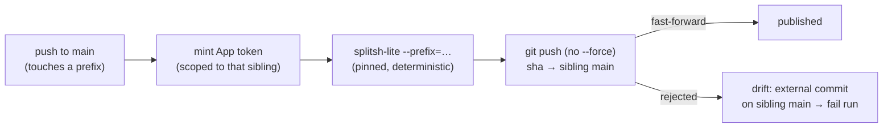

# Design 2140-a: Co-located action sources + bidirectional subtree-split publishing

Spec 2140 moves the five composite actions' canonical source into the monorepo,
publishes each verbatim to its sibling `main` as a deterministic subtree split,
defines a pull-back path for external sibling PRs, and records the pattern as a
`MONOREPO.md` standard. Consumption stays SHA-pinned; no gitlink is introduced.

This design fixes WHICH change-units exist, WHERE the publish boundary sits, and
WHAT keeps sibling `main` a faithful projection. There is no new runtime
architecture — the work is a one-time **lineage seed**, a **deterministic
outbound split**, an **explicit inbound replay**, and a **non-force push** that
makes drift detectable on the next publish.

## Components

| Component                | Where                             | Responsibility                                                                                                                                                                                                    |
| ------------------------ | --------------------------------- | ----------------------------------------------------------------------------------------------------------------------------------------------------------------------------------------------------------------- |
| Action source homes      | the five prefixes in spec § Scope | Canonical, editable action source, mirroring each sibling's whole repo root                                                                                                                                       |
| `seed` (one-time)        | maintainer run                    | Establish the split lineage on each sibling `main` once, replacing the old `main` tip; existing `v1.0.x` tags retain pre-migration history                                                                        |
| `publish-actions.yml`    | `.github/workflows/`              | Outbound: on push to `main` (paths-filtered), split each touched prefix and **non-force** push to its sibling `main`                                                                                              |
| `actions/split-and-push` | `.github/actions/`                | Composite action wrapping split + push, one tested path across the matrix — reuses the **matrix + per-repo App-token pattern** of `publish-skills.yml` (via `publish-skill-pack`), not its content-copy transform |
| Pull-back recipe         | `justfile` (named target)         | Inbound: replay a sibling PR's commits into the prefix as a monorepo PR                                                                                                                                           |

## Outbound: deterministic split, non-force push

`splitsh-lite`, not `git subtree split`. The monorepo history is large and
`git subtree split` re-walks all of it every run; `splitsh-lite` is a
**deterministic** `history → projection` function (the tool Symfony and Laravel
run in CI), **pinned by SHA** so its output commit identities are stable
run-to-run.

Determinism is what makes the published lineage append-only: given the same
monorepo prefix history, `splitsh-lite` re-emits the identical earlier split
commits plus one new commit per new monorepo commit that touched the prefix. So
each run's output is a **superset** of the last — a fast-forward — and the push
needs no `--force`.



- **Matrix** over the five `{prefix, repo}` pairs; the workflow `paths:` gate
  runs it only when an action source is touched (+ `workflow_dispatch`).
  Untouched legs re-split unchanged history and no-op fast-forward — harmless.
- **Auth** reuses `actions/create-github-app-token` (SHA-pinned `# v3`) with
  `repositories: <sibling>` — the per-repo scoping `publish-skills.yml` uses;
  the default `GITHUB_TOKEN` cannot push cross-repo. The App must be installed
  on **all five** sibling repos or that matrix leg fails.
- **Checkout** with `fetch-depth: 0` (split needs full history).
- **No tags.** The workflow mirrors `main`; append-only `v1.0.x` tags stay
  human-gated per `.github/CLAUDE.md`.

## One-time seed

The first publish cannot fast-forward: sibling `main` holds pre-migration
history that is not in the `splitsh-lite` lineage. The seed is the **only**
force update — a maintainer runs the split once, **with the same SHA-pinned
`splitsh-lite` the workflow uses** (a different version emits divergent SHAs and
breaks the very first non-force push), and force-replaces each sibling `main`
with the lineage tip. Pre-migration history is not lost: the existing `v1.0.x`
release tags still point at the old commits, so blame and releases survive.

**Ordering matters:** the seed must precede the first CI publish. The migration
PR therefore lands `publish-actions.yml` disabled (or `workflow_dispatch`-only);
the maintainer seeds all five siblings, then enables the push trigger. A CI push
firing before the seed would be rejected against the pre-migration `main`. After
the seed, every run is a plain non-force push forever.

## Projection invariant — enforced by the push, not by prose

Sibling `main` is always a projection of the monorepo. PRs are reviewed on the
sibling but **never merged there** — they land via replay. The enforcement is
the non-force push itself: the workflow runs
`git push origin <tip>:refs/heads/main` with **no** `+`/`--force`, so a
non-fast-forward is rejected and the non-zero exit fails the run. Because the
lineage is append-only, sibling `main` is normally the previous split tip and
the new split fast-forwards it. If someone merged a commit on the sibling, that
commit is not in the new split, the push is **rejected**, and the run fails. No
durable "last split" record is needed — the remote ref *is* the record.

This guard is **lazy**, not continuous: drift is caught at the next push that
touches that prefix, not the moment it happens. Recovery then needs two steps —
replay the foreign commit into the monorepo (so it is not lost), **and** re-seed
that one sibling (a deliberate force) to drop the orphaned tip from `main`.
Re-seed is the only sanctioned force besides the initial seed.

## Inbound: explicit replay, not `git subtree pull`

External PRs land on the standalone sibling repo. Pull-back replays the PR's
commits **into the prefix**:

```sh
git -C <sibling-clone> format-patch origin/main..<pr-head> --stdout \
  | git am -3 --directory=<prefix>
```

`--directory` rewrites paths into the prefix; `git am` preserves the original
author; `-3` (and `--binary`) handle merge fallback and binary hunks. The result
is a normal monorepo PR under the usual gates; merging it makes the next
outbound split republish the change, closing the sibling PR as "landed via
monorepo #NNN." Failure handling: a sibling PR touching files at the sibling
root maps cleanly; a `git am` conflict aborts (`git am --abort`) and the
maintainer re-applies by hand, and a PR nested under a path the prefix
duplicates is resolved by adjusting `--directory` depth — neither blocks the
happy path criterion 5 verifies.

Native `git subtree pull` is rejected: it depends on subtree-join commits that
`splitsh-lite` never creates (ancestry mismatch → fragile merge-base detection)
and litters the monorepo with merge commits.

```mermaid
sequenceDiagram
  participant E as External PR (sibling)
  participant M as Maintainer / recipe
  participant R as Monorepo PR
  E->>M: format-patch origin/main..pr-head
  M->>R: git am -3 --directory=<prefix> (author preserved)
  R->>R: review gates + merge
  R-->>E: next split republishes; close as landed via #NNN
```

## `MONOREPO.md` standard

A new **optional** top-level concern, distinct from the three shippable and
three support directories: _co-developed action repositories may keep canonical
source in the monorepo, co-located with their owning unit, and publish verbatim
to a sibling via deterministic subtree split._ States the inclusion test —
**only repos with no other home in the monorepo and no publish-time transform**
(skill packs/npm packages are excluded: they transform or already have a home).

## Sibling rename — one debranding pass, redirect-preserving

Four siblings are debranded as a maintainer GitHub repo-rename
(`fit-harness → harness`, `fit-benchmark → benchmark`, `fit-wiki → wiki`,
`fit-bootstrap → bootstrap`); `kata-agent` is untouched. A repo-rename is chosen
over create-new because GitHub auto-redirects the old path, so external
`forwardimpact/fit-*@<sha>` pins and the `v1.0.x` tags keep resolving — no hard
break. The rename precedes the seed, so the seed (and every later publish)
targets the renamed `main`.

The rename is consistent only if every monorepo surface naming a sibling moves
in the same change. Three surface classes carry the names:

| Surface | What repoints |
| --- | --- |
| Workflow `uses:` pins | Every `forwardimpact/fit-{harness,benchmark,wiki,bootstrap}@<sha>` line across `.github/workflows/**` (and the `fit-benchmark` reusable-workflow ref in `eval-kata.yml`) → renamed owner/repo, SHA and `# v1` marker unchanged |
| Enum source + consumers | `.github/CLAUDE.md` § Third-party actions table rows (the `sibling-composite-actions` `md-table` *source*) and the `CLAUDE.md` / `KATA.md` fenced consumer blocks → new names; the `forwardimpact/` filter and `Five` count are unchanged |
| Dependabot | `.github/dependabot.yml` tracks `github-actions` by ecosystem, not by repo name, so no edit is needed; the weekly sweep follows the renamed pins |

Because the CLIs keep their `fit-*` names, each renamed action's source still
invokes its CLI by the unchanged name (e.g. the `wiki` action runs `fit-wiki`);
only the action/repo identity changes.

## Key Decisions

| Decision             | Choice                                                                          | Rejected alternative                                                                                            |
| -------------------- | ------------------------------------------------------------------------------- | --------------------------------------------------------------------------------------------------------------- |
| Track siblings       | Co-located source + split                                                       | Submodule/`vendor/` — gitlink competes with the SHA-pin; unfetchable in single-repo proxy envs                  |
| Publish mechanism    | Verbatim subtree split                                                          | Content-copy (`fit-pack stage`) — loses history, blocks pull-back; right only for transform-needing skill packs |
| Split tool           | `splitsh-lite`, SHA-pinned                                                      | `git subtree split` — re-walks full history each CI run; slower and cache-cold                                  |
| Lineage continuity   | One-time force seed, then non-force forever                                     | Force every push — destroys externally-merged commits and hides drift                                           |
| Drift detection      | The non-force push (rejection = drift)                                          | Ancestry check against a stored "last split" — needs durable state splitsh-lite has not                         |
| Inbound              | Replay via `git am --directory`                                                 | `git subtree pull` — ancestry mismatch with splitsh-lite, merge-commit noise                                    |
| Outbound trigger     | Every push to `main` (continuous mirror)                                        | Tag-only — siblings drift stale between releases                                                                |
| `bootstrap` home | `.github/actions/bootstrap/` (prefix == sibling root; not consumed locally) | A forced `libraries/libbootstrap` — it is CI glue, not a shipped library                                        |
| Action repo names | Debrand to `harness`/`benchmark`/`wiki`/`bootstrap`; keep `kata-agent`; CLIs/npm/skills keep `fit-*`/`kata-*` | Keep `fit-*` action repos — redundant with the `forwardimpact/` owner namespace |

## Verification mapping

| Criterion                          | Where satisfied                                                                                |
| ---------------------------------- | ---------------------------------------------------------------------------------------------- |
| 1 homes populated                  | source move; `benchmark` reusable workflow + `bootstrap` sub-actions inside the prefix |
| 2 faithful projection              | `splitsh-lite` determinism + push                                                              |
| 3 non-force after seed             | § One-time seed + workflow passes no `--force`                                                 |
| 4 consumption unchanged            | no `.gitmodules`; `uses:` `# v1` pins + Dependabot bumps untouched                             |
| 5 authored pull-back               | replay recipe (`git am -3 --directory`) on a synthetic sample                                  |
| 6 drift guarded                    | non-force push rejection (§ Projection invariant)                                              |
| 7 standard documented              | `MONOREPO.md` section + `.github/CLAUDE.md` rewrite                                            |
| 8 suite green over relocated trees | check/test/format/invariant run after the five sources move                                    |
| 9 debranded + repointed            | maintainer repo-rename (redirects) + `uses:`/enum/`.github/CLAUDE.md` repoint; CLIs/npm/skills unchanged |

## Risks

- **Seed force-replace done on the wrong ref → published lineage broken.**
  Mitigation: the seed is a single, reviewed maintainer step; thereafter the
  workflow can never force-push (it passes no `--force`).
- **`splitsh-lite` version drift breaks the fast-forward.** A different binary
  version can emit different commit SHAs, turning the next push into a
  non-fast-forward. Mitigation: pin `splitsh-lite` by SHA; treat a bump as a
  re-seed, staged through security-engineer review per dependency policy.
- **App not installed on every sibling.** With `fail-fast: false` one matrix leg
  fails silently. Mitigation: criterion checks all five publish; document the
  install set.
- **Someone merges a PR on the sibling.** The non-force push is rejected and the
  run fails; recovery is to replay that commit into the monorepo, then
  republish.
- **Reusable-workflow / sub-action paths.** `benchmark`'s
  `.github/workflows/benchmark.yml` and `bootstrap`'s sub-actions must sit
  inside the prefix or consumers break. Mitigation: criterion 1 checks for them.
