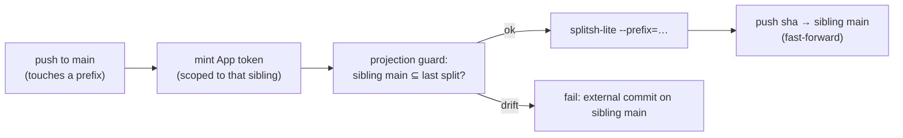

# Design 2140-a: Co-located action sources + bidirectional subtree-split publishing

Spec 2140 moves the five composite actions' canonical source into the monorepo,
publishes each verbatim to its sibling `main` as a history-preserving subtree
split on every push to `main`, defines a pull-back path for external sibling
PRs, and records the pattern as a `MONOREPO.md` standard. Consumption stays
SHA-pinned; no gitlink is introduced.

This design fixes WHICH change-units exist, WHERE the publish boundary sits, and
WHAT keeps sibling `main` a faithful projection. There is no new runtime
architecture — the work is a one-time **history import**, a **stateless outbound
split**, an **explicit inbound replay**, and a **projection invariant** that
makes the two directions safe.

## Components

| Component                | Where                             | Responsibility                                                                                                       |
| ------------------------ | --------------------------------- | -------------------------------------------------------------------------------------------------------------------- |
| Action source homes      | the five prefixes in spec § Scope | Canonical, editable action source, mirroring each sibling's whole repo root                                          |
| `seed-import` (one-time) | local/maintainer run              | `git subtree add` each sibling's history under its prefix so the first publish continues sibling history             |
| `publish-actions.yml`    | `.github/workflows/`              | Outbound: on push to `main` (paths-filtered), split each touched prefix and push to its sibling `main`               |
| `actions/split-and-push` | `.github/actions/`                | Composite action wrapping the split+push step, one tested code path across the matrix (mirrors `publish-skill-pack`) |
| Pull-back recipe         | `justfile` / maintainer doc       | Inbound: replay a sibling PR's commits into the prefix as a monorepo PR                                              |
| Projection guard         | inside `publish-actions.yml`      | Refuse to publish if sibling `main` holds a commit not produced by the monorepo                                      |

## Outbound: stateless split on push to main

`splitsh-lite`, not `git subtree split`. The monorepo history is large and
`git subtree split` re-walks all of it every run; `splitsh-lite` is a
deterministic, cache-friendly `history → projection` function (the tool Symfony
and Laravel run in CI). The split output for a prefix is a pure function of
monorepo history, so re-runs are idempotent and the push is a fast-forward of
the seeded history.



- **Matrix** over the five `{prefix, repo}` pairs, paths-filtered so only
  touched actions republish (+ `workflow_dispatch`).
- **Auth** reuses `actions/create-github-app-token@v3` with
  `repositories: <sibling>` — the exact per-repo scoping `publish-skills.yml`
  uses; the default `GITHUB_TOKEN` cannot push cross-repo.
- **Checkout** with `fetch-depth: 0` (split needs full history).
- **No tags.** The workflow mirrors `main`; append-only `v1.0.x` tags stay
  human-gated per `.github/CLAUDE.md`.

## Inbound: explicit replay, not `git subtree pull`

External PRs land on the standalone sibling repo (the benefit of it being a
real, buildable repo). Pull-back replays the PR's commits **into the prefix**:

```sh
git -C <sibling-clone> format-patch origin/main..<pr-head> --stdout \
  | git am --directory=<prefix>
```

`--directory` rewrites paths into the prefix; `git am` preserves the original
author. The result is a normal monorepo PR under the usual gates; merging it
makes the next outbound split republish the change, closing the sibling PR as
"landed via monorepo #NNN."

Native `git subtree pull` is rejected: it depends on subtree-join commits that
`splitsh-lite` never creates (ancestry mismatch → fragile merge-base detection)
and litters the monorepo with merge commits. Replay keeps one canonical history
and pairs cleanly with a stateless outbound split.

```mermaid
sequenceDiagram
  participant E as External PR (sibling)
  participant M as Maintainer / recipe
  participant R as Monorepo PR
  E->>M: format-patch origin/main..pr-head
  M->>R: git am --directory=<prefix> (author preserved)
  R->>R: review gates + merge
  R-->>E: next split republishes; close as landed via #NNN
```

## Projection invariant

Sibling `main` is always a projection of the monorepo. PRs are reviewed on the
sibling but **never merged there** — they land via replay. With that rule every
outbound push is a fast-forward, so the force-vs-external-commit hazard never
arises. The projection guard enforces it: before pushing, verify sibling `main`
is an ancestor of (or equal to) the freshly computed split; drift means someone
merged on the sibling, and the run fails loudly rather than clobbering.

## `MONOREPO.md` standard

A new **optional** top-level concern, distinct from the three shippable and
three support directories: _co-developed action repositories may keep canonical
source in the monorepo, co-located with their owning unit, and publish verbatim
to a sibling via history-preserving subtree split._ States the inclusion test —
**only repos with no other home in the monorepo and no publish-time transform**
(skill packs/npm packages are excluded: they transform or already have a home).

## Key Decisions

| Decision             | Choice                                          | Rejected alternative                                                                                                        |
| -------------------- | ----------------------------------------------- | --------------------------------------------------------------------------------------------------------------------------- |
| Track siblings       | Co-located source + split                       | Submodule/`vendor/` — gitlink competes with the SHA-pin and is unfetchable in single-repo proxy envs                        |
| Publish mechanism    | History-preserving subtree split                | Content-copy (`fit-pack stage` style) — loses history, blocks pull-back; correct only for the transform-needing skill packs |
| Split tool           | `splitsh-lite`                                  | `git subtree split` — re-walks full history every CI run, cache-cold and slow                                               |
| Inbound              | Replay via `git am --directory` into the prefix | `git subtree pull` — ancestry mismatch with `splitsh-lite`, merge-commit noise                                              |
| Outbound trigger     | Every push to `main` (continuous mirror)        | Tag-only — siblings drift stale between releases                                                                            |
| `fit-bootstrap` home | `.github/actions/fit-bootstrap/`                | A forced `libraries/libbootstrap` — it is CI glue, not a shipped library                                                    |
| Safety model         | Projection invariant + guard                    | Force-push always — silently destroys externally-merged commits                                                             |

## Verification mapping

| Criterion               | Where satisfied                                       |
| ----------------------- | ----------------------------------------------------- |
| 1 homes populated       | seed-import + source move                             |
| 2 faithful projection   | `splitsh-lite` determinism + push                     |
| 3 continuous history    | `git subtree add` seed → fast-forward                 |
| 4 consumption unchanged | no `.gitmodules`; `uses:` pins + Dependabot untouched |
| 5 authored pull-back    | replay recipe (`git am --directory`)                  |
| 6 projection guarded    | projection guard in `publish-actions.yml`             |
| 7 standard documented   | `MONOREPO.md` section + `.github/CLAUDE.md` rewrite   |
| 8 suite green           | unchanged action behavior; workflow lint              |

## Risks

- **Seed import done wrong → first publish force-clobbers the sibling.**
  Mitigation: `git subtree add` from each sibling's current `main` before the
  first run; criterion 3 asserts a fast-forward.
- **`splitsh-lite` supply chain.** It is a third-party binary on the publish
  path. Mitigation: pin by SHA and stage it through the security-engineer review
  the dependency policy already requires.
- **Someone merges a PR on the sibling.** Mitigation: the projection guard fails
  the run; recovery is to replay that commit into the monorepo, then republish.
- **Reusable-workflow / sub-action paths.** `fit-benchmark`'s
  `.github/workflows/benchmark.yml` and `fit-bootstrap`'s sub-actions must sit
  inside the prefix or consumers break. Mitigation: criterion 1 checks for them
  explicitly.
