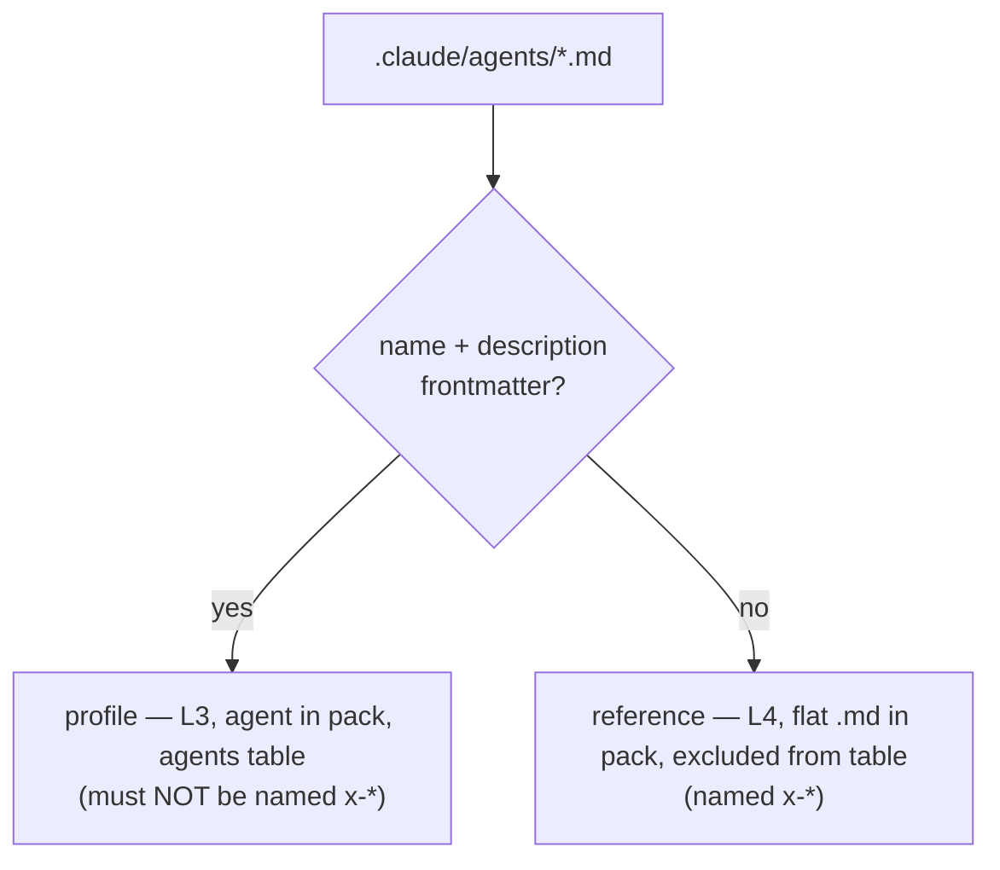
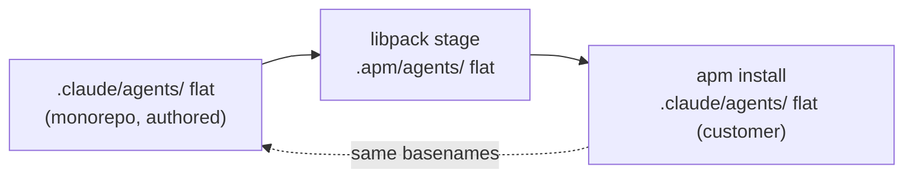

# Design 2150-a: Flatten agent references into `.claude/agents/`

Spec 2150 removes the `.claude/agents/references/` subdirectory so the monorepo
matches what `apm install` already produces: agent references flat in
`.claude/agents/`, as siblings of the profiles, each renamed with an `x-` prefix
(`x-memory-protocol.md`). Agent references stay a distinct L4 entity from L6
skill references; only their **location**, **name**, and **classifier** change.
This design fixes which components carry the classifier, where the links
repoint, and why a single frontmatter test replaces the directory.

The whole change rests on one substitution: the directory `agents/references/`
was a **classifier** — "a file here is a reference, not a profile." APM destroys
that classifier by flattening. The replacement is the test Claude Code's agent
loader already uses: a `.claude/agents/*.md` file is a **profile** if it has
`name`/`description` frontmatter, a **reference** if it does not. Three consumers
that read the directory must adopt the frontmatter test instead.

## Components

| Component | Role | Change |
| --- | --- | --- |
| Reference files | The nine shared L4 protocols | Relocate + rename `agents/references/<n>.md` → `agents/x-<n>.md`; delete the subdir. Their own cross-links repoint to the `x-` siblings |
| Agent profiles (×6) | L3 instruction layer that cites references | Repoint reference links to the flat sibling path, anchors preserved |
| Skill citations | kata-\* / fit-\* skills citing agent references by GitHub URL | Drop the `/references/` path segment from the URL |
| `libpack` stager | Builds the `.apm/agents/` tree for the pack | Partition by frontmatter (below); retire the dedicated references step |
| `libcoaligned` layer model | Assigns each instruction file its layer + length budget | Partition the flat dir by frontmatter; keep L3/L4 layers and budgets |
| Genericity invariant | Enforces published pack content stays repo-portable | Replace the `agents/references/` selector with the relocated coverage |
| `COALIGNED.md` § L4 | Documents the L4 layer | New location + frontmatter classifier; keep L4-vs-L6 distinction |

## The frontmatter classifier (shared interface)

A pure predicate, applied to a `.claude/agents/*.md` file's content:

```
isProfile(file)  := frontmatter has both `name` and `description`
isReference(file) := not isProfile(file)
```

This is not new behavior — it is the rule the runtime loader already applies to
decide what appears as an agent. Both `libpack` and `libcoaligned` move from a
path test to this content test, so all three readers (loader, packer, linter)
agree. References have no frontmatter (they open with a `#` heading), so the
partition is unambiguous for the nine current files and self-correcting for any
future one.

The `x-` filename prefix is a **second, redundant** signal layered on the
authoritative frontmatter test: it makes references obvious to a human reading
the directory and sorts them below the six profiles (all of which begin a–t). It
is not what the tooling classifies on — frontmatter is, because that is what the
loader honors — but the genericity invariant asserts the two never disagree:
every `x-*` file carries no agent frontmatter, and no profile is named `x-*`.
That guard turns a naming slip into a CI failure rather than a mis-loaded agent.



## Data flow — symmetry by construction

The defect is an asymmetry between three representations. Flattening the source
makes all three identical, so the round-trip is the identity:



Today the monorepo node is nested and the install node is flat, so links
authored against the monorepo dangle in the install. With all three flat, one
link form resolves everywhere.

## `libpack` — frontmatter partition

`#stageAgents` currently globs `agents/*.md` and stamps every file
`<stem>.agent.md`, recording each in the agents table. After flattening it would
wrongly treat the nine references as agents. The design:

- `#stageAgents` reads each `agents/*.md`, applies `isProfile`. Profiles stage as
  `<stem>.agent.md` and feed the agents table. References stage as plain
  `<stem>.md` and are excluded from the table.
- `#stageAgentReferences` (the `cp` of `agents/references/`) is **deleted** — the
  references now ride along through the single staging pass. No `references/`
  subdir is created in the pack.

The pack's `.apm/agents/` becomes flat (six `.agent.md` + nine `.md`), which APM
then installs verbatim into a flat `.claude/agents/` — the flatten is now a
no-op because the input is already flat.

## `libcoaligned` — partition one directory, keep two layers

The layer model has `findAgentProfiles` (globs `agents/*.md`) and
`findAgentReferences` (globs `agents/references/`). Both now read the **same**
flat `agents/*.md` and split it with `isProfile`:

- Profiles → L3 layer + budget (unchanged).
- References → L4 layer + budget (unchanged), with the `x-memory-protocol`
  filename keeping its enlarged L4 sub-budget exactly as today.

No layer is removed and no budget changes — the L4 entity persists, selected by
content instead of path. `findAgentReferences`'s directory walk is replaced by a
filter over the profile finder's directory listing, so the two finders share one
`readdir`.

## Link rewrite

Two families collapse to one. Every target ends up as a flat, `x-`-prefixed
sibling:

| Citing surface | Before | After |
| --- | --- | --- |
| Agent profiles (root-relative) | `.claude/agents/references/<n>.md#a` | `.claude/agents/x-<n>.md#a` |
| Agent profiles (relative) | `references/<n>.md#a` | `x-<n>.md#a` |
| Skill citations (GitHub URL) | `…/.claude/agents/references/<n>.md#a` | `…/.claude/agents/x-<n>.md#a` |
| Reference↔reference | `<n>.md` | `x-<n>.md` |

Two completeness oracles, both outside `specs/**`: `rg --hidden
'agents/references/'` returns nothing (the subdir path is gone) and no surviving
link names a reference without the `x-` prefix.

## Genericity invariant

The rule selects published pack content by glob, currently including
`.claude/agents/references/**`. That path disappears. Replace it with
`.claude/agents/**`, which covers the relocated references and the profiles
together — both are pack content that must hold in a repo that installed the
pack, so widening the glob to the whole agents directory is the more faithful
selector, not merely a patch. The same invariant gains the convention guard:
`isProfile(f) ⟺ not named x-*` over `.claude/agents/*.md`, so the visible name
and the loader's verdict can never drift apart.

## Key Decisions

| Decision | Choice | Rejected alternative |
| --- | --- | --- |
| Make the two structures agree | Flatten the monorepo to match APM's output | Patch APM to preserve nesting — no such flag; its integrator derives the target from the stem and discards the directory |
| Reference-vs-profile classifier | Absence of `name`/`description` frontmatter | Keep a directory marker — APM flattens any subdir under agents, so no on-disk directory survives to mark it |
| Make references visible + sort last | `x-` filename prefix as a redundant convention, with an invariant tying it to the frontmatter verdict | Prefix as the *primary* classifier — the loader keys on frontmatter regardless, so a prefixed file with stray frontmatter would still load as an agent; prefix must follow frontmatter, not replace it |
| Keep agent references distinct | Preserve L4 layer + budget, selected by frontmatter | Fold references into a skill's L6 `references/` — would shrink their budget and erase the agent-vs-skill reference distinction the spec requires |
| References in the pack | Flat `<stem>.md` via the one staging pass | Keep `#stageAgentReferences` copying a `references/` subdir — recreates the very nesting APM discards; dead code |
| `libcoaligned` finders | One `readdir`, partitioned by `isProfile` | Two directory globs — the second (`agents/references/`) now matches nothing |
| History | `specs/**` + CHANGELOG immutable | Rewrite old paths — large diff, no value |

## Verification mapping

| Criterion | Where satisfied |
| --- | --- |
| 1 no `references/` dir; files flat | Reference relocation |
| 2 monorepo == install basenames | Data-flow symmetry; libpack flat staging |
| 3 no dangling links | Link rewrite; `rg` oracle |
| 4 libpack partition + clean table | `#stageAgents` frontmatter split; `#stageAgentReferences` deleted |
| 5 libcoaligned budgets incl. memory-protocol | One-dir partition keeping L3/L4 |
| 6 invariant covers references + convention guard | `.claude/agents/**` selector; `isProfile ⟺ not x-*` guard |
| 7 L4 distinct from L6 | layers kept; `COALIGNED.md` § L4 updated |
| 8 all references `x-`, no profile is | naming applied at relocation; convention guard enforces |
| 9 full suite green | every component above |

## Risks

- **A future reference accidentally carries `name`/`description` frontmatter** and
  is mis-classified as an agent (and would load as a subagent). Mitigation: the
  `isProfile ⟺ not x-*` convention guard added to the genericity invariant fails
  CI on exactly this — a prefixed file with frontmatter, or a profile named
  `x-*`. This converts the design's only soft spot into an enforced rule.
- **A citation outside the swept globs** (e.g. a non-`.md` surface) keeps the old
  path. Mitigation: criterion 3's `rg --hidden` oracle spans all files, not only
  the edited ones.
- **`memory-protocol` budget regression** if the filename special-case is dropped
  in the finder rewrite. Mitigation: criterion 5 asserts the enlarged budget
  against the flat path.
