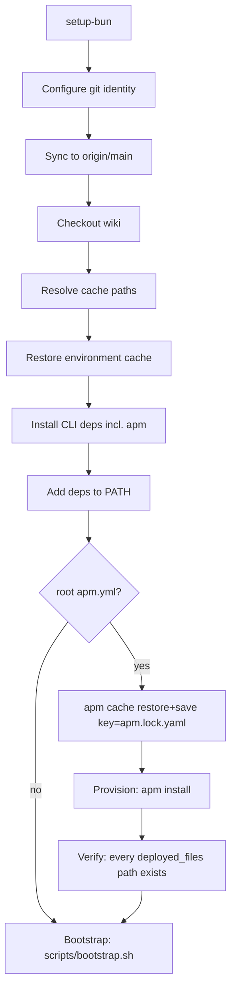
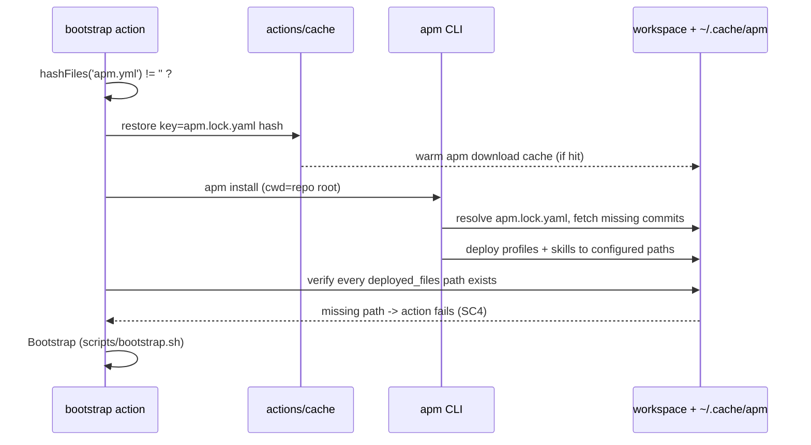

# Design 2160 — Provision declared packs in the bootstrap action

Adds a self-contained, `apm.yml`-gated provisioning unit to the `bootstrap`
composite action so a consuming repo's declared skill and agent packs are
materialized before any later agent step. The unit is inert for repos that
commit their trees (the monorepo) and for repos that declare no root `apm.yml`.

## Restated problem

`.github/actions/bootstrap/action.yml` installs the `apm` CLI but never runs
`apm install`, so a repo that declares its profiles and skills as packs (and
gitignores the materialized trees) has no instruction trees on disk at agent
run time. The action must provision those packs — pinned by `apm.lock.yaml`,
gated on a root `apm.yml`, completing before `scripts/bootstrap.sh` — and stay
exactly as it is today for every other repo.

## Architecture

Provisioning is one cohesive unit added to the existing composite action: an
**apm cache** step, a **Provision packs** step, and a **Verify provisioning**
step, all gated on the presence of a root `apm.yml`. They sit after PATH setup
and before the `Bootstrap` step. No new action inputs; the gate is the file,
not a toggle.

The consuming repo owns deployment shape. The action runs a plain `apm install`
from the repo root; `apm` reads the repo's `apm.yml` and `apm.lock.yaml` and
deploys profiles and skills to the paths it records under `deployed_files`
(auto-detected, or from `apm.yml targets:`). For an `apm_package` dependency
`apm` deploys the agent profiles itself — a consumer lockfile lists each
`.claude/agents/<name>.md` under `deployed_files` (verified against the
reference consumer's `apm.lock.yaml`). The action never post-processes the
deployed tree.

## Components

| Component | Where | Responsibility |
| --- | --- | --- |
| Provisioning gate | `if: hashFiles('apm.yml') != ''` on the three new steps | Declarative no-op for repos without a root `apm.yml`; never runs a bare `apm install` (SC2). |
| apm cache | new `actions/cache` step | Restores/saves `apm`'s content-addressed download cache (`~/.cache/apm`), keyed on `apm.lock.yaml`, so warm runs reuse checkouts (SC5). |
| Provision packs | new composite `run` step | Runs `apm install` from the repo root; deploys profiles + skills (SC1). |
| Verify provisioning | new composite `run` step | Asserts every `deployed_files` path in `apm.lock.yaml` now exists; exits nonzero if any is missing (SC4). |
| `apm` CLI | already installed by `fit-install.sh` | Resolves packs against `apm.lock.yaml` `resolved_commit` (SC3) and deploys profiles + skills (its `deployed_files`) per the repo's `apm.yml`. |

## Interfaces

- **Gate** — `hashFiles('apm.yml')` matches only the workspace-root file (no
  `**`), returning `''` for any repo without a root `apm.yml`, so the step `if:`
  skips all three new steps with no shell invoked.
- **apm cache location** — `actions/cache` names `~/.cache/apm`, `apm`'s default
  cache root on the Linux runner (it holds the git repository db and checkouts,
  content-addressed by commit). `actions/cache` expands the `~` itself, so no
  env var is set and the path needs no shell expansion.
- **Provision command** — `apm install`, working directory at the repo root. No
  `--target`; the repo's `apm.yml` (`targets:`, or auto-detected from a harness
  marker such as `.claude/`/`CLAUDE.md`) decides deploy paths.
- **Failure contract** — `apm install` exits `0` even when a pack fails to
  resolve (verified), so the exit code cannot gate the run. The Verify step
  reads `apm.lock.yaml`'s `deployed_files` and fails the action when any listed
  path is absent — covering both an unresolved pack and a deploy that resolved
  no target. The run never reaches `scripts/bootstrap.sh` with a partial
  environment.

## Key Decisions

| Decision | Choice | Rejected alternative |
| --- | --- | --- |
| Where provisioning lives | In `bootstrap`, the action every workflow already calls and `kata-agent` delegates to. | A new step in `kata-agent`/`harness` — duplicates the gate across actions; spec scopes this to `bootstrap`. |
| Provisioning gate | File presence via `hashFiles('apm.yml')` in step `if:`. | A boolean action input — spec excludes an opt-in toggle; an input can disagree with reality and the file is the real signal. |
| Deploy mechanism | Plain `apm install`; let the repo's `apm.yml`/`apm.lock.yaml` drive paths and `apm` deploy profiles itself (its `deployed_files` for an `apm_package` dep include `.claude/agents/`). | Replicate the benchmark installer's manual `apm_modules/**/agents/` staging — that staging exists for a `skill_bundle` dep that deploys skills only; for `apm_package` deps it is redundant and couples `bootstrap` to `apm` internals. |
| Cache isolation | A separate `apm.yml`-gated `actions/cache` for `~/.cache/apm`, keyed on `apm.lock.yaml`. | Fold `apm.lock.yaml` into the existing env-cache key — a pack bump would needlessly drop `node_modules`/`generated`; gating keeps the apm concern inert for non-apm repos. |
| Re-download avoidance | Rely on `apm`'s content-addressed cache (git db + checkouts by commit); always run `apm install` on a warm cache (cheap local deploy). | Skip `apm install` on a cache hit — the deployed trees live in the (uncached) workspace, so they must be re-deployed every run. |
| Failure detection | Verify every `deployed_files` path exists after install. | Trust `apm install`'s exit code — verified it exits `0` on an unresolvable pack, so the run would continue with a partial environment, violating SC4. |

## Data flow

## Success criteria coverage

| # | Met by |
| --- | --- |
| 1 | Provision step runs `apm install` before the `Bootstrap` step; profiles + skills land at their configured paths. |
| 2 | `hashFiles('apm.yml') != ''` gate skips both steps; no bare `apm install`, so no `apm.yml` is auto-created. |
| 3 | `apm install` resolves against `apm.lock.yaml`; deployed commits match each `resolved_commit`. |
| 4 | Verify step fails the action when any `deployed_files` path is missing (`apm install` itself exits `0` on failure). |
| 5 | Separate cache keyed on `apm.lock.yaml` + `apm`'s content-addressed checkouts: unchanged lock reuses, changed lock re-provisions. |

## Clean break and scope

The action gains steps; it removes nothing and wraps nothing in a fallback. The
monorepo (commits its trees, no root `apm.yml`) and any non-apm consumer take
the gate's `no` branch and behave exactly as before — no shim, no compat path.
MCP-server provisioning, the consumer's commit-vs-declare choice, and changes to
`kata-agent`/`harness`/`wiki` stay out of scope per the spec.
