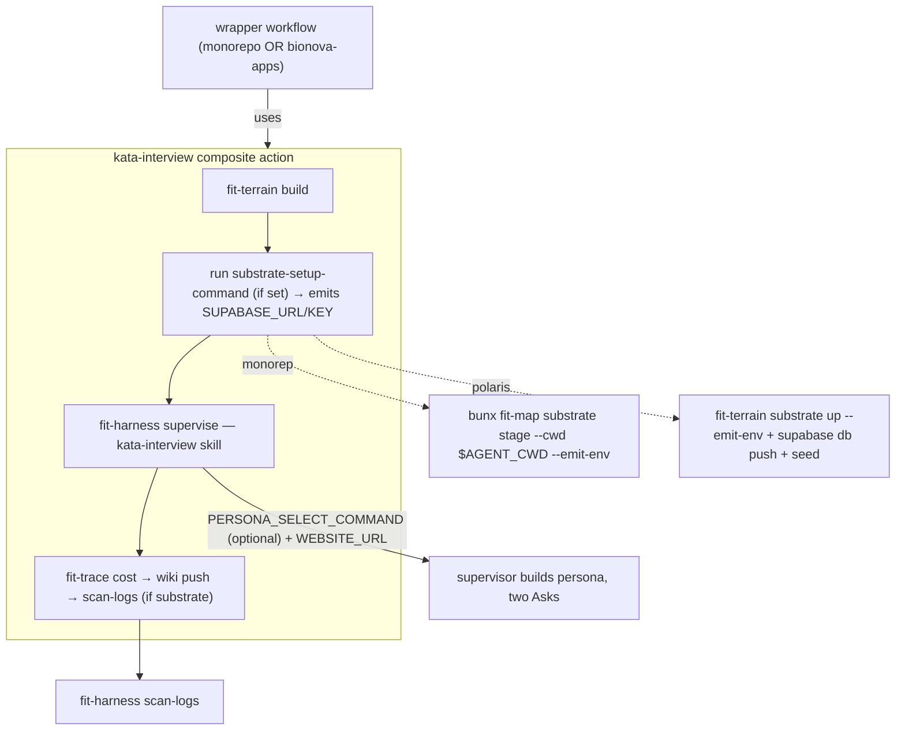

# Design 2170: Reusable interview action + generic substrate verb

Restates spec 2170: extract the switching-interview capability into a published
composite action, and give the generic Supabase bring-up a home in `fit-terrain`
so a different-domain Supabase app (Polaris) can interview itself — not just
repos running the full FI stack.

## The seam (revision)

The prior draft hardcoded `fit-map substrate stage` as the "generic" substrate
step. It is not generic: `fit-map` is an FI product whose stage knows the map
schema, roster invariants, and Landmark smoke, and whose phases share
in-process env with a map client. Polaris cannot use it. Two layers:

- **Generic Supabase bring-up** (opinionated: the consumer uses Supabase) —
  start the stack, discover the URL, emit env. Every Supabase-backed consumer
  needs exactly this. → **add** a `fit-terrain substrate up` verb (`fit-terrain`
  is generic, already Supabase-aware, already on PATH in the action).
- **FI persona + seed layer** — the map-schema seed, `auth.users` provision,
  roster `pick`, JWT `issue`, Landmark smoke. → **stays in `fit-map`**, invoked
  through a *pluggable* action command so Polaris substitutes its own.

We **add** rather than **move**: relocating `fit-map`'s stage into `fit-terrain`
would close a `libterrain → @forwardimpact/map → libterrain` dependency cycle
(libterrain already depends on map), break the in-process env its map client
reads, and disrupt `activity.js`'s use of the shared spawner. So `fit-terrain
substrate up` is a clean generic primitive; `fit-map substrate stage` keeps its
richer pipeline and only gains an `--emit-env` output. Convergence (map stage
delegating to the verb once the spawner is extracted to a lower shared library)
is future work, out of scope.

## Components

| Component | Location | Purpose |
| --- | --- | --- |
| `kata-interview` action | `products/kata/actions/kata-interview/action.yml` | Composite action; orchestration + generic infra, domain steps delegated to injected commands |
| Action README | `products/kata/actions/kata-interview/README.md` | Input/output contract for external consumers |
| Generic substrate | `libraries/libterrain/` (`fit-terrain substrate up`) | Supabase bring-up: `start` → discover → `--emit-env`. Own thin, cwd-explicit spawner. No schema/migration knowledge |
| FI emit hook | `products/map/src/commands/substrate-stage.js` | Existing phases unchanged; gains an `--emit-env` output after `url-discovery` |
| Log secret scan | `libraries/libharness/` (`fit-harness scan-logs`) | Scan a run's log archive for secret literals; fail closed |
| Workflow wrapper | `.github/workflows/kata-interview.yml` | Thin wrapper; supplies FI substrate + persona commands; keeps `concurrency` + job `timeout-minutes` |
| Skill parameterization | `.claude/skills/kata-interview/{SKILL.md,references/job-handoff.md}` | Read `WEBSITE_URL`; run the injected persona-select command instead of hardcoding `fit-map` |
| Reference wiring | `references/bionova-apps/` | Document Polaris supplying its own substrate command + anonymous access |

## Architecture



## Action interface

Shared `kata-agent` knobs (`app-id`, `app-private-key`, `anthropic-api-key`,
`app-slug`, `max-turns`, `timeout-minutes`, `allowed-tools`, `killswitch`) plus:

| Input | Required | Role |
| --- | --- | --- |
| `website-url` | yes | Entry point handed to the persona agent in Ask 2 |
| `product`, `job`, `task-amend` | no | Selection + steering, as today |
| `substrate-setup-command` | no | Shell command that brings up the substrate and emits `SUPABASE_URL`/`SUPABASE_ANON_KEY` to `$GITHUB_ENV`. Non-empty ⇒ the substrate path (bring-up + post-run scan). Empty ⇒ file-only interview. |
| `persona-select-command` | no | Command the supervisor runs to seal a persona + stash a JWT. Empty ⇒ persona from `story.dsl` / anonymous access. |
| `jwt-secret`, `service-role-key` | no | Substrate secrets, forwarded to the setup/persona commands only when the substrate path is active |

Composite actions cannot read `secrets.*`, declare `concurrency`, or set a job
`timeout-minutes` — so secrets arrive as inputs and the last two stay on the
wrapper. Outputs pass through the harness `trace-file`/`trace-dir`. The action
sets `WEBSITE_URL` and (when set) `PERSONA_SELECT_COMMAND` into the run env.
Substrate steps and the scan gate on `inputs.substrate-setup-command != ''` — no
`product == 'landmark'` literal anywhere.

## CLI verb interfaces

| Verb | Signature | Behaviour |
| --- | --- | --- |
| `fit-terrain substrate up` (new) | `--cwd <dir> --emit-env <path>` | Opinionated Supabase bring-up: `supabase start` (from `<cwd>`), parse `status --output json`, append `SUPABASE_URL=`/`SUPABASE_ANON_KEY=` to `<path>`. Migration/seed are the consumer's concern — this verb only brings up + discovers. |
| `fit-map substrate stage` | add `--emit-env <path>` | Phases unchanged; after `url-discovery`, also append the two lines to `<path>`. No delegation, no spawner move. `pick`/`issue` unchanged. |
| `fit-harness scan-logs` | `--archive <zip>` \| `--run-id <id> --repo <owner/repo>`; repeatable `--secret <label>=<literal>` | Resolve/extract the archive (download via `gh` for `--run-id`), scan for each literal, `FAIL: <label> literal in run logs` per hit, non-zero on any hit, fail closed on unreadable archive. |

`fit-terrain substrate up` carries its own minimal Supabase spawner (start +
status via `runtime.subprocess`), taking `cwd` explicitly rather than resolving
a package root — so it is portable to Polaris' checkout. `libterrain` already
declares `@supabase/supabase-js`; nothing moves out of `products/map`.

## Persona selection (pluggable)

The skill's Step 3a stops calling `fit-map` directly. The supervisor runs
`$PERSONA_SELECT_COMMAND` when set: it must seal identity into `$AGENT_CWD` and
stash a bare JWT for the post-run scan — the contract `fit-map substrate issue`
already satisfies (it writes `.env` + `.substrate.json` at `--cwd` and a bare
JWT at `--stash`; the FI command chains `pick` → `issue --stash`). When unset,
the supervisor builds identity from `story.dsl` and issues no JWT. `WEBSITE_URL`
handling in Ask 2 is unchanged from the merged design.

## Key Decisions

| Decision | Chosen | Rejected | Why |
| --- | --- | --- | --- |
| Generic substrate | **Add** `fit-terrain substrate up` (bring-up + emit only) | **Move** `fit-map substrate stage` into `fit-terrain` | A move closes a `libterrain → map` cycle, breaks the map client's in-process env, and disrupts `activity.js`; adding a clean primitive avoids all three and still gives Polaris a generic bring-up. |
| Bring-up scope | Start + discover + emit only | Also apply migrations/seed | Migrations and seed are schema-specific (map vs Polaris, different dirs); keeping them in the consumer's command keeps the verb truly generic. |
| Domain substrate | Injected `substrate-setup-command` | Hardcode `fit-map substrate stage` | The FI seed/provision/smoke is product-specific; Polaris supplies `fit-terrain substrate up` + `supabase db push` + its seed. |
| Persona selection | Injected `persona-select-command`, `fit-map issue` contract | Hardcode `fit-map` in the skill | Persona invariants are FI-only; the `.env`/`.substrate.json`/stash contract lets Polaris substitute or omit it. |
| `scan-logs` home | `fit-harness` | `fit-trace` | A GH log archive is not an NDJSON trace; scanning a run's own output is a run-lifecycle concern. |

## Data flow — substrate interview

```text
bootstrap installs CLIs + supabase
  → fit-terrain build                              (synthetic data)
  → run $substrate-setup-command                   (emits SUPABASE_URL/ANON_KEY → $GITHUB_ENV)
       monorepo: bunx fit-map substrate stage --cwd $AGENT_CWD --emit-env $GITHUB_ENV
       polaris:  fit-terrain substrate up --cwd . --emit-env $GITHUB_ENV && supabase db push && <embed>
  → fit-harness supervise (skill; WEBSITE_URL + PERSONA_SELECT_COMMAND in env)
       supervisor runs $PERSONA_SELECT_COMMAND (if set) → seals persona + stashes JWT
  → fit-trace cost → wiki push
  → fit-harness scan-logs --run-id … --repo … --secret persona-jwt=… --secret …
```

File-only interview (`substrate-setup-command` empty): setup, persona command,
and scan are skipped; persona built from `story.dsl` as today.

## Reference-app wiring

`references/bionova-apps/` documents (prose, not a monorepo workflow) a Polaris
`interview.yml` wrapping `forwardimpact/kata-interview@<sha>` with `website-url`
= the Polaris entry point and `substrate-setup-command` = `npx fit-terrain
substrate up --cwd . --emit-env "$GITHUB_ENV"` followed by Polaris' own
`supabase db push` + embed seed. Patient interviews use anonymous access (no
`persona-select-command`); staff interviews pass a Polaris persona command. It
needs no `fit-map` and no map schema.

## Test strategy

- **`fit-terrain substrate up`** — unit test with a stubbed Supabase spawner
  asserts `--emit-env` writes both `KEY=value` lines from a stubbed `status`.
- **`fit-map substrate stage --emit-env`** — test asserts the two lines are
  written after `url-discovery`, with the existing phases stubbed.
- **`fit-harness scan-logs`** — hit (non-zero), clean (zero), unreadable
  archive (fail closed).
- **Shape test** — on `action.yml`, substrate steps + the scan gate on
  `substrate-setup-command != ''`, no `product == 'landmark'`; on the wrapper,
  the interview job's `timeout-minutes < 60`.
