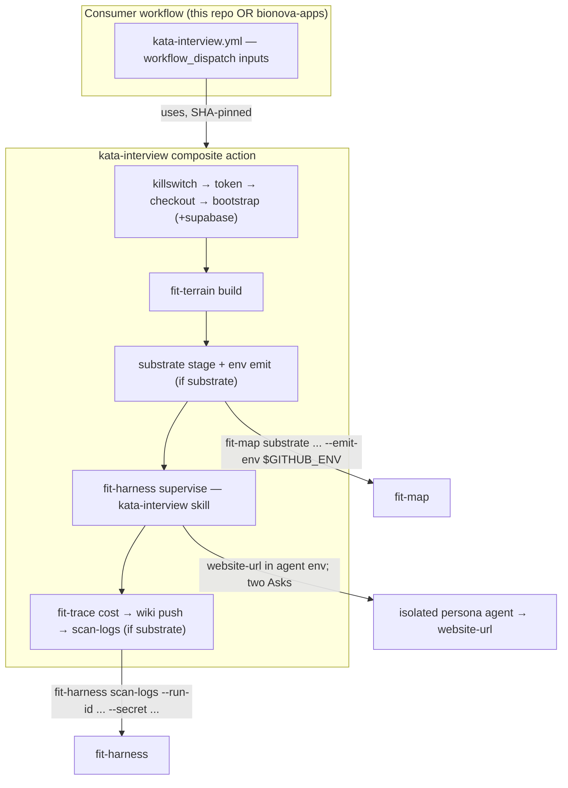

# Design 2170: Reusable interview action + CLI split

Restates spec 2170: extract the generic switching-interview infrastructure into
a published composite action, push its two untested inline-bash blocks into
tested verbs on `fit-map` and `fit-harness`, parameterize the entry point, and
reduce the workflow to a wrapper — so an external consumer (Polaris) can run its
own interview.

## Components

| Component | Location | Purpose |
| --- | --- | --- |
| `kata-interview` action | `products/kata/actions/kata-interview/action.yml` | Composite action owning generic interview infra; published by subtree split, consumed SHA-pinned |
| Action README | `products/kata/actions/kata-interview/README.md` | Input/output contract for external consumers |
| Supabase-env emit | `products/map/src/commands/substrate-stage.js` (dispatched via `products/map/bin/dispatch-substrate.js`) | Emit `SUPABASE_URL`/`SUPABASE_ANON_KEY` as env-file lines |
| Log secret scan | `libraries/libharness/` (`fit-harness scan-logs`) + `libraries/libharness/src/commands/` | Scan a run's log archive for secret literals; fail closed |
| Workflow wrapper | `.github/workflows/kata-interview.yml` | Thin `workflow_dispatch` wrapper; passes inputs to the action and retains `concurrency` + job `timeout-minutes` (a composite action cannot declare either) |
| Shape test | `.github/workflows/test/kata-interview-shape.test.js` | Assert generic substrate gating + sub-60 timeout |
| Skill parameterization | `.claude/skills/kata-interview/{SKILL.md,references/job-handoff.md}` | Read entry-point URL from env, not hardcoded |
| Reference wiring | `references/bionova-apps/` | Document a Polaris interview workflow wrapping the action |

## Architecture



## Action interface

Inputs mirror `kata-agent` for the shared knobs (`app-id`, `app-private-key`,
`anthropic-api-key`, `app-slug`, `max-turns`, `timeout-minutes`,
`allowed-tools`, `killswitch`) and add the interview-specific ones:

| Input | Required | Role |
| --- | --- | --- |
| `website-url` | yes | Entry point handed to the persona agent in Ask 2 |
| `product` | no | Product to interview; empty lets the supervisor pick |
| `job` | no | JTBD goal to test; empty lets the supervisor pick |
| `task-amend` | no | Steering appended to the task prompt |
| `substrate` | no (default `false`) | Whether to bring up the Supabase substrate + run the post-run secret scan |
| `substrate-force-empty-corpus` | no | CI assertion toggle for the empty-corpus failure path (renames the workflow's current `empty-corpus-test` input for the substrate-generic vocabulary) |
| `jwt-secret`, `service-role-key` | no | Substrate secrets, forwarded only when `substrate` |

Composite actions cannot read `secrets.*` (`.github/CLAUDE.md`), so
`jwt-secret`/`service-role-key` are **inputs** the wrapper passes from its own
`secrets.*` — this is why the substrate secrets become action inputs rather than
being read internally. Outputs pass through the harness
`trace-file`/`trace-dir`. The action sets `WEBSITE_URL` (and, under substrate,
`SUPABASE_URL`/`SUPABASE_ANON_KEY` via `$GITHUB_ENV`) into the run environment;
the supervisor reads `WEBSITE_URL` when composing Ask 2. Substrate steps and the
secret scan are gated on `inputs.substrate == 'true'`, replacing every
`product == 'landmark'` literal.

## CLI verb interfaces

| Verb | Signature | Behaviour |
| --- | --- | --- |
| `fit-map substrate stage` | add `--emit-env <path>` | After the `url-discovery` phase, append `SUPABASE_URL=<url>` and `SUPABASE_ANON_KEY=<key>` lines to `<path>`; the action points it at `$GITHUB_ENV`. Removes the workflow's inline `supabase status --output json` + `python3`. |
| `fit-harness scan-logs` | `--archive <zip>` \| `--run-id <id> --repo <owner/repo>`; repeatable `--secret <label>=<literal>` | Resolve a log archive (download via `gh` when `--run-id`), scan every entry for each non-empty secret literal, print `FAIL: <label> literal in run logs` per hit, exit non-zero on any hit; fail closed if the archive cannot be read. |

`--emit-env` reuses the URL already parsed in the `url-discovery` phase, so no
second `supabase status` call. `scan-logs` takes secret literals as inputs
(never reads them from a fixed env name) so it is generic to any run; the action
passes the persona JWT (from the `--stash` file), `jwt-secret`, and
`service-role-key`.

## Interview run wiring

The action calls the harness `supervise` mode exactly as the workflow does today
(`lead-profile: product-manager`, `supervisor-cwd: .`, `agent-cwd` = the staged
temp dir, `IS_SANDBOX=1`, `task-text` = "Run the `kata-interview` skill"). The
killswitch moves into the action as its first composite step (as `kata-agent`
does); `concurrency` and the job `timeout-minutes` stay on the wrapper workflow,
which a composite action cannot declare. The other additions are `WEBSITE_URL`
on the run env and the generic substrate gating. The skill's Step 5 reads
`WEBSITE_URL` from the environment; the `job-handoff` reference's Ask 2 template
and both worked examples use that value instead of the literal
`https://www.forwardimpact.team`. When unset (never, from the action), the skill
errors rather than inventing a URL.

## Key Decisions

| Decision | Chosen | Rejected | Why |
| --- | --- | --- | --- |
| Split seam | `fit-map` owns Supabase-env emit; `fit-harness` owns log scan | One new `fit-interview` CLI / `libinterview` | Each block already has a domain owner; a new package would need to join the gear bundle and duplicate substrate/run ownership. Splitting keeps each verb beside the lifecycle it belongs to. |
| Substrate gating | Generic `substrate` boolean input | Keep `product == 'landmark'` | The product-name predicate is monorepo-only; Polaris is substrate-backed but not named "landmark". A boolean makes the action reusable and keeps the shape invariant meaningful. |
| Entry point | `website-url` input → `WEBSITE_URL` env → skill reads it | Hardcode per-consumer skill fork; or a skill config file | An env var threads cleanly from action input to the supervisor with no new file; the skill stays a single published artifact. A per-consumer fork defeats reuse. |
| Publish path | Subtree-split sibling, SHA-pinned — one new `publish-actions.yml` matrix entry + path filter | Reference the action by local path only | Consumers are *other repos* (Polaris); only a published sibling is consumable cross-repo. The mechanism already ships `kata-agent`, so this reuses it rather than inventing one. |
| `scan-logs` input model | Secret literals passed as `--secret` args | Read a fixed env var (`JWT_SECRET`, …) | Passing literals keeps the verb generic and unit-testable against a fixture archive with no CI secrets; the action supplies the three literals. |
| `scan-logs` home | `fit-harness` | `fit-trace` | The GH log archive is not an NDJSON trace; scanning a run's own output for leaked secrets is a run-lifecycle concern `fit-harness` already owns. |
| `fit-map` on PATH | Keep the documented `bunx fit-map` exception | Move `fit-map` into the gear bundle | Out of scope; `fit-map` ships in the `map@v*` release. The action documents the exception exactly as the workflow does today. |

## Data flow — substrate interview

```text
bootstrap installs CLIs + supabase
  → fit-terrain build                         (synthetic data)
  → fit-map substrate stage --cwd $AGENT_CWD --emit-env $GITHUB_ENV
       (init→stack→url-discovery→migrate→seed→provision→smoke;
        SUPABASE_URL/SUPABASE_ANON_KEY appended to $GITHUB_ENV)
  → supervisor: fit-map substrate pick / issue --stash $RUNNER_TEMP/.persona-jwt
  → fit-harness supervise (kata-interview skill; WEBSITE_URL in agent env)
  → fit-trace cost → wiki push
  → fit-harness scan-logs --run-id $RUN_ID --repo $REPO \
       --secret <persona-jwt> --secret <jwt-secret> --secret <service-role-key>
```

For a non-substrate interview (`substrate: false`), the substrate stage,
env emit, `pick`/`issue`, and `scan-logs` steps are skipped; the persona is
built from `story.dsl`/`prose-cache.json` as today.

## Reference-app wiring

`references/bionova-apps/` gains, in its spec/design prose (not a monorepo
workflow), a documented `interview.yml` that wraps
`forwardimpact/kata-interview@<sha>` with `website-url` = the Polaris entry
point, `substrate: true`, and Polaris' `JWT_SECRET`/`SERVICE_ROLE_KEY`. Because
Polaris already vendors `story.dsl` and runs `fit-terrain build`, the action's
build + substrate + scan path applies unchanged. The interview needs none of
spec 1160's `--output-root` prerequisite: it stages synthetic data into a temp
`agent-cwd`, not the app tree, so the `rm -rf`-on-project-root hazard that flag
addresses never arises here.

## Test strategy

- **`fit-map` emit** — unit test asserts `--emit-env <tmp>` writes the two
  `KEY=value` lines from a stubbed status source.
- **`fit-harness scan-logs`** — unit test builds a fixture archive, asserts
  non-zero + `FAIL:` line on a planted literal and zero on a clean archive, and
  asserts fail-closed on an unreadable archive.
- **Shape test** — parses both files: on `action.yml`, substrate-only steps and
  substrate-selecting env keys carry the `substrate` predicate and no
  `product == 'landmark'` literal appears; on the wrapper workflow, the
  interview job's `timeout-minutes < 60`.
