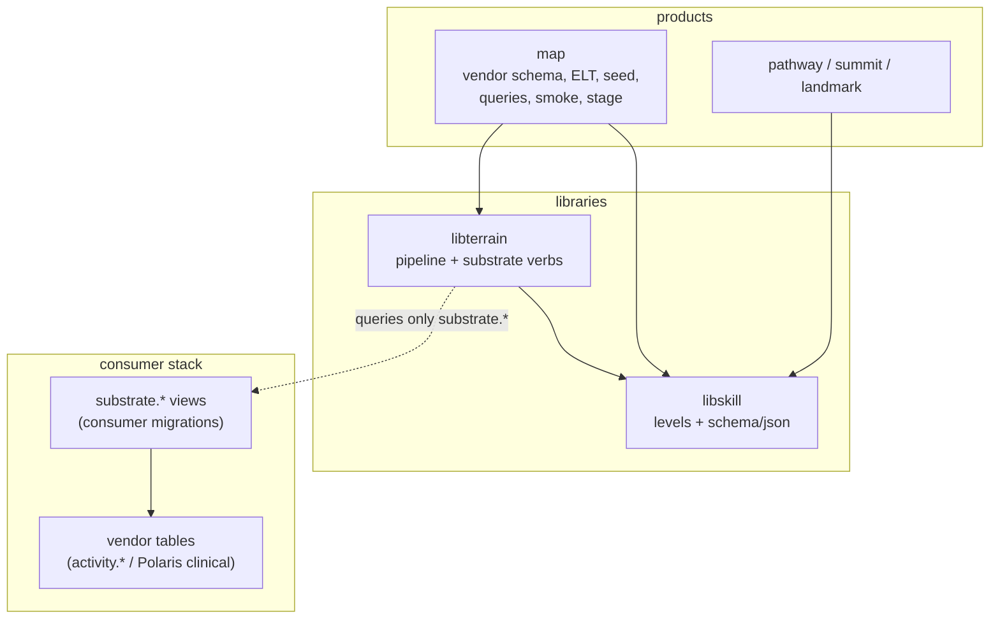

# Design 2180: Generic substrate contract

Restates spec 2180: move the standard's data contract (levels module + JSON
schemas) from `map` into `libskill`, and move the substrate identity verbs
(provision, pick, roster, issue) from `fit-map` into `fit-terrain`, rewritten
against a documented **Substrate Contract** of consumer-defined views. One clean
break: no re-export shims, no deprecated wrappers, no dual paths. Vendor
schema, transforms, seed, read queries, and the Landmark smoke stay in `map`.

## Components

| Component | Location | Purpose |
| --- | --- | --- |
| Standard contract | `libraries/libskill/` (`./levels`, `./schema/json/*` exports) | Canonical home of the levels type/enum module and the thirteen JSON schemas; `libskill` stops importing `map` |
| Substrate verbs | `libraries/libterrain/` (`fit-terrain substrate init\|check\|provision\|pick\|roster\|issue`) | Generic identity capability driven by the contract; plus existing `up` from spec 2170 |
| Substrate client | `libraries/libterrain/` | Supabase client factory bound to the `substrate` Postgres schema, built from documented env vars |
| Contract guide | `websites/fit/docs/` (library guide) | Normative documentation: relations, columns, auth model, env vars, degradation semantics |
| Map contract views | `products/map/supabase/migrations/` | New migration defining `substrate.people/evidence/discovery` over `activity.*`; `config.toml` exposes `substrate` |
| Map remainder | `products/map/` | Exports pruned; `substrate pick`/`issue`/`roster` + `people provision` deleted; `substrate stage`, the Landmark smoke, and `auth issue` consume the moved capabilities from `libterrain` |
| Workflow wiring | `.github/workflows/kata-interview.yml` | `persona-select-command` switches to `fit-terrain substrate pick`/`issue` |
| Skill wiring | `.claude/skills/fit-terrain/`, `.claude/skills/fit-map/` | fit-terrain skill documents the substrate verbs and links the contract guide; fit-map skill drops the moved verbs |
| Reference wiring | `references/bionova-apps/` | Polaris documents `up → init → migrate/seed → check → provision → pick → issue` |

## Architecture



The dependency arrows are the deliverable: after the change `rg
'@forwardimpact/map' libraries/` is empty, and `map → libterrain` is the only
new edge (product depending on library).

## Substrate Contract (normative)

- **Namespace** — a Postgres schema `substrate`, listed in the consumer's
  Supabase `api.schemas`. Terrain's client sets `db.schema = "substrate"` and
  never names another schema.
- **Relations** — implemented as views (or tables) by the consumer:

| Relation | Required | Columns |
| --- | --- | --- |
| `substrate.people` | yes | `email` (unique), `name`, `kind` (`human` rows are personas), `manager_email`, `team_id`, `team_name`, `discipline`, `level`, `track` |
| `substrate.evidence` | optional | `email` — one row per authored evidence item |
| `substrate.discovery` | optional | `key`, `value` — navigation ids copied into `.substrate.json` |

- **Auth model** — Supabase auth with email identities; product RLS keys on
  `auth.email()`; provisioning and picking use the service-role key.
- **Env vars** — `SUPABASE_URL`, `SUPABASE_SERVICE_ROLE_KEY` (every
  stack-facing verb; `init` is an offline scaffold and needs neither),
  `JWT_SECRET` (`issue` only — the name the shared libconfig resolver and
  the kata-interview action already use, so no mapping step exists
  anywhere).
- **Degradation** — declared, not silent: `check` reports optional relations
  as absent (info, not failure); `pick` without `substrate.evidence` drops the
  evidence invariants and reports which invariants applied in its payload;
  `issue` without `substrate.discovery` writes an identity-only
  `.substrate.json`.

## CLI verb interfaces

| Verb | Signature | Behaviour |
| --- | --- | --- |
| `substrate init` | `--cwd <dir>` | Write one timestamped starter migration into `<cwd>/supabase/migrations/`: `CREATE SCHEMA substrate`, grants, and commented example views the consumer edits to map its own tables |
| `substrate check` | none beyond env | Column-explicit probe of each contract relation via the API; one diagnostic per missing/malformed relation; non-zero only when a **required** relation fails |
| `substrate provision` | none beyond env | Reconcile `auth.users` against `substrate.people` emails: create missing, restore banned, decommission removed (current `people provision` semantics, requeried against the contract) |
| `substrate pick` | `--format json\|text`, `--memory <path>`, `--memory-window <n>` | Current pick semantics against contract relations: structural invariants (has manager, manages ≥1; evidence invariants when `substrate.evidence` exists), diversified against `--memory` when supplied — reading the window and appending the pick on success, so cross-run diversification carries over (stateless when omitted); `--memory-window` generalizes the previously hardcoded window of 5. Enrichment reads the synthetic story artifacts (`story.dsl`, `prose-cache.json`) resolved from the working directory's data root; absent artifacts yield the structural persona fields un-enriched |
| `substrate roster` | `--format json\|text` | List every invariant-satisfying persona (operator surface over the same persona query as `pick`) |
| `substrate issue` | `--email <e> --cwd <p> --token-env <NAME>` `[--ttl <d>] [--stash <path>]` | Mint JWT via shared secret; write `<NAME>=<jwt>` to `.env`, discovery key/values + `persona_email`/`manager_email`/`generated_at` to `.substrate.json`, bare JWT to `--stash`; atomic, mode 0600 — same file set, fields, and modes as spec 2170 |

`--token-env` is required — there is no default token name, so no product
literal can survive in the library. The FI wrapper passes
`--token-env PRODUCT_LANDMARK_TOKEN` and
`--memory wiki/kata-interview/picks.csv`.

## Data flow — interview persona path (FI wiring)

```text
substrate-setup-command:  bunx fit-map substrate stage --cwd $AGENT_CWD --emit-env $GITHUB_ENV
   stage phases: init → copy-activity → stack → url-discovery → migrate
                 → seed → provision (imported from libterrain) → smoke
persona-select-command:   fit-terrain substrate pick --format json --memory wiki/kata-interview/picks.csv
                          fit-terrain substrate issue --email <picked> --cwd $AGENT_CWD
                            --token-env PRODUCT_LANDMARK_TOKEN --stash $RUNNER_TEMP/.persona-jwt
```

Polaris wiring: `fit-terrain substrate up --emit-env` → its own
`supabase db push` (starter migration from `init`, edited, plus clinical
schema) → its own seed → `check` → `provision` → `pick`/`issue` with a
Polaris `--token-env`. No `fit-map`, no map schema.

## Key Decisions

| Decision | Chosen | Rejected | Why |
| --- | --- | --- | --- |
| Schema home | `libskill` hosts levels + JSON schemas | New `libstandard` package below `libskill` | `libskill` is already "the standard made queryable"; a data-only package adds a publish unit for no consumer benefit |
| Migration strategy | Clean break: map exports removed, all imports repoint, verbs deleted | Re-export shims + deprecated wrappers | Spec mandate; shims keep the old graph alive and every future reader pays for it; internal consumers are all in-repo, external ones take a version bump |
| Contract form | Fixed-name views in a dedicated `substrate` schema | Configurable relation names; terrain-owned tables | One documented shape is the product ("opinionated, documented"); a dedicated schema gives one `db.schema` client and zero collision with consumer namespaces; terrain-owned tables would put vendor semantics back in the library |
| Contract vocabulary | `discipline`/`level`/`track` mandated on `substrate.people` | Generic role columns with passthrough | Persona payload and interview skill already speak this vocabulary; mapping foreign role models onto three columns is cheaper than parameterizing every downstream reader |
| Optional relations | `evidence`/`discovery` optional with declared degradation | All relations required | Forcing a consumer without evidence semantics to fabricate rows weakens the invariants' meaning; degradation is declared in `check` output and pick payload, not silent |
| Verb parameterization | `--token-env` required, `--memory` opt-in | Defaults preserving current FI values | Any default bakes a product or repo literal into the library; the FI wrapper is the right home for FI values |
| supabase-js in terrain | Promote to regular dependency | Keep `optionalDependencies` | Four of six substrate verbs need it; an install-time miss surfacing at persona-issue time in CI is the worst failure point |
| Provision reuse in stage | `stage` imports the provision function from `libterrain` | Keep a private copy in map; shell out to `fit-terrain` | A copy re-creates the drift this spec removes; shelling out loses the in-process env (`SUPABASE_URL`) stage sets during url-discovery |
| Map-side survivors (Landmark smoke, `auth issue`) | Import the moved persona query and auth-user lookup from `libterrain`'s substrate module | Private copies in map | Copies re-create the drift; `map → libterrain` already exists for provision, so the seam costs nothing new |
| Roster verb home | Moves to `fit-terrain substrate roster` | Stay in map importing terrain's query | The verb is contract-generic operator surface over the same query as `pick`; leaving it behind splits one capability across two CLIs |
| JWT secret env name | Keep `JWT_SECRET` | Introduce `SUPABASE_JWT_SECRET` | The shared libconfig resolver and the kata-interview action already speak `JWT_SECRET`; a second name for the same secret adds a mapping step everywhere |
| Schema-dir resolution in terrain | Resolve from `libskill` (hard dep), drop the not-installed fallback | Keep graceful `null` skip | The fallback existed because `map` was optional for non-FI consumers; `libskill` is a required dependency, so the miss can only mean a broken install — fail loudly |

## Dependency changes

- `libterrain`: gains `@forwardimpact/libskill` (schema-dir resolution) and
  `@forwardimpact/libsecret` (JWT mint); promotes `@supabase/supabase-js`
  from optional to regular; drops `@forwardimpact/map`. Hosts the persona
  query (rewritten against `substrate.*`), persona enricher, pick memory,
  and auth-user lookup, exported for map's surviving consumers.
- `map`: gains `@forwardimpact/libterrain`; keeps `@forwardimpact/libskill`;
  its levels and JSON-schema surface leaves the package.
- `libskill`: hosts the levels module and JSON schemas; drops
  `@forwardimpact/map`.

## Test strategy

- **libskill** — import smoke for `./levels` and `./schema/json/*`; existing
  derivation tests keep passing with relative imports.
- **terrain verbs** — unit tests with a stubbed Supabase client: `check`
  (required-missing fails, optional-missing passes with diagnostic),
  `provision` (create/restore/decommission), `pick` (invariants with and
  without `substrate.evidence`, memory on/off), `issue` (file set,
  `--token-env` threading, stash, non-human rejection), `init` (migration
  file lands under the target).
- **map** — stage test keeps asserting the provision phase runs (now via the
  `libterrain` import); smoke and `auth issue` tests pass against the
  `libterrain`-owned query/lookup; contract-view migration asserted by the
  `check` shape test; removed verbs asserted absent from the CLI definition.
- **workflow shape test** — `persona-select-command` names `fit-terrain`, not
  `fit-map`.
