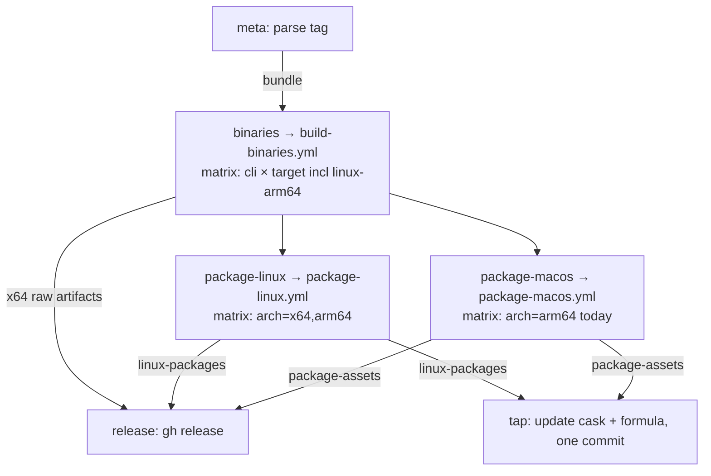

# Design 2190-a: Homebrew on Linux

Realizes [spec 2190](spec.md). The pipeline already builds per-CLI binaries and,
on macOS, packs each bundle into one `fit-<bundle>.app`. This design gives Linux
the same shape and, while doing so, makes the pipeline symmetric across
platforms and architectures: every stage is a reusable workflow fanned out by a
matrix. macOS distribution output is unchanged.

## Two invariants

**Container invariant.** Per bundle, on both platforms:

```text
build each CLI  →  pack the bundle's CLIs into one manifest-defined container
                →  one package definition installs that container
```

Each compiled CLI is self-contained: package-data assets (`fit-codegen`
templates, `fit-terrain` prompts) are inlined into the binary at compile time
(`gen-embed.mjs` + `bun --compile`), so a container is just the binaries — no
loose asset files travel beside them.

**Orchestration invariant.** Platform and architecture are matrix *data*, never
bespoke jobs. Each stage is a reusable workflow fanned out by a matrix; the one
place a target maps to a runner is a data expression. Adding an architecture or
platform is a new matrix value (and, for a new runner, one map entry) — never a
new hand-written job.

| Stage | macOS | Linux |
| --- | --- | --- |
| Container | signed `fit-<bundle>.app` | `fit-<bundle>-linux-<arch>.tar.gz` |
| Package | one cask per bundle | one formula per bundle |
| Contents | manifest CLIs | manifest CLIs |

## Job graph

Reusable workflows are single caller-level jobs; the matrix lives inside each.



`package-macos` and `package-linux` run in parallel, each matrixed over its own
architecture set. macOS keeps its existing `package-assets` artifact name (so
the `release` skip-guard and `tap` download keep working); Linux adds a parallel
`linux-packages` artifact. The symmetry is in the shape — one package workflow
per platform, each emitting one packages artifact — not in a churny rename of a
working contract. A future macOS x64 target is one matrix value, not new code.

## Components

| Component | Where | Responsibility |
| --- | --- | --- |
| Build target set | `build/cli-manifest.json`, `build-binaries.yml` matrix | Add `bun-linux-arm64` to each CLI's `targets` **and** turn the matrix's two-branch `os` ternary (`bun-linux-x64` → `ubuntu-latest`, else → `macos-14`) into a three-way map routing arm64 Linux to `ubuntu-24.04-arm`; without it the arm64 build silently runs on macOS. |
| Release target list | `publish-binaries.yml` `binaries` job `with: targets` | Add `bun-linux-arm64` to the target array. |
| `package-macos.yml` | new reusable workflow | The current `package` job lifted into a reusable workflow with an `arch` matrix and `bundle`/`version` inputs. It declares `environment: macos-signing` on its own job and takes signing secrets via `secrets: inherit`, preserving the scoping that keeps kata agents out of the certs. Behavior-preserving: same sign, notarize, staple, cdhash-stability check, cask zip, `.pkg`. Emits `package-assets` (unchanged name). |
| `package-linux.yml` | new reusable workflow | Matrix `arch=[x64,arm64]`. Per bundle, pack its manifest CLIs into `fit-<bundle>-linux-<arch>.tar.gz` + `.sha256`. Same manifest source as the `.app`. The tarball holds only the self-contained CLI executables (assets are inlined), so it carries no loose files. Emits `linux-packages`. |
| Release staging | `publish-binaries.yml` `release` job | Extend the skip-guard (today skips only `package-assets`) to also skip `linux-packages`, stage the Linux tarballs + `.sha256` as release assets, and keep staging the **x64** raw `{cli}-bun-linux-x64` assets for the bootstrap installer. arm64 ships only in the tarball — no arm64 raw asset (no consumer). |
| Tap formulae | existing tap repo, `Formula/<token>.rb` beside `Casks/` | One formula per bundle. `on_linux` + `on_arm`/`on_intel` select the arch tarball and its `sha256`; `install` does `bin.install Dir["*"]` (exact — the tarball is only executables). Same tap and token as the cask. |
| Cask + formula update | `publish-binaries.yml` `tap` job | Download both `package-assets` and `linux-packages`, recompute checksums, update the cask (one `sha256`) and the formula (version + the two per-arch `sha256`, each anchored under its `on_intel`/`on_arm` block — a targeted substitution per stanza, distinct from the cask's single sed). One commit, one tap-scoped token. |

## Formula shape

One shape for every bundle — a single-CLI product ships a one-file tarball.

```ruby
class FitGear < Formula
  desc "Gear CLIs"; homepage "https://www.forwardimpact.team"
  version "X.Y.Z"
  on_linux do
    on_intel do
      url ".../gear@vX.Y.Z/fit-gear-linux-x64.tar.gz"
      sha256 "<x64>"
    end
    on_arm do
      url ".../fit-gear-linux-arm64.tar.gz"
      sha256 "<arm64>"
    end
  end
  def install
    bin.install Dir["*"]   # tarball holds only self-contained CLIs
  end
end
```

## Key decisions

| Decision | Choice | Rejected alternative |
| --- | --- | --- |
| Packaging orchestration | **One reusable workflow per platform, matrixed over arch**, mirroring `build-binaries.yml` | A unified `package.yml` with a `platform` matrix branching to sign-or-tar — forces two very different flows into one conditional body, against "workflows orchestrate, actions implement". Bespoke inline jobs (status quo) — not matrixed, so a new arch/platform edits a job body. |
| Arch/platform as data | Matrix values + a target→runner map expression | Hardcoded per-target jobs — parallelism and additions require copy-editing jobs. |
| macOS packaging | **Extract the `package` job into `package-macos.yml`** with `environment: macos-signing` + `secrets: inherit` declared inside it, behavior-preserving | Leave it inline — keeps the signing path untouched but leaves the pipeline asymmetric. Extraction risk is bounded: composite actions and the cdhash-stability check are unchanged, and the signing-secret scoping is preserved by declaring the environment inside the reusable workflow. |
| Artifact naming | Retain `package-assets` (macOS); add `linux-packages` | Rename both to a uniform `<platform>-packages` — cosmetic symmetry that silently breaks the `release` skip-guard and the `tap` download, which key on the literal `package-assets`. |
| Linux distribution unit | One tarball per bundle, mirroring the macOS `.app` | Per-CLI formula + `fit-gear` meta-formula — asymmetric with the bundle-container model, ~29 churning formula files, empty-install audit friction. |
| Package format | Homebrew **formula** | A cask — macOS-only; Homebrew ignores casks on Linux. |
| Tap location | The **existing tap**, `Formula/` beside `Casks/` | A dedicated Linux tap — a second repo/token to avoid a bounded token collision (see Risks) that never touches the documented `--cask` path. |
| arm64 raw assets | arm64 only inside the tarball; raw assets stay **x64-only** | Publish arm64 raw assets too — no consumer, so dead assets implying an installer path that does not exist. |
| Checksum trust | Recompute each arch's `sha256` in the `tap` job | Trust the build sidecar — the cask path already recomputes. |

## Interfaces

- **Manifest → containers:** the `.app` assembly and the tarball packing both
  read `cli-manifest.json`, so the containers never diverge.
- **Package workflow → downstream:** `package-macos` emits `package-assets`,
  `package-linux` emits `linux-packages` (each: containers + `.sha256`).
  `release` uploads both as release assets; `tap` downloads both and recomputes
  checksums. The shape is uniform; the names are fixed by the existing contract.
- **Release → formula (assets):** each bundle publishes
  `fit-<bundle>-linux-{x64,arm64}.tar.gz` + `.sha256`; `{cli}-bun-linux-x64` raw
  assets remain for the installer.
- **Host CPU → tarball:** Homebrew's `on_intel`/`on_arm` selects the arch at
  install.

## Risks and boundaries

- **Token collision on macOS (bounded, verified brew 6.0.10).**
  `brew install --cask <tap>/<bundle>` installs the cask cleanly. A bare
  `brew install <tap>/<bundle>` on macOS resolves to the formula and, being
  `on_linux`-only with no macOS artifact, fails to load — never installing the
  cask's app and installing nothing. An already-installed cask upgrades normally
  (`brew upgrade` tracks the installed type). The documented macOS path is
  `--cask`; Linux has no cask. Fail-safe, not a silent wrong install.
- **macOS extraction risk.** Lifting the signing job into a reusable workflow
  touches working notarization orchestration; mitigated by unchanged composite
  actions, the retained cdhash-stability re-verification, and the environment
  declared inside the workflow. Fallback: leave `package` inline (accepted
  asymmetry).
- **arm64 runner availability.** `ubuntu-24.04-arm` is a GitHub-hosted label
  that can depend on plan tier; if unavailable the arm64 build cell fails the
  release, fallback a self-hosted runner.
- **arm64 bootstrap gap (accepted).** `fit-install.sh` has no arm64 case and is
  unchanged; arm64 users install via Homebrew, per spec.
