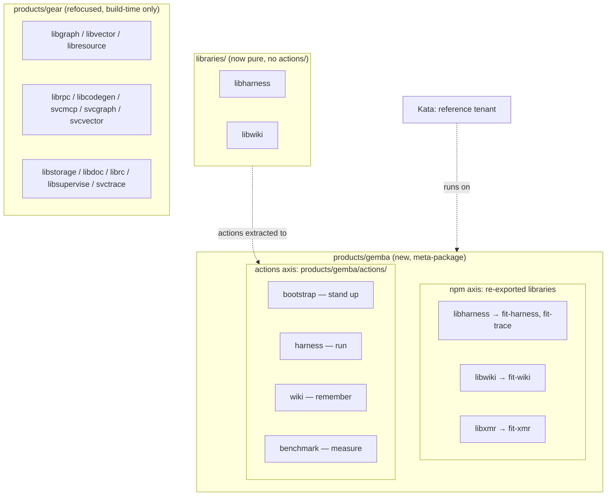

# Design 2200 — Gemba, an agent-runtime platform product

Packages the agent-runtime substrate as a Secondary meta-product (`Gemba`)
split cleanly out of Gear along one line: **`Gemba` ships what
you run; Gear ships what you import.** The product has two concrete surfaces —
an npm meta-package that re-exports the three runtime *libraries*, and a GitHub
Actions surface (`products/gemba/actions/`) that owns the composite actions
which execute the coding agent in CI. Extracting those actions leaves
`libharness` and `libwiki` as pure libraries; `svctrace` stays in Gear.

## Restated problem

The bootstrap layer plus `fit-harness`/`fit-trace`/`fit-wiki`/`fit-xmr` already
work and are published, but no product frames them. Their libraries are
re-exported by Gear (a build-time primitives meta-package), the actions that run
them hang off library directories, and `bootstrap` is filed as CI plumbing under
`.github/`. The design gives the substrate one product home — an npm axis and an
actions axis — and sharpens Gear to a single audience.

## Architecture

Two meta-products, one boundary. `Gemba` re-exports the three runtime
libraries and owns the run actions; Gear keeps the build-time set (including
`svctrace`). The libraries stay on disk under `libraries/`; only their
`actions/` subdirectories move into the product.



The runtime loop the product narrates, on both axes: **stand up** (bootstrap
action) → **run** (harness action / `fit-harness`) → **see** (`fit-trace`,
reading NDJSON) → **remember** (wiki action / `fit-wiki`) → **measure**
(benchmark action / `fit-xmr`).

## Components

| Component | Where | Responsibility |
| --- | --- | --- |
| Platform package | `products/gemba/package.json` (new) | Meta-package: `description`, one Big Hire `jobs` entry (`user` `Teams Using Agents`), `dependencies` = the three runtime libraries. No `bin/`, no `src/`, and — like Gear — no hand-authored `README.md`. |
| Platform actions | `products/gemba/actions/{bootstrap,harness,wiki,benchmark}/` (moved) | The composite actions that execute the runtime in CI, relocated from `.github/actions/bootstrap/`, `libraries/libharness/actions/{harness,benchmark}/`, and `libraries/libwiki/actions/wiki/`. |
| Overview page | `websites/fit/gemba/index.md` (new) | The "stand up and operate an agent team" story by persona; presents the CLIs and the CI actions as one loop; Getting Started names the bring-up layer. `layout: product`. |
| Platform skill | `.claude/skills/fit-gemba/SKILL.md` (new) | When to hire the platform; how the capabilities compose into the loop. No `## Documentation` CLI-parity block — the meta-package ships no CLI of its own (the Gear/Kata `private`/no-`bin` exemption in `products/CLAUDE.md`). |
| Library purification | `libraries/libharness/`, `libraries/libwiki/` | The `actions/` subdirectories are removed; the libraries become import-only. |
| Publish workflow repoint | `.github/workflows/publish-actions.yml` | Matrix `prefix:` for `bootstrap`/`harness`/`benchmark`/`wiki` repointed under `products/gemba/actions/`; `paths:` filter updated. `repo:` sibling names unchanged. |
| Bootstrap path repoint | `.claude/settings.json`, `justfile`, `publish-binaries.yml`, `.rumdl.toml`, `biome.json`, `eslint.config.js`, `.coaligned/invariants/{temporal,model-defaults}.rules.mjs` | Every live local-path reference to `.github/actions/bootstrap/` (SessionStart hook, `install-deps` recipe, release `sparse-checkout`/`sed`, and ignore globs) repointed to `products/gemba/actions/bootstrap/`. The released `fit-install.sh` stays on the `gear` bundle. |
| Bring-up script | `products/gemba/actions/bootstrap/fit-bootstrap.sh` (generalized from `scripts/bootstrap.sh`) | The workspace-and-wiki half of bring-up, generalized to drop repo-specific assumptions and colocated beside `fit-install.sh`. The `bootstrap` `action.yml` runs it via `$GITHUB_ACTION_PATH`; the `.claude/settings.json` Stop hook and `scripts/worktree-create.sh` repoint to the new path. `scripts/bootstrap.sh` is removed. |
| Standard adoption | `MONOREPO.md`, `.claude/skills/monorepo-setup/`, plus `action.yml`/`kata-agent`/`libwiki` comments | Rewrite the Monorepo standard so `fit-bootstrap.sh` *is* the bring-up script — written evergreen, as the end state, with no vendored `scripts/bootstrap.sh` and no migration language. Comments repoint to match. |
| Release publish for bring-up | `.github/workflows/publish-binaries.yml` | Add `fit-bootstrap.sh` to the existing `bundle == 'gear'` gate: check out, stamp, and stage it into `dist/release/` beside `fit-install.sh` so it ships as a co-versioned Release asset. |
| Gear package edit | `products/gear/package.json` | Remove the three runtime library deps; remove the operate-time ("chart agent metrics") promise from `jobs.littleHire`. Keep `svctrace`. |
| Kata framing | `KATA.md`, overview page | Name Kata as the reference tenant; no `products/kata/` change. Update the `sibling-composite-actions` enum / action-home prose to the new homes. |
| Generated context + counts | `JTBD.md`, `products/README.md`, `CLAUDE.md` | Regenerate the catalog/JTBD blocks via the context command; hand-edit the `products/README.md` intro count and `CLAUDE.md` § Secondary Products (neither is generated). |

## Interfaces

- **The boundary predicate** — a capability belongs to `Gemba` iff you *run*
  it to operate a team (the harness/wiki/xmr CLIs and the bootstrap/harness/
  wiki/benchmark actions); it stays in Gear iff you *import* it to build an
  agent (graph, vector, resource, rpc, codegen, svcmcp, storage, doc, rc,
  supervise, and `svctrace`). Applied once, it partitions the substrate with no
  package or action in both.
- **`svctrace` is import-time, not run-time** — `fit-trace` reads NDJSON emitted
  by `fit-harness`; it has no dependency on `svctrace`. `svctrace` is an OTel
  gRPC ingestion service whose product consumer is Guide. It therefore stays in
  Gear's build-time set and is explicitly excluded from the runtime subset.
- **Action move is a source repoint, not a republish** — the subtree-split maps
  a monorepo `prefix:` to a **sibling repo name**. Moving a `prefix:` from
  `libraries/libharness/actions/harness` to `products/gemba/actions/harness`
  changes the source path and the `paths:` filter only; the `harness` sibling
  repo and every downstream `uses: forwardimpact/harness@v…` pin are untouched.
  Kata's vendored `action.yml` files pin the sibling repos by name, so they are
  unaffected too.
- **`bootstrap` is consumed by local path, so its move fans out** — unlike the
  three `uses:`-pinned actions, `bootstrap/` is referenced by disk path in eight
  live files (the `.claude/settings.json` hook, the `justfile` recipe, the
  `publish-binaries.yml` release step, and five lint/format ignore globs:
  `.rumdl.toml`, `biome.json`, `eslint.config.js`, and the two
  `.coaligned/invariants/*.rules.mjs` modules). The move repoints each of them;
  the `forwardimpact/bootstrap` sibling pin is still untouched because no
  workflow consumes it locally. `publish-actions.yml` and the `.github/CLAUDE.md`
  prose reference it too but are covered separately (the split repoint and the
  action-home prose). The released `fit-install.sh` stays on the `gear` release
  bundle — re-homing it is a separate release-pipeline change (spec § Excluded).
- **Two installers, one shape** — bring-up is two scripts that now sit side by
  side and are handled identically: `fit-install.sh` (tools and `fit-*`
  binaries) and `fit-bootstrap.sh` (workspace reconstitution and wiki sync,
  generalized from `scripts/bootstrap.sh`). Both are bundled in the `bootstrap`
  action, invoked via `$GITHUB_ACTION_PATH`, and stamped and shipped as
  co-versioned `gear`-bundle Release assets. Neither keeps a repo-root shim —
  the `bootstrap` layer is their single home. Generalizing `fit-bootstrap.sh`
  removes the monorepo-only assumptions so a downstream repo can run the
  published copy, mirroring what `fit-install.sh` already does.
- **Package-granular npm split** — library membership is expressed only in each
  meta-product's `dependencies`, and a whole library moves as a unit.
  `libharness` carries `fit-benchmark` and `fit-selfedit` besides
  `fit-harness`/`fit-trace`; those travel with it into `Gemba`, which is
  correct — benchmarking and self-edit are part of proving and running an agent
  team, not build-time primitives.
- **Shared foundation is out of scope** — `libtelemetry`, `libutil`, and similar
  cross-cutting packages are not in the runtime subset. Wherever Gear re-exports
  them today is left as-is; `Gemba` does not claim them.
- **Names are unchanged; only homes move** — the product is `gemba`, but the
  runtime libraries (`libharness`, `libwiki`, `libxmr`), their CLIs
  (`fit-harness`, `fit-trace`, `fit-wiki`, `fit-xmr`), and the composite actions
  (`bootstrap`, `harness`, `wiki`, `benchmark`) keep their existing names. The
  change relocates the actions and re-points the re-export lists; it does not
  rename any library, CLI, or sibling action repo.

## Key Decisions

| Decision | Choice | Rejected alternative |
| --- | --- | --- |
| Product tier | Secondary meta-package mirroring Gear/Kata (re-export list + JTBD + page + skill, no CLI) — plus a `products/gemba/actions/` surface like `products/kata/actions/`. | A Primary product with its own `fit-gemba` CLI — invents a command with nothing to do; the capabilities already have CLIs. |
| Split mechanism | Clean break: runtime library deps move out of Gear into `Gemba`; run actions move out of the library dirs into `Gemba`; no cross-listing. | Cross-list the runtime packages in both products — leaves two products claiming the same capability, the exact blur being removed (spec SC3). |
| Boundary line | `run` vs `import` (operate a team vs build an agent), applied to both libraries and actions. | Split by layer (libs vs services) or by "agent-ish vs not" — neither yields a clean single-audience cut. |
| `svctrace` | Excluded from `Gemba`; stays a Gear build-time dep (it is Guide's OTel collector, not `fit-trace`'s source). | Include `svctrace` on the strength of its blurb ("prove agent changes") — but `fit-trace` reads local NDJSON and never touches `svctrace`, so it fails the run predicate. |
| Run-action home | Move `bootstrap`/`harness`/`benchmark`/`wiki` into `products/gemba/actions/`; repoint the split `prefix:` only. | Leave them under `.github/` and the library dirs and only narrate them — keeps the run surface scattered and leaves `libharness`/`libwiki` shipping CI actions. |
| `bootstrap` placement | Move it into the product with the other run actions, accepting that most CI workflows consume it as the base FIT environment. That base environment *is* the platform's stand-up step; every CI job is a tenant of it. | Keep `bootstrap` under `.github/` as neutral infra — leaves the "stand up" step of the loop outside the product and the actions surface incomplete. |
| Bring-up script | Generalize `scripts/bootstrap.sh` into `fit-bootstrap.sh`, colocate it beside `fit-install.sh`, publish it on the `gear` bundle, and drop the repo-root file. | Leave `scripts/bootstrap.sh` as a repo-vendored root script — keeps the two halves of bring-up split across two homes and leaves the workspace step unpublished, so a downstream repo cannot fetch it the way it fetches `fit-install.sh`. |
| JTBD binding | New distinct job *Stand Up and Operate an Agent Team* under `Teams Using Agents`; Kata's existing job untouched. | Re-point Kata's job to `Gemba` — erases Kata's ownership of its own hire; or two `user`s on one job — the schema allows one `user` per entry. |
| Kata relationship | Document Kata as the reference tenant; move no code. | Build a fresh demo tenant to prove genericity — the spec already treats Kata as living proof; a second tenant is unbuilt scope. |
| Naming | Product is `gemba` (the lean "actual place" where work happens, matching the Kata/PDSA house vocabulary); libraries, CLIs, and actions keep their existing names. | Rename the runtime libraries/CLIs to a product-themed set — coined terms carry no meaning for the average developer and add churn with no boundary benefit; only the actions' home needs to move. |
| Boundary cases | `libdoc`, `librc`, `libsupervise`, `svctrace` stay in Gear; `libterrain` and `svcpathway` deferred, untouched. | Pull `fit-doc`/`fit-terrain` into the platform now — doc fails the run-the-team test; terrain is Map-entangled (spec Scope-out). |

## Data flow

```mermaid
sequenceDiagram
  participant Author as this change
  participant Plat as products/gemba
  participant Libs as libraries/{libharness,libwiki}
  participant Gear as products/gear
  participant CI as publish-actions.yml
  participant Ctx as context command + hand edits
  Author->>Plat: add package.json (deps = 3 runtime libs), page, skill
  Author->>Libs: git mv actions/* into products/gemba/actions/ (+ .github bootstrap)
  Author->>CI: repoint matrix prefix + paths (repo names unchanged)
  Author->>Gear: remove 3 runtime libs; drop operate-time clause; keep svctrace
  Author->>Plat: name Kata as reference tenant (KATA.md + page)
  Author->>Ctx: run context:fix (regenerates JTBD + catalog blocks)
  Author->>Ctx: hand-edit README intro count + CLAUDE § Secondary + action-home prose
  Ctx-->>Author: bun run check passes → boundary is single-home (SC1–SC7, SC11)
```

## Success criteria coverage

| # | Met by |
| --- | --- |
| 1 | Platform `package.json` deps = the three runtime libraries, nothing else (no `svctrace`). |
| 2 | Gear `package.json` edit removes all three runtime libraries. |
| 3 | Clean-break split (no cross-listing) → each runtime library in exactly one product. |
| 4 | `svctrace` stays a Gear dep, absent from the platform deps. |
| 5 | Gear `jobs.littleHire` edit removes the operate-time clause. |
| 6 | `git mv` of the four action sources into `products/gemba/actions/`; `libharness`/`libwiki` `actions/` and `.github/actions/bootstrap/` removed. |
| 7 | `publish-actions.yml` matrix repointed (prefix + paths), sibling `repo:` names unchanged. |
| 8 | Platform `jobs` array carries one `Teams Using Agents` Big Hire with a goal distinct from Kata's. |
| 9 | New overview page + skill name the bring-up layer, reference the four runtime CLIs, and present the CI actions as the same loop. |
| 10 | Kata framed as reference tenant in `KATA.md`/page; no `products/kata/` diff. |
| 11 | `context:fix` regenerates JTBD + catalog; hand edits fix the intro count, `CLAUDE.md`, and action-home prose; `bun run check` passes. |
| 12 | Spec § Deferred decisions present; terrain/svcpathway untouched; no library/CLI/sibling-action rename. |
| 13 | Bootstrap path repoint updates all live local-path references; `rg` finds no dangling `.github/actions/bootstrap` outside `specs/`. |
| 14 | `fit-bootstrap.sh` sits beside `fit-install.sh`, the action runs it via `$GITHUB_ACTION_PATH`, `publish-binaries.yml` stamps and stages it on the `gear` bundle, `MONOREPO.md`/`monorepo-setup` name it as the bring-up script, `scripts/bootstrap.sh` is gone, and `rg` finds no dangling `scripts/bootstrap.sh`. |

## Clean break and scope

The change adds one product and edits one, and regroups the run actions under
the product. Gear loses the three runtime library deps outright — no shim, no
deprecation alias — and keeps `svctrace`. No runtime library moves on disk (only
its `actions/` subdirectory does), no library or CLI is renamed, the sibling
action repos keep their names and pins, and `products/kata/` gains no code. The
one script that does move and change is `scripts/bootstrap.sh`: generalized into
`fit-bootstrap.sh`, colocated with `fit-install.sh`, published on the `gear`
bundle, and repointed at every live caller; the Monorepo standard is rewritten
to name `fit-bootstrap.sh` as the bring-up script, evergreen. The product is
named Gemba; `fit-terrain`'s home and the `svcpathway` mis-filing stay out of
scope per the spec, each recorded as a deferred decision rather than resolved.
