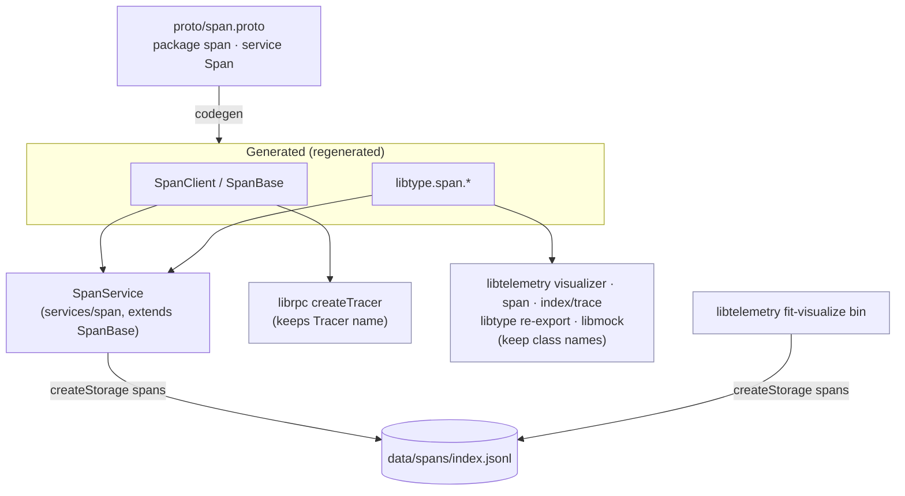

# Design 2200-a: Rename `svctrace` to `svcspan`

Spec 2200 asks for a complete clean-break rename of the span-ingestion service
from `svctrace` to `svcspan`, driven by the collision with the unrelated
`fit-trace` library. This design fixes the rename boundary: which surfaces are
renamed by hand, which are regenerated from the proto, and which shared
OpenTelemetry components stay put.

## The boundary

The proto is the single source of truth. Every "trace" identifier falls into one
of four zones, and the zone decides how it changes.

| Zone                            | Members                                                                                                                                                                                                                      | How it changes                                                                                                           |
| ------------------------------- | ---------------------------------------------------------------------------------------------------------------------------------------------------------------------------------------------------------------------------- | ------------------------------------------------------------------------------------------------------------------------ |
| **Service surface**             | directory; `package.json` name/bin/keywords/jobs/description; `README`; the `TraceService`→`SpanService` class; the service `server.js` config key (`createServiceConfig`) and storage bucket (`createStorage`); test labels | Renamed by hand                                                                                                          |
| **Proto**                       | `proto/span.proto`: file, `package span`, `service Span`                                                                                                                                                                     | Renamed by hand — the source that drives regeneration                                                                    |
| **Generated**                   | `SpanServiceDefinition`, `SpanClient`, `SpanBase`, `libtype` `span.*` namespace, gRPC path `/span.Span/*`, and the proto copies in both generated trees                                                                      | Regenerated by the codegen command; never hand-edited                                                                    |
| **Coupled refs (kept classes)** | rpc-lib `createTracer`; telemetry `visualizer`/`span`/`index/trace`; `libtype` index re-export; `libmock` client factory; `fit-visualize` bin; client-instance identifiers                                                   | Reference/string moves; hand-written class names (`Tracer`, `TraceIndex`, `TraceVisualizer`, `Span`) and `trace_id` stay |

The fourth zone is the crux. The reference-holders live in specific homes, and
naming them wrong sends the implementer looking in the wrong library:

- **`libraries/librpc` `createTracer`** — resolves the service by **config key**
  (`createServiceConfig("trace")`) and constructs the **generated client**
  (`new TraceClient(...)`). Both the key `trace`→`span` and the class reference
  `TraceClient`→`SpanClient` move here. This is _not_ the hand-written `Tracer`
  class in `libtelemetry`; that class keeps its name.
- **`libraries/libtelemetry`** — `visualizer`, `span`, and `index/trace` import
  the generated **type namespace** (`import { trace }`→`{ span }` from
  `libtype`); the `fit-visualize` bin opens the **storage bucket**
  (`createStorage("traces")`→`"spans"`). Class names are untouched.
- **`libraries/libtype`** index re-exports the namespace (`trace`→`span`); the
  **`libmock`** factory renames `createMockTraceClient`→`createMockSpanClient`.

## Data flow: regeneration keeps the generated zone honest

Editing the proto and running the repository code-generation command is what
turns `Trace*` generated artifacts into `Span*` across both generated trees.
Because the service and the tracer client are built from the same regenerated
output, the gRPC wire contract stays internally consistent — the path moves from
`/trace.Trace/*` to `/span.Span/*` on both ends at once. No component reads the
old path, so no compatibility layer is needed. The service's request and
response types (`span.Span`, `span.QueryRequest`, `span.QueryResponse`,
`span.RecordResponse`) and the `RecordSpan` / `QuerySpans` RPCs are unchanged in
shape — only the namespace prefix moves.

## Consumer, orchestration, and documentation surface

| Surface                     | Home                                                                                                                                                           | Change                                        |
| --------------------------- | -------------------------------------------------------------------------------------------------------------------------------------------------------------- | --------------------------------------------- |
| Product dependents          | `products/{guide,gear}/package.json`                                                                                                                           | new package name                              |
| Guide status + init         | `products/guide/src/lib/status.js` arrays, `src/commands/init.js`, their tests                                                                                 | config key `trace`→`span`                     |
| Environment                 | `.env.*.example` (`SERVICE_TRACE_*`, `trace.local` host)                                                                                                       | `SERVICE_SPAN_*`, `span.local`                |
| Orchestration + registry    | `docker-compose.yml` (`trace:` block, `fi/trace:latest`, `container_name`, `trace.local`); the service-URL-drift invariant registry manifest path              | span-worded                                   |
| Starter config              | guide starter config (name + module path)                                                                                                                      | new name + module                             |
| CI workflow                 | `eval-guide.yml` launch line, log-tail, process-kill pattern                                                                                                   | new dir/log/bin                               |
| Repo bootstrap              | `justfile` `data/traces` mkdir/rm                                                                                                                              | `data/spans`                                  |
| Contributor refs            | `config/CLAUDE.md` + rc-lib `README` service-list examples; release bundle listing; the tracked CLI manifest (`build/cli-manifest.json`)                       | `svcspan`                                     |
| Service guides + skill refs | `websites/fit/docs/services/prove-changes/` (name, `createClient` key, data path, `trace.*` RPC types); lifecycle guide; published skill data-layout reference | rename identity refs; keep OTel prose + slugs |

`build/cli-manifest.json` is a tracked, hand-maintained input that drives the
binary build, not codegen output — its `fit-svctrace` entry is edited by hand
alongside the other contributor refs, not regenerated.

## Key decisions

| Decision                         | Choice                                                                                                      | Rejected alternative                                                                                                                                 |
| -------------------------------- | ----------------------------------------------------------------------------------------------------------- | ---------------------------------------------------------------------------------------------------------------------------------------------------- |
| Rename depth                     | Rename the service surface, proto, and everything the proto generates; keep hand-written OTel classes       | Purge every "trace" including `Tracer`/`TraceIndex` — breaks OTel semantics and the shared telemetry stack for a non-confusable term                 |
| Generated client/base            | Let `TraceClient`/`TraceBase` become `SpanClient`/`SpanBase` as codegen output of the renamed proto service | Keep proto service `Trace` to preserve `TraceClient` — leaves the gRPC path `/span.Trace/*` and an internal name that still says the confusable word |
| Proto package + data paths       | Move package, config key, storage bucket, and log dir to `span`                                             | Keep them `trace` — the identifier the rename exists to remove would survive in the path, config, and on disk                                        |
| Migration style                  | Clean break: rename in place, dependents update in the same change; no dual-publish or wire shim            | Publish both packages / alias the old bin — the spec forbids shims and there is no installed base to bridge                                          |
| Historical `specs/**`            | Leave as immutable records                                                                                  | Rewrite them for consistency — falsifies the record of past work                                                                                     |
| `trace_id` & harness `trace-dir` | Preserve                                                                                                    | Rename to `span_id` / `span-dir` — `trace_id` is a distinct OTel field, and `trace-dir` belongs to the `fit-trace` domain                            |

## Verification hooks

The spec's success criteria map to three checks the plan will sequence: a
`--hidden` repository-wide `rg` sweep (excluding `specs/`, `.git/`, and
lockfiles) proving no live `svctrace`, service-path, or `Trace*`-generated
identifier survives while the kept OTel classes and `trace_id` still match, a
clean run of the code-generation command with no uncommitted diff, and green
test suites for the span service and the telemetry, rpc, and guide surfaces.
