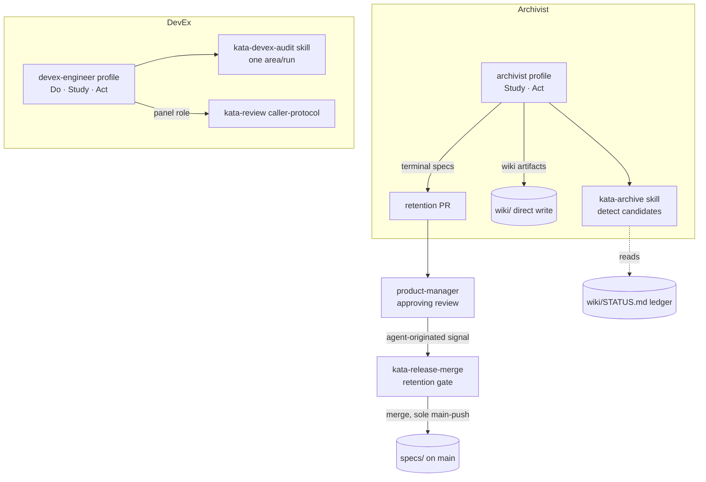
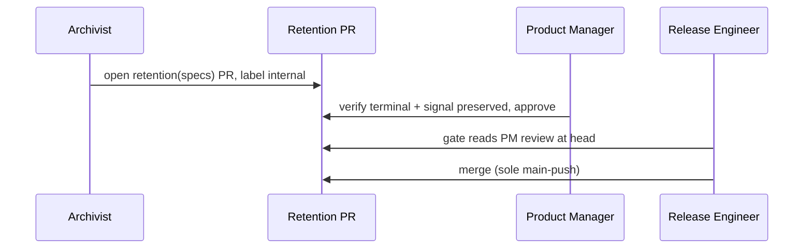

# Design 2210: Archivist and DevEx Engineer agents

Spec 2210 adds two roster agents and two Study-phase skills, plus one new
agent-originated approval class. Everything lands under `.claude/`, `KATA.md`,
the `kata-shift` workflow, and `websites/kata/`. The architecture reuses every
established shape — agent profile, coverage-map audit, review panel, merge gate
— so the two agents slot into the existing loop without new machinery.

## Component map

Both agents also appear in the roster/enumeration surfaces: `KATA.md` tables,
the `kata-shift` matrix, and the `websites/kata/` site.

## Archivist subsystem

The archivist owns **time-based retention** of terminal, time-bounded
artifacts. It detects (Study, in `kata-archive`) and removes (Act, its own
responsibility — no second skill). Two artifact classes take two write paths
because they live in different repositories under different rules.

| Artifact class | Detection input | Write path | Authorization |
| --- | --- | --- | --- |
| Past-week agent logs, past-month storyboards | ISO week / month older than a retention window | Direct wiki write on shift | Ordinary memory-write path every agent uses |
| Terminal spec directories (`plan implemented` / `cancelled`) | STATUS row terminal **and** `git log specs/NNN/` older than the window | Retention PR → release-engineer merge gate | Product-manager approving review (new class) |

The window value is a plan concern; the design fixes only the **mechanism**:
terminal state read from STATUS plus a git-mtime staleness test, so a
just-completed spec is never swept.

### Signal preservation and recoverability

Removal is safe only when the durable signal already lives elsewhere; the
archivist never authors another agent's summary to make it so.

- **Terminal specs** — the STATUS.md ledger row is the permanent record and is
  never trimmed; full text stays recoverable in `main` git history.
- **Past-week logs** — the owning agent's summary already folds live state on
  its normal cadence. Precondition before removal: **no current summary links
  the log** (a dangling `detail:` pointer blocks retirement; the archivist
  defers rather than editing the summary). The retention window is therefore
  set longer than a summary's detail-link horizon.
- **Past-month storyboards** — the MEMORY.md storyboard index keeps the
  pointer; wiki git history keeps the text.

The archivist records each retirement in its own summary and weekly log
(`wiki/archivist.md`, `wiki/archivist-{YYYY}-W{VV}.md`) — its archive ledger.

### Boundary with the technical writer

Split by artifact lifecycle so the two never contend for one file. The
technical writer's `fit-wiki rotate` seals an **over-budget current** log into
`-partN` (still present); the archivist removes a **past-period** file by age.
Different files, different triggers.

| Owner | Owns |
| --- | --- |
| Archivist | Past-week logs (incl. sealed `-partN`), past-month storyboards, terminal specs |
| Technical writer | MEMORY.md, active claims, current summaries, observations |

## Retention approval class

A retention PR carries no spec id and touches many `specs/NNN/` directories, so
the per-spec STATUS phase gate cannot apply. Its authorizing signal is a
**product-manager approving review on the PR itself** — a new agent-originated
signal that joins `kata-plan` panel-clean. It does not touch the human-only
rule, which continues to govern only `spec approved` and `design approved`.

Thread through four surfaces:

| Surface | Change |
| --- | --- |
| `x-approval-signals` § The signals | New row: retention-PR approval · source `product-manager` (retention PRs only) · read at the gate, **no STATUS write** — the one class not mediated by STATUS |
| `x-approval-signals` §§ Trust rule, Signal invalidation | One sentence in Trust rule granting product-manager retention approval; a Signal-invalidation row pins the review's commit SHA, agent-originated (any head delta voids, needs fresh PM review) — same mechanics as plan panel-clean |
| `kata-release-merge` classify + approval gate | New `retention` title type routes to a retention branch of the approval gate: verify a product-manager review covers the head instead of reading a STATUS phase row; skips the implementation spec check; the `internal` classification-label gate still applies |
| `product-manager` profile | Grant authority to approve retention PRs (confirm targets terminal + signal preserved); scope its never-originate constraint explicitly to spec and design |

The trust boundary is preserved: the archivist opens the PR but never pushes to
`main`; the release engineer stays the sole merge point, now reading a PM
review for this one class rather than a STATUS row.

## DevEx Engineer subsystem

The DevEx engineer owns **codebase health** — dead code, inconsistency,
duplication, accumulating debt — the seam between the security engineer
(security posture) and the technical writer (docs). Same phase set and shape as
the security engineer.

- **Profile** (`devex-engineer.md`, Do · Study · Act) mirrors the security
  engineer: assess ladder, coverage-map audit, fix-or-spec constraints.
- **`kata-devex-audit` skill** (Study) is `kata-security-audit` re-pointed at
  code health: audit areas as topics, one area per run, coverage map recorded
  in `wiki/devex-engineer.md` § Coverage Map (topic · last audited). Findings
  classify per work-definition — mechanical cleanup to a `fix/` PR, structural
  refactor to a `spec/` branch. **Constraint:** a cleanup fix changes no
  behavior; a structural refactor routes to a spec.

### DevEx review panel

A new, separate panel — not a lens folded into the technical panel. It slots
into `kata-review`'s caller-protocol table, which already supports multiple
panels per artifact (technical + product for specs), so the merge machinery
needs no change.

| Caller | Artifact | Panel | `subagent_type` | Reviewers |
| --- | --- | --- | --- | --- |
| `kata-design` | `design-a.md` | devex | `devex-engineer` | 3 |
| `kata-plan` | `plan-a.md` | devex | `devex-engineer` | 3 |
| `kata-implement` | diff | devex | `devex-engineer` | 3 |

Panel judges maintainability, consistency, and debt — independent of whether
the change is correct (technical panel) or secure (security engineer). Not
added to spec reviews. The caller-protocol header ("Used by") updates to name
the second panel on design/plan/implement.

## Roster and enumeration wiring

| Surface | Change |
| --- | --- |
| `kata-shift` matrix + `KATA.md` § Workflows sequence | Insert `devex-engineer` after `security-engineer` and `archivist` before `release-engineer` (so a same-shift retention PR can be merged) |
| `KATA.md` § Agents table + "Six personas" prose | Two rows; count prose → eight |
| `KATA.md` § Skills enum list | Two `kata-` skill rows (enum count auto-derives 16 → 18) |
| `KATA.md` § Workflows storyboard count | Coach `facilitates 7` — both agents join the storyboard (see Key Decisions) |
| `KATA.md` § Approval Signal + § Trust Boundary | Retention-PR PM signal row and the retention merge path |
| `websites/kata/index.md` + `llms.txt` | Two agent cards, headline count → eight, two persona names (hand-maintained); skill counts stay enum-gated |

## Key Decisions

| Decision | Choice | Rejected alternative |
| --- | --- | --- |
| Retention-PR authorization | Product-manager approving review on the PR, read at the gate | A `retention:` STATUS row — the PR spans many specs with no single id, so a per-spec row does not fit |
| Retention approval origin | New agent-originated signal, human-only rule scoped to spec/design | Require human approval — retention is routine bookkeeping; a human gate would stall the loop it exists to unclog |
| Gate identifies retention PRs | New `retention` title type in `kata-release-merge` Step 3 | Reuse `chore` — would route through the Step 9 implementation spec check it must skip |
| Spec staleness test | STATUS terminal **and** git-mtime beyond a window | Terminal state alone — would sweep a spec the shift it completes |
| Log-retirement safety | Block on any live summary `detail:` link | Rewrite dangling links — puts the archivist inside another agent's summary, breaking the lifecycle boundary |
| Archivist Act path for specs | Retention PR through the release-engineer gate | Direct `main` push — breaks the sole-merge-point trust boundary |
| DevEx as its own panel | Separate `devex-engineer` panel on design/plan/implement | Fold maintainability into the technical panel — correctness and debt are distinct verdicts and would collapse into one |
| DevEx panel size | 3 across all three phases | Mirror the technical panel (3 on design/plan, 5 on implement) — doubles the most expensive panel for lower-variance debt findings |
| Storyboard participation | Both agents join; coach `facilitates 7` | Exclude them — but they carry owned work and metrics like every roster agent, so the daily current-condition review would be blind to two agents' deliverables |
| Skills added | Only `kata-archive` and `kata-devex-audit`; removal and panel work reuse existing paths | A `kata-retention-merge` skill — the merge gate already owns merge; a new skill would duplicate it |
