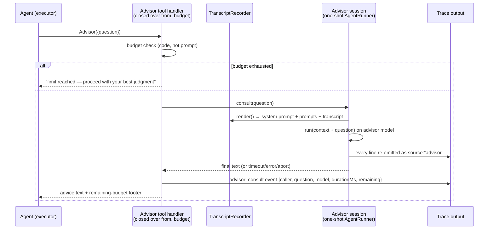

# Design 2230-a — Native Advisor Consults for fit-harness Sessions

Implements spec 2230. The advisor is the judge's mid-loop sibling: a solo,
tool-restricted, one-shot `AgentRunner` session whose final text is the
advice. The consult surface is one MCP tool closed over the caller's name, a
consult function, and a shared budget object. Two components are genuinely
new: the **transcript recorder** (the harness keeps no per-participant record
today) and **run mode's advisor wiring** (run mode has no orchestration
context, no in-process MCP server, and no lead loop — its construction is
named explicitly below, not assumed).

Surface and brain are separable: the `Advisor` tool is the surface; the
one-shot session is the brain. Both are mode-agnostic; what differs per mode
is only where they are constructed.

## Architecture

The consult is a blocking MCP tool call, so the caller pauses and resumes with
advice in hand — the same interaction shape as Anthropic's server-side tool,
without the bus's async Ask/Answer turn boundary. The advisor never appears on
the message bus and holds no participants entry.

## Components

| Component | Where | Responsibility |
| --- | --- | --- |
| `TranscriptRecorder` | new `src/transcript-recorder.js` | Per-participant record, constructed only when an advisor model is configured. Seeded at wiring time with the caller's harness-composed system prompt (or its absence); fed from two taps on the caller's runner — every delivered (amended) prompt via the new `onPrompt` tap, which is how loop-mode agents receive their task as drained bus messages, and every SDK message via the existing `onLine` path. `render()` formats system prompt + prompts + messages into the advisor's context text. In-memory. The message tap arrives post-redaction; the seeded system prompt and prompt-tap text are raw, so the recorder redacts them itself via the injected redactor. |
| `Advisor` + `createAdvisor` | new `src/advisor.js` | Judge-shaped factory, one per caller, closed over that caller's recorder: each `consult(question)` renders the record, runs one `AgentRunner` session on the advisor model with the `ADVISOR_SYSTEM_PROMPT` trailer via `composeSystemPrompt`, lines re-emitted into the parent trace as `source: "advisor"`, small turn budget (judge's default), read-only tools. Consult timeout: **5 minutes** — generous for a read-a-few-files-and-answer session, and the universal guard in modes with no stop path. Exposes the in-flight session's abort. Returns `{advice}` or `{unavailable, reason}`. |
| `ADVISOR_SYSTEM_PROMPT` | `src/advisor.js` | Role trailer: consulted specialist, not a worker; response contract (assessment / recommendation / unsolicited findings, with a stated length ceiling); read-only inspection allowed; no follow-up questions; never modify anything. |
| `AdvisorBudget` | `src/advisor.js` | `{maxUses, used}` object created once per session and shared by every caller's tool handler. |
| `Advisor` tool | `src/orchestration-toolkit.js` | `advisorTool({from, consult, emit, budget})` with schema `{question: string}`. Checks the budget, invokes `consult`, emits the consult event, returns advice with a remaining-budget footer. No orchestration-context dependency. The per-role agent server factories gain an optional extra-tools parameter — SDK MCP servers take their tool list at construction, so the tool is passed at build time, not appended after. |
| `advisor_consult` event | injected `emit` callback | `{type: "advisor_consult", caller, question, model, durationMs, remaining}` written as an orchestrator-source envelope line. |
| Consult guidance | `src/advisor.js` constant | Advisor-usage section for agent system prompts, threaded through the prompt composer's amendment fragment (see Key Decisions for seam ownership). |
| Runner prompt tap | `src/agent-runner.js` | `AgentRunner` gains an optional `onPrompt` callback invoked with the effective (amend-applied) prompt of each `run`/`resume`, so the recorder captures exactly what the caller received, without mode-specific code. |
| CLI flags + docs | `src/commands/{run,supervise,facilitate,discuss}.js` | `--advisor-model` (no default — absent means off) and `--advisor-max-uses` (default 3 per spec), parsed in each mode's `parse*Options`; `--advisor-max-uses` without `--advisor-model` is a usage error. Both flags documented in each command's libcli option help; the agent-collaboration guide gains an advisor section (spec's Documentation row). |

## Consult flow ownership

**Loop modes (`supervise`, `facilitate`, `discuss`).** Each mode factory
already constructs every agent participant's runner, composed system prompt,
and orchestration MCP server in one place. When an advisor model is
configured it additionally constructs, per agent: a recorder seeded with that
agent's composed prompt, the runner's taps composed with the existing wiring
(the `onLine` slot is single and already occupied by the mode's `emitLine`
closure — the factory wraps it so one closure feeds both the trace and the
recorder, the same composition treatment as the amendment seam), and the
`Advisor` tool passed into that agent's orchestration-server factory, closed
over the session's one budget object and the loop's orchestrator-event
emitter. Leads get none of this (spec exclusion).

**Run mode.** `run` builds its single runner inline with no orchestration
machinery, so the command constructs the advisor wiring directly: the budget
object, a dedicated in-process MCP server holding only the `Advisor` tool
(alongside the existing optional external server entry), an emit callback that
writes orchestrator-source envelope lines the way the command already writes
agent-source lines, and the recorder. Prompt guidance: with `--agent-profile`,
the guidance rides the profile composer's existing amendment parameter; with
no profile, the command composes a preset-append prompt carrying the guidance
as its only session-protocol fragment — the recorder is seeded with whichever
the harness composed, and with nothing when the advisor is off and no profile
is set (today's behavior, unchanged).

In every mode the advisor session's cwd is the caller's cwd, so read-only
inspection sees the caller's working directory. Abort: loop modes register
the in-flight advisor session's abort with the loop's stop path, so a
concluded or crashed session cancels a pending consult. Run mode has no stop
path today (the command simply awaits the runner) — the 5-minute consult
timeout is deliberately its only guard, rather than inventing signal handling
for one tool.

## Key decisions

| Decision | Choice | Rejected alternative |
| --- | --- | --- |
| Advice channel | The advisor session's **final text** is the advice | A `Conclude`-style MCP verdict tool on the advisor session — adds a tool server and a schema for what is inherently prose; the judge needs a structured verdict, advice is text |
| Consult statefulness | One fresh session per consult (stateless; matches the spec's whole-context-as-it-stands semantics) | Persistent per-caller advisor resumed with deltas — cheaper on long sessions but adds session state, delta bookkeeping, and stale-context risk; spec-excluded until cost data justifies it |
| Context source | In-memory recorder fed from the runner's line and prompt taps | Re-read the trace output — output may be bare stdout (nothing to read back), and neither the composed system prompt nor a reliable per-participant ordering exists in the stream |
| System-prompt capture | Recorder seeded at wiring time, where the composed prompt is in scope | Parse it from the SDK `system/init` event — that event carries model/tools, not the composed prompt text |
| Prompt capture | `onPrompt` tap on the runner | Recorder takes the task at construction — loop-mode agents have no task at wiring time; their work arrives later as drained bus messages through `run`/`resume` |
| Advisor tool policy | `Read`, `Glob`, `Grep` only | Judge's set (adds `Bash`) — `Bash` is execution, breaching contract item 3; Anthropic's advisor (no tools) — reproduces its documented cannot-read-files blind spot |
| Budget home | Standalone shared budget object injected into every handler | A counter on the orchestration context — run mode has no context, and creating one there imports loop machinery a solo session doesn't have; prompt-level caps — the field evidence the spec cites |
| Event emission | Injected `emit` callback into the tool factory | Emitting via the loop's orchestrator-event method directly — run mode has no loop; the callback keeps one tool implementation across all four modes |
| Failure shape | Timeout + error + parent-abort all resolve to an in-band `{unavailable}` tool result; the advisor's abort is registered with the mode's stop path | Let the MCP handler reject or hang — a wedged consult would stall the caller's turn indefinitely and a rejection would surface as a tool crash, breaching fail-open |
| Default advisor model | None — `--advisor-model` is explicit | Defaulting to the lead-tier constant — eval agents already run top-tier, so a silent default would pay double for nothing; the flag names the experiment |
| Guidance placement | The prompt composer's existing amendment fragment, with the mode factory joining existing amendment + guidance | A second role trailer merged per mode — role trailers are static by design, and the amendment seam already exists for run-specific additions (though occupied: composition, not replacement) |

## Interfaces

- `createTranscriptRecorder({systemPrompt, redactor}) → {recordPrompt(text), recordMessage(line), render()}`
- `createAdvisor({model, cwd, query, recorder, redactor, runtime, onLine, maxTurns?, timeoutMs?}) → {consult(question) → Promise<{advice} | {unavailable, reason}>, abort()}`
- `createAdvisorBudget(maxUses) → {maxUses, used}`
- `advisorTool({from, consult, emit, budget})` — passed into the agent
  tool-server factories in loop modes (new optional extra-tools parameter);
  sole tool of run mode's advisor server.
- `AgentRunner`: new optional `onPrompt(text)` callback, invoked by `run` and
  `resume`.
- CLI: `fit-harness <mode> --advisor-model <id> --advisor-max-uses <n>`.
- Trace: `advisor_consult` orchestrator event; advisor session lines under
  `source: "advisor"` (its result event carries usage and cost, giving the
  spec's cost-attribution criterion without new accounting code).

## Verification surface

All criteria run against the injected fake `query` seam: tool presence per
flag and mode (including run mode's dedicated server); single advisor-model
session per consult; forwarded context contains seeded system prompt +
delivered prompts + full transcript + question regardless of caller input;
statelessness across consults; shared budget exhaustion path with zero advisor
sessions started; consult event + `source: "advisor"` lines in the envelope
stream; timeout/error/abort resolving `{unavailable}` while the caller
continues; guidance present iff enabled, composed alongside an existing
amendment. No live LLM spend.

— Staff Engineer 🛠️
