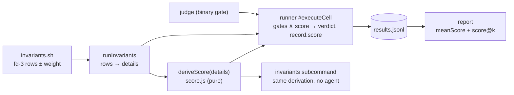

# Design 2240-a — Scored Benchmark Tasks

Implements spec 2240. A task becomes **scored** when its `invariants.sh` emits
weighted check rows on the results fd; a pure derivation turns those rows into
a score in [0, 1], the runner composes it with the existing gates, the record
carries it, and `report` aggregates it. Judged tasks — every task that emits no
weighted row — flow through unchanged code paths and produce byte-identical
records. No new file, manifest field, or flag exists; the rows are the
declaration.

## Architecture



Score derivation is one pure function with two callers (runner and the
`invariants` subcommand), so the arithmetic exists once and records are
self-describing — `report` reads `score` off the record, never re-deriving it
from details.

## The scored-row convention

A details row is a **scored check** iff it carries a boolean `pass` and a
numeric `weight > 0`:

```json
{"test": "filter-case-insensitive", "pass": false, "weight": 1}
```

- `score = Σ weight(passing scored rows) / Σ weight(all scored rows)`.
- **Full marks** is the exact integer comparison `passedWeight === totalWeight`
  — no float-equality hazard in the verdict.
- Zero scored rows → the task is judged; derivation returns `null` and no
  `score` field appears anywhere.
- Rows without `weight` remain what they are today: diagnostic detail. A scored
  task may mix both (gate diagnostics unweighted, graded checks weighted).

## Components

| Component | Where | Responsibility |
| --- | --- | --- |
| `deriveScore(details)` | new `benchmark/score.js` | Pure: filter scored rows, return `{score, passedWeight, totalWeight}` or `null`. Ignores malformed rows (`parseError`, non-boolean `pass`, non-positive/non-numeric `weight`). |
| Verdict + score composition | `benchmark/runner.js` `#executeCell` | Effective score: `null` when derivation is `null`; `0` when any gate fails (preflight, invariants exit code, judge); the derived score otherwise. Verdict: `pass` iff every gate passes ∧ (score is `null` ∨ full marks). |
| Record schema | `benchmark/result.js` | Optional `score` (number, 0–1) on the happy record and on the invariants record. Preflight-failure records omit it (no invariants ran; spec's "score 0" for gate failures applies to cells that produced rows — preflight cells carry `preflightError` and today's semantics). |
| `invariants` subcommand | `commands/benchmark-invariants.js` | Runs the same derivation; the emitted record carries `score`; exit code mirrors `run` semantics — non-zero when the gate fails **or** score is below full marks — so hook authoring iterates against the real contract. |
| Report aggregation | `benchmark/report.js` | Per task, when ≥ 1 record carries `score`: `meanScore` and `scoreAtK[k]` (expected best-of-k, § Estimator). Records without `score` in a scored group contribute score 0 to both (a gate-failed or legacy cell is not evidence of capability). |
| Report rendering | `benchmark/report.js` | Text: the pass@k table gains `score` and `score@k` columns only when the report contains a scored task (judged rows render `—`); the per-task runs table gains a `Score` column under the same condition. JSON: fields appear on scored tasks only. |
| `fit-trace assert --weight` | `commands/assert.js` + trace CLI definition | Optional flag; validates a positive number; adds `weight` to the emitted row. Keeps the documented authoring contract (`assert … >&"$RESULTS_FD"`) able to author scored checks without hand-written JSON. |
| Leading example | `benchmarks/kata-skills/tasks/implement-feature/hooks/invariants.sh` | Gate: app present + **baseline** suite green (regressions and scaffold tampering fail the gate before any credit). Score: run the hidden feature suite with the node test runner's machine-readable reporter, emit one `weight: 1` row per hidden test. Judge (scope discipline) unchanged. Family README rows updated. |
| Docs | `fit-benchmark` SKILL.md, `references/authoring.md`, `references/cli.md`, Run a Benchmark guide, `benchmarks/README.md` | Scored vs judged shapes, the row convention, gate-protection semantics, report columns, and when to author which shape. |

## Key Decisions

| Decision | Choice | Rejected alternative |
| --- | --- | --- |
| How a task declares itself scored | Row-level `weight` on fd-3 check rows | A `{"score": 0.8}` summary row — every hook reimplements the arithmetic, rounding drifts across families, and per-check evidence is lost. A manifest/flag — configuration that can contradict what the rows actually contain. |
| Verdict for scored cells | `pass` requires gates ∧ full marks | Gates-only verdict — pass@k saturates on partially-solved tasks and `run`'s exit code goes green on partial capability, breaking CI semantics. |
| Gate failure vs score | Any failed gate forces score 0 | Reporting the raw score alongside a failed gate — a cell that hacked the scaffold or flunked the scope judge could mint high scores into the mean, which is the gaming vector the gates exist to close. |
| Where the score is computed | At record time, one pure function, two callers | At report time from `details` — every downstream consumer re-implements weighting, and ledgers stop being self-describing. |
| Missing-score records in a scored group | Count as score 0 in `meanScore`/`scoreAtK` | Skipping them — inflates the mean exactly when the agent fails hardest (preflight/agent errors), rewarding crashes over attempts. |
| Best-of-k statistic | Exact expected-max via order statistics (§ Estimator) | Mean only — hides best-case capability and is asymmetric with pass@k. Monte Carlo — nondeterministic reports for the same ledger. |
| Leading example | Convert `implement-feature` | A new synthetic task — duplicates fixture maintenance and cannot demonstrate the gate + score + judge composition, which is the pattern authors must copy. |
| Weight authoring surface | Extend `fit-trace assert` | Raw `echo` JSON only — works, but leaves the documented assertion contract unable to author the new shape, forcing authors off the recommended path. |

## Estimator

`scoreAtK` generalizes pass@k to values in [0, 1]: the expected **maximum**
score over k runs drawn without replacement from the task's n runs. With scores
sorted ascending `s₍₁₎ … s₍ₙ₎`:

```text
score@k = Σ_{i=k..n}  s₍ᵢ₎ · C(i−1, k−1) / C(n, k)
```

Each term weights `s₍ᵢ₎` by the probability it is the maximum of the k-subset.
Binary scores reduce exactly to the HumanEval pass@k value, computed with the
same BigInt binomial helper. `k > n` renders the same `—` as pass@k.

## Interfaces

```js
// benchmark/score.js
deriveScore(details) // → {score: number, passedWeight: number, totalWeight: number} | null

// ResultRecord (happy branch) — additive
{ …existing, score?: number }          // 0–1; absent on judged tasks

// InvariantsRecord — additive
{ taskId, invariants, exitCode, score?: number }

// report JSON — additive, scored tasks only
task: { …existing, meanScore?: number, scoreAtK?: Record<k, number|null> }
```

## Compatibility

Judged tasks and existing ledgers are untouched: no weighted rows → `null`
derivation → no `score` field → no report columns. The schema changes are
additive optional fields, so old records validate and mixed old/new shard
merges aggregate. The judge template contract, hook environment, sharding, and
the composite action are unchanged — the new report columns flow through the
existing step-summary path.
